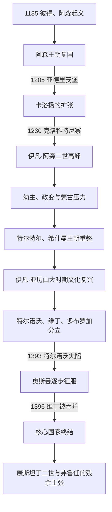

# 保加利亚第二帝国

[保加利亚历史](/%E4%BA%BA%E6%96%87%E7%A7%91%E5%AD%A6/%E5%8E%86%E5%8F%B2/%E6%AC%A7%E6%B4%B2/%E4%B8%9C%E5%8D%97%E6%AC%A7%E4%B8%8E%E5%B7%B4%E5%B0%94%E5%B9%B2/%E4%BF%9D%E5%8A%A0%E5%88%A9%E4%BA%9A/README.md)

## 时间

1185年—1396年。1393年特尔诺沃失陷、1395年伊凡·希什曼被处死、1396年维丁被吞并是核心国家灭亡的连续节点；康斯坦丁二世等人的王统主张和局部活动延续到15世纪初。

## 概括

保加利亚第二帝国由彼得与阿森兄弟起义建立，以特尔诺沃为政治和宗教中心。卡洛扬利用拜占庭瓦解和第四次十字军造成的权力真空崛起，伊凡·阿森二世在1230年后把国家推至高峰。1241年以后，未成年继承、贵族政变、蒙古压力和邻国竞争削弱中央；14世纪的家族分封又使特尔诺沃、维丁和多布罗加各自为政。奥斯曼并非一战征服，而是在控制色雷斯、切断交通、迫使诸侯称臣后逐城吞并。

## 建立背景与崛起机制

- **拜占庭危机**：12世纪末科穆宁体系衰落，安德洛尼卡一世被推翻、边疆军费与税负上升，中央难以稳定控制巴尔干山地。
- **地方精英与军事资源**：阿森兄弟属于特尔诺沃地区有影响力的地方人物，能连接堡垒、牧民、乡村人口和库曼骑兵。
- **宗教合法化**：起义者宣称圣德米特里已离开塞萨洛尼基转而庇护保加利亚，以特尔诺沃教会为复国提供神圣叙事。
- **地形与跨多瑙河网络**：山口和要塞使拜占庭大军难以持久作战；起义军受挫后可退过多瑙河整补。
- **国际权力真空**：1204年第四次十字军攻陷君士坦丁堡，拉丁帝国、伊庇鲁斯、尼西亚与保加利亚竞争，为卡洛扬和伊凡·阿森二世提供外交空间。

## 分阶段发展

### 复国与阿森兄弟

彼得四世与伊凡·阿森一世共同领导起义，前者承担王统和外交合法性，后者更偏军事统帅。1190年特里亚夫纳战役后，拜占庭再统一的希望受挫。伊凡·阿森一世1196年被贵族伊万科刺杀，彼得次年也遇害，显示王权仍受宫廷和地方贵族制约。

### 卡洛扬与拉丁帝国战争

卡洛扬一面同教宗英诺森三世通信，争取国际承认；1204年接受教宗使节加冕为“保加利亚人与瓦拉几人之王”，教会首领获“首席主教”地位。卡洛扬则在国内继续使用沙皇与宗主教传统，双方对称号理解并不相同。

拉丁贵族拒绝与他结盟并压迫色雷斯希腊城市，卡洛扬遂与地方希腊人合作。1205年亚德里安堡战役中，库曼轻骑诱敌并击溃拉丁重骑，皇帝鲍德温一世被俘。保加利亚成为第四次十字军后巴尔干权力重组的决定性力量。卡洛扬1207年围攻塞萨洛尼基时死亡，死因存在疾病、谋杀等不同说法。

### 博里尔危机与伊凡·阿森二世高峰

博里尔夺位后面临阿森家族流亡者、地方贵族和外部战争。他在1211年召开反博戈米勒会议，却无法消除合法性困境；1218年伊凡·阿森二世自流亡地返回，博里尔被废。

伊凡·阿森二世通过婚姻、贸易和有限战争扩张。1230年伊庇鲁斯统治者狄奥多罗斯背约入侵，在克洛科特尼察战败被俘，保加利亚影响迅速覆盖马其顿、阿尔巴尼亚和色雷斯大片地区。君主颁给杜布罗夫尼克商人通商特权，利用黑海—多瑙河—亚得里亚海网络；1235年与尼西亚结盟，特尔诺沃宗主教地位得到东方教会承认。

### 1241年后的继承危机

伊凡·阿森二世死后，卡利曼一世、米哈伊尔二世等未成年君主相继在位，宫廷集团频繁废立。蒙古西征后，金帐汗国力量越过多瑙河，保加利亚一度纳贡；尼西亚、伊庇鲁斯、匈牙利和塞尔维亚乘机争夺边地。国家并非持续直线衰落，但中央已难长期垄断军队、税收和外交。

1277年，伊瓦伊洛利用农民和边防人口对蒙古袭扰及贵族无能的不满起兵，击败沙皇康斯坦丁·蒂赫并一度获得特尔诺沃承认。拜占庭另立伊凡·阿森三世，金帐汗国也干预。伊瓦伊洛能战胜多路敌军，却无法建立稳定的贵族联盟和财政体系，最终流亡并被杀。

### 特尔特尔与希什曼王朝

格奥尔基·特尔特尔一世仍受蒙古支配；其子托多尔·斯韦托斯拉夫利用金帐汗国内部变化清除反对派，恢复北部秩序和黑海港口。1323年维丁贵族米哈伊尔·希什曼即位，试图在拜占庭与塞尔维亚之间重建霸权，却在1330年韦尔布日德战役败亡。

伊凡·亚历山大1331年即位后，国家经历相对稳定和宗教艺术复兴，特尔诺沃手抄本、教堂与修道活动繁荣。但黑死病、贸易格局变化、塞尔维亚与拜占庭竞争，以及宫廷继承安排限制了复兴。君主把维丁交给伊凡·斯拉齐米尔，又立第二婚之子伊凡·希什曼为特尔诺沃继承人，政治分裂被王朝化。

## 统治结构

| 层面 | 机制 | 局限 |
|---|---|---|
| 沙皇与宫廷 | 授予专制君、塞瓦斯托克拉托等拜占庭式头衔，组织外交、军役和封赏 | 王位规则不固定，兄弟共治、女系继承、政变与外援立君并存。 |
| 波雅尔贵族 | 控制土地、城堡、军队和地方网络 | 危机时可拥立、废黜君主或形成半独立领地。 |
| 教会 | 特尔诺沃教会为王权提供加冕、圣徒崇拜与文化中心 | 1204年对罗马的承认与1235年东方宗主教承认反映外交需要。 |
| 城市与贸易 | 特尔诺沃、维丁、瓦尔纳、梅森布里亚等连接多瑙河、黑海和亚得里亚海 | 意大利商人和区域战争使关税收益受外部局势左右。 |
| 军队 | 王室亲兵、贵族部队、城堡守军及库曼、阿兰等盟军或雇佣军 | 依赖个人联盟，难形成长期统一的常备防线。 |
| 地方政权 | 维丁、多布罗加及若干贵族领地在14世纪拥有独立外交和军队 | 名义王统、亲属关系与实际控制常不一致。 |

## 重要事件

| 时间 | 事件 | 过程与影响 |
|---|---|---|
| 1185—1190年 | 阿森兄弟起义与特里亚夫纳战役 | 起义从税负冲突发展为复国战争，库曼援军和山地防御迫使拜占庭承认现实。 |
| 1204年 | 卡洛扬接受教宗使节加冕 | 获西方外交承认，但“国王”与“沙皇”、“首席主教”与“宗主教”称号解释不同。 |
| 1205年 | 亚德里安堡战役 | 拉丁皇帝鲍德温一世被俘，保加利亚成为巴尔干主要强权。 |
| 1211年 | 博里尔反异端会议 | 试图借教会巩固合法性，未能解决贵族叛乱和阿森继承人挑战。 |
| 1218年 | 伊凡·阿森二世复位 | 博里尔被废，阿森王朝重新掌权。 |
| 1230年 | 克洛科特尼察战役 | 击溃伊庇鲁斯军，第二帝国势力达到最大范围。 |
| 1235年 | 特尔诺沃宗主教区恢复 | 通过与尼西亚结盟取得东方教会承认，加强帝国合法性。 |
| 1241年以后 | 蒙古压力与幼主继承 | 纳贡、边疆丧失和宫廷废立相互加强。 |
| 1277—1280年 | 伊瓦伊洛起义与三方争位 | 社会反抗、拜占庭干涉和蒙古压力汇合，中央制度进一步受损。 |
| 1300—1322年 | 托多尔·斯韦托斯拉夫重整 | 清除金帐影响和国内对手，收复部分黑海地区，证明衰落并非不可逆。 |
| 1330年 | 韦尔布日德战役 | 米哈伊尔·希什曼阵亡，塞尔维亚取得阶段性优势。 |
| 1364—1388年 | 奥斯曼控制色雷斯并迫使诸侯称臣 | 普罗夫迪夫、索菲亚等关键城市相继失守，保加利亚政权彼此孤立。 |
| 1393年 | 特尔诺沃失陷 | 奥斯曼围城后终结特尔诺沃沙皇国，宗教和贵族精英遭重组。 |
| 1395年 | 伊凡·希什曼被处死 | 尼科波尔周边残余权力被消灭。 |
| 1396年 | 维丁被吞并 | 十字军在尼科波尔失败后，伊凡·斯拉齐米尔被俘，核心中世纪国家终结。 |

## 鼎盛条件

- 拉丁帝国、尼西亚、伊庇鲁斯和拜占庭继承政权相互竞争，保加利亚可灵活结盟。
- 库曼骑兵与巴尔干山地防御弥补人口和重装军不足。
- 卡洛扬和伊凡·阿森二世把罗马教廷、东方教会、婚姻和贸易特权作为与战争并列的工具。
- 1230年胜利瓦解伊庇鲁斯霸权，大量城市在较少长期围城的情况下转而承认保加利亚。
- 特尔诺沃的王权、宗主教区与文化生产构成共同合法性中心。

## 衰落与灭亡

### 结构因素

- 继承规则不稳定，1241年后的幼主、外戚、女系继承和贵族政变反复打断政策。
- 波雅尔掌握地方要塞和军队，中央无法稳定抽取资源；14世纪分封使这种事实割据合法化。
- 经济和人口遭蒙古袭扰、战争、黑死病及贸易路线变化消耗，边防修复能力下降。
- 特尔诺沃、维丁和多布罗加虽有共同文化，却各有外交，无法建立统一指挥。

### 外部压力

- 金帐汗国、匈牙利、塞尔维亚、拜占庭及其继承政权长期从不同方向介入王位和边界。
- 奥斯曼拥有跨海峡增援、加齐军事集团、封地骑兵和吸纳地方附庸的能力；其扩张不是单纯依靠兵力，而是结合袭击、驻军、称臣和逐城吞并。
- 1371年马里查战役后，巴尔干南部反奥斯曼力量遭重创，保加利亚诸侯更难获得协调外援。

### 直接灭亡过程

奥斯曼先夺取色雷斯交通节点，把保加利亚诸政权与拜占庭、塞尔维亚南部隔开，再迫使伊凡·希什曼等称臣并提供军役。1382年前后索菲亚失守，1388年大规模远征控制东北要塞。1393年特尔诺沃陷落，1395年希什曼被处死。1396年尼科波尔十字军失败后，维丁的伊凡·斯拉齐米尔被俘。

康斯坦丁二世仍以维丁王统继承人身份活动，并与伊凡·希什曼之子弗鲁任参加15世纪初反奥斯曼行动；其是否在1396年后实际控制一块持续领土、能否把第二帝国终年延至1422年，学界口径不一。因此正文以1396年为核心国家终结，同时保留王统残余的争议。

## 王朝世系

完整主序列、共治者、拜占庭扶植者、特尔诺沃—维丁并立和多布罗加地方政权见[保加利亚中世纪统治者世系表](/%E4%BA%BA%E6%96%87%E7%A7%91%E5%AD%A6/%E5%8E%86%E5%8F%B2/%E6%AC%A7%E6%B4%B2/%E4%B8%9C%E5%8D%97%E6%AC%A7%E4%B8%8E%E5%B7%B4%E5%B0%94%E5%B9%B2/%E4%BF%9D%E5%8A%A0%E5%88%A9%E4%BA%9A/%E4%BF%9D%E5%8A%A0%E5%88%A9%E4%BA%9A%E4%B8%AD%E4%B8%96%E7%BA%AA%E7%BB%9F%E6%B2%BB%E8%80%85%E4%B8%96%E7%B3%BB%E8%A1%A8.md)。

## 演变关系

- 前一节点：[拜占庭统治与保加利亚复国运动](/%E4%BA%BA%E6%96%87%E7%A7%91%E5%AD%A6/%E5%8E%86%E5%8F%B2/%E6%AC%A7%E6%B4%B2/%E4%B8%9C%E5%8D%97%E6%AC%A7%E4%B8%8E%E5%B7%B4%E5%B0%94%E5%B9%B2/%E4%BF%9D%E5%8A%A0%E5%88%A9%E4%BA%9A/%E6%8B%9C%E5%8D%A0%E5%BA%AD%E7%BB%9F%E6%B2%BB%E4%B8%8E%E4%BF%9D%E5%8A%A0%E5%88%A9%E4%BA%9A%E5%A4%8D%E5%9B%BD%E8%BF%90%E5%8A%A8.md)。
- 后一节点：[奥斯曼统治与民族复兴](/%E4%BA%BA%E6%96%87%E7%A7%91%E5%AD%A6/%E5%8E%86%E5%8F%B2/%E6%AC%A7%E6%B4%B2/%E4%B8%9C%E5%8D%97%E6%AC%A7%E4%B8%8E%E5%B7%B4%E5%B0%94%E5%B9%B2/%E4%BF%9D%E5%8A%A0%E5%88%A9%E4%BA%9A/%E5%A5%A5%E6%96%AF%E6%9B%BC%E7%BB%9F%E6%B2%BB%E4%B8%8E%E6%B0%91%E6%97%8F%E5%A4%8D%E5%85%B4.md)。
- 第二帝国的灭亡是1393—1396年逐步完成的；15世纪初的王统主张属于残余与复国运动，不等同于恢复稳定国家。
