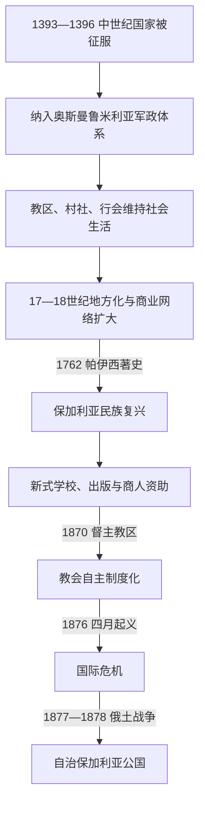

# 保加利亚的奥斯曼统治与民族复兴

[保加利亚历史](/%E4%BA%BA%E6%96%87%E7%A7%91%E5%AD%A6/%E5%8E%86%E5%8F%B2/%E6%AC%A7%E6%B4%B2/%E4%B8%9C%E5%8D%97%E6%AC%A7%E4%B8%8E%E5%B7%B4%E5%B0%94%E5%B9%B2/%E4%BF%9D%E5%8A%A0%E5%88%A9%E4%BA%9A/README.md)

## 时间

14世纪末—1878年。特尔诺沃于1393年、维丁于1396年被征服；部分王族和地方武装的抵抗延续到15世纪。1878年柏林条约建立自治保加利亚公国，但马其顿和色雷斯等许多保加利亚语人口地区仍留在奥斯曼帝国。

## 概括

奥斯曼征服终结中世纪保加利亚王权和特尔诺沃宗主教区，把当地纳入鲁米利亚的军政、税收和伊斯兰法—社群并行秩序。数百年统治并非静止的单一“黑暗期”：土地军役、城市商贸、教会管辖和地方精英都随帝国兴衰变化，基督徒承受身份不平等、额外税赋和某些时期的强制征发，也拥有村社、行会、修道院及跨境商业空间。18—19世纪经济活跃、学校与出版扩张、争取独立教会和革命组织相互作用，形成现代保加利亚民族运动。

## 征服过程与早期抵抗

奥斯曼势力先在14世纪中叶进入色雷斯，控制连接君士坦丁堡、马里查河谷和巴尔干山口的交通。保加利亚诸政权彼此并立，有些向苏丹称臣并提供军役。1393年特尔诺沃陷落，1395年伊凡·希什曼被处死；1396年尼科波尔十字军失败后，维丁的伊凡·斯拉齐米尔被俘。

征服后仍有数种抵抗：

- 康斯坦丁二世与弗鲁任在15世纪初利用奥斯曼王位内战、匈牙利和瓦拉几亚支持发动行动，未能重建稳定国家。
- 山区“海杜克”武装兼有反官府、地方自卫和劫掠性质，不能一概视为统一民族革命军。
- 1688年奇普罗夫齐起义与哈布斯堡—奥斯曼战争相连，失败后当地天主教商人和居民大量逃亡。
- 俄奥多次战争使地方基督徒反复面临征兵、供给、迁徙与报复，也把俄罗斯塑造成部分东正教社群的外部保护者。

## 统治结构与实际权力

保加利亚地区不是一个边界固定、拥有单一“总督”的殖民地，而被分入鲁米利亚省及其后不断调整的州、桑贾克和司法区。19世纪坦齐马特改革又重划多瑙州等行政单位。

| 层级或群体 | 职能 | 实际影响 |
|---|---|---|
| 奥斯曼苏丹与中央政府 | 制定征税、军役、土地和宗教社群规则，任免高级官员 | 最高主权所在，但地方执行受战争、交通和地方势力制约。 |
| 贝勒贝伊、帕夏、桑贾克贝伊 | 管理省区军政、治安、征发与要塞 | 任期和辖区多次变化，不构成连续“保加利亚行政首脑世系”。 |
| 卡迪及伊斯兰法院 | 处理司法、契约、继承与行政监督 | 穆斯林受伊斯兰法约束；基督徒也可为财产和商业事务使用法院。 |
| 西帕希与蒂马尔持有者 | 以税收权换取骑兵军役 | 早期军事财政支柱；17世纪后税农、地方豪强和大庄园重要性上升。 |
| 君士坦丁堡普世牧首区 | 管理多数东正教教区、主教和学校 | 特尔诺沃宗主教区被撤；高层希腊语化引发19世纪教会自主运动。 |
| 修道院、教区与村社首领 | 宗教、教育、慈善、调解和地方税务协助 | 保存社会组织与文字传统，也可能承担替国家征收和担保责任。 |
| 行会、商人和税农 | 组织手工业、贸易、税收承包与城市公益 | 18—19世纪形成资助学校、教堂和出版的新精英。 |

## 社会、土地与宗教变化

### 土地和税赋

早期蒂马尔制把特定税收分配给承担军役者，农户通常拥有耕作权而非现代意义的完全产权。随着战争财政扩大，终身税农和地方权贵崛起，18世纪部分地区出现大庄园化。基督徒除一般土地、产出和临时税外，需缴纳人头税；税额、征收方式和地方滥用随时期差异很大。

德夫希尔梅征集在若干世纪从基督徒家庭选取男童，培养为新军或宫廷人员，是国家强制征发而非普通自愿上升渠道；其范围、频率和地方执行并不恒定。18世纪前后制度衰退，但新军驻扎和地方军阀又带来其他负担。

### 城乡与族群

奥斯曼在要塞和交通城市安置穆斯林军政、手工业和宗教人口，索菲亚、普罗夫迪夫、舒门、鲁塞等成为跨区域市场。农村仍以东正教斯拉夫语人口为主，也存在土耳其人、罗姆人、犹太人、瓦拉几人、亚美尼亚人、希腊人和其他社群。罗多彼等地区发生长期伊斯兰化，包含社会流动、婚姻、税制、地方压力和某些强制事件，不能用一次全国性强制改宗解释。

### 教会与文化延续

特尔诺沃宗主教区被撤后，多数教区归君士坦丁堡普世牧首区；西部一些教区继续属于奥赫里德总主教区，直至1767年被撤。里拉等修道院保存手稿、宗教教育和朝圣网络。高层教会逐渐由希腊语主教控制，但基层礼仪、地方圣徒和斯拉夫语抄写从未中断。

## 民族复兴的形成

### 文化与教育

1762年，希兰达修道院的帕伊西完成《斯拉夫保加利亚史》，以中世纪王国和圣徒唤起共同历史。索夫罗尼·弗拉昌斯基抄传并把宗教写作推向更广读者。19世纪商人和手工业者资助世俗“新式学校”；1835年加布罗沃学校成为象征，教材、报刊、读书会和海外印刷把地方方言逐步连接成现代书面语公共空间。

### 教会自主运动

保加利亚社群反对希腊语高级教士和财政控制，要求本族主教、学校和礼仪权。1870年苏丹诏令成立保加利亚督主教区，以居民表决等机制确定部分教区。1872年普世牧首区宣布相关教会分离为裂教。教会边界事实上成为民族地理主张的一种测量方式，尤其牵涉马其顿与色雷斯。

### 政治与革命网络

格奥尔基·拉科夫斯基推动流亡军团和革命宣传；柳本·卡拉维洛夫、赫里斯托·波特夫等在罗马尼亚组织报刊和委员会。瓦西尔·列夫斯基强调在帝国内建立地方秘密委员会，由内部起义而非完全依赖外军解放；其1873年被处决后，网络遭重创但理念延续。

1876年四月起义准备仓促、地区响应不一，奥斯曼正规军和巴什波祖克迅速镇压。巴塔克等地的大规模杀戮引发欧洲调查和舆论震动。起义军事上失败，却把保加利亚问题推上列强外交议程。

## 重要事件

| 时间 | 事件 | 过程与影响 |
|---|---|---|
| 1393—1396年 | 特尔诺沃、维丁失陷 | 中世纪中央国家被逐步吞并，贵族、教会和土地秩序重组。 |
| 1400年代初 | 康斯坦丁二世—弗鲁任行动 | 借奥斯曼内战和邻国支持试图复国，显示王统记忆仍存。 |
| 1598、1686年 | 特尔诺沃起义传统 | 与哈布斯堡、瓦拉几亚和俄奥战争期待相连，规模和连续性在后世叙述中有夸大。 |
| 1688年 | 奇普罗夫齐起义 | 天主教商业中心反抗失败，人口外流和地区衰落。 |
| 1762年 | 《斯拉夫保加利亚史》 | 以共同历史和语言批判文化同化，成为民族复兴标志。 |
| 1835年 | 加布罗沃新式学校 | 世俗课程和互助教学扩大，教育网络快速增长。 |
| 1870年 | 保加利亚督主教区成立 | 民族教会获得奥斯曼法律承认，形成跨省组织。 |
| 1873年 | 列夫斯基被处决 | 内部革命网络受挫，其地方委员会路线成为国家记忆核心。 |
| 1876年 | 四月起义与暴行调查 | 军事失败引发国际舆论和列强干预。 |
| 1877—1878年 | 俄土战争 | 俄军、罗马尼亚军和保加利亚志愿军越过多瑙河，普列文、希普卡等战斗决定战局。 |
| 1878年3月 | 圣斯特凡诺条约 | 设想范围广大的保加利亚自治政治体，引起列强警惕。 |
| 1878年7月 | 柏林条约 | 建立较小的自治公国和东鲁米利亚，马其顿、色雷斯大部仍归奥斯曼。 |

## 奥斯曼统治为何能维持

- 军政、税收、司法和宗教社群相互嵌套，允许地方差异而不要求文化完全同化。
- 中世纪贵族王权被拆解，部分精英被吸纳或迁移，长期缺乏统一的本地军事中心。
- 帝国控制要塞、交通和跨省财政，地方起义难以同时协调山地、城市和边疆。
- 东正教教会、村社和行会提供有限自治，也降低日常治理成本。
- 俄国、哈布斯堡等外援首先服从自身战争目标，早期复国期待往往无法持续。

## 统治衰退与自治公国形成

### 结构因素

18—19世纪中央财政危机、税农和地方豪强扩张削弱行政一致性；新军和地方军队抵制改革。商品经济、跨境商人及教育网络又孕育不依赖传统教会高层的新精英。坦齐马特承诺臣民平等和行政现代化，却无法消除税负、地方暴力和民族代表权争议。

### 外部压力

俄罗斯以东正教保护和黑海—巴尔干战略多次同奥斯曼交战；哈布斯堡、英国、法国等则力求维持力量平衡。塞尔维亚、希腊和罗马尼亚国家的形成给保加利亚革命者提供基地，也使领土主张彼此冲突。

### 直接转折

四月起义的镇压和欧洲调查造成外交危机。君士坦丁堡会议方案未被奥斯曼接受后，俄国于1877年开战。军事胜利产生圣斯特凡诺的“大保加利亚”方案；英国、奥匈等担心俄国势力扩张，于柏林会议大幅改划。现代保加利亚因此不是简单由起义直接“恢复”，而是民族组织、战争、俄国军事胜利和列强均势共同塑造的自治国家。

## 演变关系

- 前一节点：[保加利亚第二帝国](/%E4%BA%BA%E6%96%87%E7%A7%91%E5%AD%A6/%E5%8E%86%E5%8F%B2/%E6%AC%A7%E6%B4%B2/%E4%B8%9C%E5%8D%97%E6%AC%A7%E4%B8%8E%E5%B7%B4%E5%B0%94%E5%B9%B2/%E4%BF%9D%E5%8A%A0%E5%88%A9%E4%BA%9A/%E4%BF%9D%E5%8A%A0%E5%88%A9%E4%BA%9A%E7%AC%AC%E4%BA%8C%E5%B8%9D%E5%9B%BD.md)；末期王统主张见[保加利亚中世纪统治者世系表](/%E4%BA%BA%E6%96%87%E7%A7%91%E5%AD%A6/%E5%8E%86%E5%8F%B2/%E6%AC%A7%E6%B4%B2/%E4%B8%9C%E5%8D%97%E6%AC%A7%E4%B8%8E%E5%B7%B4%E5%B0%94%E5%B9%B2/%E4%BF%9D%E5%8A%A0%E5%88%A9%E4%BA%9A/%E4%BF%9D%E5%8A%A0%E5%88%A9%E4%BA%9A%E4%B8%AD%E4%B8%96%E7%BA%AA%E7%BB%9F%E6%B2%BB%E8%80%85%E4%B8%96%E7%B3%BB%E8%A1%A8.md)。
- 后一节点：[保加利亚公国与王国](/%E4%BA%BA%E6%96%87%E7%A7%91%E5%AD%A6/%E5%8E%86%E5%8F%B2/%E6%AC%A7%E6%B4%B2/%E4%B8%9C%E5%8D%97%E6%AC%A7%E4%B8%8E%E5%B7%B4%E5%B0%94%E5%B9%B2/%E4%BF%9D%E5%8A%A0%E5%88%A9%E4%BA%9A/%E4%BF%9D%E5%8A%A0%E5%88%A9%E4%BA%9A%E5%85%AC%E5%9B%BD%E4%B8%8E%E7%8E%8B%E5%9B%BD.md)。
- 1878年后奥斯曼对公国仍保留名义宗主权，东鲁米利亚则是帝国内自治省；完全独立要到1908年。
