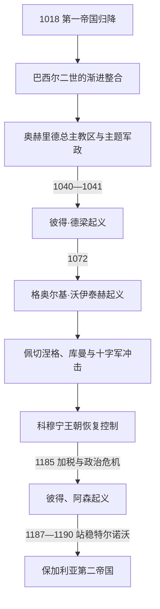

# 拜占庭统治与保加利亚复国运动

[保加利亚历史](/%E4%BA%BA%E6%96%87%E7%A7%91%E5%AD%A6/%E5%8E%86%E5%8F%B2/%E6%AC%A7%E6%B4%B2/%E4%B8%9C%E5%8D%97%E6%AC%A7%E4%B8%8E%E5%B7%B4%E5%B0%94%E5%B9%B2/%E4%BF%9D%E5%8A%A0%E5%88%A9%E4%BA%9A/README.md)

## 时间

1018年—1185年。北部和中部若干地区的控制范围曾因佩切涅格、匈牙利、塞尔维亚及地方起义而变化；1185年起义后，拜占庭到1187—1190年前后才逐步承认新政权。

## 概括

1018年巴西尔二世完成征服后，原保加利亚帝国被纳入拜占庭军政、税收和教会体系。独立王权中断，但地方人口、贵族、教区和“保加利亚”这一地域—政治称谓并未消失。巴西尔二世初期保留部分税制和奥赫里德教会自主以换取归顺；后继政府的财政改革、边疆战争与地方权力重组引发1040—1041年和1072年的大规模复国起义。12世纪后期，帝国财政与巴尔干防御危机为阿森兄弟成功起义创造条件。

## 征服后的重组

### 行政与军事

拜占庭没有简单恢复1018年前的旧省界，而是按战略需要设立和调整“保加利亚”等军政辖区，斯科普里、塞尔迪卡、都拉齐翁和多瑙河边防承担不同职能。部分保加利亚贵族获得拜占庭头衔、地产和军职，家族成员进入帝国官僚与婚姻网络；另一些人迁往小亚细亚或在地方保留影响。

这种收编减少了立即反抗，却使地方社会出现双重结构：帝国官员掌握税收和军政，原有贵族、教士与村社仍控制大量日常资源。11世纪中后期雇佣军、地产集中和军区变化，又削弱了早期妥协。

### 税收与土地

巴西尔二世在若干地区允许以实物纳税，延续战前习惯。其死后，政府逐渐改为货币税并加强征收；市场化本身并非唯一问题，关键在于现金需求、官员承包、歉收和军费叠加，使山区与农村家庭负担加重。大地产、修道院和军事持有者扩张，也改变自由农户与国家之间的直接关系。

### 教会与文化

保加利亚宗主教区被降为奥赫里德自治总主教区，但其教区范围广、直接受皇帝保护，继续服务大量斯拉夫语信众。历任总主教多为希腊语高级教士，礼仪和教育出现希腊化倾向；与此同时，修道院、地方圣徒崇拜与斯拉夫书写传统仍延续。教会因此既是帝国整合机构，也是保留第一帝国政治记忆的载体。

## 重要事件与复国尝试

### 彼得·德梁起义

1040年，声称为加夫里尔·拉多米尔之子的彼得·德梁在贝尔格莱德被拥立为沙皇，起义迅速扩展到尼什、斯科普里和马其顿。都拉齐翁军区的士兵另立蒂霍米尔，随后被德梁合并。萨穆伊尔家族后裔阿卢西安加入后，因争权和进攻塞萨洛尼基失败而刺瞎德梁，并向拜占庭投降。1041年起义被镇压。其早期扩张说明税负和地方不满广泛，失败则源于领导分裂、军事失利及帝国集中增援。

### 格奥尔基·沃伊泰赫起义

1072年，斯科普里贵族格奥尔基·沃伊泰赫联合泽塔统治者米哈伊洛之子康斯坦丁·博丁，拥立后者为“彼得三世”。起义军一度控制斯科普里、尼什和奥赫里德方向，却在分兵、补给不足和拜占庭反攻下失败。博丁被俘，沃伊泰赫在囚禁途中死亡。事件表明复国运动已与塞尔维亚—泽塔等邻国权力结合，也说明外援无法替代稳定地方组织。

### 11—12世纪的边疆冲击

- 佩切涅格和后来的库曼集团越过多瑙河，时而掠夺、时而受雇或定居，迫使拜占庭重构北方防线。
- 1183年匈牙利—塞尔维亚军队南下，破坏尼什、塞尔迪卡等地，显示帝国在巴尔干内陆的控制减弱。
- 第一次、第二次和第三次十字军经过巴尔干，带来补给冲突、城市破坏和外交压力。
- 科穆宁王朝一度通过军事复兴、地方联盟和要塞恢复控制，但安德洛尼卡一世时期的政治暴力与1185年政变削弱中央权威。

## 阿森兄弟起义的过程

1185年，皇帝伊萨克二世为婚礼和战争加征税赋。特尔诺沃地区的彼得（原名托多尔）与阿森请求获得军役地产未果，借圣德米特里崇拜和地方不满发动起义。起义军最初受挫，越过多瑙河寻求库曼援军；重返后夺取山口和要塞，以特尔诺沃为中心建立政权。

拜占庭多次远征都未能彻底消灭新国家。1187年前后的洛维奇战事和后续停战使复国政权获得事实承认；1190年伊萨克二世在特里亚夫纳山口撤退时遭重创，拜占庭恢复旧秩序的能力进一步下降。

## 拜占庭统治为何能维持又为何瓦解

### 维持条件

- 巴西尔二世以保留税制、头衔和教会框架换取贵族及城市归顺。
- 拜占庭拥有更成熟的货币财政、官僚、要塞与跨区域军队，能在起义分裂后集中反攻。
- 保加利亚各地区缺乏持续统一的王统和军事中心；1040年、1072年领导集团内部冲突尤其致命。

### 长期削弱因素

- 货币税、地产重组和官员征敛使帝国统治的地方成本提高。
- 佩切涅格、库曼、匈牙利、诺曼和十字军压力迫使中央同时应付多条战线。
- 12世纪末王朝斗争和财政危机降低军队忠诚与边防投入。
- 奥赫里德教会和地方政治记忆使“保加利亚国家”仍具有可被动员的历史合法性。
- 特尔诺沃山区适合防御，阿森兄弟又能连接地方贵族、牧民军事资源与库曼骑兵。

## 统治结构

| 角色 | 实际权力 | 说明 |
|---|---|---|
| 拜占庭皇帝 | 任命军政长官、制定税制、授予贵族头衔 | 不存在单独的“保加利亚国王”。 |
| 都督、将军与税务官 | 管理军区、要塞、征税和司法 | 边界与驻地随战争变化。 |
| 奥赫里德总主教 | 管理广泛教区与教会财产 | 保留制度连续性，但地位低于原宗主教。 |
| 地方贵族与村社 | 掌握地产、军役、人际网络和基层生活 | 既可被帝国吸纳，也可能成为起义骨干。 |
| 佩切涅格、库曼等群体 | 雇佣军、盟军、移民或边患 | 身份和政治立场并不固定。 |

## 重要事件

| 时间 | 事件 | 结果与影响 |
|---|---|---|
| 1018年 | 巴西尔二世接受各地归降 | 独立王权终结，贵族和教会被渐进纳入帝国。 |
| 1019—1020年 | 重定奥赫里德教区 | 保留广域自治总主教区，成为文化连续的重要机构。 |
| 1040—1041年 | 彼得·德梁起义 | 控制大片内陆后因内讧与军事失败被镇压。 |
| 1072年 | 格奥尔基·沃伊泰赫起义 | 借泽塔王族重建王统失败，显示区域联盟的重要性。 |
| 1091年 | 莱武尼翁战役 | 拜占庭联合库曼击败佩切涅格，暂时稳定北方。 |
| 1096、1147年 | 十字军经过 | 交通和补给冲突加重巴尔干军政负担。 |
| 1183年 | 匈牙利—塞尔维亚入侵 | 内陆城市受创，中央控制明显松动。 |
| 1185年 | 彼得、阿森起义 | 税负成为触发点，地方政治、宗教号召和外援共同推动复国。 |
| 1190年 | 特里亚夫纳战役 | 拜占庭远征失败，第二帝国生存得到巩固。 |

## 演变关系

- 前一节点：[保加利亚第一帝国](/%E4%BA%BA%E6%96%87%E7%A7%91%E5%AD%A6/%E5%8E%86%E5%8F%B2/%E6%AC%A7%E6%B4%B2/%E4%B8%9C%E5%8D%97%E6%AC%A7%E4%B8%8E%E5%B7%B4%E5%B0%94%E5%B9%B2/%E4%BF%9D%E5%8A%A0%E5%88%A9%E4%BA%9A/%E4%BF%9D%E5%8A%A0%E5%88%A9%E4%BA%9A%E7%AC%AC%E4%B8%80%E5%B8%9D%E5%9B%BD.md)。
- 后一节点：[保加利亚第二帝国](/%E4%BA%BA%E6%96%87%E7%A7%91%E5%AD%A6/%E5%8E%86%E5%8F%B2/%E6%AC%A7%E6%B4%B2/%E4%B8%9C%E5%8D%97%E6%AC%A7%E4%B8%8E%E5%B7%B4%E5%B0%94%E5%B9%B2/%E4%BF%9D%E5%8A%A0%E5%88%A9%E4%BA%9A/%E4%BF%9D%E5%8A%A0%E5%88%A9%E4%BA%9A%E7%AC%AC%E4%BA%8C%E5%B8%9D%E5%9B%BD.md)。
- 本阶段是独立君主制的中断期，不能列“保加利亚君主世系”；1040年和1072年的起义领袖属于复国主张者，已在[保加利亚中世纪统治者世系表](/%E4%BA%BA%E6%96%87%E7%A7%91%E5%AD%A6/%E5%8E%86%E5%8F%B2/%E6%AC%A7%E6%B4%B2/%E4%B8%9C%E5%8D%97%E6%AC%A7%E4%B8%8E%E5%B7%B4%E5%B0%94%E5%B9%B2/%E4%BF%9D%E5%8A%A0%E5%88%A9%E4%BA%9A/%E4%BF%9D%E5%8A%A0%E5%88%A9%E4%BA%9A%E4%B8%AD%E4%B8%96%E7%BA%AA%E7%BB%9F%E6%B2%BB%E8%80%85%E4%B8%96%E7%B3%BB%E8%A1%A8.md)中另作备注。
