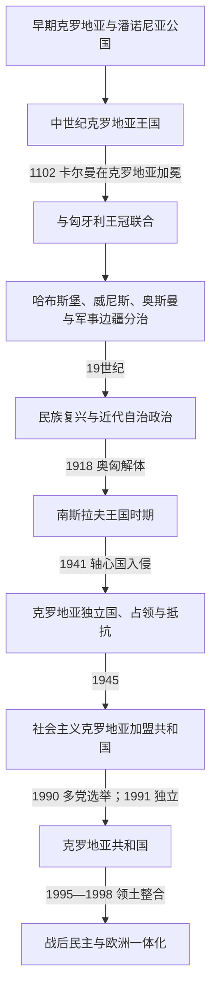

# 克罗地亚历史

[返回东南欧与巴尔干历史](/%E4%BA%BA%E6%96%87%E7%A7%91%E5%AD%A6/%E5%8E%86%E5%8F%B2/%E6%AC%A7%E6%B4%B2/%E4%B8%9C%E5%8D%97%E6%AC%A7%E4%B8%8E%E5%B7%B4%E5%B0%94%E5%B9%B2/README.md)

## 概括

克罗地亚历史由亚得里亚海沿岸、迪纳拉山区、萨瓦—德拉瓦河间地和斯拉沃尼亚多条区域线汇合而成。早期公国和王国在法兰克、拜占庭、威尼斯与教廷之间形成；1102年以后与匈牙利共奉君主，同时保留萨博尔、班和地方贵族制度。近世的哈布斯堡内陆、威尼斯达尔马提亚、奥斯曼占领区、军事边疆及杜布罗夫尼克共和国并不处于同一行政体系。19世纪民族复兴把分散领地重构为政治共同体；20世纪先后经历两代南斯拉夫、乌斯塔沙傀儡政权、社会主义联邦和1991—1995年独立战争，最终形成当代议会共和国。

## 历史主线

- **从区域公国到王国**：法兰克势力下的达尔马提亚克罗地亚与下潘诺尼亚并行发展，特尔皮米尔家族通过军事、教会和贵族联盟建立较稳定王权。托米斯拉夫在10世纪初被称为国王，彼得·克雷希米尔四世和德米特里·兹沃尼米尔时期加强沿海与内陆联系。
- **王冠联合而非简单吞并**：王统危机后，匈牙利国王卡尔曼1102年在比奥格勒加冕。克罗地亚保留王国名义、萨博尔和班，但自治和实际疆域随君主、贵族、威尼斯与战争变化。后世《协定》文本形成较晚，不能作为无争议的1102年原约。
- **多重边疆**：威尼斯长期统治大部分达尔马提亚，哈布斯堡从1527年成为克罗地亚君主，奥斯曼夺取斯拉沃尼亚和内陆大片地区，维也纳又直接管理军事边疆。现代国界是这些区域在19—20世纪重新整合的结果。
- **民族政治与南斯拉夫方案**：伊利里亚运动促进语言、出版和文化统一；1848年、1868年协议和克罗地亚—塞尔维亚联盟使自治、克罗地亚国家权利和南斯拉夫联合成为竞争路线。
- **20世纪的三次制度断裂**：1918年进入塞尔维亚王室主导的共同国家；1941年轴心国扶植乌斯塔沙“克罗地亚独立国”，实施种族迫害；1945年共产党领导的联邦克罗地亚以反法西斯法统和共和国边界重建。
- **独立、战争与整合**：1990年多党化和民族政治发生于南斯拉夫财政、宪制与塞尔维亚政治危机之中。1991—1995年战争造成围城、屠杀、驱逐和难民，1998年才以联合国监督的和平过渡完成领土整合。
- **欧洲一体化**：2000年后制度趋向议会化，2009年加入北约、2013年加入欧盟，2023年同时加入欧元区和申根区。

## 历史阶段导航

| 顺序 | 阶段 | 时间 | 简要概括 |
|---:|---|---|---|
| 1 | [克罗地亚王国](/%E4%BA%BA%E6%96%87%E7%A7%91%E5%AD%A6/%E5%8E%86%E5%8F%B2/%E6%AC%A7%E6%B4%B2/%E4%B8%9C%E5%8D%97%E6%AC%A7%E4%B8%8E%E5%B7%B4%E5%B0%94%E5%B9%B2/%E5%85%8B%E7%BD%97%E5%9C%B0%E4%BA%9A/%E5%85%8B%E7%BD%97%E5%9C%B0%E4%BA%9A%E7%8E%8B%E5%9B%BD.md) | 约7世纪—1102年 | 公国形成、基督教化、王国扩张和继承危机。 |
| 2 | [匈牙利联合与哈布斯堡时期](/%E4%BA%BA%E6%96%87%E7%A7%91%E5%AD%A6/%E5%8E%86%E5%8F%B2/%E6%AC%A7%E6%B4%B2/%E4%B8%9C%E5%8D%97%E6%AC%A7%E4%B8%8E%E5%B7%B4%E5%B0%94%E5%B9%B2/%E5%85%8B%E7%BD%97%E5%9C%B0%E4%BA%9A/%E5%8C%88%E7%89%99%E5%88%A9%E8%81%94%E5%90%88%E4%B8%8E%E5%93%88%E5%B8%83%E6%96%AF%E5%A0%A1%E6%97%B6%E6%9C%9F.md) | 1102年—1815年 | 与匈牙利共主、哈布斯堡继承、奥斯曼战争及威尼斯沿海统治。 |
| 3 | [民族复兴与近代政治](/%E4%BA%BA%E6%96%87%E7%A7%91%E5%AD%A6/%E5%8E%86%E5%8F%B2/%E6%AC%A7%E6%B4%B2/%E4%B8%9C%E5%8D%97%E6%AC%A7%E4%B8%8E%E5%B7%B4%E5%B0%94%E5%B9%B2/%E5%85%8B%E7%BD%97%E5%9C%B0%E4%BA%9A/%E6%B0%91%E6%97%8F%E5%A4%8D%E5%85%B4%E4%B8%8E%E8%BF%91%E4%BB%A3%E6%94%BF%E6%B2%BB.md) | 1815年—1918年 | 伊利里亚运动、1848年革命、有限自治和南斯拉夫方案。 |
| 4 | [南斯拉夫王国时期的克罗地亚](/%E4%BA%BA%E6%96%87%E7%A7%91%E5%AD%A6/%E5%8E%86%E5%8F%B2/%E6%AC%A7%E6%B4%B2/%E4%B8%9C%E5%8D%97%E6%AC%A7%E4%B8%8E%E5%B7%B4%E5%B0%94%E5%B9%B2/%E5%85%8B%E7%BD%97%E5%9C%B0%E4%BA%9A/%E5%8D%97%E6%96%AF%E6%8B%89%E5%A4%AB%E7%8E%8B%E5%9B%BD%E6%97%B6%E6%9C%9F%E7%9A%84%E5%85%8B%E7%BD%97%E5%9C%B0%E4%BA%9A.md) | 1918年—1941年 | 中央集权共同国家、克罗地亚农民党动员与1939年自治省。 |
| 5 | [克罗地亚独立国与第二次世界大战](/%E4%BA%BA%E6%96%87%E7%A7%91%E5%AD%A6/%E5%8E%86%E5%8F%B2/%E6%AC%A7%E6%B4%B2/%E4%B8%9C%E5%8D%97%E6%AC%A7%E4%B8%8E%E5%B7%B4%E5%B0%94%E5%B9%B2/%E5%85%8B%E7%BD%97%E5%9C%B0%E4%BA%9A/%E5%85%8B%E7%BD%97%E5%9C%B0%E4%BA%9A%E7%8B%AC%E7%AB%8B%E5%9B%BD%E4%B8%8E%E7%AC%AC%E4%BA%8C%E6%AC%A1%E4%B8%96%E7%95%8C%E5%A4%A7%E6%88%98.md) | 1941年—1945年 | 轴心国分割、乌斯塔沙政权、种族灭绝与多方抵抗。 |
| 6 | [社会主义时期的克罗地亚](/%E4%BA%BA%E6%96%87%E7%A7%91%E5%AD%A6/%E5%8E%86%E5%8F%B2/%E6%AC%A7%E6%B4%B2/%E4%B8%9C%E5%8D%97%E6%AC%A7%E4%B8%8E%E5%B7%B4%E5%B0%94%E5%B9%B2/%E5%85%8B%E7%BD%97%E5%9C%B0%E4%BA%9A/%E7%A4%BE%E4%BC%9A%E4%B8%BB%E4%B9%89%E6%97%B6%E6%9C%9F%E7%9A%84%E5%85%8B%E7%BD%97%E5%9C%B0%E4%BA%9A.md) | 1945年—1990年 | 社会主义联邦共和国中的工业化、旅游、克罗地亚之春与自治扩张。 |
| 7 | [独立战争与当代克罗地亚](/%E4%BA%BA%E6%96%87%E7%A7%91%E5%AD%A6/%E5%8E%86%E5%8F%B2/%E6%AC%A7%E6%B4%B2/%E4%B8%9C%E5%8D%97%E6%AC%A7%E4%B8%8E%E5%B7%B4%E5%B0%94%E5%B9%B2/%E5%85%8B%E7%BD%97%E5%9C%B0%E4%BA%9A/%E7%8B%AC%E7%AB%8B%E6%88%98%E4%BA%89%E4%B8%8E%E5%BD%93%E4%BB%A3%E5%85%8B%E7%BD%97%E5%9C%B0%E4%BA%9A.md) | 1990年至今 | 独立战争、领土恢复、民主转型及欧洲—大西洋整合。 |

## 世系与领导表

| 专表或共用表 | 覆盖范围 | 使用说明 |
|---|---|---|
| [克罗地亚中世纪统治者世系表](/%E4%BA%BA%E6%96%87%E7%A7%91%E5%AD%A6/%E5%8E%86%E5%8F%B2/%E6%AC%A7%E6%B4%B2/%E4%B8%9C%E5%8D%97%E6%AC%A7%E4%B8%8E%E5%B7%B4%E5%B0%94%E5%B9%B2/%E5%85%8B%E7%BD%97%E5%9C%B0%E4%BA%9A/%E5%85%8B%E7%BD%97%E5%9C%B0%E4%BA%9A%E4%B8%AD%E4%B8%96%E7%BA%AA%E7%BB%9F%E6%B2%BB%E8%80%85%E4%B8%96%E7%B3%BB%E8%A1%A8.md) | 早期达尔马提亚克罗地亚、下潘诺尼亚及1102年前诸王 | 完整列出年代不确定者、共治、敌对支系和末期王位竞争。 |
| [匈牙利君主与摄政世系表](/%E4%BA%BA%E6%96%87%E7%A7%91%E5%AD%A6/%E5%8E%86%E5%8F%B2/%E6%AC%A7%E6%B4%B2/%E5%8C%88%E7%89%99%E5%88%A9/%E5%8C%88%E7%89%99%E5%88%A9%E5%90%9B%E4%B8%BB%E4%B8%8E%E6%91%84%E6%94%BF%E4%B8%96%E7%B3%BB%E8%A1%A8.md) | 1102—1918年共同君主 | 克罗地亚和匈牙利共奉同一君主，不在两处重复维护同一完整世系；克罗地亚地方制度在阶段页另述。 |
| [克罗地亚国家元首与政府首脑表](/%E4%BA%BA%E6%96%87%E7%A7%91%E5%AD%A6/%E5%8E%86%E5%8F%B2/%E6%AC%A7%E6%B4%B2/%E4%B8%9C%E5%8D%97%E6%AC%A7%E4%B8%8E%E5%B7%B4%E5%B0%94%E5%B9%B2/%E5%85%8B%E7%BD%97%E5%9C%B0%E4%BA%9A/%E5%85%8B%E7%BD%97%E5%9C%B0%E4%BA%9A%E5%9B%BD%E5%AE%B6%E5%85%83%E9%A6%96%E4%B8%8E%E6%94%BF%E5%BA%9C%E9%A6%96%E8%84%91%E8%A1%A8.md) | 1939年至2026年7月14日 | 区分自治省、傀儡政权、社会主义加盟共和国与独立共和国的法定和实际权力。 |

## 重要转折与时间节点

| 时间 | 事件 | 长期意义 |
|---|---|---|
| 约800—812年 | 法兰克—拜占庭争夺与亚琛和约 | 亚得里亚城镇和内陆公国被置于不同宗主体系。 |
| 852年 | 特尔皮米尔文书 | 早期本地统治和教会资助的重要证据。 |
| 879年 | 教宗致布拉尼米尔书信 | 显示克罗地亚公国获得罗马教廷的独立政治承认。 |
| 925年前后 | 托米斯拉夫称王及斯普利特教会会议 | 王国地位、拉丁教会组织和斯拉夫礼仪争议制度化。 |
| 1075年 | 兹沃尼米尔受教宗使节加冕 | 王权与改革教廷结盟。 |
| 1091—1102年 | 王位危机与卡尔曼加冕 | 本地王朝终结，与匈牙利长期共主。 |
| 1358年 | 扎达尔和约 | 安茹王权一度从威尼斯收回达尔马提亚。 |
| 1493、1526年 | 克尔巴瓦战败与莫哈奇战役 | 奥斯曼压力和王位断裂把克罗地亚推入哈布斯堡边防体系。 |
| 1527年 | 切廷议会选择费迪南 | 哈布斯堡王权在克罗地亚取得等级承认。 |
| 1671年 | 兹林斯基—弗兰科潘阴谋失败 | 贵族反维也纳路线遭清洗，中央集权加强。 |
| 1808—1815年 | 杜布罗夫尼克终结、伊利里亚省及奥地利重组 | 旧沿海政治格局结束，现代行政和民族想象获得新背景。 |
| 1848年 | 耶拉契奇任班与革命 | 废除农奴制，克罗地亚、匈牙利和哈布斯堡关系全面重构。 |
| 1868年 | 克罗地亚—匈牙利协议 | 确立克罗地亚—斯拉沃尼亚有限自治，达尔马提亚仍分离。 |
| 1918年 | 萨博尔断绝奥匈关系并加入共同国家 | 王冠联合终止，南斯拉夫国家阶段开始。 |
| 1928—1929年 | 拉迪奇遇刺与王室独裁 | 克罗地亚自治冲突转为共同国家的生存危机。 |
| 1939年 | 克罗地亚自治省成立 | 战间期首次大范围自治安排，被轴心国入侵打断。 |
| 1941—1945年 | 乌斯塔沙政权、种族灭绝与游击战争 | 人口、领土和政治记忆遭灾难性重塑。 |
| 1971、1974年 | 克罗地亚之春及联邦宪法 | 改革派遭清洗，但共和国宪法权力随后扩大。 |
| 1991年 | 独立宣言与战争全面化 | 加盟共和国转为国际承认国家。 |
| 1995—1998年 | 军事收复与东斯拉沃尼亚和平回归 | 完成领土整合，同时留下塞族难民、犯罪追责与和解问题。 |
| 2000年 | 政权轮替与宪制调整 | 图季曼时期的半总统制转向议会政府。 |
| 2009、2013、2023年 | 北约、欧盟、欧元区和申根 | 安全、法律和货币制度深度嵌入欧洲。 |

## 关键辨析

- “克罗地亚王国”在1102年后仍作为王冠和法权单位存在，但不能把这种名义与现代主权国家等同。
- 达尔马提亚、斯拉沃尼亚、军事边疆、伊斯特拉和杜布罗夫尼克的历史路径不同；任何单线地图都必须注明实际控制。
- 1941—1945年的“克罗地亚独立国”依赖德国、意大利军事和领土安排，是实施种族灭绝的傀儡国家；当代共和国明确以社会主义克罗地亚及反法西斯决议的宪制领土为独立基础。
- “祖国战争”是克罗地亚的官方记忆框架；从区域史看，它也是南斯拉夫解体战争，必须同时记录各方针对平民的犯罪与被迫迁徙。
- 截至2026年7月14日，克罗地亚总统为佐兰·米拉诺维奇，总理为安德烈·普连科维奇。
