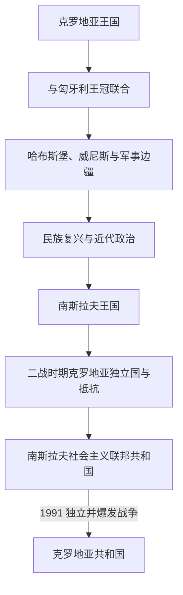

# 克罗地亚历史

[返回东南欧与巴尔干历史](/%E4%BA%BA%E6%96%87%E7%A7%91%E5%AD%A6/%E5%8E%86%E5%8F%B2/%E6%AC%A7%E6%B4%B2/%E4%B8%9C%E5%8D%97%E6%AC%A7%E4%B8%8E%E5%B7%B4%E5%B0%94%E5%B9%B2/README.md)

## 概括

克罗地亚历史可按“中世纪公国与王国 → 与匈牙利王冠联合 → 哈布斯堡、威尼斯和奥斯曼边疆 → 民族复兴与近代自治政治 → 两代南斯拉夫国家 → 独立战争与共和国”来理解。亚得里亚海沿岸、内陆克罗地亚和斯拉沃尼亚长期处在不同政治体系，现代国家线由这些区域逐步整合而成。

## 历史阶段导航

| 顺序 | 阶段 | 时间 | 历史走向 |
|---:|---|---|---|
| 1 | [克罗地亚王国](/%E4%BA%BA%E6%96%87%E7%A7%91%E5%AD%A6/%E5%8E%86%E5%8F%B2/%E6%AC%A7%E6%B4%B2/%E4%B8%9C%E5%8D%97%E6%AC%A7%E4%B8%8E%E5%B7%B4%E5%B0%94%E5%B9%B2/%E5%85%8B%E7%BD%97%E5%9C%B0%E4%BA%9A/%E5%85%8B%E7%BD%97%E5%9C%B0%E4%BA%9A%E7%8E%8B%E5%9B%BD.md) | 9世纪—1102年 | 中世纪国家形成并与拉丁基督教世界相连。 |
| 2 | [匈牙利联合与哈布斯堡时期](/%E4%BA%BA%E6%96%87%E7%A7%91%E5%AD%A6/%E5%8E%86%E5%8F%B2/%E6%AC%A7%E6%B4%B2/%E4%B8%9C%E5%8D%97%E6%AC%A7%E4%B8%8E%E5%B7%B4%E5%B0%94%E5%B9%B2/%E5%85%8B%E7%BD%97%E5%9C%B0%E4%BA%9A/%E5%8C%88%E7%89%99%E5%88%A9%E8%81%94%E5%90%88%E4%B8%8E%E5%93%88%E5%B8%83%E6%96%AF%E5%A0%A1%E6%97%B6%E6%9C%9F.md) | 1102年—19世纪初 | 王冠联合、奥斯曼战争、威尼斯沿海统治和军事边疆。 |
| 3 | [民族复兴与近代政治](/%E4%BA%BA%E6%96%87%E7%A7%91%E5%AD%A6/%E5%8E%86%E5%8F%B2/%E6%AC%A7%E6%B4%B2/%E4%B8%9C%E5%8D%97%E6%AC%A7%E4%B8%8E%E5%B7%B4%E5%B0%94%E5%B9%B2/%E5%85%8B%E7%BD%97%E5%9C%B0%E4%BA%9A/%E6%B0%91%E6%97%8F%E5%A4%8D%E5%85%B4%E4%B8%8E%E8%BF%91%E4%BB%A3%E6%94%BF%E6%B2%BB.md) | 19世纪初—1918年 | 伊利里亚运动、自治诉求及南斯拉夫主义发展。 |
| 4 | 南斯拉夫国家时期 | 1918年—1991年 | 经历[南斯拉夫王国](/%E4%BA%BA%E6%96%87%E7%A7%91%E5%AD%A6/%E5%8E%86%E5%8F%B2/%E6%AC%A7%E6%B4%B2/%E4%B8%9C%E5%8D%97%E6%AC%A7%E4%B8%8E%E5%B7%B4%E5%B0%94%E5%B9%B2/%E5%8D%97%E6%96%AF%E6%8B%89%E5%A4%AB%E5%8E%86%E5%8F%B2/%E5%8D%97%E6%96%AF%E6%8B%89%E5%A4%AB%E7%8E%8B%E5%9B%BD.md)、二战和[社会主义联邦](/%E4%BA%BA%E6%96%87%E7%A7%91%E5%AD%A6/%E5%8E%86%E5%8F%B2/%E6%AC%A7%E6%B4%B2/%E4%B8%9C%E5%8D%97%E6%AC%A7%E4%B8%8E%E5%B7%B4%E5%B0%94%E5%B9%B2/%E5%8D%97%E6%96%AF%E6%8B%89%E5%A4%AB%E5%8E%86%E5%8F%B2/%E5%8D%97%E6%96%AF%E6%8B%89%E5%A4%AB%E7%A4%BE%E4%BC%9A%E4%B8%BB%E4%B9%89%E8%81%94%E9%82%A6%E5%85%B1%E5%92%8C%E5%9B%BD.md)。 |
| 5 | [独立战争与当代克罗地亚](/%E4%BA%BA%E6%96%87%E7%A7%91%E5%AD%A6/%E5%8E%86%E5%8F%B2/%E6%AC%A7%E6%B4%B2/%E4%B8%9C%E5%8D%97%E6%AC%A7%E4%B8%8E%E5%B7%B4%E5%B0%94%E5%B9%B2/%E5%85%8B%E7%BD%97%E5%9C%B0%E4%BA%9A/%E7%8B%AC%E7%AB%8B%E6%88%98%E4%BA%89%E4%B8%8E%E5%BD%93%E4%BB%A3%E5%85%8B%E7%BD%97%E5%9C%B0%E4%BA%9A.md) | 1991年至今 | 独立战争、领土恢复、民主化与欧洲整合。 |

## 关键辨析

- 1102年后的克罗地亚并未简单“消失”，但其自治制度、王冠关系和实际权力随时期变化。
- 达尔马提亚、克罗地亚—斯拉沃尼亚和军事边疆的归属不同，不能用现代国界覆盖中世纪与近代政治地理。
- 1941—1945年的克罗地亚独立国是轴心国支持的傀儡政权，不能与当代克罗地亚共和国作无条件直系继承。
