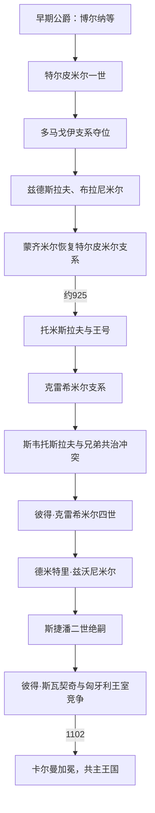

# 克罗地亚中世纪统治者世系表

[克罗地亚历史](/%E4%BA%BA%E6%96%87%E7%A7%91%E5%AD%A6/%E5%8E%86%E5%8F%B2/%E6%AC%A7%E6%B4%B2/%E4%B8%9C%E5%8D%97%E6%AC%A7%E4%B8%8E%E5%B7%B4%E5%B0%94%E5%B9%B2/%E5%85%8B%E7%BD%97%E5%9C%B0%E4%BA%9A/README.md)

## 范围与口径

本表区分达尔马提亚克罗地亚的公爵—国王主线、下潘诺尼亚的并行统治者，以及1090—1102年的王位竞争。7—10世纪材料零碎，多数年份是学术重建；“特尔皮米尔王朝”这一总称也是后世史学概念，托米斯拉夫、克雷希米尔一世等是否与早期支系存在可证明的连续血缘，不能全部确定。

## 早期达尔马提亚克罗地亚公爵

| 顺序 | 统治者 | 家族或政治基础 | 约在位 | 与前任关系 | 关键事件与争议 |
|---:|---|---|---|---|---|
| 1 | 维舍斯拉夫（Višeslav） | 不详 | 约8世纪末—约802年 | 关系不详 | 名称主要来自洗礼池铭文；是否统治后来意义的全部克罗地亚及确切年代均有争议。 |
| 2 | **博尔纳（Borna）** | 不详，法兰克附庸 | 约810—821年 | 关系不详 | 被法兰克文献称达尔马提亚和利布尔尼亚公爵；与柳德维特·波萨夫斯基作战。 |
| 3 | 弗拉迪斯拉夫（Vladislav） | 可能博尔纳近亲 | 821—约835年 | 由民众与皇帝认可继承博尔纳 | 资料极少，实际辖域与卒年不确定。 |
| 4 | 米斯拉夫（Mislav） | 不详 | 约835—约845年 | 关系不详 | 与威尼斯发生海上冲突，资助斯普利特教会。 |
| 5 | **特尔皮米尔一世（Trpimir I）** | 特尔皮米尔家 | 约845—864年 | 可能继承米斯拉夫 | 852年文书称“克罗地亚人的公爵”；击退保加利亚军并资助修道院。 |
| 6 | 多马戈伊（Domagoj） | 多马戈伊家 | 约864—876年 | 夺取特尔皮米尔诸子王位 | 同威尼斯、阿拉伯海盗和法兰克政治互动；教宗批评其海盗行为。 |
| 7 | 多马戈伊之子，姓名不详 | 多马戈伊家 | 876—878年 | 多马戈伊之子 | 旧史有“伊利科”称呼，但可靠性不足；被兹德斯拉夫推翻。 |
| 8 | 兹德斯拉夫（Zdeslav） | 特尔皮米尔家 | 878—879年 | 特尔皮米尔一世之子 | 在拜占庭支持下归国，次年被布拉尼米尔集团杀死。 |
| 9 | **布拉尼米尔（Branimir）** | 可能多马戈伊支系或独立贵族 | 879—892年 | 政变推翻兹德斯拉夫 | 教宗若望八世祝福其统治，政治自主和罗马教会联系加强。 |
| 10 | 蒙齐米尔（Muncimir／Mutimir） | 特尔皮米尔家 | 892—约910年或914年 | 特尔皮米尔一世之子、兹德斯拉夫之弟 | 恢复家族，文书显示宫廷与司法；终年有不同重建。 |

## 王国主序列

| 顺序 | 统治者 | 家族 | 约在位 | 继承关系 | 关键事件与争议 |
|---:|---|---|---|---|---|
| 1 | **托米斯拉夫（Tomislav）** | 通常归特尔皮米尔家 | 约910/914—约928年 | 常视为蒙齐米尔之后，亲属未证实 | 925年教廷文书称国王；连接内陆与斯拉沃尼亚，军力数字不可照单全信。 |
| 2 | 特尔皮米尔二世（Trpimir II） | 特尔皮米尔家 | 约928—935年 | 常被视为托米斯拉夫近亲 | 主要由后世编年重建，是否真实独立统治及亲属关系有争议。 |
| 3 | 克雷希米尔一世（Krešimir I） | 特尔皮米尔家 | 约935—945年 | 常被视为前任之子或近亲 | 在位材料很少；有两子米罗斯拉夫和米哈伊尔·克雷希米尔二世。 |
| 4 | 米罗斯拉夫（Miroslav） | 特尔皮米尔家 | 约945—949年 | 克雷希米尔一世之子 | 与弟弟争位，被班普里比纳杀死。 |
| 5 | 米哈伊尔·克雷希米尔二世（Michael Krešimir II） | 特尔皮米尔家 | 约949—969年 | 米罗斯拉夫之弟 | 与王后耶莱娜共同恢复秩序；王后在索林建教堂与陵墓。 |
| 6 | **斯捷潘·德尔日斯拉夫（Stephen Držislav）** | 特尔皮米尔家 | 969—997年 | 克雷希米尔二世之子 | 获拜占庭王冠和达尔马提亚头衔；“斯捷潘”可能是加冕名。 |
| 7 | 斯韦托斯拉夫·苏罗尼亚（Svetoslav Suronja） | 特尔皮米尔家长支 | 997—约1000年 | 德尔日斯拉夫长子 | 被弟弟们推翻；与威尼斯奥尔塞奥洛家结盟，其后裔可能形成斯韦托斯拉夫支。 |
| 8 | 克雷希米尔三世（Krešimir III） | 特尔皮米尔家 | 约1000—1030年 | 斯韦托斯拉夫之弟 | 与戈伊斯拉夫共治，争夺达尔马提亚城市；起始年有997、1000等说。 |
| — | 戈伊斯拉夫（Gojslav） | 特尔皮米尔家 | 约1000—1020年，共治 | 克雷希米尔三世之弟 | 共同推翻兄长；死亡及是否被兄长所杀有争议。 |
| 9 | 斯捷潘一世（Stephen I） | 特尔皮米尔家 | 约1030—1058年 | 多认为克雷希米尔三世之子 | 加强同拜占庭和达尔马提亚城市关系；老谱系编号因德尔日斯拉夫加冕名而不同。 |
| 10 | **彼得·克雷希米尔四世（Peter Krešimir IV）** | 特尔皮米尔家 | 1058—1074/1075年 | 斯捷潘一世之子 | 对达尔马提亚影响达高峰，支持教会改革；末期遭诺曼介入，卒年有差异。 |
| 11 | **德米特里·兹沃尼米尔（Demetrius Zvonimir）** | 可能斯韦托斯拉夫支，血缘有争议 | 1075—1089年 | 曾任斯拉沃尼亚班；与前王可能为远亲或姻亲 | 教宗使节加冕，娶匈牙利公主耶莱娜；死因和“被杀”传说不确定。 |
| 12 | 斯捷潘二世或三世（Stephen II／III） | 特尔皮米尔家 | 1089—1090/1091年 | 彼得·克雷希米尔四世之侄或王族近亲 | 长期在修道院，年老复位后无嗣去世；编号取决于是否把德尔日斯拉夫算斯捷潘一世。 |

## 1090—1102年王位竞争

| 人物 | 主张或控制期 | 合法性与实际控制 | 结果 |
|---|---|---|---|
| 拉斯洛一世（Ladislaus I） | 1091—1095年介入 | 匈牙利国王，兹沃尼米尔王后耶莱娜之兄；控制斯拉沃尼亚并建立萨格勒布主教区 | 未能稳控整个达尔马提亚克罗地亚，死后由卡尔曼继续。 |
| 阿尔莫什（Álmos） | 1091—1095年前后 | 拉斯洛一世之侄，被安排管理新占地区；是否正式称“克罗地亚国王”与范围有争议 | 后与兄长卡尔曼争夺匈牙利权力，未建立独立克罗地亚王朝。 |
| **彼得·斯瓦契奇（Petar Svačić／Snačić）** | 约1093/1097—1097年 | 由一部分克罗地亚贵族拥立，常称最后一位本地国王 | 1097年在格沃兹德山同卡尔曼军作战身亡；家族名拼写及早年经历不明。 |
| **卡尔曼（Coloman）** | 1097年后推进，1102年加冕 | 匈牙利国王、阿尔帕德王朝；以征服、谈判和加冕取得承认 | 开启两王国共奉君主的长期结构。 |

## 下潘诺尼亚的并行统治者

下列人物统治萨瓦—德拉瓦及其周边的法兰克边疆政体，不能硬插入达尔马提亚克罗地亚单线，却是斯拉沃尼亚历史的重要前身。

| 统治者 | 约在位 | 宗主与范围 | 关键事件与争议 |
|---|---|---|---|
| 沃伊诺米尔（Vojnomir） | 约790—800年 | 法兰克方面的斯拉夫首领，活动于潘诺尼亚或卡尔尼奥拉 | 是否为“潘诺尼亚克罗地亚公爵”、族属和辖区均有争议。 |
| **柳德维特·波萨夫斯基（Ljudevit Posavski）** | 约810—823年 | 下潘诺尼亚公爵，初为法兰克附庸 | 819年起反法兰克，联合或争取多支斯拉夫力量，失败后逃亡并被杀。 |
| 拉特米尔（Ratimir） | 约829—838年 | 潘诺尼亚地方统治者，可能依附保加利亚 | 838年遭东法兰克将领驱逐；同达尔马提亚主线关系不明。 |
| 布拉斯拉夫（Braslav） | 约880—898/900年 | 法兰克附庸的下潘诺尼亚公爵 | 受命防御匈牙利人；其政权在马扎尔征服中消失。 |

## 世系连续性说明

- 维舍斯拉夫以前的波尔加等7世纪人物主要见于较晚叙述，无法建立可靠连续年表，故不装作公认在位世系。
- 斯韦托斯拉夫、克雷希米尔三世和戈伊斯拉夫约997—1020年的先后与共治关系有多种方案，表中采用“长兄先位、两弟共治夺权”的谨慎口径。
- “特尔皮米尔王朝”不能证明从特尔皮米尔一世到1090年完全不间断父系相承；兹沃尼米尔的支系尤其有争议。
- 1102年以后克罗地亚王号由匈牙利共同君主承继；完整序列见[匈牙利君主与摄政世系表](/%E4%BA%BA%E6%96%87%E7%A7%91%E5%AD%A6/%E5%8E%86%E5%8F%B2/%E6%AC%A7%E6%B4%B2/%E5%8C%88%E7%89%99%E5%88%A9/%E5%8C%88%E7%89%99%E5%88%A9%E5%90%9B%E4%B8%BB%E4%B8%8E%E6%91%84%E6%94%BF%E4%B8%96%E7%B3%BB%E8%A1%A8.md)，不在本表重复。
- 后世《协定》可反映贵族特权传统，但不能据此断言1102年每一条条件均以现存文字签署。

## 相关阶段

- [克罗地亚王国](/%E4%BA%BA%E6%96%87%E7%A7%91%E5%AD%A6/%E5%8E%86%E5%8F%B2/%E6%AC%A7%E6%B4%B2/%E4%B8%9C%E5%8D%97%E6%AC%A7%E4%B8%8E%E5%B7%B4%E5%B0%94%E5%B9%B2/%E5%85%8B%E7%BD%97%E5%9C%B0%E4%BA%9A/%E5%85%8B%E7%BD%97%E5%9C%B0%E4%BA%9A%E7%8E%8B%E5%9B%BD.md)
- [匈牙利联合与哈布斯堡时期](/%E4%BA%BA%E6%96%87%E7%A7%91%E5%AD%A6/%E5%8E%86%E5%8F%B2/%E6%AC%A7%E6%B4%B2/%E4%B8%9C%E5%8D%97%E6%AC%A7%E4%B8%8E%E5%B7%B4%E5%B0%94%E5%B9%B2/%E5%85%8B%E7%BD%97%E5%9C%B0%E4%BA%9A/%E5%8C%88%E7%89%99%E5%88%A9%E8%81%94%E5%90%88%E4%B8%8E%E5%93%88%E5%B8%83%E6%96%AF%E5%A0%A1%E6%97%B6%E6%9C%9F.md)
