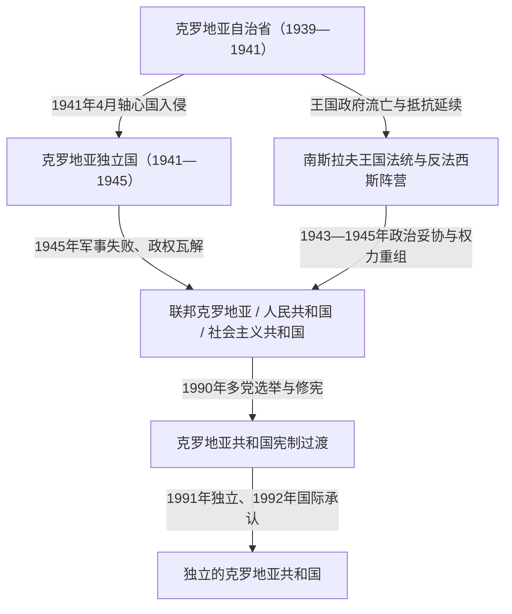

# 克罗地亚国家元首与政府首脑表

## 范围与口径

本表集中整理1939年以来克罗地亚区域内各主要政体的行政首脑、法定国家元首、政府首脑与实际权力中心。它不是一条彼此合法继承的单线“总统世系”：克罗地亚自治省属于南斯拉夫王国，克罗地亚独立国是轴心国扶植的乌斯塔沙政权，社会主义克罗地亚是南斯拉夫联邦共和国，1990年以后才逐步形成今日的独立共和国。不同政体分表，是为了避免把名义君主、占领当局、党内领导与宪制元首混为一谈。

日期采用正式任命、选举、就职或权力交接日。战争时期和早期社会主义阶段的个别职位存在“机构成立日”“政体改名日”与“任职确认日”不同的口径，相关行在备注中说明。

## 职位演变图

## 克罗地亚自治省行政首脑（1939—1941）

[南斯拉夫王国时期的克罗地亚](/%E4%BA%BA%E6%96%87%E7%A7%91%E5%AD%A6/%E5%8E%86%E5%8F%B2/%E6%AC%A7%E6%B4%B2/%E4%B8%9C%E5%8D%97%E6%AC%A7%E4%B8%8E%E5%B7%B4%E5%B0%94%E5%B9%B2/%E5%85%8B%E7%BD%97%E5%9C%B0%E4%BA%9A/%E5%8D%97%E6%96%AF%E6%8B%89%E5%A4%AB%E7%8E%8B%E5%9B%BD%E6%97%B6%E6%9C%9F%E7%9A%84%E5%85%8B%E7%BD%97%E5%9C%B0%E4%BA%9A.md)中的克罗地亚自治省是王国内部的自治单位，不是主权国家。自治省长（Ban）主管自治行政，但王国中央保留外交、国防、货币和部分治安权限。

| 顺序 | 姓名 | 职位 | 任期 | 与前任关系 | 实际权力与重要事件 |
|---:|---|---|---|---|---|
| 1 | **伊万·舒巴希奇**（Ivan Šubašić） | 克罗地亚自治省长 | 1939-08-26—1941-04-10 | 新设职位 | 唯一一任自治省长；组织11个行政部门，但自治议会未及选出，1941年轴心国入侵使自治安排崩溃。 |

### 同期权力结构

| 层级 | 人物或机构 | 作用 |
|---|---|---|
| 法定君主 | 彼得二世 | 南斯拉夫国王；1941年3月前因未成年由摄政委员会代行王权。 |
| 摄政核心 | 保罗亲王 | 1934—1941年主导摄政体制；1941年3月政变后失势。 |
| 王国政府 | 德拉吉沙·茨韦特科维奇 | 以首相身份与克罗地亚政治代表达成1939年协议。 |
| 克罗地亚政治核心 | 弗拉特科·马切克 | 克罗地亚农民党领袖、王国副首相，是自治方案的主要克罗地亚政治推动者，但不是自治省长。 |
| 自治行政 | 自治省长及11个部门 | 管理农业、贸易、工业、教育、司法、内政等广泛领域；原拟与自治议会共同形成自治体制，议会选举因战争未能举行。 |

## 克罗地亚独立国的名义元首与实际统治（1941—1945）

[克罗地亚独立国与第二次世界大战](/%E4%BA%BA%E6%96%87%E7%A7%91%E5%AD%A6/%E5%8E%86%E5%8F%B2/%E6%AC%A7%E6%B4%B2/%E4%B8%9C%E5%8D%97%E6%AC%A7%E4%B8%8E%E5%B7%B4%E5%B0%94%E5%B9%B2/%E5%85%8B%E7%BD%97%E5%9C%B0%E4%BA%9A/%E5%85%8B%E7%BD%97%E5%9C%B0%E4%BA%9A%E7%8B%AC%E7%AB%8B%E5%9B%BD%E4%B8%8E%E7%AC%AC%E4%BA%8C%E6%AC%A1%E4%B8%96%E7%95%8C%E5%A4%A7%E6%88%98.md)是纳粹德国和法西斯意大利扶植的轴心国附庸。乌斯塔沙领袖安特·帕韦利奇掌握最高权力；意大利指定的“国王”从未入境或行使统治，不能按正常君主制处理。

### 国家元首与名义君主

| 顺序 | 姓名 | 身份 | 任期 | 权力性质与备注 |
|---:|---|---|---|---|
| 1 | 斯拉夫科·克瓦特尔尼克（Slavko Kvaternik） | 帕韦利奇代理人、建政初期临时领导 | 1941-04-10—1941-04-15 | 代尚未抵达萨格勒布的帕韦利奇宣布成立政权，不是正常宪制下的长期国家元首。 |
| 2 | **安特·帕韦利奇**（Ante Pavelić） | “领袖”（Poglavnik）、实际国家元首 | 1941-04-15—1945-05-06 | 乌斯塔沙党政军最高决策者；以独裁统治实施族群迫害与大规模暴力，末期随政权撤离萨格勒布。 |
| — | 艾莫内·迪·萨伏依-奥斯塔（Aimone di Savoia-Aosta），王号“托米斯拉夫二世” | 意大利指定的名义国王 | 1941-05-18—1943年10月 | 从未正式加冕、进入克罗地亚或行使王权；1943年意大利政局崩溃后退出，具体决定与正式放弃日期存在不同口径。 |

### 政府首脑

| 顺序 | 姓名 | 任期 | 与前任关系 | 重要事件与备注 |
|---:|---|---|---|---|
| 1 | **安特·帕韦利奇** | 1941-04-16—1943-09-02 | 首任 | 同时是实际国家元首；政府决策受德国、意大利军政支配和乌斯塔沙领袖个人权力制约。 |
| 2 | 尼古拉·曼迪奇（Nikola Mandić） | 1943-09-02—1945年5月 | 帕韦利奇任命 | 意大利投降后德国主导程度上升；政权崩溃时随领导层撤退。 |

### 占领与实际控制

| 力量 | 控制方式 | 对政权的影响 |
|---|---|---|
| 法西斯意大利 | 通过军队、外交压力和1941年《罗马条约》 | 取得大片达尔马提亚沿海与岛屿，扶植名义君主，并直接影响其占领区的行政与军事。 |
| 纳粹德国 | 控制战略交通、军务和重要经济资源 | 随战争扩大增兵；1943年意大利投降后接管原意占区并成为主要外部支配者。 |
| 乌斯塔沙运动 | 垄断合法政治组织、警察与党军 | 帕韦利奇掌握核心决策；国家议会没有独立制衡能力。 |
| 游击队与其他武装 | 在占领区和农村建立抵抗或竞争性控制 | 共产党领导的游击队逐步扩张；塞尔维亚切特尼克等力量也活动于部分地区，政治目标和暴力对象并不相同。 |

## 社会主义克罗地亚法定国家元首（1943/1945—1990）

[社会主义时期的克罗地亚](/%E4%BA%BA%E6%96%87%E7%A7%91%E5%AD%A6/%E5%8E%86%E5%8F%B2/%E6%AC%A7%E6%B4%B2/%E4%B8%9C%E5%8D%97%E6%AC%A7%E4%B8%8E%E5%B7%B4%E5%B0%94%E5%B9%B2/%E5%85%8B%E7%BD%97%E5%9C%B0%E4%BA%9A/%E7%A4%BE%E4%BC%9A%E4%B8%BB%E4%B9%89%E6%97%B6%E6%9C%9F%E7%9A%84%E5%85%8B%E7%BD%97%E5%9C%B0%E4%BA%9A.md)的元首职位多次改名。1943—1945年的克罗地亚反法西斯人民解放委员会（ZAVNOH）既是战时代表机关也是新政权核心；1946年后由议会主席团主席、议会主席或共和国主席团主席承担法定元首职能。法定元首不等于共和国层面的实际最高政治领导。

| 顺序 | 姓名 | 职务 | 任期 | 与前任关系 | 关键事件与备注 |
|---:|---|---|---|---|---|
| 1 | **弗拉迪米尔·纳佐尔**（Vladimir Nazor） | ZAVNOH主席；后历任克罗地亚人民议会及人民共和国议会主席团主席 | 1943-06-13—1949-06-19 | 战时机构首任主席 | 1943年起领导ZAVNOH；1945—1947年机构名称随联邦和共和国宪制建立多次变化，但本人连续任职，1949年在任内去世。 |
| — | 安通·巴比奇、米莱·波丘查 | 两位副主席共同代理 | 1949-06-19—1949-10-15 | 因纳佐尔去世集体代理 | 两人共同代行主席团职权，不能指定其中一人为唯一元首。 |
| 2 | 卡尔洛·姆拉佐维奇（Karlo Mrazović） | 议会主席团主席 | 1949-10-15—1952-03-18 | 正式继任 | 延续人民共和国初期体制。 |
| 3 | 维茨科·克尔斯图洛维奇（Vicko Krstulović） | 议会主席团主席 | 1952-03-18—1953-02-06 | 议会选出 | 1953年宪制改组后，主席团元首职位撤销。 |
| 4 | 兹拉坦·斯雷梅茨（Zlatan Sremec） | 议会主席、形式上的共和国元首 | 1953-02-06—1953-12-18 | 因制度改组承接元首职能 | 议长开始兼具形式元首地位。 |
| 5 | **弗拉迪米尔·巴卡里奇**（Vladimir Bakarić） | 议会主席 | 1953-12-18—1963-06-27 | 由政府首脑转任 | 同时长期担任执政党领导，是法定职位与实际政治影响力高度重合的阶段。 |
| 6 | 伊万·克拉亚契奇（Ivan Krajačić） | 议会主席 | 1963-06-27—1967-05-11 | 议会选出 | 1963年国名改为“社会主义共和国”，元首职能仍由议长承担。 |
| 7 | 雅科夫·布拉热维奇（Jakov Blažević） | 议会主席 | 1967-05-11—1974-05-08 | 议会选出 | 任至1974年集体主席团制度建立。 |
| 8 | **雅科夫·布拉热维奇** | 共和国主席团主席 | 1974-05-08—1982-05-10 | 新制首任，连续两届 | 1974年宪法设共和国集体主席团；主席团主席与议长自此分开。 |
| 9 | 马里扬·茨韦特科维奇（Marijan Cvetković） | 共和国主席团主席 | 1982-05-10—1983-05-11 | 轮换产生 | 1981年修宪后实行较短周期轮换。 |
| 10 | 米卢廷·巴尔蒂奇（Milutin Baltić） | 共和国主席团主席 | 1983-05-11—1984-05-10 | 轮换产生 | 集体领导成员之一。 |
| 11 | 雅克沙·佩特里奇（Jakša Petrić） | 共和国主席团主席 | 1984-05-10—1985-05-10 | 轮换产生 | 集体领导成员之一。 |
| 12 | 佩罗·察尔（Pero Car） | 共和国主席团主席 | 1985-05-10—1985-11-15 | 轮换产生 | 在任内去世。 |
| — | 共和国主席团集体 | 主席空缺期集体履职 | 1985-11-15—1985-12-26 | 因佩罗·察尔去世 | 没有单一正式代理主席。 |
| 13 | 埃玛·德罗西-别拉亚茨（Ema Derosi-Bjelajac） | 共和国主席团主席 | 1985-12-26—1986-05-09 | 主席团推举 | 克罗地亚首位女性法定国家元首。 |
| 14 | 安特·马尔科维奇（Ante Marković） | 共和国主席团主席 | 1986-05-09—1988-05-09 | 主席团推举 | 后任南斯拉夫联邦政府末任总理。 |
| 15 | 伊沃·拉廷（Ivo Latin） | 共和国主席团主席 | 1988-05-09—1990-05-30 | 主席团推举 | 任内经历一党体制末期和多党选举准备。 |
| 16 | **弗拉尼奥·图季曼**（Franjo Tuđman） | 共和国主席团主席 | 1990-05-30—1990-07-25 | 首次多党选举后由议会选出 | 7月修宪后职位改为克罗地亚共和国总统。 |

> 1974年以后议长与国家元首已经分离。伊沃·佩里辛虽在1974—1978年担任议长，但不是共和国主席团主席，因此不列入元首顺序。

## 社会主义克罗地亚政府首脑（1945—1990）

1943—1945年前期，ZAVNOH尚未形成与其完全分离的常设共和国政府；第一届克罗地亚人民政府于1945年4月14日成立。1953年后政府首脑通常称“议会执行委员会主席”。

| 顺序 | 姓名 | 职务 | 任期 | 与前任关系 | 关键事件与备注 |
|---:|---|---|---|---|---|
| 1 | **弗拉迪米尔·巴卡里奇** | 人民政府主席；后为议会执行委员会主席 | 1945-04-14—1953-12-18 | 首任 | 组织战后接管、国有化和新宪制；同时长期掌握党内领导。 |
| 2 | 雅科夫·布拉热维奇 | 议会执行委员会主席 | 1953-12-18—1962-07-10 | 议会选出 | 横跨两个执行委员会任期。 |
| 3 | 兹冯科·布尔基奇（Zvonko Brkić） | 议会执行委员会主席 | 1962-07-10—1963-06-27 | 议会选出 | 任期跨越1963年国名与宪制调整。 |
| 4 | 米卡·什皮利亚克（Mika Špiljak） | 议会执行委员会主席 | 1963-06-27—1967-05-11 | 议会选出 | 工业化和联邦经济改革时期。 |
| 5 | 萨夫卡·达布切维奇-库查尔（Savka Dabčević-Kučar） | 议会执行委员会主席 | 1967-05-11—1969-05-08 | 议会选出 | 后转任执政党领导，并成为“克罗地亚之春”主要人物。 |
| 6 | 德拉古廷·哈拉米亚（Dragutin Haramija） | 议会执行委员会主席 | 1969-05-08—1971-12-28 | 议会选出 | 克罗地亚之春高潮及受压时期的政府首脑。 |
| 7 | 伊沃·佩里辛（Ivo Perišin） | 议会执行委员会主席 | 1971-12-28—1974-05-08 | 运动受压后接任 | 参与重整政府，后任议长。 |
| 8 | 雅科夫·西罗特科维奇（Jakov Sirotković） | 议会执行委员会主席 | 1974-05-08—1978-05-09 | 1974年新宪制下就任 | 共和国权限扩大与自治管理制度发展时期。 |
| 9 | 佩塔尔·弗莱科维奇（Petar Fleković） | 议会执行委员会主席 | 1978-05-09—1982-05-10 | 议会选出 | 经历铁托去世和经济压力上升。 |
| 10 | 安特·马尔科维奇 | 议会执行委员会主席 | 1982-05-10—1986-05-10 | 议会选出 | 推动经济管理改革；后转任共和国元首和联邦总理。 |
| 11 | 安通·米洛维奇（Antun Milović） | 议会执行委员会主席 | 1986-05-10—1990-05-30 | 议会选出 | 经济、民族和联邦危机深化时期。 |
| 12 | 斯捷潘·梅西奇（Stjepan Mesić） | 议会执行委员会主席 | 1990-05-30—1990-07-25 | 多党选举后组阁 | 7月25日修宪后职位改称总理，并连续任职至8月24日。 |

## 社会主义时期共和国层面的执政党领导

共和国法定元首、政府首脑和党首是不同角色。克罗地亚共产党／克罗地亚共产主义者联盟的领导人是共和国层面的主要实际政治核心，但其上仍有铁托、南斯拉夫共产主义者联盟中央和联邦国家机关，不能写成完全独立于联邦的“最高统治者”。

| 顺序 | 姓名 | 党内最高职务任期 | 与前任关系 | 关键事件与备注 |
|---:|---|---|---|---|
| 1 | 安德里亚·赫布朗（Andrija Hebrang） | 1942—1944年10月 | 战时党组织领导 | 领导战时克罗地亚共产党和解放运动政治工作；属于社会主义建政前史。 |
| 2 | **弗拉迪米尔·巴卡里奇** | 1944年10月—1969年3月28日 | 接替赫布朗 | 长期第一书记，1966年后称中央委员会主席；既参与共和国建制，又长期连接共和国与联邦权力。 |
| 3 | **萨夫卡·达布切维奇-库查尔** | 1969-03-28—1971-12-13 | 党内改组后接任 | “克罗地亚之春”领导人之一，联邦党领导施压后辞职。 |
| 4 | 米尔卡·普拉宁茨（Milka Planinc） | 1971-12-14—1982-05-16 | 整顿期接任 | 重组党组织，后来出任南斯拉夫联邦政府首脑。 |
| 5 | 尤雷·比利奇（Jure Bilić） | 1982-05-16—1983-05-23 | 新轮换制度下接任 | 任期缩短，党内领导趋向集体化和轮换。 |
| 6 | 约西普·弗尔霍韦茨（Josip Vrhovec） | 1983-05-23—1984-05-14 | 党内轮换 | 同时具有联邦外交和党政经历。 |
| 7 | 米卡·什皮利亚克 | 1984-05-14—1986-05-18 | 党内轮换 | 曾任共和国政府首脑及多项联邦职务。 |
| 8 | 斯坦科·斯托伊切维奇（Stanko Stojčević） | 1986-05-18—1989-12-13 | 党内推举 | 经济停滞、民族政治上升和联邦制度危机阶段。 |
| 9 | 伊维察·拉昌（Ivica Račan） | 1989-12-13—1990-11-03 | 改革派接任 | 接受政治多元与多党选举；原党在1990年改组并逐步转型为社会民主党。 |

## 克罗地亚共和国总统与代行总统职权者（1990—2026）

1990年12月宪法确立权力较强的总统制色彩；2000年修宪后转向议会制，总统保留国家代表、国防和外交等宪法职能，政府由议会多数支持的总理领导。

| 顺序 | 姓名 | 职位 | 任期 | 与前任关系 | 关键事件与备注 |
|---:|---|---|---|---|---|
| 1 | **弗拉尼奥·图季曼** | 共和国主席团主席；1990-07-25后为共和国总统 | 1990-05-30—1999-12-10 | 多党选举后由议会选出 | 领导独立、战争和战后重建；1992、1997年赢得直选，在任内去世。 |
| — | 弗拉特科·帕夫莱蒂奇（Vlatko Pavletić） | 代行总统职权 | 1999-12-10—2000-02-02 | 依议长身份代理 | 在总统去世和新总统选举之间代行职权。 |
| — | 兹拉特科·托姆契奇（Zlatko Tomčić） | 代行总统职权 | 2000-02-02—2000-02-18 | 新任议长接续代理 | 完成总统选举后的短期交接。 |
| 2 | **斯捷潘·梅西奇** | 总统 | 2000-02-18—2010-02-18 | 直选 | 连任两届；任期内半总统制转为议会制并推进欧洲—大西洋一体化。 |
| 3 | 伊沃·约西波维奇（Ivo Josipović） | 总统 | 2010-02-18—2015-02-18 | 直选 | 一届；强调地区和解、法治与欧洲政策。 |
| 4 | 科琳达·格拉巴尔-基塔罗维奇（Kolinda Grabar-Kitarović） | 总统 | 2015-02-18—2020-02-18 | 直选击败在任者 | 克罗地亚首位女性总统；就职宣誓与完成权力交接相隔数日，本表用交接日。 |
| 5 | **佐兰·米拉诺维奇**（Zoran Milanović） | 总统 | 2020-02-18—至今 | 直选击败在任者 | 2025-02-18宣誓开始第二个五年任期；截至2026-07-14仍在任。 |

## 克罗地亚共和国总理（1990—2026）

| 顺序 | 姓名 | 任期 | 与前任关系 | 关键事件与备注 |
|---:|---|---|---|---|
| 1 | 斯捷潘·梅西奇 | 1990-05-30—1990-08-24 | 多党选举后组阁 | 7月25日前为议会执行委员会主席，此后职称改为总理。 |
| 2 | 约西普·马诺利奇（Josip Manolić） | 1990-08-24—1991-07-17 | 图季曼任命 | 独立危机与塞族叛乱扩大阶段。 |
| 3 | **弗拉尼奥·格雷古里奇**（Franjo Gregurić） | 1991-07-17—1992-08-12 | 战争升级后组建广泛政府 | 领导战时民族团结政府，处理承认、停火和军政组织。 |
| 4 | 赫尔沃耶·沙里尼奇（Hrvoje Šarinić） | 1992-08-12—1993-04-03 | 选举后接任 | 战时政府，并参与与塞尔维亚方面的秘密或公开接触。 |
| 5 | 尼基察·瓦伦蒂奇（Nikica Valentić） | 1993-04-03—1995-11-07 | 政府改组 | 推动货币稳定，任期覆盖“闪电”和“风暴”行动。 |
| 6 | 兹拉特科·马泰沙（Zlatko Mateša） | 1995-11-07—2000-01-27 | 战争后期接任 | 处理战后重建、和平回归和图季曼时代末期转型。 |
| 7 | **伊维察·拉昌** | 2000-01-27—2003-12-23 | 中左联盟胜选 | 先后主持两届内阁；削弱总统行政权、推动民主制度巩固与欧洲整合。 |
| 8 | 伊沃·萨纳德（Ivo Sanader） | 2003-12-23—2009-07-06 | 克罗地亚民主共同体胜选 | 主持两届内阁，推进北约和欧盟进程；2009年突然辞职，后来因腐败案件被审判。 |
| 9 | 亚德兰卡·科索尔（Jadranka Kosor） | 2009-07-06—2011-12-23 | 执政党内部接任 | 克罗地亚首位女总理；完成欧盟入盟谈判的重要阶段并推进反腐。 |
| 10 | 佐兰·米拉诺维奇 | 2011-12-23—2016-01-22 | 中左联盟胜选 | 任内克罗地亚于2013年加入欧盟。 |
| 11 | 蒂霍米尔·奥雷什科维奇（Tihomir Orešković） | 2016-01-22—2016-10-19 | 议会妥协产生 | 无党派技术官僚型总理；联盟破裂后政府任期较短。 |
| 12 | **安德烈·普连科维奇**（Andrej Plenković） | 2016-10-19—至今 | 克罗地亚民主共同体组阁 | 2016、2020、2024年三次组阁；任内加入欧元区和申根区，截至2026-07-14仍在任。 |

## 制度转折与权力变化

| 时间 | 转折 | 对领导结构的影响 |
|---|---|---|
| 1939 | 克罗地亚自治省成立 | 王国内首次形成覆盖大部分克罗地亚地区的广泛自治行政，但仍受王国君主、摄政与中央政府约束。 |
| 1941 | 轴心国入侵南斯拉夫 | 自治体制被摧毁；乌斯塔沙在德意支配下建政，名义国王没有实权。 |
| 1943—1945 | ZAVNOH、游击队胜利与联邦重建 | 反法西斯代表机关成为社会主义克罗地亚的制度起点；共和国嵌入南斯拉夫联邦。 |
| 1953 | 议会主席团撤销 | 议长承担形式元首职能，政府改称执行委员会。 |
| 1974 | 新宪法与共和国集体主席团 | 共和国权限扩大，元首、议长、政府和党首的职位更加明确分开。 |
| 1990 | 多党选举和连续修宪 | 图季曼接任共和国元首，执行委员会改称政府；一党统治终结。 |
| 1991—1992 | 独立、战争与国际承认 | 共和国领导机关转为主权国家机关，总统在战争体制中拥有强势地位。 |
| 1999—2001 | 图季曼去世、政党轮替与修宪 | 短期出现两位议长代理总统；国家由半总统制转向以总理和议会多数为中心的议会制。 |

## 前后关系

- 前一共同国家阶段：[南斯拉夫王国时期的克罗地亚](/%E4%BA%BA%E6%96%87%E7%A7%91%E5%AD%A6/%E5%8E%86%E5%8F%B2/%E6%AC%A7%E6%B4%B2/%E4%B8%9C%E5%8D%97%E6%AC%A7%E4%B8%8E%E5%B7%B4%E5%B0%94%E5%B9%B2/%E5%85%8B%E7%BD%97%E5%9C%B0%E4%BA%9A/%E5%8D%97%E6%96%AF%E6%8B%89%E5%A4%AB%E7%8E%8B%E5%9B%BD%E6%97%B6%E6%9C%9F%E7%9A%84%E5%85%8B%E7%BD%97%E5%9C%B0%E4%BA%9A.md)
- 轴心国政权与战争：[克罗地亚独立国与第二次世界大战](/%E4%BA%BA%E6%96%87%E7%A7%91%E5%AD%A6/%E5%8E%86%E5%8F%B2/%E6%AC%A7%E6%B4%B2/%E4%B8%9C%E5%8D%97%E6%AC%A7%E4%B8%8E%E5%B7%B4%E5%B0%94%E5%B9%B2/%E5%85%8B%E7%BD%97%E5%9C%B0%E4%BA%9A/%E5%85%8B%E7%BD%97%E5%9C%B0%E4%BA%9A%E7%8B%AC%E7%AB%8B%E5%9B%BD%E4%B8%8E%E7%AC%AC%E4%BA%8C%E6%AC%A1%E4%B8%96%E7%95%8C%E5%A4%A7%E6%88%98.md)
- 社会主义共和国阶段：[社会主义时期的克罗地亚](/%E4%BA%BA%E6%96%87%E7%A7%91%E5%AD%A6/%E5%8E%86%E5%8F%B2/%E6%AC%A7%E6%B4%B2/%E4%B8%9C%E5%8D%97%E6%AC%A7%E4%B8%8E%E5%B7%B4%E5%B0%94%E5%B9%B2/%E5%85%8B%E7%BD%97%E5%9C%B0%E4%BA%9A/%E7%A4%BE%E4%BC%9A%E4%B8%BB%E4%B9%89%E6%97%B6%E6%9C%9F%E7%9A%84%E5%85%8B%E7%BD%97%E5%9C%B0%E4%BA%9A.md)
- 独立战争与当代制度：[独立战争与当代克罗地亚](/%E4%BA%BA%E6%96%87%E7%A7%91%E5%AD%A6/%E5%8E%86%E5%8F%B2/%E6%AC%A7%E6%B4%B2/%E4%B8%9C%E5%8D%97%E6%AC%A7%E4%B8%8E%E5%B7%B4%E5%B0%94%E5%B9%B2/%E5%85%8B%E7%BD%97%E5%9C%B0%E4%BA%9A/%E7%8B%AC%E7%AB%8B%E6%88%98%E4%BA%89%E4%B8%8E%E5%BD%93%E4%BB%A3%E5%85%8B%E7%BD%97%E5%9C%B0%E4%BA%9A.md)
- 返回：[克罗地亚历史](/%E4%BA%BA%E6%96%87%E7%A7%91%E5%AD%A6/%E5%8E%86%E5%8F%B2/%E6%AC%A7%E6%B4%B2/%E4%B8%9C%E5%8D%97%E6%AC%A7%E4%B8%8E%E5%B7%B4%E5%B0%94%E5%B9%B2/%E5%85%8B%E7%BD%97%E5%9C%B0%E4%BA%9A/README.md)
