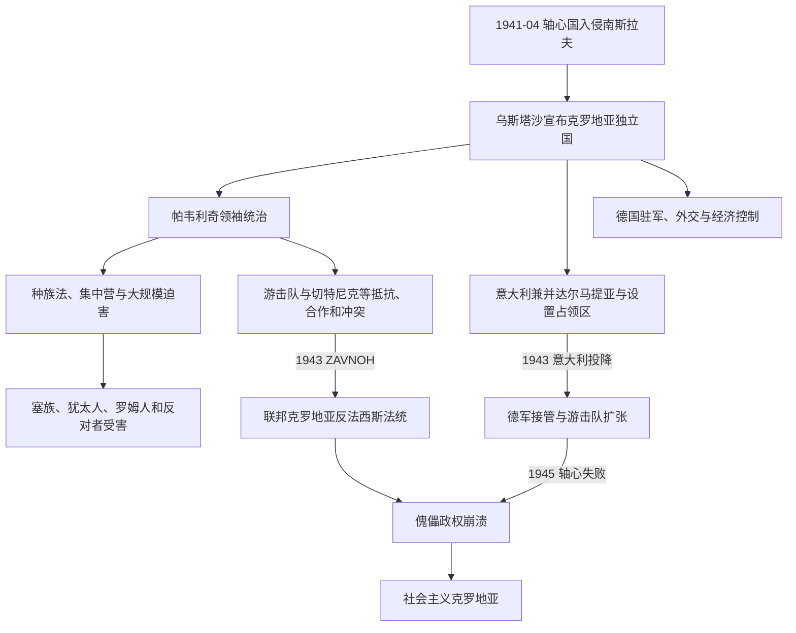

# 克罗地亚独立国与第二次世界大战

[克罗地亚历史](/%E4%BA%BA%E6%96%87%E7%A7%91%E5%AD%A6/%E5%8E%86%E5%8F%B2/%E6%AC%A7%E6%B4%B2/%E4%B8%9C%E5%8D%97%E6%AC%A7%E4%B8%8E%E5%B7%B4%E5%B0%94%E5%B9%B2/%E5%85%8B%E7%BD%97%E5%9C%B0%E4%BA%9A/README.md)

## 时间

1941年4月10日—1945年5月。其领土还包括几乎整个波斯尼亚和黑塞哥维那，但达尔马提亚大片地区被意大利兼并，其他区域分别受德意军事占领、游击队或敌对武装控制。

## 概括

“克罗地亚独立国”是轴心国摧毁南斯拉夫后扶植的乌斯塔沙政权。安特·帕韦利奇拥有“领袖”权力，意大利王族艾蒙内以托米斯拉夫二世名义担任从未到任的国王，德国和意大利通过驻军、领土割让、外交代表及经济控制限制其主权。政权以种族法律、集中营、强制改宗、驱逐和屠杀迫害塞族、犹太人、罗姆人及政治反对者。共产党领导的游击队在多族群基础上建立反法西斯委员会，1943—1945年逐步取代傀儡国家；战争也是乌斯塔沙、切特尼克、游击队、占领军和地方武装交错的内战。

## 建立与领土分割

1941年4月6日德意等国入侵，南斯拉夫军队迅速瓦解。4月10日，斯拉夫科·克瓦特尔尼克在德军进入萨格勒布时宣布新国家，流亡意大利的帕韦利奇随后回国。克罗地亚农民党领袖马切克拒绝领导傀儡政府，但号召追随者服从新政权以避免混乱；部分官员和武装因此被吸收。

5月《罗马条约》把扎达尔外更广的达尔马提亚海岸、岛屿交给意大利，并划定意军影响区。意大利公爵艾蒙内被指定为“托米斯拉夫二世”，从未赴克罗地亚或实际执政，1943年意大利退出战争后放弃称号。德国控制北部交通、矿业、粮食和军事行动；意大利在南部一度保护或利用塞族切特尼克力量制衡乌斯塔沙和游击队。所谓“独立”因而从建立之初就受轴心强权分区支配。

## 统治结构

| 角色 | 人物或机构 | 名义与实际权力 |
|---|---|---|
| 领袖 | **安特·帕韦利奇** | 乌斯塔沙党国最高权力，掌握任命、警察、军队与立法命令。 |
| 名义国王 | 托米斯拉夫二世／艾蒙内·萨伏依—奥斯塔 | 1941—1943年仅有名号，从未到任；不能视为实际君主统治。 |
| 政府首脑 | 帕韦利奇；1943年后尼古拉·曼迪奇任政府主席 | 内阁从属于领袖，并受德意代表和军队制约。 |
| 乌斯塔沙监督与警察 | 总部、政治警察、营地系统 | 推行种族政策、镇压和群众动员。 |
| 克罗地亚国土防卫军 | 正规军体系 | 与乌斯塔沙民兵并存，1944年名义合并；战斗力和忠诚不一。 |
| 德国、意大利占领机关 | 驻军、全权代表和战区司令 | 决定大规模军事、资源和部分任命，意大利1943年退出后德国控制加深。 |
| 地方行政 | 大区、县、市镇与宗教团体 | 实际控制随游击区、切特尼克区及德意行动反复变化。 |

完整任期与法统辨析见[克罗地亚国家元首与政府首脑表](/%E4%BA%BA%E6%96%87%E7%A7%91%E5%AD%A6/%E5%8E%86%E5%8F%B2/%E6%AC%A7%E6%B4%B2/%E4%B8%9C%E5%8D%97%E6%AC%A7%E4%B8%8E%E5%B7%B4%E5%B0%94%E5%B9%B2/%E5%85%8B%E7%BD%97%E5%9C%B0%E4%BA%9A/%E5%85%8B%E7%BD%97%E5%9C%B0%E4%BA%9A%E5%9B%BD%E5%AE%B6%E5%85%83%E9%A6%96%E4%B8%8E%E6%94%BF%E5%BA%9C%E9%A6%96%E8%84%91%E8%A1%A8.md)。

## 种族统治与大规模犯罪

乌斯塔沙政权迅速颁布仿照纳粹的种族法，剥夺犹太人、罗姆人权利和财产；对塞族则实施杀害、驱逐、拘禁与强制改宗相结合的政策。戈斯皮奇—亚多夫诺—帕格营地群和后来的亚塞诺瓦茨体系成为大规模杀害中心。受害者还包括克罗地亚和穆斯林反法西斯人士、共产党人及不服从者。

部分天主教神职人员参与强制改宗或乌斯塔沙机构，另一些神职人员和阿洛伊齐耶·斯特皮纳茨大主教在不同时段批评个别暴行、营救受害者或仍维持与国家礼仪关系。教会角色不能用“整体支持”或“整体抵抗”一句概括，但国家迫害的组织责任明确属于乌斯塔沙政权及其轴心保护者。

塞族平民遭屠杀推动起义，也被切特尼克宣传转化为建立同质塞族领土的理由。切特尼克部队在克罗地亚、波黑和达尔马提亚杀害克罗地亚人、穆斯林及被视为游击队支持者的平民，并在一些地区同意大利或德国战术合作。记录这些犯罪不改变乌斯塔沙国家实施系统种族迫害的性质。

## 抵抗战争与联邦方案

### 游击队

南斯拉夫共产党在德国进攻苏联后扩大武装起义。克罗地亚游击队早期有不少塞族成员，随着乌斯塔沙暴行、意大利兼并和共产党强调克塞平等，越来越多克罗地亚人加入。部队建立“解放区”、人民委员会和跨地区军事网络，同时对被认定为通敌者进行处决，战争末期也发生未经审判的报复。

1943年6月，克罗地亚人民民族解放反法西斯委员会在奥托查茨附近首次集会，宣布自己为克罗地亚最高政治代表；后续会议确认克罗地亚作为南斯拉夫联邦单位，主张克罗地亚人与塞族平等，并宣布并入被意大利割取的沿海地区。这个委员会成为社会主义克罗地亚的直接宪制前身。

### 意大利投降后的转折

1943年9月意大利投降，游击队夺取大量武器和一批沿海城市。帕韦利奇宣布《罗马条约》失效，却无力独立接管；德军发动行动控制交通和主要港口。游击队在盟军支持、地方征募和德国战线收缩下逐步扩大，1944年后成为最有组织的本地军事力量。

## 重要事件

| 时间 | 事件 | 过程与影响 |
|---|---|---|
| 1941年4月6—17日 | 轴心入侵和南斯拉夫投降 | 共同国家瓦解，德意分割克罗地亚和波黑。 |
| 1941年4月10日 | 克罗地亚独立国宣布 | 乌斯塔沙依德军进入首都建立政权。 |
| 1941年5月 | 罗马条约和名义王国 | 意大利兼并达尔马提亚，托米斯拉夫二世仅名义在位。 |
| 1941年春夏 | 种族法和首轮屠杀 | 塞族、犹太人、罗姆人和反对者遭剥夺、拘禁、驱逐与杀害，武装起义扩大。 |
| 1941—1945年 | 亚塞诺瓦茨营地体系 | 成为乌斯塔沙大规模杀害和强迫劳动中心。 |
| 1942年 | 科扎拉战役及清剿 | 德乌军围攻游击区，大量平民死亡或被送入营地。 |
| 1943年6月 | ZAVNOH首次会议 | 建立联邦克罗地亚的反法西斯政治代表机构。 |
| 1943年9月 | 意大利投降 | 沿海权力真空扩大，游击队得武器，德国接管原意占区。 |
| 1943—1944年 | ZAVNOH后续会议 | 宣布沿海回归、克塞平等和联邦单位主权。 |
| 1944年 | 洛尔科维奇—沃基奇政变图谋 | 部分政权高官试图转向盟军，被帕韦利奇逮捕并杀害。 |
| 1945年5月 | 萨格勒布失守与政权撤退 | 乌斯塔沙、军队和平民向奥地利撤退，傀儡国家终结。 |
| 1945年5月以后 | 布莱堡遣返与死亡行军 | 英军拒绝大规模投降后，南斯拉夫部队处决战俘和疑似通敌者，造成未经审判的大量死亡。 |

## 政权为何能建立与为何崩溃

### 建立条件

- 德意军事入侵摧毁南斯拉夫军政，直接给乌斯塔沙提供领土、武器和保护。
- 战间期中央集权、议会暴力和民族不满使“独立”口号获得部分初期支持。
- 农民党没有组织武装夺权，其行政和地方网络部分被新政权吸收。
- 轴心宣传和战争机会让流亡小组织突然获得国家机器。

### 结构性弱点

- 向意大利割让达尔马提亚与“民族国家”宣传直接矛盾，削弱合法性。
- 乌斯塔沙群众基础有限，以恐怖统治制造更大规模反抗。
- 国土防卫军、乌斯塔沙民兵、德意军和地方武装指挥分裂。
- 对塞族、犹太人、罗姆人和反对派的迫害破坏社会，迫使大量人口支持游击队或其他武装。
- 经济被占领军征用、交通受游击战破坏，政权无法稳定供给。

### 直接崩溃

意大利1943年投降后，德国虽加深控制，却无法消灭扩大的游击队。1944—1945年苏军和南斯拉夫军在塞尔维亚方向突破，西方盟军控制亚得里亚和意大利，德军撤离巴尔干。帕韦利奇政权没有独立外交或战略后路，随德国败亡撤退。其终结是军事失败和本地反法西斯建政共同作用，而非向当代共和国的合法交接。

## 演变关系

- 前一节点：[南斯拉夫王国时期的克罗地亚](/%E4%BA%BA%E6%96%87%E7%A7%91%E5%AD%A6/%E5%8E%86%E5%8F%B2/%E6%AC%A7%E6%B4%B2/%E4%B8%9C%E5%8D%97%E6%AC%A7%E4%B8%8E%E5%B7%B4%E5%B0%94%E5%B9%B2/%E5%85%8B%E7%BD%97%E5%9C%B0%E4%BA%9A/%E5%8D%97%E6%96%AF%E6%8B%89%E5%A4%AB%E7%8E%8B%E5%9B%BD%E6%97%B6%E6%9C%9F%E7%9A%84%E5%85%8B%E7%BD%97%E5%9C%B0%E4%BA%9A.md)。
- 后一节点：[社会主义时期的克罗地亚](/%E4%BA%BA%E6%96%87%E7%A7%91%E5%AD%A6/%E5%8E%86%E5%8F%B2/%E6%AC%A7%E6%B4%B2/%E4%B8%9C%E5%8D%97%E6%AC%A7%E4%B8%8E%E5%B7%B4%E5%B0%94%E5%B9%B2/%E5%85%8B%E7%BD%97%E5%9C%B0%E4%BA%9A/%E7%A4%BE%E4%BC%9A%E4%B8%BB%E4%B9%89%E6%97%B6%E6%9C%9F%E7%9A%84%E5%85%8B%E7%BD%97%E5%9C%B0%E4%BA%9A.md)。
- 南斯拉夫共同战场见[第二次世界大战时期的南斯拉夫](/%E4%BA%BA%E6%96%87%E7%A7%91%E5%AD%A6/%E5%8E%86%E5%8F%B2/%E6%AC%A7%E6%B4%B2/%E4%B8%9C%E5%8D%97%E6%AC%A7%E4%B8%8E%E5%B7%B4%E5%B0%94%E5%B9%B2/%E5%8D%97%E6%96%AF%E6%8B%89%E5%A4%AB%E5%8E%86%E5%8F%B2/%E7%AC%AC%E4%BA%8C%E6%AC%A1%E4%B8%96%E7%95%8C%E5%A4%A7%E6%88%98%E6%97%B6%E6%9C%9F%E7%9A%84%E5%8D%97%E6%96%AF%E6%8B%89%E5%A4%AB.md)。
