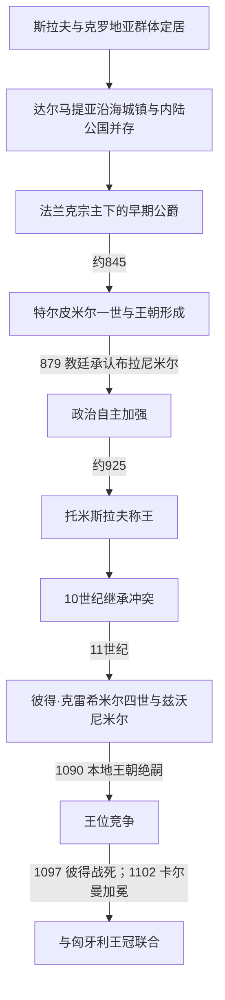

# 克罗地亚王国

[克罗地亚历史](/%E4%BA%BA%E6%96%87%E7%A7%91%E5%AD%A6/%E5%8E%86%E5%8F%B2/%E6%AC%A7%E6%B4%B2/%E4%B8%9C%E5%8D%97%E6%AC%A7%E4%B8%8E%E5%B7%B4%E5%B0%94%E5%B9%B2/%E5%85%8B%E7%BD%97%E5%9C%B0%E4%BA%9A/README.md)

## 时间

约7世纪斯拉夫与克罗地亚群体进入亚得里亚东岸起，至1102年匈牙利国王卡尔曼在比奥格勒加冕。9世纪以前的统治者、迁徙和政治边界主要由较晚文献和外部记载重建，年代与族群身份存在争议。

## 概括

中世纪克罗地亚并非由一个完整国家瞬间形成。亚得里亚城镇保留东罗马传统，内陆公国先受阿瓦、法兰克和拜占庭竞争影响，下潘诺尼亚又有独立政治线。9世纪特尔皮米尔家族整合达尔马提亚腹地、贵族县区与拉丁教会；托米斯拉夫在10世纪初被教廷文书称为国王。11世纪王权把达尔马提亚城镇、内陆克罗地亚和斯拉沃尼亚联系得最紧密，却因本地王朝绝嗣、贵族竞争和匈牙利王室的姻亲主张而进入共主王国。

## 形成背景

### 迁徙、罗马城市与外部帝国

6—7世纪，斯拉夫语群体和被称为克罗地亚人的政治—族群集团进入达尔马提亚腹地。关于其原乡、迁徙次数和拜占庭皇帝“邀请”说主要来自10世纪君士坦丁七世的叙述，不能当作同时代逐年记录。萨洛纳等古城受破坏后，斯普利特、扎达尔、特罗吉尔和岛屿城市保存罗马法、主教区和海上商业，与内陆氏族和县区形成长期互动。

8世纪末法兰克击败阿瓦人，势力扩至伊斯特拉、达尔马提亚腹地和下潘诺尼亚；拜占庭控制主要沿海城镇。812年亚琛和约大体确认这种分工。早期“达尔马提亚克罗地亚”和“下潘诺尼亚”不是后来现代国界内的统一行政体。

### 公爵权力与地方贵族

公爵依靠亲兵、县区首领和贡赋治理，向法兰克或拜占庭的臣属常是外交形式而非日常直接统治。特尔皮米尔一世852年的文书自称“克罗地亚人的公爵”，向斯普利特教会捐赠土地；它显示王室地产、地方见证人和教会书写已构成国家能力。多马戈伊、兹德斯拉夫和布拉尼米尔的相继夺位，又说明继承尚未制度化，威尼斯、拜占庭和教廷都可支持不同派系。

## 分阶段发展

### 布拉尼米尔与罗马教廷

879年布拉尼米尔推翻亲拜占庭的兹德斯拉夫。教宗若望八世致信祝福他和人民，常被视为本地政权获得西方教会承认的标志。布拉尼米尔并非现代意义的独立国家总统，而是利用罗马—君士坦丁堡竞争加强公爵合法性。

蒙齐米尔约892年复位特尔皮米尔支系，文书称其拥有宫廷、司法和附属官员。公国在法兰克帝国解体、匈牙利人进入喀尔巴阡盆地和拜占庭资源有限的环境中扩大自主。

### 托米斯拉夫与王国形成

托米斯拉夫约910年执政，教宗在925年教会会议相关书信中称其为“克罗地亚人的国王”。后世关于其拥有十万步兵、六万骑兵和庞大舰队的数字来自较晚且解释困难的文本，不能按现代统计照录。较可靠的意义是：他把达尔马提亚克罗地亚与北方斯拉沃尼亚联系起来，能介入保加利亚—拜占庭—塞尔维亚冲突，并主持足以同沿海主教谈判的王权。

925与928年斯普利特会议调整主教管辖，推动斯普利特大主教地位和拉丁礼仪。斯拉夫礼仪与格拉哥里文字没有因此消失，后来在北达尔马提亚、克尔克等地继续存在，形成克罗地亚拉丁教会内部的特殊传统。

### 10世纪继承与海权竞争

托米斯拉夫后特尔皮米尔二世、克雷希米尔一世相继统治。米罗斯拉夫与兄弟米哈伊尔·克雷希米尔二世争位，班普里比纳杀死米罗斯拉夫，显示班和贵族可决定继承。斯捷潘·德尔日斯拉夫从拜占庭取得王冠和“克罗地亚与达尔马提亚国王”地位，借此对抗威尼斯。

德尔日斯拉夫死后，斯韦托斯拉夫·苏罗尼亚与弟弟克雷希米尔三世、戈伊斯拉夫内战。威尼斯总督彼得罗二世·奥尔塞奥洛利用分裂，在1000年前后迫使或吸引多个达尔马提亚城市和岛屿承认其权威。沿海控制随后在威尼斯、克罗地亚王室和拜占庭间反复变化。

### 11世纪的高峰

彼得·克雷希米尔四世在位时，王权对达尔马提亚城镇和岛屿的影响达到高峰，自称“克罗地亚与达尔马提亚国王”。他支持修道院与教会改革，也在1060年代教会会议中接受拉丁礼仪纪律；地方斯拉夫礼传统仍以不同形式延续。

克雷希米尔无子，诺曼人一度俘获国王或迫使其割让城市，王位由曾任斯拉沃尼亚班的德米特里·兹沃尼米尔取得。1075年，教宗格里高利七世使节为兹沃尼米尔加冕，国王向教廷宣誓。这既加强国际合法性，也把克罗地亚置于教宗改革与神圣罗马—拜占庭竞争中。

## 统治结构

| 层面 | 机制 | 说明 |
|---|---|---|
| 公爵或国王 | 领导战争、分配王室地产、保护教会、召集贵族 | 称号由公爵向国王转变，但早期确切加冕和疆域不能完全重建。 |
| 班 | 王室高级军事与地方代表，后常管理斯拉沃尼亚或全王国 | 班可能成为造王者；职能随时期变化。 |
| 朱潘与县区 | 地方贵族首领管理要塞、贡赋、司法和军役 | 王权依靠而非消灭氏族贵族网络。 |
| 萨博尔的早期形态 | 贵族和高级教士集会 | 不能直接等同近代民选议会，但成为后世政治传统来源。 |
| 主教与修道院 | 文书、教育、地产、礼仪和外交 | 拉丁教会为王权提供国际承认；斯拉夫礼与格拉哥里文字保留地方特色。 |
| 达尔马提亚城市 | 保留城市法、主教、商业和相当自治 | 常以贡赋或承认宗主换取特权，实际归属可快速改变。 |

## 重要事件

| 时间 | 事件 | 过程与影响 |
|---|---|---|
| 约799—812年 | 法兰克—拜占庭战争与亚琛和约 | 沿海城市和内陆公国分属不同势力，奠定双重政治地理。 |
| 819—823年 | 柳德维特·波萨夫斯基反法兰克起义 | 下潘诺尼亚联盟失败，显示北方公国与达尔马提亚线并行。 |
| 852年 | 特尔皮米尔文书 | 记录“克罗地亚人的公爵”、宫廷和教会捐赠，是国家形成关键证据。 |
| 879年 | 布拉尼米尔获教宗祝福 | 摆脱亲拜占庭政变派，强化罗马教会联系和自主合法性。 |
| 925、928年 | 斯普利特教会会议 | 托米斯拉夫王号见诸教廷材料，教区与礼仪秩序重组。 |
| 949年前后 | 米罗斯拉夫被杀 | 班普里比纳介入王位斗争，王权一度分裂。 |
| 969—997年 | 斯捷潘·德尔日斯拉夫统治 | 与拜占庭结盟并取得王号象征，国家对沿海的主张增强。 |
| 1000年前后 | 威尼斯总督远征达尔马提亚 | 利用王室内战控制多个城市和岛屿，海岸归属长期摇摆。 |
| 1058—1074/75年 | 彼得·克雷希米尔四世在位 | 王权对达尔马提亚影响达高峰，教会改革加深。 |
| 1075年 | 兹沃尼米尔加冕 | 教廷授冠和誓约把王权纳入改革教宗的国际秩序。 |
| 1089/1090年 | 兹沃尼米尔、斯捷潘二世相继去世 | 特尔皮米尔王朝无稳定男性继承人，匈牙利王室以姻亲主张介入。 |
| 1091—1097年 | 拉斯洛入侵与彼得·斯瓦契奇抵抗 | 匈牙利先控制斯拉沃尼亚，最后一位本地竞争王在格沃兹德山战死。 |
| 1102年 | 卡尔曼在比奥格勒加冕 | 克罗地亚进入与匈牙利共主的王国结构。 |

## 鼎盛条件

- 法兰克分裂、拜占庭资源有限和威尼斯尚未永久控制整个海岸，给本地王权留下空间。
- 王室通过县区贵族、班、教会地产和达尔马提亚城市贡赋连接内陆与海上经济。
- 罗马教廷、拜占庭和威尼斯的竞争可被统治者用于争取王冠、教区和贸易合法性。
- 11世纪修道院、城市文书和王室捐赠扩大了行政记忆与政治网络。
- 斯拉沃尼亚、内陆克罗地亚和达尔马提亚联系最紧密时，国王能从农业、山地军役和海港获得多元资源。

## 衰落与王统终结

### 结构因素

- 继承规则未固定，兄弟共治、长幼继承与贵族拥立并存；无嗣国王使姻亲王室获得主张。
- 达尔马提亚城市保有高度自治，王室无法像控制内陆县区那样稳定征税和驻军。
- 班与大贵族拥有军力，王室内战时可以倒向威尼斯、拜占庭或匈牙利。
- 王国北部斯拉沃尼亚与南部达尔马提亚的政治网络并不完全一体。

### 外部压力

- 威尼斯以舰队、贸易和城市派系持续介入海岸；拜占庭、诺曼人和教廷也能改变王位合法性。
- 匈牙利阿尔帕德王朝已控制克罗地亚北方，并通过兹沃尼米尔王后耶莱娜的亲属关系提出继承权。
- 十字军时代亚得里亚战略价值上升，本地王权难以独立支配海上通道。

### 直接过程

兹沃尼米尔约1089年去世，关于他被贵族谋杀和“诅咒”的故事主要来自后世传说，不能当作确定事实。年老的斯捷潘二世短暂复位后绝嗣。匈牙利拉斯洛一世1091年进入斯拉沃尼亚并设置王族统治；克罗地亚贵族又拥立彼得·斯瓦契奇抵抗。彼得1097年在格沃兹德山战死后，卡尔曼逐步取得控制，并于1102年在比奥格勒加冕。

14世纪抄本保存的《克罗地亚贵族与卡尔曼协定》称十二部族以保留特权换取承认国王，其文本年代晚、是否反映1102年的真实书面契约存在争议。可以确定的是，克罗地亚并未被改成普通匈牙利郡，而以王国、班和贵族法的形式进入共主结构。

## 王朝世系

完整公爵、国王、共治与争位者见[克罗地亚中世纪统治者世系表](/%E4%BA%BA%E6%96%87%E7%A7%91%E5%AD%A6/%E5%8E%86%E5%8F%B2/%E6%AC%A7%E6%B4%B2/%E4%B8%9C%E5%8D%97%E6%AC%A7%E4%B8%8E%E5%B7%B4%E5%B0%94%E5%B9%B2/%E5%85%8B%E7%BD%97%E5%9C%B0%E4%BA%9A/%E5%85%8B%E7%BD%97%E5%9C%B0%E4%BA%9A%E4%B8%AD%E4%B8%96%E7%BA%AA%E7%BB%9F%E6%B2%BB%E8%80%85%E4%B8%96%E7%B3%BB%E8%A1%A8.md)。1102年后的共同君主不在此重复，见[匈牙利君主与摄政世系表](/%E4%BA%BA%E6%96%87%E7%A7%91%E5%AD%A6/%E5%8E%86%E5%8F%B2/%E6%AC%A7%E6%B4%B2/%E5%8C%88%E7%89%99%E5%88%A9/%E5%8C%88%E7%89%99%E5%88%A9%E5%90%9B%E4%B8%BB%E4%B8%8E%E6%91%84%E6%94%BF%E4%B8%96%E7%B3%BB%E8%A1%A8.md)。

## 演变关系

- 前置背景：南斯拉夫迁徙、晚期罗马城市延续与法兰克—拜占庭竞争。
- 后一节点：[匈牙利联合与哈布斯堡时期](/%E4%BA%BA%E6%96%87%E7%A7%91%E5%AD%A6/%E5%8E%86%E5%8F%B2/%E6%AC%A7%E6%B4%B2/%E4%B8%9C%E5%8D%97%E6%AC%A7%E4%B8%8E%E5%B7%B4%E5%B0%94%E5%B9%B2/%E5%85%8B%E7%BD%97%E5%9C%B0%E4%BA%9A/%E5%8C%88%E7%89%99%E5%88%A9%E8%81%94%E5%90%88%E4%B8%8E%E5%93%88%E5%B8%83%E6%96%AF%E5%A0%A1%E6%97%B6%E6%9C%9F.md)。
