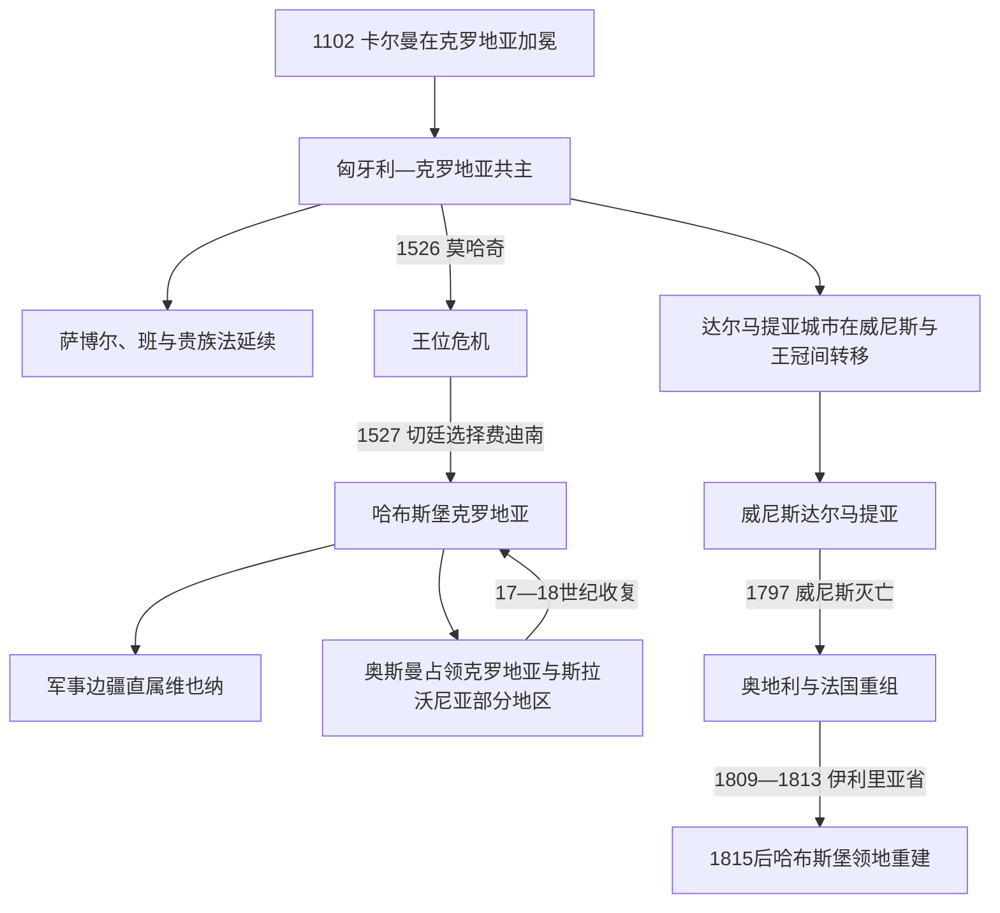

# 匈牙利联合与哈布斯堡时期

[克罗地亚历史](/%E4%BA%BA%E6%96%87%E7%A7%91%E5%AD%A6/%E5%8E%86%E5%8F%B2/%E6%AC%A7%E6%B4%B2/%E4%B8%9C%E5%8D%97%E6%AC%A7%E4%B8%8E%E5%B7%B4%E5%B0%94%E5%B9%B2/%E5%85%8B%E7%BD%97%E5%9C%B0%E4%BA%9A/README.md)

## 时间

1102年—1815年。1102—1526年主要处在匈牙利王冠联合；1527年克罗地亚等级选择哈布斯堡费迪南。达尔马提亚多数时期由威尼斯统治，内陆大片地区一度属奥斯曼；1809—1813年法国伊利里亚省打断旧制度，1815年维也纳会议后由奥地利重新组织。

## 概括

1102年以后，匈牙利国王兼任克罗地亚国王，克罗地亚仍以王国、萨博尔、班和贵族法存在。共同君主并未带来统一行政：斯拉沃尼亚逐渐成为独特政治单位，达尔马提亚城市在威尼斯与王冠间转移，杜布罗夫尼克发展为独立共和国。奥斯曼战争又把哈布斯堡克罗地亚、直属军事边疆、奥斯曼省区和威尼斯沿岸并置。近世克罗地亚的韧性来自地方法权和边防组织，代价则是长期战争、人口迁徙和领土碎片化。

## 王冠联合与自治制度

卡尔曼1102年加冕后，克罗地亚和匈牙利共奉阿尔帕德王室。国王通过班治理，依靠萨博尔和地方贵族征集军役、确认地产与处理司法。后世《协定》可能保存贵族特权记忆，却不是可无争议追溯到1102年的原始宪法文本。

| 机构 | 职能 | 历史变化 |
|---|---|---|
| 共同国王 | 克罗地亚与达尔马提亚国王，同时为匈牙利国王 | 实际控制范围随威尼斯、奥斯曼和内战变化；完整世系见[匈牙利君主与摄政世系表](/%E4%BA%BA%E6%96%87%E7%A7%91%E5%AD%A6/%E5%8E%86%E5%8F%B2/%E6%AC%A7%E6%B4%B2/%E5%8C%88%E7%89%99%E5%88%A9/%E5%8C%88%E7%89%99%E5%88%A9%E5%90%9B%E4%B8%BB%E4%B8%8E%E6%91%84%E6%94%BF%E4%B8%96%E7%B3%BB%E8%A1%A8.md)。 |
| 班 | 国王在克罗地亚或斯拉沃尼亚的最高代表，主持军政、司法和议会 | 有时分设克罗地亚班、斯拉沃尼亚班，权力取决于个人与战争。 |
| 萨博尔 | 高级教士、贵族及后来的等级代表会议 | 认可君主、征税、军役与地方立法，代表范围远非现代普选议会。 |
| 县与贵族共同体 | 管理地方司法、税负与军役 | 大贵族家族可形成半独立势力。 |
| 达尔马提亚城市公社 | 以章程管理司法、商业和港口 | 向威尼斯、匈牙利王冠或拜占庭纳贡换取自治。 |
| 杜布罗夫尼克共和国 | 城邦贵族议会与总督 | 1358年后承认匈牙利宗主并保持广泛自治，后向奥斯曼纳贡，实际独立至1808年。 |

## 中世纪共主时期

### 海岸竞争与十字军

12世纪拜占庭皇帝曼努埃尔一世一度控制达尔马提亚和部分内陆；其死后匈牙利王权恢复。1202年第四次十字军应威尼斯要求攻陷信奉天主教的扎达尔，暴露海上商业、十字军债务和王冠保护能力的冲突。

1241—1242年蒙古军追击匈牙利国王贝拉四世进入克罗地亚和达尔马提亚。国王在特罗吉尔等沿海要塞避难，蒙古撤退后推动自由王城、石质城堡和贵族防御。萨格勒布格拉德茨1242年获“金玺”特权，成为后来城市发展的核心之一。

### 大贵族与安茹重整

13世纪末，舒比奇家族控制克罗地亚和波斯尼亚大片地区，帕瓦奥·舒比奇以班身份近似独立君主。安茹王朝查理一世逐步打败寡头，恢复王权。1358年拉约什一世在对威尼斯战争获胜后签订扎达尔和约，威尼斯放弃从克瓦尔内尔到杜布罗夫尼克的达尔马提亚权利；杜布罗夫尼克转而承认匈牙利宗主并保持自治。

拉约什死后，女王玛丽亚、西吉斯蒙德与那不勒斯安茹支系争位，克罗地亚贵族分裂。那不勒斯的拉迪斯劳斯1409年把自己对达尔马提亚的权利出售给威尼斯；到1420年前后，威尼斯控制大部分沿海城市和岛屿，王冠只保留少数港区，杜布罗夫尼克仍独立。

## 奥斯曼扩张与哈布斯堡继承

### 边疆崩缩

奥斯曼征服波斯尼亚后直接压迫克罗地亚内陆。1493年克尔巴瓦平原战役中，克罗地亚贵族军遭重创；1526年莫哈奇战役又使共同国王拉约什二世战死。奥斯曼夺取利卡、克尔巴瓦、斯拉沃尼亚和波斯尼亚边界大片地区，剩余王国被称为“残余中的残余”。

1527年切廷萨博尔选择哈布斯堡费迪南为王，期待其提供常备军和财政；斯拉沃尼亚一部分贵族则支持扎波尧伊。这个选择不是现代民族独立宣言，而是莫哈奇后两王竞争中的等级决定，也奠定克罗地亚与哈布斯堡延续至1918年的王朝关系。

### 军事边疆

维也纳逐步把最危险的边境从班和萨博尔管辖中分离，建立卡尔洛瓦茨、瓦拉日丁等军事边疆总辖区。边民以土地和宗教、地方特权换取世袭军役，居民包括本地克罗地亚人、从奥斯曼地区迁入的塞尔维亚人、瓦拉几身份群体及其他移民。军事边疆直接受宫廷战争委员会指挥，不能视为克罗地亚—斯拉沃尼亚普通自治领土。

塞尼乌斯科克以边防、私掠和袭击奥斯曼及威尼斯贸易为生，引发哈布斯堡—威尼斯冲突。1615—1617年乌斯科克战争后，维也纳迁散其力量以换取海上和平。

### 大贵族反抗

兹林斯基和弗兰科潘家族长期组织抗奥斯曼防御。1664年哈布斯堡在圣哥达获胜却签订瓦什瓦尔和约，未充分收复领地，引发克罗地亚、匈牙利贵族谋求法国、威尼斯乃至奥斯曼支持。阴谋失败后，佩塔尔·兹林斯基和弗兰·克尔斯托·弗兰科潘1671年被处决，家产没收，本地大贵族权力和对王室的制衡严重削弱。

## 17—18世纪重组

大土耳其战争后，1699年卡尔洛维茨和约使哈布斯堡收复斯拉沃尼亚及多数内陆地区，1718年帕萨罗维茨和约进一步推远边界。收复区一部分归克罗地亚—斯拉沃尼亚县制，大片仍留在军事边疆；庄园恢复、殖民和宗教政策改变族群与土地结构。

玛丽亚·特蕾莎和约瑟夫二世推动税务、学校、军队和行政改革，限制等级自治。里耶卡作为匈牙利王冠“分离附属体”的归属日益争议。军事边疆获得更统一的军农制度，既保卫帝国，也把大量人口置于萨博尔之外。

### 威尼斯达尔马提亚与杜布罗夫尼克

威尼斯以总督和地方贵族委员会管理达尔马提亚，控制港口、盐业和航运；内陆“莫尔拉克”人口及宗教社群在奥斯曼战争中迁移。17—18世纪威尼斯从奥斯曼取得更多达尔马提亚腹地，但沿海经济受共和国贸易衰退限制。

杜布罗夫尼克凭对奥斯曼纳贡、地中海外交和商船网络保持独立。1667年大地震重创城市，仍完成重建；其贵族共和国在法国军队进入后于1808年被马尔蒙废除。

## 法国革命战争与旧格局终结

1797年威尼斯共和国灭亡，奥地利取得达尔马提亚；1805年后法国接管，并于1809年把达尔马提亚、杜布罗夫尼克、军事边疆部分地区和斯洛文尼亚领地组成伊利里亚省。法国废除若干封建权利，推行民法、道路、统一行政和世俗教育，但征税、征兵、英国海上封锁与地方反抗限制改革。

1813年奥地利军队重占，1815年维也纳会议确认哈布斯堡获得达尔马提亚、杜布罗夫尼克和伊斯特拉。克罗地亚—斯拉沃尼亚、达尔马提亚和军事边疆仍未合并；“伊利里亚”名称和短暂行政整合却为19世纪民族运动提供想象资源。

## 重要事件

| 时间 | 事件 | 结果与影响 |
|---|---|---|
| 1102年 | 卡尔曼加冕 | 建立共主结构，克罗地亚保留王国和地方法权。 |
| 1202年 | 十字军攻陷扎达尔 | 威尼斯海权压倒王冠保护，城市反复易手。 |
| 1241—1242年 | 蒙古入侵 | 推动城堡、自由王城和王权重建。 |
| 1270—1320年代 | 舒比奇家族强盛与衰落 | 班权近似地方君主，后被安茹王权压服。 |
| 1358年 | 扎达尔和约 | 匈牙利—克罗地亚王权一度重新控制达尔马提亚。 |
| 1409—1420年 | 威尼斯购权并占领沿海 | 达尔马提亚多数城市与内陆克罗地亚长期分治。 |
| 1493年 | 克尔巴瓦平原战役 | 贵族军损失惨重，奥斯曼边疆危机加速。 |
| 1526—1527年 | 莫哈奇与切廷选择 | 中世纪共同王朝崩溃，哈布斯堡取得克罗地亚王权。 |
| 1550—1600年代 | 军事边疆制度化 | 边民军役社会形成，地方脱离萨博尔直接管辖。 |
| 1566年 | 西盖特堡保卫战 | 尼古拉·舒比奇·兹林斯基战死，延缓奥斯曼推进并成为国家记忆。 |
| 1671年 | 兹林斯基—弗兰科潘领袖被处决 | 本地大贵族政治遭摧毁，哈布斯堡中央权力加强。 |
| 1699年 | 卡尔洛维茨和约 | 斯拉沃尼亚和内陆大片地区脱离奥斯曼统治。 |
| 1797年 | 威尼斯灭亡 | 达尔马提亚进入奥法争夺，数百年威尼斯统治终结。 |
| 1808年 | 杜布罗夫尼克共和国被废 | 独立城邦线终结。 |
| 1809—1813年 | 伊利里亚省 | 短期行政整合与改革影响19世纪政治文化。 |
| 1815年 | 奥地利取得沿海 | 现代克罗地亚各区域同处哈布斯堡君主国，但仍分属不同行政单位。 |

## 维持与转型机制

### 长期延续条件

- 共主王国允许地方贵族和教会保留法权，减少直接吞并的治理成本。
- 班、萨博尔和县制提供政治连续性，即使疆域和实际权限变化。
- 哈布斯堡财政、德意志和边民军事资源使残余克罗地亚抵住奥斯曼进一步推进。
- 达尔马提亚城市、杜布罗夫尼克和军事边疆各自适应海洋贸易、贡纳外交或军役经济。
- 多层身份使精英可同时诉诸克罗地亚王国权利、匈牙利等级权利和哈布斯堡忠诚。

### 旧制度衰退因素

- 长期分治使“克罗地亚—斯拉沃尼亚—达尔马提亚三一王国”更多是政治主张而非统一行政。
- 维也纳和布达佩斯的中央化削弱萨博尔财政、军队和任官权。
- 农奴制、贵族免税和军事边疆特殊制度阻碍统一市场与公民政治。
- 法国革命、拿破仑民法和民族语言公共空间动摇等级—王朝合法性。
- 1815年后的奥地利重组没有解决区域统一，反而使合并诉求成为19世纪民族运动核心。

## 王统与地方权力

1102—1918年克罗地亚和匈牙利的完整共同君主、对立国王、共治者与哈布斯堡摄政见[匈牙利君主与摄政世系表](/%E4%BA%BA%E6%96%87%E7%A7%91%E5%AD%A6/%E5%8E%86%E5%8F%B2/%E6%AC%A7%E6%B4%B2/%E5%8C%88%E7%89%99%E5%88%A9/%E5%8C%88%E7%89%99%E5%88%A9%E5%90%9B%E4%B8%BB%E4%B8%8E%E6%91%84%E6%94%BF%E4%B8%96%E7%B3%BB%E8%A1%A8.md)。本阶段不重复同一批人物；克罗地亚地方的班、萨博尔、军事边疆司令和威尼斯总督各属不同权力层级，不能混成一张“克罗地亚国王表”。

## 演变关系

- 前一节点：[克罗地亚王国](/%E4%BA%BA%E6%96%87%E7%A7%91%E5%AD%A6/%E5%8E%86%E5%8F%B2/%E6%AC%A7%E6%B4%B2/%E4%B8%9C%E5%8D%97%E6%AC%A7%E4%B8%8E%E5%B7%B4%E5%B0%94%E5%B9%B2/%E5%85%8B%E7%BD%97%E5%9C%B0%E4%BA%9A/%E5%85%8B%E7%BD%97%E5%9C%B0%E4%BA%9A%E7%8E%8B%E5%9B%BD.md)。
- 后一节点：[民族复兴与近代政治](/%E4%BA%BA%E6%96%87%E7%A7%91%E5%AD%A6/%E5%8E%86%E5%8F%B2/%E6%AC%A7%E6%B4%B2/%E4%B8%9C%E5%8D%97%E6%AC%A7%E4%B8%8E%E5%B7%B4%E5%B0%94%E5%B9%B2/%E5%85%8B%E7%BD%97%E5%9C%B0%E4%BA%9A/%E6%B0%91%E6%97%8F%E5%A4%8D%E5%85%B4%E4%B8%8E%E8%BF%91%E4%BB%A3%E6%94%BF%E6%B2%BB.md)。
