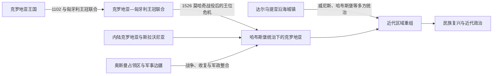

# 匈牙利联合与哈布斯堡时期

## 时间

1102年—19世纪初

## 概括

1102年以后，克罗地亚与匈牙利长期共奉同一君主，但克罗地亚的议会（萨博尔）、总督（班）和地方法权并未立即消失。1526年莫哈奇战役后，克罗地亚贵族于1527年承认哈布斯堡王朝；与此同时，奥斯曼扩张、威尼斯的沿海统治和哈布斯堡军事边疆使克罗地亚历史长期呈现多重政治空间并存的格局。

## 政治与区域演变

- **王冠联合**：1102年前后的安排通常被概括为克罗地亚与匈牙利的王冠联合。后世所谓《协定》（Pacta conventa）的文本年代和法律效力存在争论，不能把它当作无争议的原始契约。
- **制度延续**：萨博尔和班等制度在不同时期继续存在，但自治范围取决于王权、贵族政治、战争和帝国改革，不能理解为现代主权国家的完整延续。
- **奥斯曼—哈布斯堡边疆**：16世纪奥斯曼夺取大片克罗地亚和斯拉沃尼亚土地；哈布斯堡设置军事边疆，直接以军政制度组织防御和移民社会。
- **亚得里亚海沿岸**：达尔马提亚城镇和岛屿长期受威尼斯等政权支配；杜布罗夫尼克共和国又保有自身的城邦和外交传统。沿海线与内陆线并不完全同步。
- **18世纪重组**：奥斯曼势力后退后，部分土地重新进入哈布斯堡体系，但军事边疆、克罗地亚—斯拉沃尼亚和达尔马提亚仍分属不同制度。
- **拿破仑时期**：1809—1813年的伊利里亚省打破部分旧有边界，为19世纪行政重组和“伊利里亚”政治文化想象提供了新的历史背景。

## 演变关系

- 前一阶段：[克罗地亚王国](/%E4%BA%BA%E6%96%87%E7%A7%91%E5%AD%A6/%E5%8E%86%E5%8F%B2/%E6%AC%A7%E6%B4%B2/%E4%B8%9C%E5%8D%97%E6%AC%A7%E4%B8%8E%E5%B7%B4%E5%B0%94%E5%B9%B2/%E5%85%8B%E7%BD%97%E5%9C%B0%E4%BA%9A/%E5%85%8B%E7%BD%97%E5%9C%B0%E4%BA%9A%E7%8E%8B%E5%9B%BD.md)。
- 后一阶段：[民族复兴与近代政治](/%E4%BA%BA%E6%96%87%E7%A7%91%E5%AD%A6/%E5%8E%86%E5%8F%B2/%E6%AC%A7%E6%B4%B2/%E4%B8%9C%E5%8D%97%E6%AC%A7%E4%B8%8E%E5%B7%B4%E5%B0%94%E5%B9%B2/%E5%85%8B%E7%BD%97%E5%9C%B0%E4%BA%9A/%E6%B0%91%E6%97%8F%E5%A4%8D%E5%85%B4%E4%B8%8E%E8%BF%91%E4%BB%A3%E6%94%BF%E6%B2%BB.md)。
- 共同区域背景：[奥斯曼—哈布斯堡分治与民族运动](/%E4%BA%BA%E6%96%87%E7%A7%91%E5%AD%A6/%E5%8E%86%E5%8F%B2/%E6%AC%A7%E6%B4%B2/%E4%B8%9C%E5%8D%97%E6%AC%A7%E4%B8%8E%E5%B7%B4%E5%B0%94%E5%B9%B2/%E5%8D%97%E6%96%AF%E6%8B%89%E5%A4%AB%E5%8E%86%E5%8F%B2/%E5%A5%A5%E6%96%AF%E6%9B%BC%E2%80%94%E5%93%88%E5%B8%83%E6%96%AF%E5%A0%A1%E5%88%86%E6%B2%BB%E4%B8%8E%E6%B0%91%E6%97%8F%E8%BF%90%E5%8A%A8.md)。

## 关键辨析

- “与匈牙利联合”不等于克罗地亚政治传统在1102年突然终止，也不等于此后一直拥有不变的自治权。
- “哈布斯堡时期”内部同时存在匈牙利王冠领地、奥地利方面的达尔马提亚、直属军事边疆以及一度属于奥斯曼或威尼斯的区域。
- 中世纪和近代的克罗地亚、斯拉沃尼亚、达尔马提亚不能直接套用现代克罗地亚共和国的边界。
