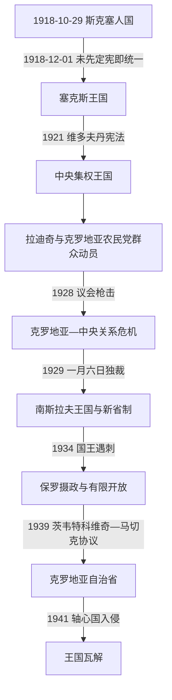

# 南斯拉夫王国时期的克罗地亚

[克罗地亚历史](/%E4%BA%BA%E6%96%87%E7%A7%91%E5%AD%A6/%E5%8E%86%E5%8F%B2/%E6%AC%A7%E6%B4%B2/%E4%B8%9C%E5%8D%97%E6%AC%A7%E4%B8%8E%E5%B7%B4%E5%B0%94%E5%B9%B2/%E5%85%8B%E7%BD%97%E5%9C%B0%E4%BA%9A/README.md)

## 时间

1918年10月29日—1941年4月。1918年12月1日前为短暂的斯洛文尼亚人、克罗地亚人和塞尔维亚人国；此后先属塞尔维亚人、克罗地亚人和斯洛文尼亚人王国，1929年改称南斯拉夫王国。1939年设克罗地亚自治省，1941年轴心国入侵使其终结。

## 概括

克罗地亚地区进入共同王国时，没有先就联邦、边界和王权权限达成完整协议。塞尔维亚王室、军队和战前官僚主张统一中央国家，克罗地亚农民党则以农村多数为基础要求共和、联邦或广泛自治。1921年中央集权宪法、1928年议会枪击案和1929年王室独裁把争议升级为政体危机。1939年克罗地亚自治省首次把萨瓦、滨海及若干波黑地区组合为自治单位，但战争在制度巩固前摧毁了妥协。

## 建国过渡

奥匈崩溃后，萨格勒布国民委员会自称代表帝国南斯拉夫地区。新国家缺乏国际承认、稳定军队和边防，意大利又依1915年秘密《伦敦条约》占领伊斯特拉、扎达尔及达尔马提亚据点。农村“绿军”、返乡士兵和粮食危机使秩序恶化。

国民委员会代表团赴贝尔格莱德时虽带有联邦和过渡条件，摄政王亚历山大于1918年12月1日直接宣布统一。克罗地亚萨博尔没有对最终文本另行表决。共和派政治家斯捷潘·拉迪奇反对“像鹅闯入雾中”般仓促统一，成为后续反中央运动中心。

## 中央集权与克罗地亚农民党

### 维多夫丹宪法

1920年制宪议会选举中，克罗地亚共和农民党在克罗地亚—斯拉沃尼亚农村取得压倒性支持，却拒绝宣誓效忠王室并抵制议会。1921年《维多夫丹宪法》以一院议会、强大国王和统一行政建立中央国家，未承认历史领地的联邦地位。政府以33个州取代旧王国和省界，塞尔维亚战前法律、军官和官僚在统一中占优势。

中央化也带来共同市场、货币和交通整合，但税制、战争赔偿、土地改革和行政岗位分配被不同地区视为不平等。意大利通过1920年《拉帕洛条约》取得伊斯特拉、扎达尔和若干岛屿，里耶卡先成为自由邦，1924年被意大利吞并；边界失落强化克罗地亚政治不满。

### 拉迪奇的策略转变

拉迪奇把农民经济、和平主义、共和制和克罗地亚自治结合，建立全国最强群众政党之一。他寻求国际支持并一度接近共产国际，1925年被捕后承认宪法和王朝、入阁，以期从体制内改革。合作迅速破裂，农民党同普里比切维奇领导的独立民主党组成“农民—民主联盟”，其中包含大量克罗地亚塞族选民，反对贝尔格莱德中央集权。

## 1928年枪击与王室独裁

1928年6月20日，塞尔维亚激进党议员普尼沙·拉契奇在国民议会开枪，打死两名克罗地亚议员并重伤拉迪奇；拉迪奇8月伤重去世。克罗地亚代表退出议会，萨格勒布出现大规模抗议。事件把政策冲突转化为共同国家合法性危机。

1929年1月6日，亚历山大一世解散议会、废止宪法、禁止民族政党并实行个人独裁。国家改名南斯拉夫，以九个按河流命名的“巴诺维纳”打破历史边界；克罗地亚核心被分入萨瓦和滨海两省。政府强调统一“南斯拉夫民族”，警察审查和特别法庭则压制农民党、共产党及民族组织。

## 激进流亡与1934年危机

安特·帕韦利奇等权利党激进分子流亡意大利，建立乌斯塔沙组织，接受墨索里尼资助并同马其顿内部革命组织合作。1932年韦莱比特小规模袭击被镇压。1934年，马其顿革命者在乌斯塔沙协助下于马赛刺杀亚历山大国王和法国外交部长。

幼王彼得二世继位，由保罗亲王主持摄政。政权逐步恢复有限政党活动，米兰·斯托亚迪诺维奇试图以经济发展和同意德接近稳定国家；克罗地亚农民党新领袖弗拉特科·马切克坚持自治谈判。

## 克罗地亚自治省

1939年欧洲战争迫近，首相德拉吉沙·茨韦特科维奇与马切克签订协议，把萨瓦省、滨海省及杜布罗夫尼克、特拉夫尼克等若干地区合成克罗地亚自治省。伊万·舒巴希奇任班，自治政府负责内政、教育、司法、农业和部分经济事务，国防、外交和共同财政仍属中央。

| 权力层级 | 负责人或机构 | 实际职能 |
|---|---|---|
| 南斯拉夫君主与摄政 | 彼得二世、保罗亲王主持的摄政委员会 | 国家元首、军队、外交和任命。 |
| 中央政府 | 茨韦特科维奇内阁，马切克任副首相 | 维持共同国家并推动妥协。 |
| 克罗地亚自治省 | 班伊万·舒巴希奇及自治机关 | 管理授权的地方事务；新的萨博尔尚未来得及正常选举。 |
| 克罗地亚农民党网络 | 马切克及农民保护队 | 掌握群众组织和实际地方影响，但不是正式国家军队。 |

自治省边界包含大量塞族和波黑人口，也未解决斯洛文尼亚、塞尔维亚及波斯尼亚穆斯林的对等联邦要求。塞族民族主义者批评其分割塞族居住区，乌斯塔沙则反对任何南斯拉夫内妥协。制度仅运行约十九个月。

## 重要事件

| 时间 | 事件 | 过程与影响 |
|---|---|---|
| 1918年10—12月 | 斯克塞人国与统一 | 在意大利推进和秩序危机下仓促合并，宪制条件未先解决。 |
| 1920年 | 制宪选举 | 农民党成为克罗地亚群众代表，但抵制议会。 |
| 1921年 | 维多夫丹宪法 | 确立中央集权君主国，否定历史联邦单位。 |
| 1920、1924年 | 拉帕洛和罗马条约 | 意大利取得伊斯特拉、扎达尔、里耶卡等地，难民和领土修约问题加深。 |
| 1925年 | 拉迪奇承认王朝并入阁 | 尝试从抵制转向体制内改革，合作很快失败。 |
| 1927年 | 农民—民主联盟形成 | 克罗地亚人与部分塞族反中央力量联合。 |
| 1928年 | 议会枪击与拉迪奇死亡 | 议会政治合法性崩溃，克罗地亚代表退出。 |
| 1929年 | 一月六日独裁 | 国王废宪、禁党、改国名与省界，国家强制一体化。 |
| 1934年 | 马赛刺杀 | 亚历山大遇刺，幼王摄政和有限政治缓和开始。 |
| 1939年 | 克罗地亚自治省 | 中央与最大克罗地亚政党达成自治妥协。 |
| 1941年3—4月 | 加入三国同盟、贝尔格莱德政变和轴心入侵 | 王国军队迅速瓦解，自治省和共同国家均终止。 |

## 制度维持与失败原因

### 维持条件

- 塞尔维亚军队和王室提供战胜国的外交承认与初期强制能力。
- 共同市场、铁路、货币和亚得里亚港口给统一提供经济理由。
- 意大利边界压力使部分克罗地亚精英把南斯拉夫视为安全屏障。
- 农民党虽反中央，长期仍寻求和平自治而非乌斯塔沙式暴力。

### 结构因素

- 建国前没有明确联邦契约，中央化被许多克罗地亚人视为塞尔维亚国家制度的扩张。
- 经济发展、税负、军官与公务员构成的地区差异被民族政治解释。
- 国王能绕过议会，警察暴力和选举操纵阻塞妥协。
- 克罗地亚自治、塞族跨区统一和波黑主体性在同一领土上相互重叠。

### 直接终结

1939年协议来得太晚，自治机关尚未完整建立，欧洲战争已迫近。1941年3月政府在德国压力下加入三国同盟，两日后军官政变推翻摄政路线。希特勒决定入侵，4月德意军与盟国从多方向突破；军队的地区不信任、动员混乱和技术劣势使王国十一天内投降。乌斯塔沙在占领军保护下接管克罗地亚，不是自治省依法继承。

## 领导与共同国家关系

南斯拉夫国王、摄政和中央总理见[南斯拉夫王国](/%E4%BA%BA%E6%96%87%E7%A7%91%E5%AD%A6/%E5%8E%86%E5%8F%B2/%E6%AC%A7%E6%B4%B2/%E4%B8%9C%E5%8D%97%E6%AC%A7%E4%B8%8E%E5%B7%B4%E5%B0%94%E5%B9%B2/%E5%8D%97%E6%96%AF%E6%8B%89%E5%A4%AB%E5%8E%86%E5%8F%B2/%E5%8D%97%E6%96%AF%E6%8B%89%E5%A4%AB%E7%8E%8B%E5%9B%BD.md)；克罗地亚地方在1918—1939年没有独立国家元首。1939—1941年的班、中央权力和后续政权领导见[克罗地亚国家元首与政府首脑表](/%E4%BA%BA%E6%96%87%E7%A7%91%E5%AD%A6/%E5%8E%86%E5%8F%B2/%E6%AC%A7%E6%B4%B2/%E4%B8%9C%E5%8D%97%E6%AC%A7%E4%B8%8E%E5%B7%B4%E5%B0%94%E5%B9%B2/%E5%85%8B%E7%BD%97%E5%9C%B0%E4%BA%9A/%E5%85%8B%E7%BD%97%E5%9C%B0%E4%BA%9A%E5%9B%BD%E5%AE%B6%E5%85%83%E9%A6%96%E4%B8%8E%E6%94%BF%E5%BA%9C%E9%A6%96%E8%84%91%E8%A1%A8.md)。

## 演变关系

- 前一节点：[民族复兴与近代政治](/%E4%BA%BA%E6%96%87%E7%A7%91%E5%AD%A6/%E5%8E%86%E5%8F%B2/%E6%AC%A7%E6%B4%B2/%E4%B8%9C%E5%8D%97%E6%AC%A7%E4%B8%8E%E5%B7%B4%E5%B0%94%E5%B9%B2/%E5%85%8B%E7%BD%97%E5%9C%B0%E4%BA%9A/%E6%B0%91%E6%97%8F%E5%A4%8D%E5%85%B4%E4%B8%8E%E8%BF%91%E4%BB%A3%E6%94%BF%E6%B2%BB.md)。
- 后一节点：[克罗地亚独立国与第二次世界大战](/%E4%BA%BA%E6%96%87%E7%A7%91%E5%AD%A6/%E5%8E%86%E5%8F%B2/%E6%AC%A7%E6%B4%B2/%E4%B8%9C%E5%8D%97%E6%AC%A7%E4%B8%8E%E5%B7%B4%E5%B0%94%E5%B9%B2/%E5%85%8B%E7%BD%97%E5%9C%B0%E4%BA%9A/%E5%85%8B%E7%BD%97%E5%9C%B0%E4%BA%9A%E7%8B%AC%E7%AB%8B%E5%9B%BD%E4%B8%8E%E7%AC%AC%E4%BA%8C%E6%AC%A1%E4%B8%96%E7%95%8C%E5%A4%A7%E6%88%98.md)。
