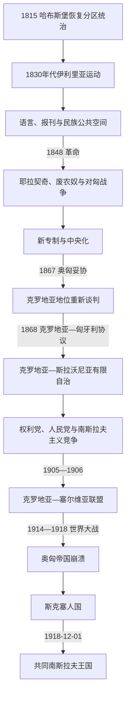

# 民族复兴与近代政治

[克罗地亚历史](/%E4%BA%BA%E6%96%87%E7%A7%91%E5%AD%A6/%E5%8E%86%E5%8F%B2/%E6%AC%A7%E6%B4%B2/%E4%B8%9C%E5%8D%97%E6%AC%A7%E4%B8%8E%E5%B7%B4%E5%B0%94%E5%B9%B2/%E5%85%8B%E7%BD%97%E5%9C%B0%E4%BA%9A/README.md)

## 时间

1815年—1918年。拿破仑时期改革和伊利里亚名称构成前史；1918年10月29日克罗地亚—斯拉沃尼亚萨博尔断绝与奥匈的国家法关系，12月1日短暂的斯洛文尼亚人、克罗地亚人和塞尔维亚人国并入共同王国。

## 概括

19世纪克罗地亚政治围绕三个彼此重叠但不相同的目标展开：把克罗地亚—斯拉沃尼亚、达尔马提亚、军事边疆等历史地区整合起来；在哈布斯堡君主国内争取对匈牙利或维也纳的自治；以共同语言文化推动南斯拉夫合作。伊利里亚运动建立现代出版和语言公共空间，1848年革命废除农奴制并把耶拉契奇塑成国家象征。1868年协议确认有限自治，却把里耶卡、达尔马提亚和共同财政问题留作争议。第一次世界大战摧毁王朝框架，意大利领土要求和国内秩序危机又推动快速加入塞尔维亚王室国家。

## 1815年后的政治地理

| 区域 | 帝国内地位 | 主要争议 |
|---|---|---|
| 克罗地亚—斯拉沃尼亚 | 匈牙利王冠体系内，有萨博尔和班 | 自治、官方语言、税收、铁路与任命权。 |
| 达尔马提亚 | 奥地利帝国、1867年后奥地利一半的王国和议会领地 | 是否与克罗地亚—斯拉沃尼亚合并，意大利语城市精英与斯拉夫多数政治。 |
| 伊斯特拉 | 奥地利滨海地区 | 克罗地亚、斯洛文尼亚与意大利民族运动竞争。 |
| 里耶卡 | 匈牙利王冠的特殊港市，1868年文本附录制造法律争议 | 克罗地亚自治与匈牙利直接管理冲突。 |
| 军事边疆 | 维也纳军政直属区，1881年才并入克罗地亚—斯拉沃尼亚 | 军役特权、土地、东正教塞族人口与文官化。 |

## 伊利里亚运动与文化建构

1830年代，留德维特·盖伊统一拉丁字母拼写，创办报刊；扬科·德拉什科维奇等把语言文化诉求转为政治纲领。运动使用“伊利里亚”以跨越克罗地亚地方方言和南斯拉夫名称分歧，选择什托卡维亚语作为书面语基础，促进克罗地亚人与塞尔维亚人、斯洛文尼亚人的文化交流。

运动由贵族、教士、城市知识分子和新兴专业群体推动，并未立即覆盖所有农民。1843年政府禁止公开使用“伊利里亚”政治名称，文化组织和出版仍延续。萨格勒布逐渐成为全克罗地亚文化中心，语言、历史和“克罗地亚国家权利”成为政治动员资源。

## 1848年革命

匈牙利革命政府主张统一匈牙利政治民族和马扎尔语国家，克罗地亚精英担心自治与语言权受损。萨博尔推举约瑟普·耶拉契奇为班，提出联合达尔马提亚、废除农奴义务和扩大自治，并拒绝服从佩斯政府。耶拉契奇军进入匈牙利，最终帮助哈布斯堡镇压革命。

1848年不能只理解为克罗地亚“站在反革命一边”：农奴制被废，现代政治纲领和代表会议形成；同时克罗地亚军政目标依赖维也纳。革命失败后，皇帝实行巴赫新专制，撤销许多自治承诺，以德语官僚和统一税制中央化。

## 二元帝国与1868年协议

1860—1861年王朝危机迫使恢复宪政，萨博尔重新讨论同匈牙利的国家法关系。1867年奥匈妥协绕过克罗地亚，把君主国分成奥地利和匈牙利两半。1868年克罗地亚—匈牙利协议随后规定：

| 权力领域 | 克罗地亚自治 | 共同或匈牙利控制 |
|---|---|---|
| 内政、宗教、教育、地方司法 | 萨博尔立法，由萨格勒布自治政府执行 | 班由国王依匈牙利首相提议任命。 |
| 财政 | 有地方预算和一定比例收入 | 海关、主要税收与分配由共同财政框架决定。 |
| 军事、外交、商业、交通 | 缺乏完整自治 | 由匈牙利或二元帝国共同机关掌握。 |
| 官方语言 | 克罗地亚语用于自治机关和对共同机关往来 | 铁路等共同机构的语言与符号长期冲突。 |
| 领土 | 克罗地亚—斯拉沃尼亚构成自治王国 | 达尔马提亚未并入；里耶卡地位因“里耶卡附录”争议。 |

1881年军事边疆文官化并入克罗地亚—斯拉沃尼亚，完成内陆大部分地区制度整合，也使大量塞族东正教居民进入自治政治。达尔马提亚仍在奥地利一侧，三一王国没有实现。

## 政治路线与社会动员

### 人民党与南斯拉夫主义

约瑟普·尤拉伊·施特罗斯迈尔主教、弗拉尼奥·拉奇基等主张文化教育、南斯拉夫合作和在君主国内的联邦改革，创建南斯拉夫科学院等机构。其“南斯拉夫”并不等于接受塞尔维亚中央集权，而是多种联邦和文化联合方案的总称。

### 权利党

安特·斯塔尔切维奇和欧根·克瓦特尔尼克以克罗地亚历史国家权利主张更完整主权，批判维也纳、布达佩斯及某些南斯拉夫统一方案。1871年拉科维察起义迅速失败，克瓦特尔尼克被杀。权利党后来分裂为不同路线，其中约瑟普·弗兰克一派强化排塞政治，不能把所有权利党传统简单等同后来乌斯塔沙。

### 农民政治

农奴制废除后，土地碎片、债务、税负和移民成为农村核心问题。安通和斯捷潘·拉迪奇1904年创建克罗地亚人民农民党，把农民教育、共和主义和克罗地亚自治结合，逐步成为20世纪最有群众基础的政党。

### 库恩时期与克罗地亚—塞尔维亚联盟

班卡罗伊·库恩—海代尔瓦里1883—1903年执政，以选举控制、官僚网络和塞族政治盟友维持亲布达佩斯秩序。铁路语言、财政和国家象征争议引发学生及市民抗议。1903年后，达尔马提亚与克罗地亚政治家提出“新路线”；1905年《里耶卡决议》和《扎达尔决议》促成克罗地亚—塞尔维亚联盟，1906年起成为萨博尔重要多数，主张南斯拉夫合作和反匈牙利中央化。

## 第一次世界大战与1918年转折

克罗地亚、斯拉沃尼亚、达尔马提亚、伊斯特拉及波黑居民在奥匈不同部队服役，战线伤亡、征购、通胀和饥饿破坏社会。流亡政治家安特·特鲁姆比奇等组成南斯拉夫委员会，寻求与塞尔维亚共同建国；1917年《科孚宣言》提出卡拉乔杰维奇王朝下的立宪共同国家，但没有解决联邦还是中央集权。

1918年10月，萨格勒布的斯洛文尼亚人、克罗地亚人和塞尔维亚人国民委员会接管南斯拉夫地区。10月29日萨博尔断绝与奥匈国家法关系，克罗地亚进入“斯洛文尼亚人、克罗地亚人和塞尔维亚人国”。这个国家缺乏稳定军队、财政和国际承认，又面对意大利按秘密《伦敦条约》占领亚得里亚地区、农村绿军骚动和返乡士兵。国民委员会在未先确定完整宪制条件的情况下派代表团赴贝尔格莱德，12月1日宣布与塞尔维亚王国统一。

## 重要事件

| 时间 | 事件 | 结果与影响 |
|---|---|---|
| 1835年 | 盖伊报刊出版 | 标准拼写和民族公共空间形成。 |
| 1843年 | 禁止“伊利里亚”名称 | 政治运动受限，文化机构继续发展。 |
| 1848年 | 耶拉契奇任班、萨博尔纲领与战争 | 废农奴、语言和领土诉求制度化，克匈关系破裂。 |
| 1849—1860年 | 巴赫新专制 | 维也纳中央化取代革命承诺，现代官僚和税制同时扩张。 |
| 1867年 | 奥匈妥协 | 克罗地亚被置于匈牙利一侧，迫使另行谈判。 |
| 1868年 | 克罗地亚—匈牙利协议 | 确认有限自治，也留下财政、里耶卡和达尔马提亚争议。 |
| 1871年 | 拉科维察起义 | 激进国家权利路线军事失败。 |
| 1881年 | 军事边疆并入 | 内陆领土行政整合，族群和选举结构改变。 |
| 1883—1903年 | 库恩任班 | 亲匈行政稳定与选举、语言冲突并存。 |
| 1905—1906年 | 里耶卡、扎达尔决议和联盟形成 | 克罗地亚—塞尔维亚合作成为主要议会力量。 |
| 1914—1918年 | 第一次世界大战 | 兵役、匮乏和帝国崩溃摧毁旧政治框架。 |
| 1917年 | 科孚宣言 | 流亡委员会与塞尔维亚政府同意共同君主国原则，宪制细节未决。 |
| 1918年10月29日 | 萨博尔断绝奥匈关系 | 结束数百年王冠关系，进入短暂斯克塞人国。 |
| 1918年12月1日 | 宣布统一 | 加入共同王国，未预先解决自治、边界和权力分配。 |

## 近代制度为何既维持又瓦解

### 维持条件

- 萨博尔、班和历史王国法为精英提供在帝国内谈判的制度语言。
- 哈布斯堡军队、市场和官僚把分散地区连接于中欧经济。
- 1868年协议虽有限，仍允许克罗地亚语教育、司法和地方政府发展。
- 政党可以在萨博尔和共同议会中竞争，形成跨克罗地亚—塞尔维亚联盟。

### 结构矛盾

- 达尔马提亚、伊斯特拉和里耶卡未与克罗地亚—斯拉沃尼亚统一，领土诉求长期未解。
- 匈牙利控制财政、铁路和商业，自治政府难以独立制定现代化政策。
- 选举权狭窄、行政操控强，农村多数到20世纪才被农民党充分动员。
- 克罗地亚国家权利、塞族政治平等、南斯拉夫联合和匈牙利国家完整彼此冲突。

### 直接终结

第一次世界大战的军事失败、粮食和财政崩溃使奥匈王朝失去执行力。捷克斯洛伐克和南斯拉夫自决获得协约国越来越多支持，意大利军队又在亚得里亚推进。萨格勒布国民委员会没有足够军力维护边界，因而把快速联合视为安全方案；这种仓促也把中央集权与自治争议直接带入新国家。

## 统治结构与领导

本阶段共同君主见[匈牙利君主与摄政世系表](/%E4%BA%BA%E6%96%87%E7%A7%91%E5%AD%A6/%E5%8E%86%E5%8F%B2/%E6%AC%A7%E6%B4%B2/%E5%8C%88%E7%89%99%E5%88%A9/%E5%8C%88%E7%89%99%E5%88%A9%E5%90%9B%E4%B8%BB%E4%B8%8E%E6%91%84%E6%94%BF%E4%B8%96%E7%B3%BB%E8%A1%A8.md)。班是克罗地亚—斯拉沃尼亚自治政府首长，但由国王依匈牙利首相建议任命；达尔马提亚总督、军事边疆司令和里耶卡行政首长属于其他体系，不能并入一条班世系。1848年耶拉契奇、1883—1903年库恩—海代尔瓦里是最能改变阶段走向的班；完整近现代地方领导口径见[克罗地亚国家元首与政府首脑表](/%E4%BA%BA%E6%96%87%E7%A7%91%E5%AD%A6/%E5%8E%86%E5%8F%B2/%E6%AC%A7%E6%B4%B2/%E4%B8%9C%E5%8D%97%E6%AC%A7%E4%B8%8E%E5%B7%B4%E5%B0%94%E5%B9%B2/%E5%85%8B%E7%BD%97%E5%9C%B0%E4%BA%9A/%E5%85%8B%E7%BD%97%E5%9C%B0%E4%BA%9A%E5%9B%BD%E5%AE%B6%E5%85%83%E9%A6%96%E4%B8%8E%E6%94%BF%E5%BA%9C%E9%A6%96%E8%84%91%E8%A1%A8.md)。

## 演变关系

- 前一节点：[匈牙利联合与哈布斯堡时期](/%E4%BA%BA%E6%96%87%E7%A7%91%E5%AD%A6/%E5%8E%86%E5%8F%B2/%E6%AC%A7%E6%B4%B2/%E4%B8%9C%E5%8D%97%E6%AC%A7%E4%B8%8E%E5%B7%B4%E5%B0%94%E5%B9%B2/%E5%85%8B%E7%BD%97%E5%9C%B0%E4%BA%9A/%E5%8C%88%E7%89%99%E5%88%A9%E8%81%94%E5%90%88%E4%B8%8E%E5%93%88%E5%B8%83%E6%96%AF%E5%A0%A1%E6%97%B6%E6%9C%9F.md)。
- 后一节点：[南斯拉夫王国时期的克罗地亚](/%E4%BA%BA%E6%96%87%E7%A7%91%E5%AD%A6/%E5%8E%86%E5%8F%B2/%E6%AC%A7%E6%B4%B2/%E4%B8%9C%E5%8D%97%E6%AC%A7%E4%B8%8E%E5%B7%B4%E5%B0%94%E5%B9%B2/%E5%85%8B%E7%BD%97%E5%9C%B0%E4%BA%9A/%E5%8D%97%E6%96%AF%E6%8B%89%E5%A4%AB%E7%8E%8B%E5%9B%BD%E6%97%B6%E6%9C%9F%E7%9A%84%E5%85%8B%E7%BD%97%E5%9C%B0%E4%BA%9A.md)。
- 区域共同背景：[南斯拉夫王国](/%E4%BA%BA%E6%96%87%E7%A7%91%E5%AD%A6/%E5%8E%86%E5%8F%B2/%E6%AC%A7%E6%B4%B2/%E4%B8%9C%E5%8D%97%E6%AC%A7%E4%B8%8E%E5%B7%B4%E5%B0%94%E5%B9%B2/%E5%8D%97%E6%96%AF%E6%8B%89%E5%A4%AB%E5%8E%86%E5%8F%B2/%E5%8D%97%E6%96%AF%E6%8B%89%E5%A4%AB%E7%8E%8B%E5%9B%BD.md)。
