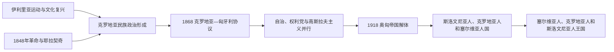

# 民族复兴与近代政治

## 时间

19世纪初—1918年

## 概括

19世纪的克罗地亚政治在哈布斯堡帝国、匈牙利王国和南斯拉夫语言文化运动之间展开。伊利里亚运动推动克罗地亚语文标准化和南斯拉夫文化合作；1848年革命、1867年奥匈妥协和1868年《克罗地亚—匈牙利协议》则重新规定自治范围。到第一次世界大战末，部分克罗地亚政治力量转向建立南斯拉夫共同国家。

## 重要进程

- **伊利里亚运动**：1830年代起，留德维特·盖伊等人以“伊利里亚”名义推进语言规范、出版和南斯拉夫文化联合；运动并不意味着各南斯拉夫民族已经形成单一政治民族。
- **1848年革命**：克罗地亚总督约瑟普·耶拉契奇反对匈牙利革命政府，同时支持废除农奴制和克罗地亚政治要求。克罗地亚诉求、哈布斯堡王权和匈牙利革命之间并非简单的民族二元对立。
- **二元帝国与自治**：1867年奥匈妥协把帝国划为奥地利和匈牙利两部分；1868年协议给予克罗地亚—斯拉沃尼亚有限自治，而达尔马提亚仍在奥地利一侧，区域整合并未完成。
- **政治路线分化**：自治主义、安特·斯塔尔切维奇的权利党传统以及南斯拉夫主义长期竞争；20世纪初克罗地亚—塞尔维亚联盟成为重要议会力量。
- **1918年转折**：奥匈帝国崩溃后，克罗地亚地区首先进入斯洛文尼亚人、克罗地亚人和塞尔维亚人国，随后于1918年12月同塞尔维亚王国合并。合并方式、中央集权和克罗地亚自治问题成为战间期冲突的根源。

## 演变关系

- 前一阶段：[匈牙利联合与哈布斯堡时期](/%E4%BA%BA%E6%96%87%E7%A7%91%E5%AD%A6/%E5%8E%86%E5%8F%B2/%E6%AC%A7%E6%B4%B2/%E4%B8%9C%E5%8D%97%E6%AC%A7%E4%B8%8E%E5%B7%B4%E5%B0%94%E5%B9%B2/%E5%85%8B%E7%BD%97%E5%9C%B0%E4%BA%9A/%E5%8C%88%E7%89%99%E5%88%A9%E8%81%94%E5%90%88%E4%B8%8E%E5%93%88%E5%B8%83%E6%96%AF%E5%A0%A1%E6%97%B6%E6%9C%9F.md)。
- 后续共同阶段：[南斯拉夫王国](/%E4%BA%BA%E6%96%87%E7%A7%91%E5%AD%A6/%E5%8E%86%E5%8F%B2/%E6%AC%A7%E6%B4%B2/%E4%B8%9C%E5%8D%97%E6%AC%A7%E4%B8%8E%E5%B7%B4%E5%B0%94%E5%B9%B2/%E5%8D%97%E6%96%AF%E6%8B%89%E5%A4%AB%E5%8E%86%E5%8F%B2/%E5%8D%97%E6%96%AF%E6%8B%89%E5%A4%AB%E7%8E%8B%E5%9B%BD.md)与[第二次世界大战时期的南斯拉夫](/%E4%BA%BA%E6%96%87%E7%A7%91%E5%AD%A6/%E5%8E%86%E5%8F%B2/%E6%AC%A7%E6%B4%B2/%E4%B8%9C%E5%8D%97%E6%AC%A7%E4%B8%8E%E5%B7%B4%E5%B0%94%E5%B9%B2/%E5%8D%97%E6%96%AF%E6%8B%89%E5%A4%AB%E5%8E%86%E5%8F%B2/%E7%AC%AC%E4%BA%8C%E6%AC%A1%E4%B8%96%E7%95%8C%E5%A4%A7%E6%88%98%E6%97%B6%E6%9C%9F%E7%9A%84%E5%8D%97%E6%96%AF%E6%8B%89%E5%A4%AB.md)。
- 共同区域背景：[奥斯曼—哈布斯堡分治与民族运动](/%E4%BA%BA%E6%96%87%E7%A7%91%E5%AD%A6/%E5%8E%86%E5%8F%B2/%E6%AC%A7%E6%B4%B2/%E4%B8%9C%E5%8D%97%E6%AC%A7%E4%B8%8E%E5%B7%B4%E5%B0%94%E5%B9%B2/%E5%8D%97%E6%96%AF%E6%8B%89%E5%A4%AB%E5%8E%86%E5%8F%B2/%E5%A5%A5%E6%96%AF%E6%9B%BC%E2%80%94%E5%93%88%E5%B8%83%E6%96%AF%E5%A0%A1%E5%88%86%E6%B2%BB%E4%B8%8E%E6%B0%91%E6%97%8F%E8%BF%90%E5%8A%A8.md)。

## 关键辨析

- 伊利里亚运动既参与克罗地亚民族形成，也提出南斯拉夫文化联合；两种取向并非在当时就完全分离。
- 1868年后的克罗地亚—斯拉沃尼亚和达尔马提亚仍属奥匈帝国不同部分，不能把有限自治等同于领土统一。
- 1918年的共同国家经历了“斯洛文尼亚人、克罗地亚人和塞尔维亚人国”这一短暂节点，不能直接从奥匈帝国画到南斯拉夫王国。
