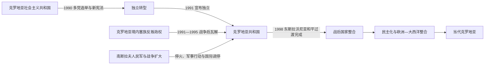

# 独立战争与当代克罗地亚

## 时间

1990年至今

## 概括

1990年多党选举后，克罗地亚从南斯拉夫社会主义联邦共和国的加盟共和国转向独立国家。1991—1995年的战争、1995年后的领土恢复与难民问题，以及1998年东斯拉沃尼亚和平重返克罗地亚管辖，共同塑造了共和国早期。此后克罗地亚经历民主制度巩固、欧洲—大西洋体系整合和人口经济转型。

## 重要阶段

- **政治转型**：1990年多党选举结束一党体制；新宪法重构共和国制度。独立进程与南斯拉夫联邦危机、塞族人口地位争议和军队介入相互交织。
- **独立与战争**：1991年克罗地亚宣布独立，战争迅速扩大。武科瓦尔围城、杜布罗夫尼克受袭和大规模人口流离失所成为战争的重要节点，各方均发生针对平民的犯罪。
- **1995年转折**：克罗地亚军队通过“闪电”和“风暴”等行动恢复大部分失地；大量塞族居民逃离或被迫离开，回归、财产和司法问题延续到战后。
- **和平过渡**：东斯拉沃尼亚在联合国监督下实行过渡行政，并于1998年和平重返克罗地亚管辖，完成主要领土整合。
- **制度与外交**：2000年前后权力交替推动民主制度进一步巩固；克罗地亚2009年加入北约、2013年加入欧洲联盟，2023年加入欧元区和申根区。
- **当代议题**：人口减少与外流、地区发展差异、战争记忆、少数族群权利、旅游业依赖和欧洲一体化是持续议题。

## 演变关系

- 共同前一阶段：[南斯拉夫社会主义联邦共和国](/%E4%BA%BA%E6%96%87%E7%A7%91%E5%AD%A6/%E5%8E%86%E5%8F%B2/%E6%AC%A7%E6%B4%B2/%E4%B8%9C%E5%8D%97%E6%AC%A7%E4%B8%8E%E5%B7%B4%E5%B0%94%E5%B9%B2/%E5%8D%97%E6%96%AF%E6%8B%89%E5%A4%AB%E5%8E%86%E5%8F%B2/%E5%8D%97%E6%96%AF%E6%8B%89%E5%A4%AB%E7%A4%BE%E4%BC%9A%E4%B8%BB%E4%B9%89%E8%81%94%E9%82%A6%E5%85%B1%E5%92%8C%E5%9B%BD.md)。
- 分裂背景：[南斯拉夫解体](/%E4%BA%BA%E6%96%87%E7%A7%91%E5%AD%A6/%E5%8E%86%E5%8F%B2/%E6%AC%A7%E6%B4%B2/%E4%B8%9C%E5%8D%97%E6%AC%A7%E4%B8%8E%E5%B7%B4%E5%B0%94%E5%B9%B2/%E5%8D%97%E6%96%AF%E6%8B%89%E5%A4%AB%E5%8E%86%E5%8F%B2/%E5%8D%97%E6%96%AF%E6%8B%89%E5%A4%AB%E8%A7%A3%E4%BD%93.md)。
- 国家入口：[克罗地亚历史](/%E4%BA%BA%E6%96%87%E7%A7%91%E5%AD%A6/%E5%8E%86%E5%8F%B2/%E6%AC%A7%E6%B4%B2/%E4%B8%9C%E5%8D%97%E6%AC%A7%E4%B8%8E%E5%B7%B4%E5%B0%94%E5%B9%B2/%E5%85%8B%E7%BD%97%E5%9C%B0%E4%BA%9A/README.md)。

## 关键辨析

- 克罗地亚共和国以加盟共和国的制度和领土为独立基础，但这不等于它与1941—1945年的克罗地亚独立国存在政体上的连续继承。
- “独立战争”是克罗地亚国家叙事中的常用称谓；从南斯拉夫整体看，它也是联邦解体战争的一部分。
- 1995年的军事胜利与塞族平民大规模离去、战后回归和战争罪追责是同一历史过程中的不同侧面。
