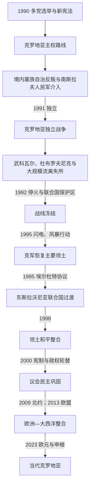

# 独立战争与当代克罗地亚

[克罗地亚历史](/%E4%BA%BA%E6%96%87%E7%A7%91%E5%AD%A6/%E5%8E%86%E5%8F%B2/%E6%AC%A7%E6%B4%B2/%E4%B8%9C%E5%8D%97%E6%AC%A7%E4%B8%8E%E5%B7%B4%E5%B0%94%E5%B9%B2/%E5%85%8B%E7%BD%97%E5%9C%B0%E4%BA%9A/README.md)

## 时间

1990年至今。1991年6月25日宣布独立，10月8日结束同南斯拉夫的国家法联系；1992年1月获得欧洲共同体承认，同年5月加入联合国。现实状态核验至2026年7月14日。

## 概括

克罗地亚从社会主义加盟共和国转为独立国家，与南斯拉夫联邦宪制危机、米洛舍维奇时代塞尔维亚民族政治、克罗地亚民族主义和境内塞族安全恐惧同步发生。1991—1995年战争造成武科瓦尔毁灭、杜布罗夫尼克受袭、族群驱逐及大量死亡；1995年克军收复主要失地，东斯拉沃尼亚则于1998年和平回归。图季曼时期建立国家和军队，却伴随半总统权力集中、私有化寻租及波黑战争争议。2000年后宪制转向议会制并加强战争罪追责，最终加入北约、欧盟、欧元区和申根。人口减少、旅游依赖、地区差距、地震重建和战争记忆仍塑造政治。

## 独立进程与战争起因

### 政治转型

1990年克罗地亚民主共同体赢得选举，历史学家和前游击队将领弗拉尼奥·图季曼成为共和国主席。新政府恢复传统旗徽、清除部分共产党符号并强调国家主权；一些官员的排塞言论和1941符号复现，使塞族人口担心从“构成民族”降为少数族。新宪法确立克罗地亚为克罗地亚民族国家，同时承诺少数族平等，政治效果却未消除恐惧。

塞尔维亚领导层和媒体利用乌斯塔沙记忆，米洛舍维奇支持克罗地亚塞族自治力量。1990年8月克宁周边发生“原木革命”，反叛者封锁道路，逐步建立塞尔维亚克拉伊纳实体。南斯拉夫人民军名义维持联邦秩序，实际越来越保护塞族控制区并阻止克罗地亚取得联邦武器。

### 独立法定步骤

1991年5月公投中，参加者大多数支持独立和可能的主权国家联盟，许多塞族抵制。6月25日萨博尔宣布独立，依欧洲共同体斡旋暂停三个月；10月8日正式断绝国家法联系。欧洲共同体于1992年1月15日承认，条件包括少数族保障；国际社会按原加盟共和国边界承认克罗地亚，不承认以武力改变边界的克拉伊纳主张。

## 1991—1995年战争过程

### 1991年全面战争

春季普利特维采、博罗沃塞洛等冲突造成警察和武装人员死亡。夏秋，南斯拉夫人民军、塞族地方部队和来自塞尔维亚的准军事组织攻击东斯拉沃尼亚、利卡、巴诺维纳与达尔马提亚。克罗地亚从警察和新国民卫队仓促建立军队，通过夺取军营武器增强战力。

武科瓦尔遭三个月围攻，11月陷落后，伤员和平民在奥夫查拉等地被杀害，大量非塞族居民被驱逐。人民军和黑山部队围攻并炮击世界遗产城市杜布罗夫尼克，引发国际谴责。塞族势力控制约四分之一克罗地亚领土，克罗地亚控制区内也发生针对塞族平民的杀害、失踪和驱逐，如戈斯皮奇等案件。

### 停火与联合国保护区

1992年《万斯计划》促成停火，联合国保护部队部署在若干“保护区”，南斯拉夫人民军撤出或把武器交给当地塞族。克拉伊纳建立自己的政府、军队和货币，经济依赖塞尔维亚；克罗地亚不承认其分离。联合国未能完成全面解除武装和难民返回，战线转为低强度冲突。

克军1993年在马斯莱尼察、梅达克口袋等行动改善交通和阵地，行动中亦有塞族平民死亡和村庄被毁。和平方案在克拉伊纳地位、边界与自治程度上反复失败。

### 波斯尼亚战争的交叉

克罗地亚最初支持波黑独立并接收难民，克罗地亚国防委员会同波黑政府军共同对抗波黑塞族。图季曼政府又支持“黑塞哥—波斯尼亚”克族实体，1993—1994年克军、克族武装与波什尼亚克部队发生战争，双方建立营地并攻击平民；国际法院后来确认若干克族领导参与共同犯罪计划，但没有把当代克罗地亚国家整体等同傀儡政权。

美国斡旋的1994年《华盛顿协议》结束克波战争，建立波黑联邦。1995年克罗地亚与波黑政府协调行动，改变波黑西部和克拉伊纳军事平衡，并为《代顿协议》创造条件。

### 1995年军事转折

5月“闪电行动”收复西斯拉沃尼亚；塞族方面随后向萨格勒布发射火箭，杀伤平民。8月“风暴行动”在数日内夺取克宁和大部分克拉伊纳。约十多万至二十万塞族居民随军队撤离或因恐惧逃亡，留下者中有人被杀，房屋遭焚毁和掠夺。克罗地亚政府曾呼吁居民留下并否认驱逐政策，但战后犯罪、阻碍返回和财产安排使人口外流长期化。

国际法庭一审认定部分将领参与共同犯罪，二审以证据标准推翻炮击等核心认定并宣告无罪；无罪判决不意味着所有战后杀害和破坏不存在，个案责任与国家记忆仍需分别讨论。

## 东斯拉沃尼亚和平回归

多瑙河沿岸东斯拉沃尼亚、巴拉尼亚和西锡尔米亚仍由塞族控制。1995年11月《埃尔杜特协议》选择谈判而非新攻势，设联合国东斯拉沃尼亚过渡行政当局。联合国管理警察、复员、选举、文件和难民问题，1998年1月把行政权交还克罗地亚。

和平整合避免大规模战斗，但塞族返回、克罗地亚难民安置、失踪者、教育语言和战争罪调查长期存在。武科瓦尔地区至今保留双重记忆和社会隔离。

## 图季曼时期的国家建设

1990年宪法的半总统制使图季曼控制外交、军队和政府任命。民主共同体借战争动员和选举优势长期执政，完成军队、货币、外交和基础设施建设。德国等早期承认、侨民资金和国内动员支撑国家。

同时，战时及战后私有化把社会资产转给政治关系密切者，造成“二百家族”等腐败批评；媒体和反对党受压，萨格勒布市长任命危机显示总统可阻挡地方多数。图季曼对波黑边界的谈话和对克族实体支持损害国际关系。其1999年去世后，个人化权力中心消失。

## 2000年后的民主与欧洲整合

2000年反对党联盟赢得议会，斯捷潘·梅西奇当选总统。宪法修正把主要行政权转向总理和议会，建立更清晰的议会制。伊维察·拉昌政府推进难民返回、媒体开放和同前南斯拉夫问题国际刑事法庭合作；将领引渡在国内引发大规模抗议。

伊沃·萨纳德领导民主共同体向中右翼亲欧政党转型，后因腐败案件获刑，显示司法追责也触及前总理。克罗地亚2009年加入北约，经过司法、竞争、边界和战争罪合作谈判，于2013年加入欧盟。

| 进程 | 时间 | 意义 |
|---|---|---|
| 加入北约 | 2009年4月1日 | 安全和军队制度进入北约框架。 |
| 加入欧洲联盟 | 2013年7月1日 | 进入单一市场、欧盟法和资金体系。 |
| 申根区 | 2023年1月1日 | 取消内部陆海边境检查，机场检查同年3月调整。 |
| 欧元区 | 2023年1月1日 | 以固定换算率1欧元等于7.53450库纳采用欧元。 |

## 当代政治与社会

安德烈·普连科维奇2016年起领导多届政府，以亲欧、财政稳定和危机管理维持民主共同体主导。2020年萨格勒布和佩特里尼亚地震造成重大住房与遗产损失，重建速度和采购受到批评；新冠疫情重创旅游并考验医疗，欧盟复苏资金随后推动投资。2024年议会选举后，普连科维奇同“祖国运动”等组成第三届政府。

佐兰·米拉诺维奇曾于2011—2016年任总理，2020年就任总统，2025年再次当选。总统与普连科维奇在军队任命、外交、乌克兰政策和情报事务上多次公开冲突，反映直接民选总统与议会政府之间仍有政治张力。截至2026年7月14日，米拉诺维奇为总统，普连科维奇为总理；完整任期见[克罗地亚国家元首与政府首脑表](/%E4%BA%BA%E6%96%87%E7%A7%91%E5%AD%A6/%E5%8E%86%E5%8F%B2/%E6%AC%A7%E6%B4%B2/%E4%B8%9C%E5%8D%97%E6%AC%A7%E4%B8%8E%E5%B7%B4%E5%B0%94%E5%B9%B2/%E5%85%8B%E7%BD%97%E5%9C%B0%E4%BA%9A/%E5%85%8B%E7%BD%97%E5%9C%B0%E4%BA%9A%E5%9B%BD%E5%AE%B6%E5%85%83%E9%A6%96%E4%B8%8E%E6%94%BF%E5%BA%9C%E9%A6%96%E8%84%91%E8%A1%A8.md)。

### 主要长期议题

- **人口与劳动力**：低生育、老龄化和加入欧盟后的外迁使人口减少；近年又依靠来自亚洲、乌克兰和邻国的移民补充旅游、建筑和护理劳动。
- **旅游依赖**：亚得里亚旅游带来外汇和就业，也推高住房、季节性和沿海生态压力。
- **地区差距**：萨格勒布和沿海增长较快，战争受损的内陆、斯拉沃尼亚和岛屿面临人口与公共服务收缩。
- **腐败与机构信任**：多名部长因调查辞职，欧盟资金和公共采购强化监督，却未消除政商网络。
- **少数族与和解**：塞族代表参与部分执政联盟，语言、纪念、失踪者和难民财产问题仍易被民族政治激化。
- **战争记忆**：风暴行动被国家纪念为胜利和感恩日，塞族社会则纪念流亡受害；成熟叙事需同时承认侵略、国家自卫和战后平民犯罪。

## 重要事件

| 时间 | 事件 | 结果与影响 |
|---|---|---|
| 1990年 | 多党选举与新宪法 | 一党制结束，主权路线和塞族地位争议同步加深。 |
| 1991年3—6月 | 早期武装冲突与独立公投 | 警察冲突升级，萨博尔宣布独立。 |
| 1991年8—11月 | 武科瓦尔围城、杜布罗夫尼克受袭 | 战争全面化，平民犯罪和国际关注达到高峰。 |
| 1991年10月8日 | 断绝南斯拉夫国家法联系 | 独立法定完成。 |
| 1992年 | 国际承认、联合国成员与万斯计划 | 战线冻结，约四分之一国土仍在反叛控制。 |
| 1993年 | 马斯莱尼察、梅达克行动 | 克军改善战略位置，也发生针对平民的犯罪。 |
| 1994年 | 华盛顿协议 | 结束克波战争，重建对波黑塞族共同战线。 |
| 1995年5、8月 | 闪电、风暴行动 | 收复主要领土，克拉伊纳塞族大规模外流。 |
| 1995年11月 | 埃尔杜特协议 | 为东部和平整合建立联合国过渡机制。 |
| 1998年1月 | 东斯拉沃尼亚回归 | 主要领土整合完成。 |
| 2000—2001年 | 政权轮替和宪法修正 | 半总统制转向议会制，国际合作加强。 |
| 2009年 | 加入北约 | 安全制度完成重要转向。 |
| 2013年 | 加入欧盟 | 法律经济深度嵌入欧洲。 |
| 2020年 | 地震与疫情 | 暴露住房、医疗和行政能力问题。 |
| 2023年 | 加入欧元区和申根 | 货币、边境和旅游市场进一步一体化。 |
| 2024—2025年 | 普连科维奇第三届政府、米拉诺维奇连任 | 民主共同体继续主导议会，总统与政府共存竞争。 |

## 独立国家的巩固条件

- 加盟共和国已有边界、萨博尔、行政、警察和宪法，为国家转化提供机构。
- 战争动员、侨民资金和国际承认形成国家合法性。
- 1995年的军事优势与埃尔杜特谈判分别解决大部分领土和东部问题。
- 2000年和平政权轮替和宪制改革降低个人权力风险。
- 北约与欧盟成员资格为安全、法律改革、资金和市场提供外部锚。

## 持续压力

- 战争创伤、人口迁徙和选择性纪念阻碍克塞社会和解。
- 旅游、欧盟资金和进口劳动力依赖使经济对外部冲击敏感。
- 人口收缩削弱内陆市镇、养老金和医疗可持续性。
- 长期单一大党主导、政商网络和地方庇护关系影响机构信任。
- 总统与政府的外交、军队权限边界虽有宪法规定，政治实践仍会冲突。

## 演变关系

- 前一节点：[社会主义时期的克罗地亚](/%E4%BA%BA%E6%96%87%E7%A7%91%E5%AD%A6/%E5%8E%86%E5%8F%B2/%E6%AC%A7%E6%B4%B2/%E4%B8%9C%E5%8D%97%E6%AC%A7%E4%B8%8E%E5%B7%B4%E5%B0%94%E5%B9%B2/%E5%85%8B%E7%BD%97%E5%9C%B0%E4%BA%9A/%E7%A4%BE%E4%BC%9A%E4%B8%BB%E4%B9%89%E6%97%B6%E6%9C%9F%E7%9A%84%E5%85%8B%E7%BD%97%E5%9C%B0%E4%BA%9A.md)。
- 分裂背景：[南斯拉夫解体](/%E4%BA%BA%E6%96%87%E7%A7%91%E5%AD%A6/%E5%8E%86%E5%8F%B2/%E6%AC%A7%E6%B4%B2/%E4%B8%9C%E5%8D%97%E6%AC%A7%E4%B8%8E%E5%B7%B4%E5%B0%94%E5%B9%B2/%E5%8D%97%E6%96%AF%E6%8B%89%E5%A4%AB%E5%8E%86%E5%8F%B2/%E5%8D%97%E6%96%AF%E6%8B%89%E5%A4%AB%E8%A7%A3%E4%BD%93.md)。
- 当前仍处于克罗地亚共和国阶段。
