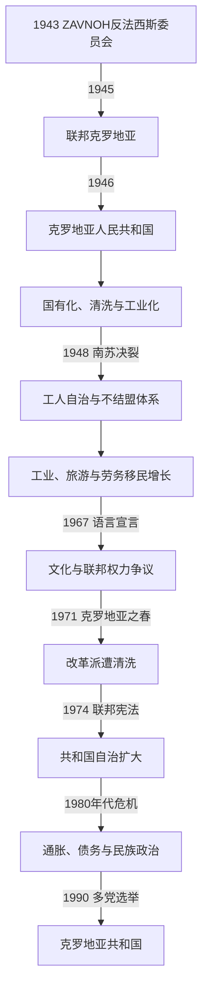

# 社会主义时期的克罗地亚

[克罗地亚历史](/%E4%BA%BA%E6%96%87%E7%A7%91%E5%AD%A6/%E5%8E%86%E5%8F%B2/%E6%AC%A7%E6%B4%B2/%E4%B8%9C%E5%8D%97%E6%AC%A7%E4%B8%8E%E5%B7%B4%E5%B0%94%E5%B9%B2/%E5%85%8B%E7%BD%97%E5%9C%B0%E4%BA%9A/README.md)

## 时间

1943年ZAVNOH建立反法西斯政治法统起，1945年成为南斯拉夫联邦单位；1946—1963年称克罗地亚人民共和国，1963—1990年称克罗地亚社会主义共和国。1990年多党选举后删除“社会主义”国名，12月新宪法完成制度转换。

## 概括

社会主义克罗地亚由共产党领导的游击胜利建立，是南斯拉夫六个共和国之一。战后国有化、工业化和一党政治与联邦制度同步发展；1948年同苏联决裂后转向工人自治、不结盟和较开放的旅游与劳务移民经济。伊斯特拉、里耶卡和扎达尔等沿海地区并入，使共和国边界接近当代国家。1967年语言宣言和1971年“克罗地亚之春”表达经济、文化与联邦权力诉求，运动虽遭清洗，1974年宪法仍扩大共和国权力。1980年代债务、通胀和联邦民族冲突瓦解一党共识，1990年通过选举和平结束社会主义体制，随后却进入独立和战争。

## 建立与战后重组

ZAVNOH在战争中宣布自己为克罗地亚最高代表机关，强调克罗地亚人和塞族平等，并与南斯拉夫反法西斯人民解放委员会建立联邦关系。1945年萨博尔接收其职能，弗拉迪米尔·纳佐尔等担任共和国法定领导；共产党通过人民阵线、警察和干部任命掌握实际权力。

战后审判乌斯塔沙和占领合作者具有追责功能，也伴随未经审判处决、财产没收和政治清洗。德国族人口大规模逃亡或被驱逐，意大利语居民在边界变更、暴力和选择国籍中大量离开伊斯特拉、里耶卡和扎达尔，形成长期记忆争议。

## 边界与领土整合

| 区域 | 战后安排 | 意义 |
|---|---|---|
| 扎达尔及多数达尔马提亚岛屿 | 1947年巴黎和约确认归南斯拉夫，纳入克罗地亚 | 终结意大利兼并。 |
| 伊斯特拉大部与里耶卡 | 1947年归南斯拉夫，主要纳入克罗地亚 | 共和国获得重要港口、工业和多族群地区。 |
| 的里雅斯特自由区B区 | 1954年伦敦备忘录后由南斯拉夫管理，1975年奥西莫条约确认 | 北部部分归斯洛文尼亚，南部部分归克罗地亚。 |
| 巴拉尼亚、东斯拉沃尼亚 | 作为克罗地亚共和国组成部分 | 边界来自战后联邦安排，1991年后成为战争重点。 |
| 波斯尼亚和黑塞哥维那边界 | 按联邦共和国边界确认 | 克罗地亚未继承1941年傀儡国家对波黑的领土。 |

这些边界由联邦反法西斯机关、战后条约和共和国划界共同形成，是1991年国际承认时的宪制边界基础。

## 政治与实际权力

| 层级 | 机构 | 权力特征 |
|---|---|---|
| 南斯拉夫联邦 | 铁托、联邦共产党、联邦政府和军队 | 国防、外交、货币及重大干部政策居主导。 |
| 克罗地亚共产党联盟 | 中央委员会及第一书记或主席 | 共和国实际最高人事与政策中心，领导人须服从联邦党内平衡。 |
| 萨博尔及主席团 | 法定共和国立法和国家元首机关 | 宪法权力随1953、1963、1974年改革扩大，但一党时期缺乏竞争性选举。 |
| 执行委员会或政府 | 共和国行政和经济管理 | 管理教育、警务、工业、旅游等，受党组织监督。 |
| 市镇与工人委员会 | 地方公共事务和企业自治 | 有一定参与和资源分配权，也受干部体系及宏观计划制约。 |

完整共和国法定元首、政府首脑和党领导人见[克罗地亚国家元首与政府首脑表](/%E4%BA%BA%E6%96%87%E7%A7%91%E5%AD%A6/%E5%8E%86%E5%8F%B2/%E6%AC%A7%E6%B4%B2/%E4%B8%9C%E5%8D%97%E6%AC%A7%E4%B8%8E%E5%B7%B4%E5%B0%94%E5%B9%B2/%E5%85%8B%E7%BD%97%E5%9C%B0%E4%BA%9A/%E5%85%8B%E7%BD%97%E5%9C%B0%E4%BA%9A%E5%9B%BD%E5%AE%B6%E5%85%83%E9%A6%96%E4%B8%8E%E6%94%BF%E5%BA%9C%E9%A6%96%E8%84%91%E8%A1%A8.md)。

## 经济与社会转型

### 国有化、集体化与工业化

1945年后政府没收敌产、国有化银行和大工业，实行五年计划。农业集体化在农村遭抵制，南苏决裂和政策调整后于1950年代逐步放松。萨格勒布、里耶卡、斯普利特、锡萨克和奥西耶克发展机械、造船、石化、食品和军工，农村人口大规模进入城市。

妇女获得选举权和更广就业，教育、医疗、住房和社会保险覆盖扩大。快速城市化也带来住房不足、污染、地区差异和对联邦投资分配的争论。

### 1948年决裂与工人自治

铁托拒绝斯大林控制后，克罗地亚党组织清洗亲苏或被怀疑亲苏者，部分人被关押在裸岛。1950年工人自治法把企业委员会塑造成南斯拉夫模式核心；实际决策仍受党、银行、地方和市场共同制约，不是企业完全独立。

1960年代市场改革扩大企业自主和对西方贸易。亚得里亚旅游、造船和侨汇使克罗地亚成为较富共和国之一，大批劳动者赴西德、奥地利等地工作。共和国领导人主张保留更多外汇，欠发达地区和联邦政府则强调再分配，由此形成经济—民族政治交汇。

## 文化、语言与克罗地亚之春

战后官方强调“兄弟团结”，既承认克罗地亚民族，又压制乌斯塔沙复辟、塞族民族主义和被定义为分离主义的活动。1967年一批文化机构发表《克罗地亚文学语言名称与地位宣言》，反对以模糊的“塞尔维亚—克罗地亚语”压低克罗地亚标准语地位。

1960年代末，克罗地亚党领导萨夫卡·达布切维奇—库查尔、米科·特里帕洛等支持经济改革、共和国权力和语言文化诉求；学生、知识分子及克罗地亚文化协会提出更激进要求。1971年铁托在卡拉乔杰沃会议迫使改革派辞职，学生领袖和文化人士遭逮捕或禁职，后被称为“克罗地亚沉默”。

运动内部既有联邦改革者，也有民族主义者，不能整体描述为独立革命。清洗短期恢复秩序，但削弱党内公开处理民族和财政争议的能力。

## 1974年宪法与晚期危机

1974年联邦宪法扩大共和国在经济、警察、教育和联邦集体机构中的权力，并确认共和国拥有主权性权利及自决原则，联邦决策越来越依赖共识。克罗地亚设集体主席团，地方党组织拥有更大干部权。

铁托1980年去世后，轮值联邦主席制缺乏最终仲裁者。外债、石油冲击、通胀、失业和紧缩削弱生活水平；克罗地亚旅游外汇与联邦再分配再次成为争议。1986年后斯洛博丹·米洛舍维奇在塞尔维亚崛起，以科索沃和塞族统一动员，改变共和国平衡。克罗地亚塞族对1941年记忆和地位的担忧，与克罗地亚民族主义复兴彼此加强。

## 1990年制度转换

1989年克罗地亚共产党允许政治多元，弗拉尼奥·图季曼创建克罗地亚民主共同体。1990年1月南斯拉夫共产主义者联盟第十四次代表大会上，斯洛文尼亚代表团退出，克罗地亚代表团随后离场，联邦党实际瓦解。

4—5月多党选举中，民主共同体凭多数制规则取得萨博尔多数，图季曼当选共和国主席。共产党改组为民主改革党并和平交权。7月国名删除“社会主义”，12月22日新宪法确立克罗地亚共和国。转型在机构上和平完成，但塞族人口地位、联邦军队和国家主权争议迅速军事化。

## 重要事件

| 时间 | 事件 | 结果与影响 |
|---|---|---|
| 1943年 | ZAVNOH成立 | 建立反法西斯克罗地亚政治法统与联邦原则。 |
| 1945—1946年 | 联邦单位和共和国宪法建立 | 共产党一党统治、萨博尔和共和国政府制度化。 |
| 1947年 | 巴黎和约 | 扎达尔、伊斯特拉和里耶卡等边界获国际安排。 |
| 1948年 | 南苏决裂 | 清洗亲苏者，转向独立社会主义和西方经济联系。 |
| 1950年 | 工人自治制度启动 | 企业管理模式区别于苏联中央计划。 |
| 1954、1975年 | 的里雅斯特安排 | 西北边界逐步稳定。 |
| 1967年 | 语言宣言 | 语言平等和共和国文化权成为公开政治议题。 |
| 1971年 | 克罗地亚之春被清洗 | 改革派、学生和文化组织受压，民族争议转入地下。 |
| 1974年 | 新联邦宪法 | 共和国自治和否决权扩大，为后来的主权解释提供依据。 |
| 1980年 | 铁托去世 | 联邦失去个人仲裁，集体体制面对经济和民族危机。 |
| 1989年 | 政治多元化 | 新政党形成，共产党准备竞争性选举。 |
| 1990年1月 | 联邦党代表大会破裂 | 一党共同组织瓦解。 |
| 1990年4—5月 | 多党选举 | 民主共同体执政，图季曼成为共和国主席。 |
| 1990年12月 | 新宪法 | 议会民主、国家主权和新的民族条款确立。 |

## 制度的成就与衰落

### 发展条件

- 游击队胜利和反法西斯委员会给共和国提供本地法统，联邦又保障边界和安全。
- 战后国有投资、沿海港口与受教育劳动力推动工业化。
- 同苏联决裂后可同时利用西方信贷、旅游市场和社会主义贸易。
- 工人自治、市镇权力与1974年宪法给共和国精英和社会更多空间。
- 克罗地亚作为联邦单位保留名称、边界、萨博尔和宪法，为和平选举转型提供机构。

### 结构因素

- 一党体制以清洗而非公开协商处理民族、语言和财政冲突。
- 工人自治的企业、地方银行和联邦担保形成软预算与外债。
- 富共和国和欠发达地区对再分配的利益冲突被民族化。
- 1974年体制扩大否决，却没有建立成员希望退出时的可执行程序。
- 二战记忆被官方公式压缩，乌斯塔沙罪行、战后报复和塞族安全恐惧在1980年代重新政治化。

### 直接终结

东欧剧变使一党合法性消失，联邦党在1990年初分裂。克罗地亚共产党接受多党选举并交权，因此社会主义共和国的政体不是在战场上被推翻。然而新政府要求更大主权、塞尔维亚领导反对松散邦联、克罗地亚塞族建立自治实体，南斯拉夫人民军又拒绝成为中立仲裁者。制度转换很快与联邦解体战争相接。

## 演变关系

- 前一节点：[克罗地亚独立国与第二次世界大战](/%E4%BA%BA%E6%96%87%E7%A7%91%E5%AD%A6/%E5%8E%86%E5%8F%B2/%E6%AC%A7%E6%B4%B2/%E4%B8%9C%E5%8D%97%E6%AC%A7%E4%B8%8E%E5%B7%B4%E5%B0%94%E5%B9%B2/%E5%85%8B%E7%BD%97%E5%9C%B0%E4%BA%9A/%E5%85%8B%E7%BD%97%E5%9C%B0%E4%BA%9A%E7%8B%AC%E7%AB%8B%E5%9B%BD%E4%B8%8E%E7%AC%AC%E4%BA%8C%E6%AC%A1%E4%B8%96%E7%95%8C%E5%A4%A7%E6%88%98.md)。
- 后一节点：[独立战争与当代克罗地亚](/%E4%BA%BA%E6%96%87%E7%A7%91%E5%AD%A6/%E5%8E%86%E5%8F%B2/%E6%AC%A7%E6%B4%B2/%E4%B8%9C%E5%8D%97%E6%AC%A7%E4%B8%8E%E5%B7%B4%E5%B0%94%E5%B9%B2/%E5%85%8B%E7%BD%97%E5%9C%B0%E4%BA%9A/%E7%8B%AC%E7%AB%8B%E6%88%98%E4%BA%89%E4%B8%8E%E5%BD%93%E4%BB%A3%E5%85%8B%E7%BD%97%E5%9C%B0%E4%BA%9A.md)。
- 联邦共同史：[南斯拉夫社会主义联邦共和国](/%E4%BA%BA%E6%96%87%E7%A7%91%E5%AD%A6/%E5%8E%86%E5%8F%B2/%E6%AC%A7%E6%B4%B2/%E4%B8%9C%E5%8D%97%E6%AC%A7%E4%B8%8E%E5%B7%B4%E5%B0%94%E5%B9%B2/%E5%8D%97%E6%96%AF%E6%8B%89%E5%A4%AB%E5%8E%86%E5%8F%B2/%E5%8D%97%E6%96%AF%E6%8B%89%E5%A4%AB%E7%A4%BE%E4%BC%9A%E4%B8%BB%E4%B9%89%E8%81%94%E9%82%A6%E5%85%B1%E5%92%8C%E5%9B%BD.md)。
