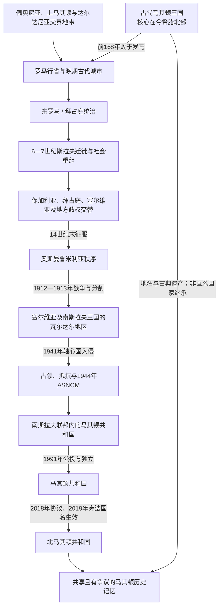

# 北马其顿历史

[返回东南欧与巴尔干历史](/%E4%BA%BA%E6%96%87%E7%A7%91%E5%AD%A6/%E5%8E%86%E5%8F%B2/%E6%AC%A7%E6%B4%B2/%E4%B8%9C%E5%8D%97%E6%AC%A7%E4%B8%8E%E5%B7%B4%E5%B0%94%E5%B9%B2/README.md)

## 概括

北马其顿的历史主线不是“古代马其顿王国自然延续至今”，而是现代国土上的古代佩奥尼亚与罗马—拜占庭遗产，经斯拉夫迁徙、中世纪多国竞争、五百余年奥斯曼统治、1912—1913年马其顿地区分割和两次世界大战，最终在1944年南斯拉夫联邦框架内形成马其顿共和国，并于1991年成为独立国家。现代国家只覆盖历史地理马其顿的瓦尔达尔部分；古代王国的核心则在今希腊北部。

## 历史主线

- **空间先于国名**：现代北马其顿领土在古代主要涉及佩奥尼亚、林凯斯提斯、达尔达尼亚边缘及罗马行省网络，不能把今日国界投射回古代。
- **奥赫里德传统贯穿多国统治**：斯拉夫礼仪、文字教育与奥赫里德教会中心先后处于保加利亚、拜占庭和其他政权框架中，其文化影响超过任何一代政治边界。
- **近代“马其顿问题”由帝国衰退催化**：19世纪教会、学校、语言和革命组织竞争，把原本交叠的地方、宗教和语言身份逐渐纳入相互排斥的民族国家方案。
- **现代国家的制度起点在1944年**：马其顿民族解放反法西斯大会确立共和国和马其顿语地位；社会主义时期完成语言、教育、文化与行政机构建设。
- **独立后的两条议程相互牵连**：国内围绕马其顿族—阿尔巴尼亚族权力分享重构制度，对外则以解决希腊国名争议、处理保加利亚历史与语言争议、加入北约和推进欧盟谈判为主。
- **截至2026年7月14日**：北马其顿为议会共和国，戈尔达娜·西莉娅诺夫斯卡-达夫科娃任总统，赫里斯蒂扬·米茨科斯基任政府总理。

## 历史阶段导航

| 顺序 | 阶段 | 时间 | 主线 |
|---:|---|---|---|
| 1 | [古代马其顿与罗马—拜占庭时期](/%E4%BA%BA%E6%96%87%E7%A7%91%E5%AD%A6/%E5%8E%86%E5%8F%B2/%E6%AC%A7%E6%B4%B2/%E4%B8%9C%E5%8D%97%E6%AC%A7%E4%B8%8E%E5%B7%B4%E5%B0%94%E5%B9%B2/%E5%8C%97%E9%A9%AC%E5%85%B6%E9%A1%BF/%E5%8F%A4%E4%BB%A3%E9%A9%AC%E5%85%B6%E9%A1%BF%E4%B8%8E%E7%BD%97%E9%A9%AC%E2%80%94%E6%8B%9C%E5%8D%A0%E5%BA%AD%E6%97%B6%E6%9C%9F.md) | 公元前1千纪—6世纪 | 佩奥尼亚、古代马其顿、罗马行省和早期基督教城市网络先后影响现代国土。 |
| 2 | [斯拉夫迁徙与中世纪马其顿地区](/%E4%BA%BA%E6%96%87%E7%A7%91%E5%AD%A6/%E5%8E%86%E5%8F%B2/%E6%AC%A7%E6%B4%B2/%E4%B8%9C%E5%8D%97%E6%AC%A7%E4%B8%8E%E5%B7%B4%E5%B0%94%E5%B9%B2/%E5%8C%97%E9%A9%AC%E5%85%B6%E9%A1%BF/%E6%96%AF%E6%8B%89%E5%A4%AB%E8%BF%81%E5%BE%99%E4%B8%8E%E4%B8%AD%E4%B8%96%E7%BA%AA%E9%A9%AC%E5%85%B6%E9%A1%BF%E5%9C%B0%E5%8C%BA.md) | 6世纪—14世纪末 | 斯拉夫聚落形成，地区在保加利亚、拜占庭、塞尔维亚及地方领主间反复易手。 |
| 3 | [奥斯曼统治下的马其顿地区](/%E4%BA%BA%E6%96%87%E7%A7%91%E5%AD%A6/%E5%8E%86%E5%8F%B2/%E6%AC%A7%E6%B4%B2/%E4%B8%9C%E5%8D%97%E6%AC%A7%E4%B8%8E%E5%B7%B4%E5%B0%94%E5%B9%B2/%E5%8C%97%E9%A9%AC%E5%85%B6%E9%A1%BF/%E5%A5%A5%E6%96%AF%E6%9B%BC%E7%BB%9F%E6%B2%BB%E4%B8%8B%E7%9A%84%E9%A9%AC%E5%85%B6%E9%A1%BF%E5%9C%B0%E5%8C%BA.md) | 14世纪末—1912年 | 奥斯曼行政、商贸与宗教共同体塑造社会，19世纪民族竞争和革命运动增强。 |
| 4 | [巴尔干战争、塞尔维亚统治与战间期](/%E4%BA%BA%E6%96%87%E7%A7%91%E5%AD%A6/%E5%8E%86%E5%8F%B2/%E6%AC%A7%E6%B4%B2/%E4%B8%9C%E5%8D%97%E6%AC%A7%E4%B8%8E%E5%B7%B4%E5%B0%94%E5%B9%B2/%E5%8C%97%E9%A9%AC%E5%85%B6%E9%A1%BF/%E5%B7%B4%E5%B0%94%E5%B9%B2%E6%88%98%E4%BA%89%E3%80%81%E5%A1%9E%E5%B0%94%E7%BB%B4%E4%BA%9A%E7%BB%9F%E6%B2%BB%E4%B8%8E%E6%88%98%E9%97%B4%E6%9C%9F.md) | 1912年—1941年 | 地理马其顿被分割，瓦尔达尔地区经历塞尔维亚统治、一战占领和南斯拉夫中央集权。 |
| 5 | [战争时期与马其顿共和国](/%E4%BA%BA%E6%96%87%E7%A7%91%E5%AD%A6/%E5%8E%86%E5%8F%B2/%E6%AC%A7%E6%B4%B2/%E4%B8%9C%E5%8D%97%E6%AC%A7%E4%B8%8E%E5%B7%B4%E5%B0%94%E5%B9%B2/%E5%8C%97%E9%A9%AC%E5%85%B6%E9%A1%BF/%E6%88%98%E4%BA%89%E6%97%B6%E6%9C%9F%E4%B8%8E%E9%A9%AC%E5%85%B6%E9%A1%BF%E5%85%B1%E5%92%8C%E5%9B%BD.md) | 1941年—1991年 | 占领与抵抗导向ASNOM建制，社会主义共和国完成现代民族—国家机构化。 |
| 6 | [独立、国名争议与北马其顿](/%E4%BA%BA%E6%96%87%E7%A7%91%E5%AD%A6/%E5%8E%86%E5%8F%B2/%E6%AC%A7%E6%B4%B2/%E4%B8%9C%E5%8D%97%E6%AC%A7%E4%B8%8E%E5%B7%B4%E5%B0%94%E5%B9%B2/%E5%8C%97%E9%A9%AC%E5%85%B6%E9%A1%BF/%E7%8B%AC%E7%AB%8B%E3%80%81%E5%9B%BD%E5%90%8D%E4%BA%89%E8%AE%AE%E4%B8%8E%E5%8C%97%E9%A9%AC%E5%85%B6%E9%A1%BF.md) | 1991年至今 | 独立、2001年冲突、普雷斯帕协议、北约入盟及欧盟进程构成当代主线。 |

## 专题与统治序列

| 专题 | 用途 |
|---|---|
| [古代马其顿与现代国家名称辨析](/%E4%BA%BA%E6%96%87%E7%A7%91%E5%AD%A6/%E5%8E%86%E5%8F%B2/%E6%AC%A7%E6%B4%B2/%E4%B8%9C%E5%8D%97%E6%AC%A7%E4%B8%8E%E5%B7%B4%E5%B0%94%E5%B9%B2/%E5%8C%97%E9%A9%AC%E5%85%B6%E9%A1%BF/%E5%8F%A4%E4%BB%A3%E9%A9%AC%E5%85%B6%E9%A1%BF%E4%B8%8E%E7%8E%B0%E4%BB%A3%E5%9B%BD%E5%AE%B6%E5%90%8D%E7%A7%B0%E8%BE%A8%E6%9E%90.md) | 区分古代王国、历史地理区域、现代民族与语言、南斯拉夫共和国和当代国家。 |
| [北马其顿国家元首与政府首脑表](/%E4%BA%BA%E6%96%87%E7%A7%91%E5%AD%A6/%E5%8E%86%E5%8F%B2/%E6%AC%A7%E6%B4%B2/%E4%B8%9C%E5%8D%97%E6%AC%A7%E4%B8%8E%E5%B7%B4%E5%B0%94%E5%B9%B2/%E5%8C%97%E9%A9%AC%E5%85%B6%E9%A1%BF/%E5%8C%97%E9%A9%AC%E5%85%B6%E9%A1%BF%E5%9B%BD%E5%AE%B6%E5%85%83%E9%A6%96%E4%B8%8E%E6%94%BF%E5%BA%9C%E9%A6%96%E8%84%91%E8%A1%A8.md) | 分列1944—1991年共和国法定元首、政府首脑、党内领导，以及1991—2026年正式与代理总统、历届总理。 |
| [南斯拉夫历史](/%E4%BA%BA%E6%96%87%E7%A7%91%E5%AD%A6/%E5%8E%86%E5%8F%B2/%E6%AC%A7%E6%B4%B2/%E4%B8%9C%E5%8D%97%E6%AC%A7%E4%B8%8E%E5%B7%B4%E5%B0%94%E5%B9%B2/%E5%8D%97%E6%96%AF%E6%8B%89%E5%A4%AB%E5%8E%86%E5%8F%B2/README.md) | 对读南斯拉夫王国、社会主义联邦及解体的共同国家过程。 |

## 重要转折与时间节点

| 时间 | 转折 | 意义 |
|---|---|---|
| 前168年 | 罗马击败安提柯王朝 | 古代马其顿王国终结，地区重组为罗马行省体系。 |
| 1018年 | 拜占庭征服萨穆伊尔政权 | 政权终结而奥赫里德总主教区延续，显示政治与文化边界并不一致。 |
| 1390年代 | 奥斯曼控制斯科普里、奥赫里德等地 | 地区逐步纳入延续五百余年的鲁米利亚秩序。 |
| 1903年 | 伊林登起义 | 虽遭镇压，却成为自治、保加利亚和马其顿等多种历史叙事的关键记忆。 |
| 1912—1913年 | 巴尔干战争与《布加勒斯特条约》 | 地理马其顿分割，瓦尔达尔部分进入塞尔维亚王国。 |
| 1944年8月2日 | ASNOM第一次会议 | 建立马其顿联邦国家制度并确认马其顿语官方地位。 |
| 1991年9月8日 | 独立公投 | 共和国以相对和平方式脱离正在解体的南斯拉夫。 |
| 2001年 | 武装冲突与《奥赫里德框架协议》 | 通过语言、地方自治和公平代表原则重构多族群国家。 |
| 2018—2019年 | 《普雷斯帕协议》与宪法修正 | 国名改为北马其顿共和国，解除希腊对北约进程的主要阻碍。 |
| 2020年 | 加入北约 | 完成欧洲—大西洋安全体系整合，欧盟入盟仍受改革与邻国争议制约。 |
