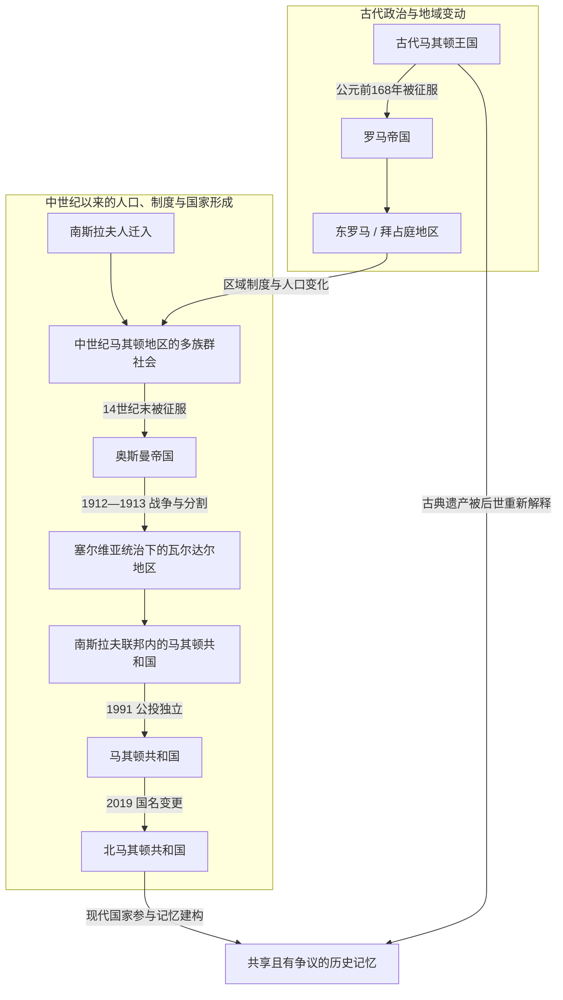

# 北马其顿历史

[返回东南欧与巴尔干历史](/%E4%BA%BA%E6%96%87%E7%A7%91%E5%AD%A6/%E5%8E%86%E5%8F%B2/%E6%AC%A7%E6%B4%B2/%E4%B8%9C%E5%8D%97%E6%AC%A7%E4%B8%8E%E5%B7%B4%E5%B0%94%E5%B9%B2/README.md)

## 概括

北马其顿历史可按“古代马其顿地区的多重政权 → 斯拉夫迁徙与中世纪帝国竞争 → 奥斯曼统治和近代民族运动 → 巴尔干战争后进入塞尔维亚及南斯拉夫国家 → 社会主义马其顿共和国 → 1991年独立、国名争议与北马其顿共和国”来理解。现代国家主要形成于20世纪，其领土只覆盖历史地理“马其顿”的一部分；古代马其顿王国、现代马其顿民族与当代北马其顿国家不能画成无间断直系继承。

## 历史阶段导航

| 顺序 | 阶段 | 时间 | 历史走向 |
|---:|---|---|---|
| 1 | [古代马其顿与罗马—拜占庭时期](/%E4%BA%BA%E6%96%87%E7%A7%91%E5%AD%A6/%E5%8E%86%E5%8F%B2/%E6%AC%A7%E6%B4%B2/%E4%B8%9C%E5%8D%97%E6%AC%A7%E4%B8%8E%E5%B7%B4%E5%B0%94%E5%B9%B2/%E5%8C%97%E9%A9%AC%E5%85%B6%E9%A1%BF/%E5%8F%A4%E4%BB%A3%E9%A9%AC%E5%85%B6%E9%A1%BF%E4%B8%8E%E7%BD%97%E9%A9%AC%E2%80%94%E6%8B%9C%E5%8D%A0%E5%BA%AD%E6%97%B6%E6%9C%9F.md) | 公元前1千纪—6世纪 | 佩奥尼亚、古代马其顿、罗马行省与东罗马制度先后影响现代国土。 |
| 2 | [斯拉夫迁徙与中世纪马其顿地区](/%E4%BA%BA%E6%96%87%E7%A7%91%E5%AD%A6/%E5%8E%86%E5%8F%B2/%E6%AC%A7%E6%B4%B2/%E4%B8%9C%E5%8D%97%E6%AC%A7%E4%B8%8E%E5%B7%B4%E5%B0%94%E5%B9%B2/%E5%8C%97%E9%A9%AC%E5%85%B6%E9%A1%BF/%E6%96%AF%E6%8B%89%E5%A4%AB%E8%BF%81%E5%BE%99%E4%B8%8E%E4%B8%AD%E4%B8%96%E7%BA%AA%E9%A9%AC%E5%85%B6%E9%A1%BF%E5%9C%B0%E5%8C%BA.md) | 6世纪—14世纪末 | 斯拉夫人迁入后，地区在拜占庭、保加利亚、塞尔维亚及地方政权间反复易手。 |
| 3 | [奥斯曼统治下的马其顿地区](/%E4%BA%BA%E6%96%87%E7%A7%91%E5%AD%A6/%E5%8E%86%E5%8F%B2/%E6%AC%A7%E6%B4%B2/%E4%B8%9C%E5%8D%97%E6%AC%A7%E4%B8%8E%E5%B7%B4%E5%B0%94%E5%B9%B2/%E5%8C%97%E9%A9%AC%E5%85%B6%E9%A1%BF/%E5%A5%A5%E6%96%AF%E6%9B%BC%E7%BB%9F%E6%B2%BB%E4%B8%8B%E7%9A%84%E9%A9%AC%E5%85%B6%E9%A1%BF%E5%9C%B0%E5%8C%BA.md) | 14世纪末—1912年 | 奥斯曼鲁米利亚秩序塑造城市、宗教和贸易网络，19世纪民族运动竞逐加剧。 |
| 4 | [巴尔干战争、塞尔维亚统治与战间期](/%E4%BA%BA%E6%96%87%E7%A7%91%E5%AD%A6/%E5%8E%86%E5%8F%B2/%E6%AC%A7%E6%B4%B2/%E4%B8%9C%E5%8D%97%E6%AC%A7%E4%B8%8E%E5%B7%B4%E5%B0%94%E5%B9%B2/%E5%8C%97%E9%A9%AC%E5%85%B6%E9%A1%BF/%E5%B7%B4%E5%B0%94%E5%B9%B2%E6%88%98%E4%BA%89%E3%80%81%E5%A1%9E%E5%B0%94%E7%BB%B4%E4%BA%9A%E7%BB%9F%E6%B2%BB%E4%B8%8E%E6%88%98%E9%97%B4%E6%9C%9F.md) | 1912年—1941年 | 地理马其顿被分割，瓦尔达尔地区进入塞尔维亚和南斯拉夫王国体系。 |
| 5 | [战争时期与马其顿共和国](/%E4%BA%BA%E6%96%87%E7%A7%91%E5%AD%A6/%E5%8E%86%E5%8F%B2/%E6%AC%A7%E6%B4%B2/%E4%B8%9C%E5%8D%97%E6%AC%A7%E4%B8%8E%E5%B7%B4%E5%B0%94%E5%B9%B2/%E5%8C%97%E9%A9%AC%E5%85%B6%E9%A1%BF/%E6%88%98%E4%BA%89%E6%97%B6%E6%9C%9F%E4%B8%8E%E9%A9%AC%E5%85%B6%E9%A1%BF%E5%85%B1%E5%92%8C%E5%9B%BD.md) | 1941年—1991年 | 二战占领与抵抗后，马其顿共和国在社会主义南斯拉夫内制度化。 |
| 6 | [独立、国名争议与北马其顿](/%E4%BA%BA%E6%96%87%E7%A7%91%E5%AD%A6/%E5%8E%86%E5%8F%B2/%E6%AC%A7%E6%B4%B2/%E4%B8%9C%E5%8D%97%E6%AC%A7%E4%B8%8E%E5%B7%B4%E5%B0%94%E5%B9%B2/%E5%8C%97%E9%A9%AC%E5%85%B6%E9%A1%BF/%E7%8B%AC%E7%AB%8B%E3%80%81%E5%9B%BD%E5%90%8D%E4%BA%89%E8%AE%AE%E4%B8%8E%E5%8C%97%E9%A9%AC%E5%85%B6%E9%A1%BF.md) | 1991年至今 | 独立共和国处理族群关系、国名争议及欧洲—大西洋整合。 |

## 专题辨析

- [古代马其顿与现代国家名称辨析](/%E4%BA%BA%E6%96%87%E7%A7%91%E5%AD%A6/%E5%8E%86%E5%8F%B2/%E6%AC%A7%E6%B4%B2/%E4%B8%9C%E5%8D%97%E6%AC%A7%E4%B8%8E%E5%B7%B4%E5%B0%94%E5%B9%B2/%E5%8C%97%E9%A9%AC%E5%85%B6%E9%A1%BF/%E5%8F%A4%E4%BB%A3%E9%A9%AC%E5%85%B6%E9%A1%BF%E4%B8%8E%E7%8E%B0%E4%BB%A3%E5%9B%BD%E5%AE%B6%E5%90%8D%E7%A7%B0%E8%BE%A8%E6%9E%90.md)：区分古代王国、历史地理区域、现代民族和当代国家。
- 北马其顿是南斯拉夫 / 巴尔干斯拉夫历史中的现代国家方向之一，但并非只从南斯拉夫解体时才拥有历史背景；中世纪地方传统、奥斯曼统治、近代民族运动、两次世界大战和冷战共同塑造其国家形成。
- 该地主要处于奥斯曼统治；哈布斯堡在战争、外交和列强竞争中产生阶段性或间接影响，不能与奥斯曼的长期行政统治并列为同等覆盖。

## 与南斯拉夫共同主线的关系

本目录记录马其顿地区及北马其顿国家视角；共同国家过程由[南斯拉夫历史](/%E4%BA%BA%E6%96%87%E7%A7%91%E5%AD%A6/%E5%8E%86%E5%8F%B2/%E6%AC%A7%E6%B4%B2/%E4%B8%9C%E5%8D%97%E6%AC%A7%E4%B8%8E%E5%B7%B4%E5%B0%94%E5%B9%B2/%E5%8D%97%E6%96%AF%E6%8B%89%E5%A4%AB%E5%8E%86%E5%8F%B2/README.md)维护，参见[南斯拉夫王国](/%E4%BA%BA%E6%96%87%E7%A7%91%E5%AD%A6/%E5%8E%86%E5%8F%B2/%E6%AC%A7%E6%B4%B2/%E4%B8%9C%E5%8D%97%E6%AC%A7%E4%B8%8E%E5%B7%B4%E5%B0%94%E5%B9%B2/%E5%8D%97%E6%96%AF%E6%8B%89%E5%A4%AB%E5%8E%86%E5%8F%B2/%E5%8D%97%E6%96%AF%E6%8B%89%E5%A4%AB%E7%8E%8B%E5%9B%BD.md)、[第二次世界大战时期的南斯拉夫](/%E4%BA%BA%E6%96%87%E7%A7%91%E5%AD%A6/%E5%8E%86%E5%8F%B2/%E6%AC%A7%E6%B4%B2/%E4%B8%9C%E5%8D%97%E6%AC%A7%E4%B8%8E%E5%B7%B4%E5%B0%94%E5%B9%B2/%E5%8D%97%E6%96%AF%E6%8B%89%E5%A4%AB%E5%8E%86%E5%8F%B2/%E7%AC%AC%E4%BA%8C%E6%AC%A1%E4%B8%96%E7%95%8C%E5%A4%A7%E6%88%98%E6%97%B6%E6%9C%9F%E7%9A%84%E5%8D%97%E6%96%AF%E6%8B%89%E5%A4%AB.md)、[南斯拉夫社会主义联邦共和国](/%E4%BA%BA%E6%96%87%E7%A7%91%E5%AD%A6/%E5%8E%86%E5%8F%B2/%E6%AC%A7%E6%B4%B2/%E4%B8%9C%E5%8D%97%E6%AC%A7%E4%B8%8E%E5%B7%B4%E5%B0%94%E5%B9%B2/%E5%8D%97%E6%96%AF%E6%8B%89%E5%A4%AB%E5%8E%86%E5%8F%B2/%E5%8D%97%E6%96%AF%E6%8B%89%E5%A4%AB%E7%A4%BE%E4%BC%9A%E4%B8%BB%E4%B9%89%E8%81%94%E9%82%A6%E5%85%B1%E5%92%8C%E5%9B%BD.md)与[南斯拉夫解体](/%E4%BA%BA%E6%96%87%E7%A7%91%E5%AD%A6/%E5%8E%86%E5%8F%B2/%E6%AC%A7%E6%B4%B2/%E4%B8%9C%E5%8D%97%E6%AC%A7%E4%B8%8E%E5%B7%B4%E5%B0%94%E5%B9%B2/%E5%8D%97%E6%96%AF%E6%8B%89%E5%A4%AB%E5%8E%86%E5%8F%B2/%E5%8D%97%E6%96%AF%E6%8B%89%E5%A4%AB%E8%A7%A3%E4%BD%93.md)。

## 重要转折与时间节点

| 时间 | 转折 | 意义 |
|---|---|---|
| 公元前168年 | 罗马击败古代马其顿王国 | 古代王国终结，地区逐步纳入罗马行省体系。 |
| 1018年 | 拜占庭征服萨穆伊尔政权 | 奥赫里德仍保持重要宗教地位，政权边界与文化网络并不同步。 |
| 14世纪末 | 奥斯曼征服 | 地区进入持续数百年的鲁米利亚秩序。 |
| 1912—1913年 | 巴尔干战争与《布加勒斯特条约》 | 地理马其顿被分割，瓦尔达尔地区进入塞尔维亚。 |
| 1944年 | 马其顿民族解放反法西斯大会召开 | 马其顿共和国的联邦国家制度起点。 |
| 1991年 | 独立公投 | 马其顿共和国脱离南斯拉夫。 |
| 2001年 | 冲突与《奥赫里德框架协议》 | 多族群权力分享、语言和地方治理制度重组。 |
| 2019年 | 国名改为北马其顿共和国 | 《普雷斯帕协议》生效，调整对外名称和历史遗产表述。 |
