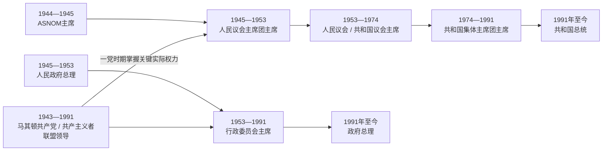

# 北马其顿国家元首与政府首脑表

## 时间

1944年—2026年7月14日

## 使用说明

1944—1991年的马其顿是南斯拉夫联邦单位，一党体制下“法定元首”“议会主持者”“政府首脑”和“共产党实际领导人”并非同一角色。1945—1953年主席团承担集体元首职能；1953—1974年议会主席兼具共和国代表职能；1974年宪法又建立共和国主席团。为避免把不同职位混成一列，本页分表列出。1991年以后改为直接选举总统和议会负责制政府，总理是日常行政中心；议长只在总统空缺或不能履职时代理元首。

## 社会主义阶段法定元首职能承担者

### ASNOM与人民议会主席团（1944—1953）

| 顺序 | 姓名 | 职务 | 在任 | 继任关系 | 关键事件与说明 |
|---:|---|---|---|---|---|
| 1 | **梅托迪亚·安多诺夫-琴托**（Metodija Andonov-Čento） | ASNOM主席；1945年后人民议会主席团主席 | 1944-08-02—1946-03-15 | ASNOM第一次会议选出 | 主持现代共和国建制；主张更大共和国自主，1946年辞职，后遭逮捕判刑。 |
| 2 | 迪米塔尔·内斯托罗夫（Dimitar Nestorov） | 人民议会主席团主席 | 1946-03-16—1946-12-30 | 接替琴托 | 处于制宪共和国从战争机构转为常规国家机关的过渡期。 |
| 3 | 布拉戈亚·福特夫（Blagoja Fotev） | 人民议会主席团主席 | 1947年—1951-01-04 | 接替内斯托罗夫；1947年具体就任日名录不一 | 见证1946年宪法实施、国有化和一党国家巩固。 |
| 4 | 维多埃·斯米列夫斯基-巴托（Vidoe Smilevski-Bato） | 人民议会主席团主席 | 1951-01-04—1953年 | 接替福特夫 | 铁托—斯大林分裂后的国家安全和工人自治转型期。 |

说明：这一时期“人民议会主席”和“人民议会主席团主席”曾为不同职位。议会官方议长序列中的鲍里斯·斯皮罗夫、迪米塔尔·内斯托罗夫、迪姆切·斯托扬诺夫等，不能机械等同集体元首主席团序列；本表只列承担共和国法定元首职能者。

### 人民议会／共和国议会主席（1953—1974）

| 顺序 | 姓名 | 在任 | 与前任关系 | 关键事件与说明 |
|---:|---|---|---|---|
| 5 | 迪姆切·斯托扬诺夫-米雷（Dimče Stojanov-Mire） | 1953年—1953-12-19 | 主席团制改组后的短期议会主席 | 宪制由主席团转向议会主席代表共和国。 |
| 6 | **拉扎尔·科利舍夫斯基**（Lazar Koliševski） | 1953-12-19—1962-06-26 | 接替斯托扬诺夫 | 共和国长期核心领导人；工业化和文化机构扩张时期。 |
| 7 | 柳普乔·阿尔索夫（Ljupčo Arsov） | 1962-06-26—1963-06-24 | 接替科利舍夫斯基 | 1963年新宪法与国名改为“社会主义共和国”的过渡期。 |
| 8 | 维多埃·斯米列夫斯基-巴托（Vidoe Smilevski-Bato） | 1963-06-25—1967-05-12 | 再度担任共和国最高代表职务 | 经历1963年斯科普里地震及国际重建。 |
| 9 | 米托·哈吉瓦西列夫-亚斯明（Mito Hadživasilev-Jasmin） | 1967-05-12—1968-08-01 | 接替斯米列夫斯基 | 任内马其顿东正教会宣布自主；在任内去世。 |
| — | 议会副职临时承担 | 1968-08-01—1968-09-23 | 哈吉瓦西列夫去世后形成空缺 | 不同名录对临时主持者记载不一，故不虚构正式顺序。 |
| 10 | 尼古拉·明切夫（Nikola Minčev） | 1968-09-23—1974-05-06 | 经议会选举接任 | 任内南斯拉夫进一步联邦化，1974年转为集体主席团制。 |

### 共和国主席团主席（1974—1991）

| 顺序 | 姓名 | 在任 | 状态 | 关键事件与说明 |
|---:|---|---|---|---|
| 11 | **维多埃·斯米列夫斯基-巴托**（Vidoe Smilevski-Bato） | 1974-05-06—1979-09-08 | 正式 | 首任集体主席团主席；1979年在任内去世。 |
| — | 职位空缺 | 1979-09-08—1979-09-28 | 空缺 | 主席团集体履行职能。 |
| — | 柳普乔·阿尔索夫 | 1979-09-28—1979-10-31 | 受指定代行 | 后经选举转为正式主席。 |
| 12 | 柳普乔·阿尔索夫（Ljupčo Arsov） | 1979-10-31—1982-04-28 | 正式 | 经历铁托去世后联邦集体领导和经济危机初现。 |
| 13 | 安格尔·切梅尔斯基（Angel Čemerski） | 1982-04-28—1983-04-27 | 正式 | 轮值化主席团时期。 |
| 14 | 布拉戈亚·塔列斯基（Blagoja Taleski） | 1983-04-28—1984-04-27 | 正式 | 经济紧缩与地区发展问题加深。 |
| 15 | 托梅·布克莱斯基（Tome Bukleski） | 1984-04-28—1985-04-27 | 正式 | 共和国主席团年度轮换。 |
| 16 | 万乔·阿波斯托尔斯基（Vančo Apostolski） | 1985-04-28—1986-04-27 | 正式 | 军事史家及游击战争将领出身。 |
| — | 马泰亚·马特夫斯基（Mateja Matevski） | 1986-04-28—1986-04-30 | 临时主持 | 仅在部分名录中作为两日代理单列。 |
| 17 | 德拉戈柳布·斯塔夫雷夫（Dragoljub Stavrev） | 1986-04-30—1988-04-27 | 正式 | 联邦债务、通胀与政治分歧加剧。 |
| 18 | 耶兹迪米尔·博格丹斯基（Jezdimir Bogdanski） | 1988-04-28—1990-04-27 | 正式 | 东欧剧变前夕，一党制度合法性下降。 |
| 19 | 弗拉基米尔·米特科夫（Vladimir Mitkov） | 1990-04-28—1991-01-27 | 正式；末任集体主席 | 主持多党选举过渡，随后由个别总统制取代。 |
| 20 | **基罗·格利戈罗夫**（Kiro Gligorov） | 1991-01-27起 | 议会选出的个别共和国总统 | 当选时国名仍含“社会主义”；同年继续担任独立国家总统。 |

## 社会主义阶段政府首脑

1945年3月7日至4月16日，埃马努埃尔·丘奇科夫（Emanuel Čučkov）曾任南斯拉夫临时政府中的“马其顿事务部长”，负责从战争机构向共和国政府过渡；他不是共和国历届总理序列中的常规首脑。

| 顺序 | 姓名 | 正式职称 | 在任 | 关键事件与说明 |
|---:|---|---|---|---|
| 1 | **拉扎尔·科利舍夫斯基**（Lazar Koliševski） | 人民政府主席／总理；1953年短期转称行政委员会主席 | 1945-04-16—1953-12月 | 组建第一届人民政府，推动国有化、语言制度化和一党国家；同时任党魁，实际权力集中。 |
| 2 | 柳普乔·阿尔索夫（Ljupčo Arsov） | 行政委员会主席 | 1953-12月—1961年 | 工人自治、农业政策调整和工业化起步。 |
| 3 | 亚历山大·格尔利奇科夫（Aleksandar Grličkov） | 行政委员会主席 | 1961年—1965年 | 共和国经济开放、1963年地震救灾和重建初期。 |
| 4 | 尼古拉·明切夫（Nikola Minčev） | 行政委员会主席 | 1965年—1968年 | 1960年代经济改革、科学院和教会建制时期。 |
| 5 | 克森特·博戈耶夫（Ksente Bogoev） | 行政委员会主席 | 1968年—1974-03月 | 联邦去中心化及1974年宪法准备。 |
| 6 | 布拉戈伊·波波夫（Blagoj Popov） | 行政委员会主席 | 1974-03月—1982-04-29 | 新宪法实施，发展基金、工业与共和国权限扩大。 |
| 7 | 德拉戈柳布·斯塔夫雷夫（Dragoljub Stavrev） | 行政委员会主席 | 1982-04-29—1986-06月 | 外债、通胀和就业压力加剧。 |
| 8 | 格利戈里耶·戈戈夫斯基（Gligorije Gogovski） | 行政委员会主席 | 1986-06月—1991-01-27 | 末任社会主义政府首脑，经历罢工、经济危机和多党选举。 |
| 9 | 尼古拉·克柳塞夫（Nikola Kljusev） | 马其顿共和国政府总理 | 1991-03-20起 | 专家政府；任内完成独立公投、货币和国防初建，完整任期列于现代总理表。 |

## 一党时期实际党内领导

共产党对干部任命、国家政策和安全机关拥有决定性影响，但“党魁”不等于可以忽略法定国家机构；铁托、南斯拉夫共产主义者联盟和联邦机关也制约共和国领导。下表列马其顿共和国层级的最高党领导。

| 顺序 | 姓名 | 在任 | 职称变化 | 关键事件与权力位置 |
|---:|---|---|---|---|
| 1 | **拉扎尔·科利舍夫斯基**（Lazar Koliševski） | 1943-03-19—1963-07-03 | 中央委员会书记 | 建党及战后长期实际核心；兼任政府和议会最高职务。 |
| 2 | 克尔斯特·茨尔文科夫斯基（Krste Crvenkovski） | 1963-07-03—1969-03-20 | 书记；1966年后中央委员会主席 | 与南斯拉夫自由化、联邦化改革相连。 |
| 3 | 安格尔·切梅尔斯基（Angel Čemerski） | 1969-03-20—1982-05-08 | 中央委员会主席 | 跨越1974年宪法和铁托去世，长期掌握党组织。 |
| 4 | 克尔斯特·马尔科夫斯基（Krste Markovski） | 1982-05-08—1984-05-05 | 中央委员会主席团主席 | 新党章实行较短任期。 |
| 5 | 米兰·潘切夫斯基（Milan Pančevski） | 1984-05-05—1986-05-10 | 中央委员会主席团主席 | 后进入南斯拉夫联邦党领导层。 |
| 6 | 亚科夫·拉扎罗斯基（Jakov Lazaroski） | 1986-05-10—1989-11-28 | 中央委员会主席团主席 | 经济危机、民族关系紧张与党内改革压力扩大。 |
| 7 | 佩塔尔·戈舍夫（Petar Gošev） | 1989-11-28—1991-04-20 | 中央委员会主席团主席 | 末任共产党领导；推动改名和社会民主化转型。 |

## 独立国家总统（含代理）

总统任期通常为五年，可连任一次。代理总统由议长依宪法在空缺或总统不能履职时承担。政治背景一栏表示选举支持或任前党籍，不表示总统任内必然继续担任党职。

| 顺序 | 姓名 | 在任 | 状态 | 政治背景／支持 | 关键事件与说明 |
|---:|---|---|---|---|---|
| 1 | **基罗·格利戈罗夫**（Kiro Gligorov） | 1991-01-27—1995-10-04 | 正式；1991-09-18后为独立国家元首 | 无党籍，获议会跨党支持 | 主导和平独立、联合国承认和对希腊谈判；1995年遇刺重伤。 |
| — | 斯托扬·安多夫（Stojan Andov） | 1995-10-04—1996-01-10 | 代理 | 自由党；时任议长 | 在格利戈罗夫康复期间履行元首职责。 |
| 1 | 基罗·格利戈罗夫 | 1996-01-10—1999-11-19 | 复职 | 无党籍 | 完成第二任期，推进1995年临时协议后的国家稳定。 |
| — | 萨沃·克利莫夫斯基（Savo Klimovski） | 1999-11-19—1999-12-15 | 代理 | 民主替代；时任议长 | 格利戈罗夫任期结束至新总统就职的宪法代理。 |
| 2 | **鲍里斯·特拉伊科夫斯基**（Boris Trajkovski） | 1999-12-15—2004-02-26 | 正式 | VMRO-DPMNE支持 | 2001年冲突中推动《奥赫里德框架协议》；任内因空难去世。 |
| — | 柳普乔·约尔丹诺夫斯基（Ljupčo Jordanovski） | 2004-02-26—2004-05-12 | 代理 | SDSM；时任议长 | 特拉伊科夫斯基去世后代理，组织提前总统选举。 |
| 3 | 布兰科·茨尔文科夫斯基（Branko Crvenkovski） | 2004-05-12—2009-05-12 | 正式 | SDSM支持 | 任内获欧盟候选国地位；北约邀请受国名争议阻碍。 |
| 4 | 格奥尔基·伊万诺夫（Gjorge Ivanov） | 2009-05-12—2019-05-12 | 正式，两届 | VMRO-DPMNE支持 | 窃听危机中赦免决定引发抗议；反对《普雷斯帕协议》但无法阻止议会修宪。 |
| 5 | 斯特沃·彭达罗夫斯基（Stevo Pendarovski） | 2019-05-12—2024-05-12 | 正式 | SDSM及联盟支持 | 国名变更后首位就任总统；任内加入北约、应对疫情并启动欧盟谈判阶段。 |
| 6 | **戈尔达娜·西莉娅诺夫斯卡-达夫科娃**（Gordana Siljanovska-Davkova） | 2024-05-12—至今 | 正式 | VMRO-DPMNE支持 | 该国首位女总统；截至2026-07-14仍在任。 |

## 独立国家政府首脑（含代理与技术政府）

| 顺序 | 姓名 | 在任 | 状态／政党 | 关键事件与说明 |
|---:|---|---|---|---|
| 1 | **尼古拉·克柳塞夫**（Nikola Kljusev） | 1991-03-20—1992-09-04 | 正式；无党籍专家政府 | 完成公投、独立初建、南斯拉夫军队撤出与本国货币准备。 |
| 2 | 布兰科·茨尔文科夫斯基（Branko Crvenkovski） | 1992-09-04—1998-11-30 | 正式；SDSM | 处理联合国承认、希腊禁运与1995年临时协议。 |
| 3 | 柳普乔·格奥尔基耶夫斯基（Ljubčo Georgievski） | 1998-11-30—2002-11-01 | 正式；VMRO-DPMNE | 科索沃难民危机和2001年武装冲突；签署框架协议的执政方。 |
| 2 | 布兰科·茨尔文科夫斯基 | 2002-11-01—2004-05-12 | 再任；SDSM | 推进框架协议落实；当选总统后离任。 |
| — | 拉德米拉·谢凯琳斯卡（Radmila Šekerinska） | 2004-05-12—2004-06-02 | 代理；SDSM | 茨尔文科夫斯基转任总统后的短期代理。 |
| 4 | 哈里·科斯托夫（Hari Kostov） | 2004-06-02—2004-11-18 | 正式；无党籍 | 因联合政府内政策分歧辞职。 |
| — | 拉德米拉·谢凯琳斯卡 | 2004-11-18—2004-12-12 | 再度代理；SDSM | 新政府组成前维持行政连续。 |
| 5 | 弗拉多·布奇科夫斯基（Vlado Bučkovski） | 2004-12-12—2006-08-26 | 正式；SDSM | 2005年取得欧盟候选国地位。 |
| 6 | **尼古拉·格鲁埃夫斯基**（Nikola Gruevski） | 2006-08-26—2016-01-18 | 正式；VMRO-DPMNE | 长期执政、斯科普里2014、北约受阻及2015年窃听危机。 |
| 7 | 埃米尔·迪米特里耶夫（Emil Dimitriev） | 2016-01-18—2017-05-31 | 技术政府；VMRO-DPMNE | 依《普尔日诺协议》负责选举过渡，政治危机延长任期。 |
| 8 | **佐兰·扎埃夫**（Zoran Zaev） | 2017-05-31—2020-01-03 | 正式；SDSM | 签署《普雷斯帕协议》、推动宪法更名并接近北约。 |
| 9 | 奥利弗·斯帕索夫斯基（Oliver Spasovski） | 2020-01-03—2020-08-30 | 技术政府；SDSM | 负责选举并应对新冠疫情与紧急状态。 |
| 8 | 佐兰·扎埃夫 | 2020-08-30—2022-01-16 | 再任；SDSM | 北约成员期首届政府；地方选举失利后辞职。 |
| 10 | 迪米塔尔·科瓦切夫斯基（Dimitar Kovačevski） | 2022-01-16—2024-01-28 | 正式；SDSM | 接受2022年欧盟谈判框架，未取得修宪所需多数。 |
| 11 | 塔拉特·贾费里（Talat Xhaferi） | 2024-01-28—2024-06-23 | 看守政府；DUI | 首位阿尔巴尼亚族总理，按选举前技术政府安排组阁。 |
| 12 | **赫里斯蒂扬·米茨科斯基**（Hristijan Mickoski） | 2024-06-23—至今 | 正式；VMRO-DPMNE | 领导VMRO-DPMNE、“值得”联盟与ZNAM联合政府；截至2026-07-14仍在任。 |

## 角色关系与读表要点

1. 科利舍夫斯基1945—1953年同时掌握政府与党领导，1953年后又任议会主席，因此是早期共和国最重要的实际权力人物，但不能把其全部时期只写成“总统”。
2. 1974年后共和国主席团主席轮换频繁，行政委员会主席和党魁往往比年度元首更能持续影响政策。
3. 基罗·格利戈罗夫在1991年1月当选时共和国尚未独立，职务连续跨越社会主义国名、主权化和独立国家三个节点。
4. 独立后总统不是政府首脑；框架协议及后续实践强化议会—内阁中心，总理负责绝大多数日常行政。
5. 技术政府并非“无权代理”：迪米特里耶夫、斯帕索夫斯基和贾费里均由议会选出，任务主要是按跨党协议组织选举；谢凯琳斯卡两次则属总理空缺时短期代理。

## 相关笔记

- [战争时期与马其顿共和国](/%E4%BA%BA%E6%96%87%E7%A7%91%E5%AD%A6/%E5%8E%86%E5%8F%B2/%E6%AC%A7%E6%B4%B2/%E4%B8%9C%E5%8D%97%E6%AC%A7%E4%B8%8E%E5%B7%B4%E5%B0%94%E5%B9%B2/%E5%8C%97%E9%A9%AC%E5%85%B6%E9%A1%BF/%E6%88%98%E4%BA%89%E6%97%B6%E6%9C%9F%E4%B8%8E%E9%A9%AC%E5%85%B6%E9%A1%BF%E5%85%B1%E5%92%8C%E5%9B%BD.md)
- [独立、国名争议与北马其顿](/%E4%BA%BA%E6%96%87%E7%A7%91%E5%AD%A6/%E5%8E%86%E5%8F%B2/%E6%AC%A7%E6%B4%B2/%E4%B8%9C%E5%8D%97%E6%AC%A7%E4%B8%8E%E5%B7%B4%E5%B0%94%E5%B9%B2/%E5%8C%97%E9%A9%AC%E5%85%B6%E9%A1%BF/%E7%8B%AC%E7%AB%8B%E3%80%81%E5%9B%BD%E5%90%8D%E4%BA%89%E8%AE%AE%E4%B8%8E%E5%8C%97%E9%A9%AC%E5%85%B6%E9%A1%BF.md)
- [北马其顿历史](/%E4%BA%BA%E6%96%87%E7%A7%91%E5%AD%A6/%E5%8E%86%E5%8F%B2/%E6%AC%A7%E6%B4%B2/%E4%B8%9C%E5%8D%97%E6%AC%A7%E4%B8%8E%E5%B7%B4%E5%B0%94%E5%B9%B2/%E5%8C%97%E9%A9%AC%E5%85%B6%E9%A1%BF/README.md)
