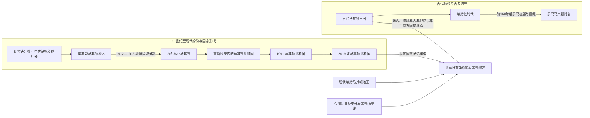

# 古代马其顿与现代国家名称辨析

## 概括

“马其顿”至少涉及古代王国、跨国历史地理区域、现代马其顿民族与语言、南斯拉夫时期共和国，以及当代北马其顿国家五个层次。它们之间存在地名、空间和记忆联系，但不能画成单一血缘或国家法统的直线继承。

## 双线关系图

## 五个层次

| 层次 | 时间与范围 | 说明 |
|---|---|---|
| 古代马其顿王国 | 主要为公元前1千纪，核心在今希腊北部 | 腓力二世、亚历山大三世所属古代王国；边界随扩张变化。 |
| 罗马与拜占庭“马其顿” | 古代晚期至中世纪 | 行省和军区名称曾覆盖不同空间，不能等同现代地理区域。 |
| 历史地理马其顿 | 奥斯曼晚期以来常用 | 大致跨今希腊、北马其顿、保加利亚及阿尔巴尼亚部分地区，没有唯一不变边界。 |
| 现代马其顿民族与语言 | 主要在19—20世纪制度化 | 属南斯拉夫语言文化方向，标准语言于社会主义南斯拉夫时期规范化。 |
| 北马其顿共和国 | 1991年独立，2019年采用现国名 | 现代主权国家，只覆盖历史地理马其顿的一部分。 |

## 为什么不能画成直系继承

1. 古代王国终结后，地区经历罗马、拜占庭、中世纪保加利亚和塞尔维亚政权、奥斯曼帝国及现代民族国家重组。
2. 6—7世纪斯拉夫迁徙与古代马其顿王国之间相隔多个历史阶段，人口和语言结构显著变化。
3. 现代民族身份通过语言标准化、教育、教会、政治运动和共和国制度形成，不是古代王族血缘的自然延续。
4. 现代希腊、北马其顿和保加利亚等社会都与马其顿地区历史相连，遗产共享不等于主权或民族来源具有排他性。
5. 《普雷斯帕协议》通过区分古代希腊遗产与现代北马其顿的语言和公民身份，解决的是国家命名与外交争端，不是为全部历史争议作唯一结论。

## 术语使用

- 写古典时代时使用“古代马其顿王国”。
- 写跨国空间时使用“历史地理马其顿”或说明爱琴、瓦尔达尔、皮林等分区。
- 写现代民族和语言时使用“马其顿民族”“马其顿语”。
- 写国家时按时期使用“马其顿共和国”或“北马其顿共和国”。

## 相关笔记

- [北马其顿历史](/%E4%BA%BA%E6%96%87%E7%A7%91%E5%AD%A6/%E5%8E%86%E5%8F%B2/%E6%AC%A7%E6%B4%B2/%E4%B8%9C%E5%8D%97%E6%AC%A7%E4%B8%8E%E5%B7%B4%E5%B0%94%E5%B9%B2/%E5%8C%97%E9%A9%AC%E5%85%B6%E9%A1%BF/README.md)
- [古代马其顿与罗马—拜占庭时期](/%E4%BA%BA%E6%96%87%E7%A7%91%E5%AD%A6/%E5%8E%86%E5%8F%B2/%E6%AC%A7%E6%B4%B2/%E4%B8%9C%E5%8D%97%E6%AC%A7%E4%B8%8E%E5%B7%B4%E5%B0%94%E5%B9%B2/%E5%8C%97%E9%A9%AC%E5%85%B6%E9%A1%BF/%E5%8F%A4%E4%BB%A3%E9%A9%AC%E5%85%B6%E9%A1%BF%E4%B8%8E%E7%BD%97%E9%A9%AC%E2%80%94%E6%8B%9C%E5%8D%A0%E5%BA%AD%E6%97%B6%E6%9C%9F.md)
- [斯拉夫迁徙与中世纪马其顿地区](/%E4%BA%BA%E6%96%87%E7%A7%91%E5%AD%A6/%E5%8E%86%E5%8F%B2/%E6%AC%A7%E6%B4%B2/%E4%B8%9C%E5%8D%97%E6%AC%A7%E4%B8%8E%E5%B7%B4%E5%B0%94%E5%B9%B2/%E5%8C%97%E9%A9%AC%E5%85%B6%E9%A1%BF/%E6%96%AF%E6%8B%89%E5%A4%AB%E8%BF%81%E5%BE%99%E4%B8%8E%E4%B8%AD%E4%B8%96%E7%BA%AA%E9%A9%AC%E5%85%B6%E9%A1%BF%E5%9C%B0%E5%8C%BA.md)
- [保加利亚历史](/%E4%BA%BA%E6%96%87%E7%A7%91%E5%AD%A6/%E5%8E%86%E5%8F%B2/%E6%AC%A7%E6%B4%B2/%E4%B8%9C%E5%8D%97%E6%AC%A7%E4%B8%8E%E5%B7%B4%E5%B0%94%E5%B9%B2/%E4%BF%9D%E5%8A%A0%E5%88%A9%E4%BA%9A/README.md)
- [塞尔维亚历史](/%E4%BA%BA%E6%96%87%E7%A7%91%E5%AD%A6/%E5%8E%86%E5%8F%B2/%E6%AC%A7%E6%B4%B2/%E4%B8%9C%E5%8D%97%E6%AC%A7%E4%B8%8E%E5%B7%B4%E5%B0%94%E5%B9%B2/%E5%A1%9E%E5%B0%94%E7%BB%B4%E4%BA%9A/README.md)
- [希腊历史](/%E4%BA%BA%E6%96%87%E7%A7%91%E5%AD%A6/%E5%8E%86%E5%8F%B2/%E6%AC%A7%E6%B4%B2/%E4%B8%9C%E5%8D%97%E6%AC%A7%E4%B8%8E%E5%B7%B4%E5%B0%94%E5%B9%B2/%E5%B8%8C%E8%85%8A.md)
