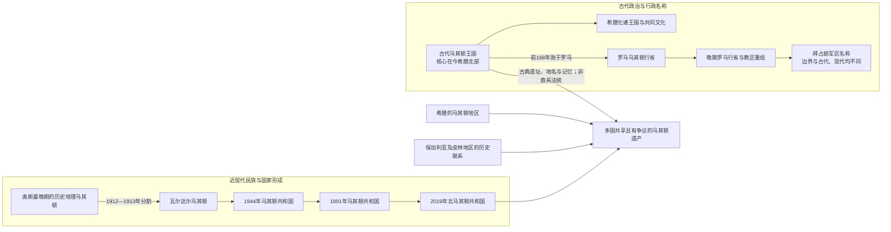

# 古代马其顿与现代国家名称辨析

## 概括

“马其顿”不是一个从古代到现代始终不变的国家名称。它至少可以指古代马其顿王国、罗马和拜占庭时期名称不断变化的行政区、奥斯曼晚期被重新界定的历史地理区域、19—20世纪形成的现代马其顿民族与语言、1944年成立的南斯拉夫联邦共和国，以及1991年独立、2019年更名的北马其顿共和国。它们存在空间、地名与记忆联系，却没有一条连续两千余年的王朝、制度或人口谱系。

## 六个必须分开的层次

| 层次 | 大致时间与范围 | 应如何理解 |
|---|---|---|
| 古代马其顿王国 | 约前7世纪—前168年；核心在今希腊北部 | 阿吉德、安提帕特和安提柯诸王朝的古代君主国，腓力二世与亚历山大三世时期一度扩张为跨洲帝国。 |
| 现代国土上的古代地区 | 公元前1千纪 | 今北马其顿大部与佩奥尼亚、达尔达尼亚、上马其顿诸区有关；只有南部和西南部分与古王国边缘交叠。 |
| 罗马—拜占庭行政名称 | 前2世纪—中世纪 | “马其顿行省”“马其顿教区”“马其顿军区”边界多次移动；拜占庭马其顿军区甚至以色雷斯为核心，不能据名称等同今日马其顿。 |
| 历史地理马其顿 | 主要在19世纪“东方问题”语境中定型 | 通常包括今希腊北部、北马其顿、保加利亚西南部以及阿尔巴尼亚、塞尔维亚的部分地区，没有一条跨时代不变边界。 |
| 现代马其顿民族与标准语言 | 19世纪后期至20世纪制度化 | 在南斯拉夫语支方言连续体、教会学校竞争、革命运动和南斯拉夫共和国制度中形成；1945年完成标准语规范化。 |
| 北马其顿共和国 | 1944年具共和国制度，1991年独立，2019年采用现国名 | 当代主权国家，领土大致对应历史地理马其顿的瓦尔达尔部分，是社会主义马其顿共和国的法律继承者。 |

## 古代王国为何不等于现代国家

### 领土与中心不同

古代马其顿王国的早期核心是下马其顿平原，主要位于今希腊的埃泽萨、佩拉和塞萨洛尼基周边。今天北马其顿的斯科普里在古代属于达尔达尼亚—佩奥尼亚交界体系，斯托比位于佩奥尼亚南部交通节点，奥赫里德周边则与林凯斯提斯、达萨雷提亚等区域相连。腓力二世的扩张使部分现代北马其顿领土进入王国势力范围，但扩张期边界不能倒推为现代国界。

### 人口、语言与制度发生断裂性重组

古王国覆亡后，地区历经罗马征服、拉丁语和希腊语行政文化、基督教化、晚期古代城市衰退、6—7世纪斯拉夫迁徙、中世纪保加利亚与拜占庭统治、塞尔维亚扩张以及奥斯曼征服。现代马其顿语属于南斯拉夫语支，与古代马其顿社会之间不存在可证明的连续国家语言链。现代居民当然可能承继本地古代人口的部分生物与文化遗产，但这种广泛的区域连续性不能转化为排他的国家法统。

### “同名”不等于“同一实体”

罗马人把被征服地区组织为马其顿行省；戴克里先改革后又形成多个省和马其顿教区。拜占庭约9世纪设置的“马其顿军区”核心却在阿德里安堡一带的色雷斯。行政单位沿用一个著名地名，常是帝国分类传统，并不证明边界、居民或政治共同体连续。

## 现代民族与国家如何形成

- **语言基础**：瓦尔达尔地区的南斯拉夫方言与今保加利亚西部、希腊北部斯拉夫方言构成连续体。19世纪活动者对标准语中心和民族归属提出不同方案。
- **教会与学校竞争**：君士坦丁堡普世牧首区、1870年后保加利亚督主教区、塞尔维亚教育网络及天主教、传教体系，使宗教管辖、教学语言与民族认同逐渐绑定。
- **革命政治**：马其顿内部革命组织中的自治主义、保加利亚民族取向、地方联邦主义及后来独立马其顿方案并存，不能用单一现代标签覆盖所有成员。
- **战争与边界**：1913年分割后，瓦尔达尔、爱琴和皮林三部分分别进入不同国家。新边界通过学校、军役、土地与人口政策制造不同制度经验。
- **共和国制度**：1944年ASNOM把马其顿民族、语言和联邦共和国写入国家制度；1945年的字母与正字法、此后的教育、媒体、大学和科学院才构成现代标准文化基础。
- **主权国家**：1991年独立不是古代王国“复国”，而是南斯拉夫联邦共和国依宪政与公投转化为主权国家。

## 国名争议的具体内容

希腊在1991年后担忧“马其顿共和国”这一名称及宪法、地图和象征可能暗示对希腊马其顿地区的历史垄断或领土要求。1993年新国家以“前南斯拉夫的马其顿共和国”这一临时指称加入联合国；1995年临时协议后修改旗帜并强化无领土要求的宪法保证。与此同时，许多国家在双边关系中承认其宪法国名。

2018年《普雷斯帕协议》采用“北马其顿共和国”作为对内对外通用国名，并确认其公民身份和语言使用“马其顿”名称；协议同时将现代马其顿语言文化置于南斯拉夫传统中，与古代希腊文明遗产作出区分。2018年咨询性公投赞成票占多数但投票率未达法定门槛，国会随后以宪法修正完成更名，协议在希腊批准后于2019年生效。它解决国家名称和双边制度障碍，并未消除所有社会记忆分歧。

## 与保加利亚争议应另行区分

保加利亚首先承认新国家的独立，却长期对“马其顿民族和语言是与保加利亚完全无关的古老独立连续体”等叙事持异议。双方围绕共同历史人物、第二次世界大战用语、语言称谓与少数群体权利发生争论。2017年友好条约和联合历史委员会尝试处理争议；此后欧盟谈判框架把宪法承认保加利亚人等条件纳入入盟进程。此争议不同于希腊国名争议，不应合并为同一个问题。

## 常见误写与修正

| 容易误写 | 更准确的表述 |
|---|---|
| “亚历山大大帝建立了今天的北马其顿” | 亚历山大三世统治古代马其顿王国；其核心与首都在今希腊北部，当代北马其顿是20世纪形成的国家。 |
| “斯拉夫人是古代马其顿人的直接后代” | 6—7世纪斯拉夫迁徙与既有人群融合，现代民族形成还经历一千余年的政治、宗教和语言制度变化。 |
| “罗马和拜占庭始终维持同一个马其顿省” | 行省、教区和军区名称及边界多次改变，其中一些单位并不覆盖今日马其顿。 |
| “1913年三个国家瓜分了既存的马其顿民族国家” | 被分割的是奥斯曼统治下的历史地理区域，当时不存在统一主权马其顿国家。 |
| “2019年更名取消了马其顿民族和语言” | 更改的是国家宪法国名；协议继续使用马其顿语和马其顿公民身份称谓。 |
| “所有IMRO成员都追求同一现代国家” | 组织在不同阶段包含自治、合并保加利亚、巴尔干联邦及独立等相互竞争方向。 |

## 使用术语的原则

1. 古典时代写“古代马其顿王国”或具体王朝，不单写“马其顿”后直接连接现代国家。
2. 跨越今天数国的空间写“历史地理马其顿”，并在需要时注明瓦尔达尔、爱琴或皮林部分。
3. 1944—1991年按时段写“民主联邦马其顿”“马其顿人民共和国”或“马其顿社会主义共和国”。
4. 1991—2019年写“马其顿共和国”；2019年后写“北马其顿共和国”。
5. 对中世纪萨穆伊尔政权、奥赫里德传统和近代革命者，说明同时存在保加利亚、马其顿及其他史学解释，不以现代国籍替代当时人的政治语境。

## 相关笔记

- [北马其顿历史](/%E4%BA%BA%E6%96%87%E7%A7%91%E5%AD%A6/%E5%8E%86%E5%8F%B2/%E6%AC%A7%E6%B4%B2/%E4%B8%9C%E5%8D%97%E6%AC%A7%E4%B8%8E%E5%B7%B4%E5%B0%94%E5%B9%B2/%E5%8C%97%E9%A9%AC%E5%85%B6%E9%A1%BF/README.md)
- [古代马其顿与罗马—拜占庭时期](/%E4%BA%BA%E6%96%87%E7%A7%91%E5%AD%A6/%E5%8E%86%E5%8F%B2/%E6%AC%A7%E6%B4%B2/%E4%B8%9C%E5%8D%97%E6%AC%A7%E4%B8%8E%E5%B7%B4%E5%B0%94%E5%B9%B2/%E5%8C%97%E9%A9%AC%E5%85%B6%E9%A1%BF/%E5%8F%A4%E4%BB%A3%E9%A9%AC%E5%85%B6%E9%A1%BF%E4%B8%8E%E7%BD%97%E9%A9%AC%E2%80%94%E6%8B%9C%E5%8D%A0%E5%BA%AD%E6%97%B6%E6%9C%9F.md)
- [斯拉夫迁徙与中世纪马其顿地区](/%E4%BA%BA%E6%96%87%E7%A7%91%E5%AD%A6/%E5%8E%86%E5%8F%B2/%E6%AC%A7%E6%B4%B2/%E4%B8%9C%E5%8D%97%E6%AC%A7%E4%B8%8E%E5%B7%B4%E5%B0%94%E5%B9%B2/%E5%8C%97%E9%A9%AC%E5%85%B6%E9%A1%BF/%E6%96%AF%E6%8B%89%E5%A4%AB%E8%BF%81%E5%BE%99%E4%B8%8E%E4%B8%AD%E4%B8%96%E7%BA%AA%E9%A9%AC%E5%85%B6%E9%A1%BF%E5%9C%B0%E5%8C%BA.md)
- [奥斯曼统治下的马其顿地区](/%E4%BA%BA%E6%96%87%E7%A7%91%E5%AD%A6/%E5%8E%86%E5%8F%B2/%E6%AC%A7%E6%B4%B2/%E4%B8%9C%E5%8D%97%E6%AC%A7%E4%B8%8E%E5%B7%B4%E5%B0%94%E5%B9%B2/%E5%8C%97%E9%A9%AC%E5%85%B6%E9%A1%BF/%E5%A5%A5%E6%96%AF%E6%9B%BC%E7%BB%9F%E6%B2%BB%E4%B8%8B%E7%9A%84%E9%A9%AC%E5%85%B6%E9%A1%BF%E5%9C%B0%E5%8C%BA.md)
- [独立、国名争议与北马其顿](/%E4%BA%BA%E6%96%87%E7%A7%91%E5%AD%A6/%E5%8E%86%E5%8F%B2/%E6%AC%A7%E6%B4%B2/%E4%B8%9C%E5%8D%97%E6%AC%A7%E4%B8%8E%E5%B7%B4%E5%B0%94%E5%B9%B2/%E5%8C%97%E9%A9%AC%E5%85%B6%E9%A1%BF/%E7%8B%AC%E7%AB%8B%E3%80%81%E5%9B%BD%E5%90%8D%E4%BA%89%E8%AE%AE%E4%B8%8E%E5%8C%97%E9%A9%AC%E5%85%B6%E9%A1%BF.md)
