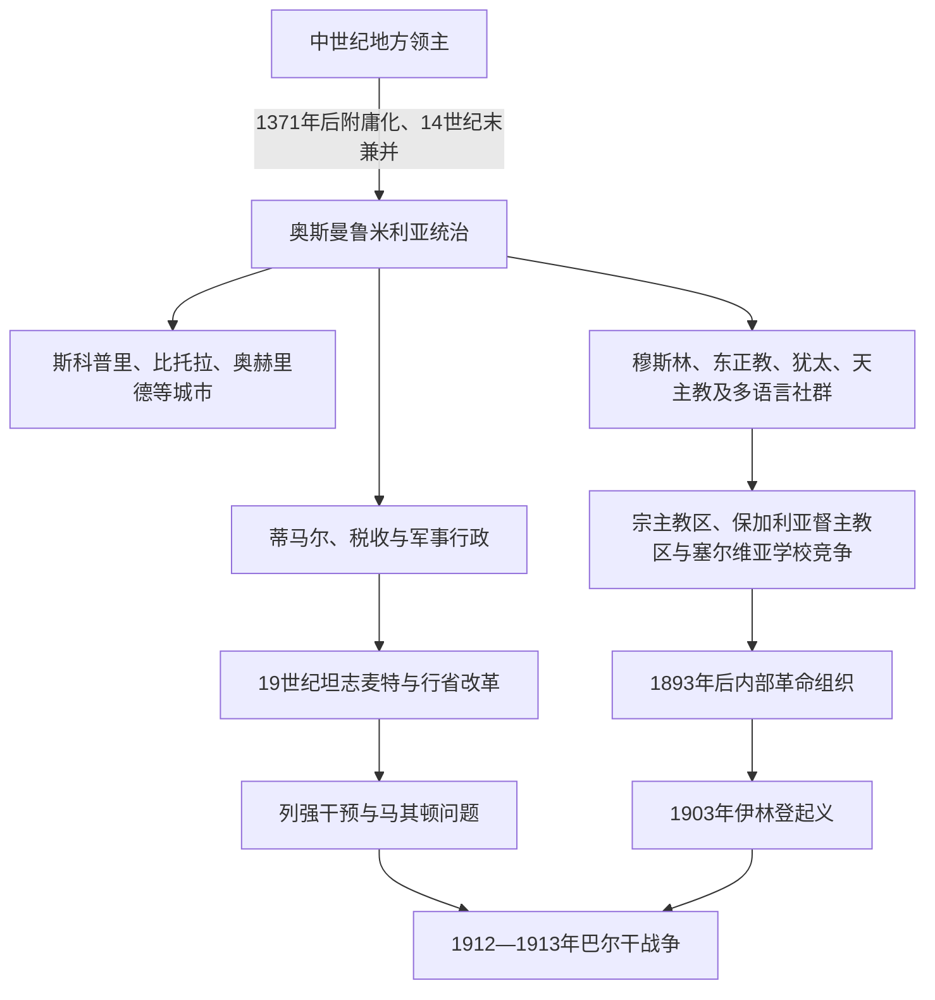

# 奥斯曼统治下的马其顿地区

## 时间

14世纪末—1912年

## 概括

奥斯曼在14世纪末至15世纪初逐步征服今日北马其顿地区，并将其纳入鲁米利亚的军政、税收、交通和宗教秩序。斯科普里、比托拉、奥赫里德、什蒂普和韦莱斯等地成为市场、驻军、手工业与宗教中心；农村则以村社、庄园、牧业和山区交通为主。帝国并未设置一座边界等同“历史地理马其顿”的固定行省。19世纪行政改革、保加利亚—希腊—塞尔维亚教会学校竞争及革命组织活动，才把“马其顿问题”推到国际政治中心。

## 征服与行政整合

1371年马里查河战役后，普里莱普、德亚诺维奇等领主先承认奥斯曼宗主权、纳贡并提供军队。斯科普里约于1392年被占领，1395年马尔科和康斯坦丁·德拉加什作为奥斯曼附庸战死后，其领地被直接兼并；奥赫里德及西部山区的控制则在随后数十年逐步巩固。征服过程包含战役、附庸化、贵族改宗或迁移、土地登记和要塞驻军，不能简化为单一日期。

### 行政层级

“马其顿”在奥斯曼时代主要是地理称呼，而非始终存在的正式行省。今日北马其顿各地在不同时期分属斯科普里、奥赫里德、克斯滕迪尔等桑贾克，19世纪行省改革后又分别进入科索沃、莫纳斯提尔和塞萨洛尼基等维拉耶特。比托拉在奥斯曼文献中常称莫纳斯提尔，19世纪成为第三军团驻地和维拉耶特首府；斯科普里则是科索沃维拉耶特后期重要行政中心。

| 层级或机构 | 功能 | 地方影响 |
|---|---|---|
| 贝勒贝伊辖区、维拉耶特 | 统辖大区军政与改革官僚 | 边界随战争和改革变化，没有固定“马其顿省”。 |
| 桑贾克 | 军事、税收与司法的中层单位 | 斯科普里、奥赫里德等桑贾克联系城镇与乡村。 |
| 卡扎、纳希耶 | 法官辖区和基层行政 | 卡迪处理民刑纠纷、契约、遗产和市场监管。 |
| 蒂马尔 | 以税收收益供养骑兵及官员 | 并非土地私有；17世纪后税农和庄园化增多。 |
| 宗教共同体与教会 | 婚姻、教育、慈善和身份组织 | 法律地位不平等，但非穆斯林共同体保有内部制度。 |
| 瓦克夫 | 清真寺、学校、桥梁、浴场和济贫基金 | 支撑城市建设，也将财产固定在宗教公益网络。 |

## 城市、乡村与交通

### 斯科普里

斯科普里位于瓦尔达尔河谷与科索沃—爱琴海道路交汇处，征服后发展为重要商城和行政中心。清真寺、驿站、浴场、桥梁和巴扎由官员及瓦克夫资助；石桥连接河两岸，旧巴扎汇集皮革、金属、纺织和区域贸易。1689年哈布斯堡将领皮科洛米尼一度占领并焚烧城市，传统解释称为遏制瘟疫，军事惩罚和撤退策略也可能同时存在。战乱与疫病使城市衰退，18—19世纪再度恢复。

### 比托拉与奥赫里德

比托拉控制佩拉戈尼亚平原，是商路、军营和谷物市场中心。19世纪设第三军团总部，多国领事馆集中，因而有“领事之城”之称；军校也是奥斯曼晚期新式精英培养机构。奥赫里德以湖区贸易、手工业和东正教机构著称，奥赫里德总主教区在奥斯曼庇护与财政约束下延续，直到1767年被撤销并并入君士坦丁堡普世牧首区。

### 乡村社会

大多数人口生活在村庄。低地种植谷物、烟草、棉花和葡萄，山区经营牧业、林业与季节性迁徙。基督徒农民、穆斯林农民和不同语言社区并非严格按地域分开。17—18世纪税农制扩张和奇夫利克庄园化，使部分农民失去稳定使用权、承担更重租税；山区也存在较强村社自治、武装护卫和逃税空间。治安恶化时，海杜克、地方武装和商旅保护网络并存，官方叙事中的“匪徒”可能在民间记忆中成为反抗英雄。

## 宗教与多语言社群

奥斯曼社会以宗教法地位区分臣民，而现代民族分类尚未固定。城市和乡村可见土耳其语或阿尔巴尼亚语穆斯林、斯拉夫语东正教徒、希腊语教育群体、瓦拉几人、罗姆人、犹太人及天主教徒。15世纪末伊比利亚犹太人被驱逐后，塞法迪犹太社群在塞萨洛尼基、比托拉和斯科普里等城市发展，使用拉迪诺语并参与纺织、贸易和医药。

伊斯兰化程度因地区、阶层和时代而异。城市官员、军人和手工业者中穆斯林比例较高，西部部分阿尔巴尼亚语人口和斯拉夫语群体也在数世纪中改宗；原因包括社会流动、税负、婚姻、地方保护和苏菲网络，不能简单写成全部由强迫完成。东正教徒需承担额外税赋并受地位限制，但教会、修道院和村社仍保存财产、礼仪和教育。

## 17—18世纪的危机与地方化

长期战争、货币贬值、税收外包和中央军制转型削弱传统蒂马尔体系。地方阿扬、军人、商人和大庄园主掌握税源与武装，中央往往通过谈判维系统治。

- 1683—1699年大土耳其战争把哈布斯堡军队带入巴尔干内陆。
- 1689年卡尔波什起义在库马诺沃、克里瓦帕兰卡一带响应哈布斯堡推进；奥斯曼反攻后迅速镇压，卡尔波什被处死。
- 18世纪商路恢复，奥赫里德、克鲁舍沃和比托拉的商人、工匠与瓦拉几网络连接多瑙河、亚得里亚海和爱琴海市场。
- 西部受斯库台和亚尼纳等地方强人影响，中央在19世纪才以军事改革重新压制半自主势力。
- 1767年奥赫里德总主教区被撤销，地方教会改由普世牧首区管理，后来成为语言与教会自主竞争的重要历史背景。

## 坦志麦特改革与近代社会

1839年《玫瑰园敕令》和1856年改革敕令宣布改善生命财产安全、税役制度及非穆斯林法律地位；1864年后维拉耶特制引入省议会、专业官僚和较统一的行政层级。铁路于19世纪后期连接斯科普里、韦莱斯、比托拉与塞萨洛尼基，扩大烟草、谷物和牲畜贸易，也让军队更快调动。

改革效果并不一致：

- 正式平等扩大基督徒精英参与，却使宗教共同体更加围绕学校、语言和代表席位竞争。
- 新税制和征兵试图直接接触个人，削弱中介，但腐败、欠税和地方暴力依旧。
- 世界市场刺激商品农业，土地集中和债务同时增加。
- 新式学校、印刷品、铁路与领事馆传播民族政治，却没有立刻消除地方和宗教身份。

## 教会、学校与民族竞争

1870年奥斯曼承认保加利亚督主教区。一个教区选择普世牧首区还是督主教区，不仅是神学问题，也逐渐被解释为希腊或保加利亚民族归属。保加利亚学校以当地斯拉夫语和标准保加利亚语教学；希腊网络依托牧首区、城市商人和希腊语高等文化；塞尔维亚自19世纪后期资助教师、教士和奖学金，主张当地斯拉夫人属于塞尔维亚民族。罗马尼亚支持瓦拉几学校，天主教和新教传教士亦有活动。

1877—1878年俄土战争后，《圣斯特凡诺条约》设想的大保加利亚包括马其顿大部，但旋即被《柏林条约》取消。条约把地区留在奥斯曼统治下，改革承诺又迟迟未落实，造成强烈失望。此后保加利亚、希腊和塞尔维亚组织以教会、学校、领事和武装队争夺村庄；居民的选择有时出于语言认同，有时取决于安全、土地纠纷、亲族与谁能提供教师或武装保护。

## 革命组织与伊林登起义

### 内部组织的形成

1893年，一批教师和知识分子在塞萨洛尼基建立秘密组织，后经多次改名，通常概称马其顿内部革命组织。它通过村级委员会、信使、筹款和武装队建立地下网络，早期纲领多要求马其顿与阿德里安堡地区自治。成员中既有把自治视为最终目标者，也有把它视为通向与保加利亚统一的阶段者，以及倾向巴尔干联邦和地方独立者。设于索非亚、试图从外部发动行动的“最高委员会”与内部组织时而合作、时而冲突，不宜统称为一个方向。

1902年戈尔诺朱马亚起义准备不足并迅速失败，促使内部组织就是否全面起义发生争论。1903年春塞萨洛尼基爆炸行动引来镇压；同年斯米莱沃代表大会决定比托拉革命区起义。

### 1903年伊林登起义过程

- 8月2日即圣以利亚日，武装队袭击驻军、铁路和行政据点，起义以比托拉维拉耶特山地最强。
- 克鲁舍沃起义者短暂控制城镇，建立约十天的革命行政，后世称“克鲁舍沃共和国”；其宣言试图号召不同宗教居民共同反抗，但实际动员和冲突仍受地方关系影响。
- 奥斯曼调集正规军和非正规武装反攻，克鲁舍沃失守，大批村庄被焚，平民死亡、流离失所或逃往保加利亚。
- 色雷斯的普雷奥布拉日涅起义与伊林登相关，但发生在阿德里安堡地区，不能全部算作今日北马其顿的地方事件。
- 起义未能获得列强军事干预，也未建立持续根据地，到秋季基本失败。

### 失败原因与长期影响

**结构因素**包括组织地区发展不均、武器与补给不足、不同革命路线分裂，且多族群城市和部分村庄并未统一响应。**外部压力**是奥斯曼仍能调动远超起义军的正规军，列强只愿推动有限改革而不支持边界革命。**直接触发因素**则是镇压压力和地方组织担忧网络被破坏，促使部分领导在准备不足时发动起义。

失败后，俄国与奥匈推动1903年米尔茨施泰格改革，由外国军官监督宪兵和行政改良，但列强竞争、奥斯曼抵制和地方武装冲突使成效有限。伊林登成为北马其顿国家纪念、保加利亚革命传统及左翼联邦主义等多种叙事共享的象征，纪念的重叠正说明当时身份并非现代边界下的单一归属。

## 青年土耳其革命与奥斯曼统治终结

1908年青年土耳其革命从马其顿驻军和萨洛尼卡政治网络扩散，恢复宪法。许多革命者一度合法化并参加选举，希望自治诉求能在议会内解决。联合进步委员会随后加强中央集权、推行缴械和统一公民政策，民族组织与政府关系再次恶化。1910年阿尔巴尼亚起义及1912年大规模反抗动摇西部秩序；周边巴尔干国家同时建立反奥斯曼同盟。

### 结构因素

- 帝国改革提高国家渗透，却未解决税负、土地、代表权和民族教育冲突。
- 教会学校与跨境武装把村庄安全纳入邻国竞争，行政合法性持续流失。
- 财政困难、军队政治化和青年军官派系斗争削弱中央协调。

### 外部压力

俄国、奥匈、英国等列强把马其顿作为东方问题筹码；保加利亚、塞尔维亚、希腊和黑山则直接准备瓜分奥斯曼欧洲领土。铁路让奥斯曼能调兵，也让邻国军队可沿现代交通线推进。

### 直接灭亡过程

1912年10月第一次巴尔干战争爆发。塞尔维亚军在库马诺沃战役击败奥斯曼瓦尔达尔军团，随后占领斯科普里和比托拉方向；希腊军从南控制塞萨洛尼基，保加利亚军在色雷斯推进。1913年伦敦和布加勒斯特安排终结奥斯曼在马其顿的长期统治，并把地理区域分给邻国。帝国统治结束并未解决民族问题，而是把同一地区转化为多个国家的少数群体与边界问题。

## 重要事件

| 时间 | 事件 | 结果与影响 |
|---|---|---|
| 1392年前后 | 斯科普里被奥斯曼占领 | 瓦尔达尔河谷核心进入直接统治。 |
| 1395年 | 马尔科、康斯坦丁战死 | 附庸领地被兼并，区域征服进一步完成。 |
| 1689年 | 哈布斯堡占领斯科普里与卡尔波什起义 | 奥斯曼反攻镇压，城市和北部乡村遭重创。 |
| 1767年 | 奥赫里德总主教区撤销 | 地方教会转归普世牧首区，为19世纪教会竞争埋下背景。 |
| 1839、1856年 | 坦志麦特改革敕令 | 法律平等和中央官僚化推进，但地方执行不均。 |
| 1870年 | 保加利亚督主教区成立 | 教区、学校和民族归属竞争制度化。 |
| 1878年 | 柏林会议维持奥斯曼统治 | 改革落空加剧革命与邻国干预。 |
| 1893年 | 内部革命组织成立 | 地下自治运动在马其顿地区建立网络。 |
| 1903年 | 伊林登起义 | 军事失败但形成持续的跨国历史记忆，并促成有限国际改革。 |
| 1908年 | 青年土耳其革命 | 短暂开放后转向中央集权，自治期待破灭。 |
| 1912年 | 库马诺沃战役和第一次巴尔干战争 | 今日北马其顿地区脱离奥斯曼统治，进入塞尔维亚军政控制。 |

## 演变关系

- 前一阶段：[斯拉夫迁徙与中世纪马其顿地区](/%E4%BA%BA%E6%96%87%E7%A7%91%E5%AD%A6/%E5%8E%86%E5%8F%B2/%E6%AC%A7%E6%B4%B2/%E4%B8%9C%E5%8D%97%E6%AC%A7%E4%B8%8E%E5%B7%B4%E5%B0%94%E5%B9%B2/%E5%8C%97%E9%A9%AC%E5%85%B6%E9%A1%BF/%E6%96%AF%E6%8B%89%E5%A4%AB%E8%BF%81%E5%BE%99%E4%B8%8E%E4%B8%AD%E4%B8%96%E7%BA%AA%E9%A9%AC%E5%85%B6%E9%A1%BF%E5%9C%B0%E5%8C%BA.md)
- 后一阶段：[巴尔干战争、塞尔维亚统治与战间期](/%E4%BA%BA%E6%96%87%E7%A7%91%E5%AD%A6/%E5%8E%86%E5%8F%B2/%E6%AC%A7%E6%B4%B2/%E4%B8%9C%E5%8D%97%E6%AC%A7%E4%B8%8E%E5%B7%B4%E5%B0%94%E5%B9%B2/%E5%8C%97%E9%A9%AC%E5%85%B6%E9%A1%BF/%E5%B7%B4%E5%B0%94%E5%B9%B2%E6%88%98%E4%BA%89%E3%80%81%E5%A1%9E%E5%B0%94%E7%BB%B4%E4%BA%9A%E7%BB%9F%E6%B2%BB%E4%B8%8E%E6%88%98%E9%97%B4%E6%9C%9F.md)
- 帝国主线：[奥斯曼帝国](/%E4%BA%BA%E6%96%87%E7%A7%91%E5%AD%A6/%E5%8E%86%E5%8F%B2/%E8%A5%BF%E4%BA%9A/%E5%9C%9F%E8%80%B3%E5%85%B6/%E5%A5%A5%E6%96%AF%E6%9B%BC%E5%B8%9D%E5%9B%BD/README.md)
- 名称辨析：[古代马其顿与现代国家名称辨析](/%E4%BA%BA%E6%96%87%E7%A7%91%E5%AD%A6/%E5%8E%86%E5%8F%B2/%E6%AC%A7%E6%B4%B2/%E4%B8%9C%E5%8D%97%E6%AC%A7%E4%B8%8E%E5%B7%B4%E5%B0%94%E5%B9%B2/%E5%8C%97%E9%A9%AC%E5%85%B6%E9%A1%BF/%E5%8F%A4%E4%BB%A3%E9%A9%AC%E5%85%B6%E9%A1%BF%E4%B8%8E%E7%8E%B0%E4%BB%A3%E5%9B%BD%E5%AE%B6%E5%90%8D%E7%A7%B0%E8%BE%A8%E6%9E%90.md)
- 全史入口：[北马其顿历史](/%E4%BA%BA%E6%96%87%E7%A7%91%E5%AD%A6/%E5%8E%86%E5%8F%B2/%E6%AC%A7%E6%B4%B2/%E4%B8%9C%E5%8D%97%E6%AC%A7%E4%B8%8E%E5%B7%B4%E5%B0%94%E5%B9%B2/%E5%8C%97%E9%A9%AC%E5%85%B6%E9%A1%BF/README.md)
