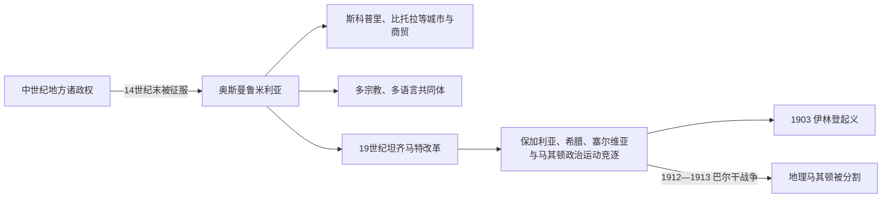

# 奥斯曼统治下的马其顿地区

## 时间

14世纪末—1912年

## 概括

奥斯曼征服后，马其顿地区进入鲁米利亚行政、交通与商业网络。斯科普里、比托拉等城市连接巴尔干内陆与爱琴海，穆斯林、东正教徒、犹太人、罗姆人及多种语言人群并存。19世纪帝国改革和周边民族运动把教会、学校与武装组织变成竞争核心。

## 演进图

## 历史过程

- 奥斯曼把地区纳入鲁米利亚，行政边界随时期变化；“马其顿”长期更像地理和文化名称，而非固定行省。
- 城镇中的穆斯林、斯拉夫语和希腊语东正教徒、阿尔巴尼亚人、土耳其人、瓦拉几人、犹太人、罗姆人等形成复杂社会。
- 交通、市场、手工业和宗教基金推动城市发展，山区、乡村和边境的治理方式则差异明显。
- 19世纪保加利亚督主教区、希腊宗主教区、塞尔维亚和其他教育网络争夺学校、教会和地方认同。
- 马其顿内部革命组织等团体追求自治或不同国家方案；1903年伊林登起义被镇压，却成为后世多种民族叙事的重要记忆。
- 巴尔干战争结束奥斯曼长期统治，地理马其顿被塞尔维亚、希腊、保加利亚及阿尔巴尼亚方向分割。

## 关键辨析

- 奥斯曼统治时期不存在覆盖今日边界的“北马其顿国家”。
- 19世纪居民的宗教、语言、地方和民族认同可能重叠或变化，不能将后来国籍机械投射到所有人。
- 革命组织内部对自治、统一和归属存在分歧，不能写成单一现代国家运动。

## 演变关系

- 前一节点：[斯拉夫迁徙与中世纪马其顿地区](/%E4%BA%BA%E6%96%87%E7%A7%91%E5%AD%A6/%E5%8E%86%E5%8F%B2/%E6%AC%A7%E6%B4%B2/%E4%B8%9C%E5%8D%97%E6%AC%A7%E4%B8%8E%E5%B7%B4%E5%B0%94%E5%B9%B2/%E5%8C%97%E9%A9%AC%E5%85%B6%E9%A1%BF/%E6%96%AF%E6%8B%89%E5%A4%AB%E8%BF%81%E5%BE%99%E4%B8%8E%E4%B8%AD%E4%B8%96%E7%BA%AA%E9%A9%AC%E5%85%B6%E9%A1%BF%E5%9C%B0%E5%8C%BA.md)
- 后一节点：[巴尔干战争、塞尔维亚统治与战间期](/%E4%BA%BA%E6%96%87%E7%A7%91%E5%AD%A6/%E5%8E%86%E5%8F%B2/%E6%AC%A7%E6%B4%B2/%E4%B8%9C%E5%8D%97%E6%AC%A7%E4%B8%8E%E5%B7%B4%E5%B0%94%E5%B9%B2/%E5%8C%97%E9%A9%AC%E5%85%B6%E9%A1%BF/%E5%B7%B4%E5%B0%94%E5%B9%B2%E6%88%98%E4%BA%89%E3%80%81%E5%A1%9E%E5%B0%94%E7%BB%B4%E4%BA%9A%E7%BB%9F%E6%B2%BB%E4%B8%8E%E6%88%98%E9%97%B4%E6%9C%9F.md)
- 帝国背景：[奥斯曼帝国](/%E4%BA%BA%E6%96%87%E7%A7%91%E5%AD%A6/%E5%8E%86%E5%8F%B2/%E8%A5%BF%E4%BA%9A/%E5%9C%9F%E8%80%B3%E5%85%B6/%E5%A5%A5%E6%96%AF%E6%9B%BC%E5%B8%9D%E5%9B%BD/README.md)
