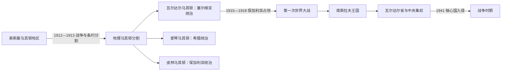

# 巴尔干战争、塞尔维亚统治与战间期

## 时间

1912年—1941年

## 概括

巴尔干战争结束奥斯曼统治后，地理马其顿被分割。现代北马其顿大体对应的瓦尔达尔地区进入塞尔维亚王国，1918年后成为南斯拉夫王国的一部分。国家推行中央集权与塞尔维亚化政策，同时地方革命活动、社会改革和对身份的竞争持续存在。

## 演进图

## 历史过程

- 1913年《布加勒斯特条约》等安排把地理马其顿主要分给塞尔维亚、希腊和保加利亚；现代北马其顿国家只继承其中瓦尔达尔部分。
- 塞尔维亚当局将该地视为“南塞尔维亚”，推行行政整合、学校与语言政策，并压制保加利亚和马其顿取向的组织。
- 第一次世界大战期间保加利亚占领大部地区；战后瓦尔达尔地区进入塞尔维亚人、克罗地亚人和斯洛文尼亚人王国。
- 南斯拉夫王国把地区纳入中央集权体系，1929年后形成瓦尔达尔省。土地、人口迁徙、警察统治与有限现代化并行。
- 马其顿身份在高压和跨境政治中继续发展，但直到二战与社会主义联邦时期才获得共和国和标准语言制度。

## 关键辨析

- “马其顿分割”是地理区域的分割，不是一个既有统一马其顿民族国家被三国瓜分。
- 塞尔维亚王国、南斯拉夫王国与后来的社会主义南斯拉夫对马其顿身份采取不同政策，不能合并成同一种统治。
- 同一家庭或地方共同体可能因新边界、学校和迁徙被纳入不同国家身份。

## 演变关系

- 前一节点：[奥斯曼统治下的马其顿地区](/%E4%BA%BA%E6%96%87%E7%A7%91%E5%AD%A6/%E5%8E%86%E5%8F%B2/%E6%AC%A7%E6%B4%B2/%E4%B8%9C%E5%8D%97%E6%AC%A7%E4%B8%8E%E5%B7%B4%E5%B0%94%E5%B9%B2/%E5%8C%97%E9%A9%AC%E5%85%B6%E9%A1%BF/%E5%A5%A5%E6%96%AF%E6%9B%BC%E7%BB%9F%E6%B2%BB%E4%B8%8B%E7%9A%84%E9%A9%AC%E5%85%B6%E9%A1%BF%E5%9C%B0%E5%8C%BA.md)
- 后一节点：[战争时期与马其顿共和国](/%E4%BA%BA%E6%96%87%E7%A7%91%E5%AD%A6/%E5%8E%86%E5%8F%B2/%E6%AC%A7%E6%B4%B2/%E4%B8%9C%E5%8D%97%E6%AC%A7%E4%B8%8E%E5%B7%B4%E5%B0%94%E5%B9%B2/%E5%8C%97%E9%A9%AC%E5%85%B6%E9%A1%BF/%E6%88%98%E4%BA%89%E6%97%B6%E6%9C%9F%E4%B8%8E%E9%A9%AC%E5%85%B6%E9%A1%BF%E5%85%B1%E5%92%8C%E5%9B%BD.md)
- 共同国家：[南斯拉夫王国](/%E4%BA%BA%E6%96%87%E7%A7%91%E5%AD%A6/%E5%8E%86%E5%8F%B2/%E6%AC%A7%E6%B4%B2/%E4%B8%9C%E5%8D%97%E6%AC%A7%E4%B8%8E%E5%B7%B4%E5%B0%94%E5%B9%B2/%E5%8D%97%E6%96%AF%E6%8B%89%E5%A4%AB%E5%8E%86%E5%8F%B2/%E5%8D%97%E6%96%AF%E6%8B%89%E5%A4%AB%E7%8E%8B%E5%9B%BD.md)
