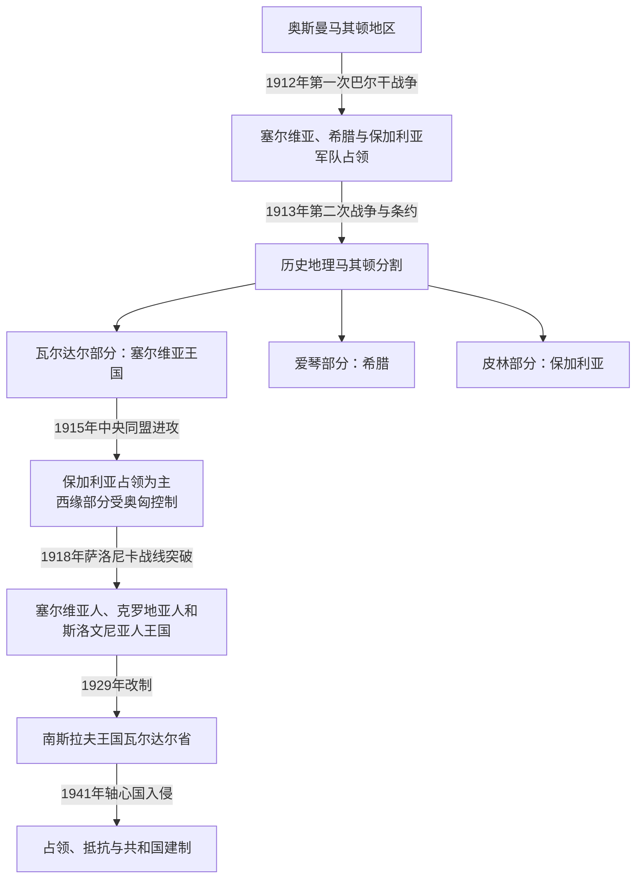

# 巴尔干战争、塞尔维亚统治与战间期

## 时间

1912年—1941年

## 概括

1912年第一次巴尔干战争结束奥斯曼在瓦尔达尔河流域的统治；1913年第二次战争和《布加勒斯特条约》把历史地理马其顿主要分为塞尔维亚控制的瓦尔达尔部分、希腊控制的爱琴部分和保加利亚控制的皮林部分。现代北马其顿大体从瓦尔达尔部分发展而来。塞尔维亚及其后的南斯拉夫王国把当地定义为“南塞尔维亚”，推行中央集权、学校与教会整合和殖民安置；第一次世界大战的保加利亚占领、战后IMRO袭击和国家镇压，又使身份与边界冲突长期军事化。

## 1912—1913年巴尔干战争与分割

### 第一次巴尔干战争

塞尔维亚、保加利亚、希腊和黑山组成巴尔干同盟，目标是夺取奥斯曼在欧洲的领土，但战前对马其顿的具体分配并无完整共识。塞尔维亚与保加利亚秘密条约划出若干“无争议区”和需由俄国仲裁的争议区；战争进程和列强建立阿尔巴尼亚，使塞尔维亚失去预期的亚得里亚海出口，进一步增强其保留瓦尔达尔地区的决心。

1912年10月23—24日，塞尔维亚第一集团军在库马诺沃击败奥斯曼瓦尔达尔集团军，随后进入斯科普里。11月莫纳斯提尔战役后，比托拉方向的奥斯曼主力崩溃。希腊军占领塞萨洛尼基，保加利亚军主攻色雷斯。奥斯曼行政迅速退出，但军队征用、报复、逃难和族群暴力伴随权力真空。

### 第二次巴尔干战争

保加利亚不满塞尔维亚和希腊拒绝按战前安排让出马其顿领土，于1913年6月进攻盟军。塞尔维亚与保加利亚军在布雷加尔尼察河一带激战，罗马尼亚和奥斯曼也乘机参战。保加利亚战败后，8月《布加勒斯特条约》确认：

| 分区 | 主要控制国 | 与今日国家的关系 |
|---|---|---|
| 瓦尔达尔马其顿 | 塞尔维亚王国 | 构成现代北马其顿领土主体。 |
| 爱琴马其顿 | 希腊王国 | 包括塞萨洛尼基及古代马其顿王国核心区。 |
| 皮林马其顿 | 保加利亚王国 | 主要对应今保加利亚布拉戈耶夫格勒州。 |
| 西部边缘 | 新成立的阿尔巴尼亚 | 边界把部分阿尔巴尼亚语共同体和奥赫里德—德巴尔经济区分开。 |

“分割”指奥斯曼统治下历史地理区域被纳入邻国，并非一个已存在的统一主权马其顿民族国家被三国瓜分。条约也没有解决居民自我认同、少数群体和跨境革命网络问题。

## 塞尔维亚王国的直接统治

塞尔维亚政府没有给予新领土自治，而以军政命令将其纳入国家，称“新地区”或“南塞尔维亚”。当地居民在宪法权利、选举和兵役方面经历过渡性差别，行政官员、教师、警察和东正教体系多由北方派入。

### 整合与塞尔维亚化

- 保加利亚督主教区的教士和教师被驱逐、替换或要求效忠塞尔维亚教会，学校改用塞尔维亚课程。
- 官方不承认独立的马其顿民族或标准语言，将当地斯拉夫方言视为塞尔维亚语南部方言；姓名、公共仪式和行政术语逐渐塞尔维亚化。
- 土地调查、税制和征兵把村民直接纳入国家，但基层官员腐败和军警暴力削弱合法性。
- 西部阿尔巴尼亚语人口反对新边界与军政统治，1913年德巴尔—奥赫里德一带发生由阿尔巴尼亚武装和IMRO力量参与的起事，遭塞军镇压。
- 并非所有居民都以同一方式抵抗：部分城市精英接受新职位，一些家庭利用塞尔维亚教育上升，另一些人迁往保加利亚、土耳其或海外。

塞尔维亚统治时间很短，政策尚未完成制度化，第一次世界大战即改变控制权。

## 第一次世界大战

保加利亚于1915年加入中央同盟，目标之一是取得1913年未获的马其顿领土。保加利亚军与德奥联军击败塞尔维亚，塞尔维亚军经阿尔巴尼亚撤退。瓦尔达尔地区大部由保加利亚占领并设军事行政，西北边缘一度处于奥匈体系。

### 占领政策与社会后果

保加利亚当局把当地多数斯拉夫语居民视为保加利亚人，接管学校、教会和行政，征召男子入伍并动员劳役。部分在1912年后受塞尔维亚压制的居民最初欢迎保军，另一些群体则反对征兵、征粮和强制同化。城市粮食短缺、疾病和难民流动加剧，战场附近村庄承受反复征用。

协约国在塞萨洛尼基建立东方军，战线自阿尔巴尼亚经比托拉北缘延伸至斯特鲁马河。1916年比托拉被协约军占领，此后长期炮战使周边严重破坏。1918年9月协约军在多布罗波列突破，保加利亚军队哗变和国内危机迫使索非亚签署停战；塞尔维亚军随即重返瓦尔达尔地区。第一次世界大战因此不是简单的“保加利亚统治恢复”，而是两种相互排斥的国家整合方案在战争、征兵和报复中交替。

## 南斯拉夫王国时期

1918年12月，瓦尔达尔地区随塞尔维亚进入塞尔维亚人、克罗地亚人和斯洛文尼亚人王国。1921年《维多夫丹宪法》确立中央集权，国家没有承认马其顿为单独历史政治单位。1922年行政区划将当地分成若干州；1929年亚历山大一世实行王室独裁、改国名为南斯拉夫王国，并建立以河流命名的瓦尔达尔省，省会斯科普里。该省还包括今塞尔维亚南部和科索沃部分地区，不能等同今日北马其顿。

### 国家结构与实际权力

| 层次 | 正式角色 | 当地实际影响 |
|---|---|---|
| 国王 | 卡拉乔尔杰维奇王朝国家元首 | 任命政府、在1929年后直接掌握宪政与军警体系。 |
| 中央政府 | 内政、教育、土地改革和财政政策 | 关键决定来自贝尔格莱德，当地自治有限。 |
| 省长 | 1929年后管理瓦尔达尔省 | 统辖行政、治安与地方预算，由中央任命。 |
| 东正教会 | 1920年统一的塞尔维亚东正教会 | 接收原有教区，以塞尔维亚礼仪和神职体系整合宗教空间。 |
| 警察与宪兵 | 反颠覆、边境和乡村治安 | 对IMRO、共产党和马其顿民族活动实施监控与镇压。 |

共同国家的君主与政府首脑完整序列见[南斯拉夫国家元首与政府首脑表](/%E4%BA%BA%E6%96%87%E7%A7%91%E5%AD%A6/%E5%8E%86%E5%8F%B2/%E6%AC%A7%E6%B4%B2/%E4%B8%9C%E5%8D%97%E6%AC%A7%E4%B8%8E%E5%B7%B4%E5%B0%94%E5%B9%B2/%E5%8D%97%E6%96%AF%E6%8B%89%E5%A4%AB%E5%8E%86%E5%8F%B2/%E5%8D%97%E6%96%AF%E6%8B%89%E5%A4%AB%E5%9B%BD%E5%AE%B6%E5%85%83%E9%A6%96%E4%B8%8E%E6%94%BF%E5%BA%9C%E9%A6%96%E8%84%91%E8%A1%A8.md)，本页不重复维护同一批人物。

## 土地、社会与现代化

战后土地改革没收部分大地产和穆斯林地主土地，国家又在边境与战略地区安置塞尔维亚、黑山军人家庭和殖民者。政策意在改变土地结构、稳固边境并强化国家认同，但土地质量、权属争议和地方敌意使效果不一。部分穆斯林家庭向土耳其迁移，阿尔巴尼亚人、土耳其人和当地斯拉夫农民都可能卷入土地纠纷。

斯科普里作为省会扩张，铁路、公路、学校、医院和官署增加；采矿、烟草加工和小型工业有所发展。然而瓦尔达尔省仍是王国最贫穷、文盲率较高且农业人口占比最大的区域之一。国家投资常优先服务军政控制和南北交通，乡村土地零碎、信贷不足和人口增长限制生活改善。经济落后既非“完全无人建设”，也不能被少数城市工程掩盖。

## IMRO、国家镇压与身份政治

战后IMRO以保加利亚皮林地区为主要基地，向南斯拉夫和希腊境内派遣武装队、刺杀官员并破坏交通。托多尔·亚历山德罗夫死后，伊万·米哈伊洛夫逐渐掌权，组织内部清洗和政治暗杀加剧。其主流领导在语言文化上倾向保加利亚认同，同时使用“马其顿自治或独立”目标；左翼分支则更接近巴尔干联邦和共产党。南斯拉夫当局以特别法庭、集体惩罚、边境封锁和警察网络回应，普通村民常同时受地下组织征募与国家报复。

1934年，IMRO成员弗拉多·切尔诺泽姆斯基在乌斯塔沙合作下于马赛刺杀亚历山大一世。保加利亚新政府同年镇压本国境内IMRO，跨境袭击减少，却未消除政治问题。共产国际1934年文件承认独立的马其顿民族，为南斯拉夫共产党后来提出马其顿共和国方案提供理论框架。1930年代学生、文化团体和左翼网络越来越多地使用单独马其顿民族认同，但在王国境内仍无合法国家教育与标准语言制度。

## 战间期秩序为何终结

### 结构因素

- 中央集权未能为马其顿、克罗地亚、斯洛文尼亚等地区建立被广泛接受的权力分享机制。
- 国家把语言与身份诉求视为治安问题，压制短期控制了组织，却妨碍合法政治整合。
- 经济落后、土地纠纷和地区发展不均使王国认同缺少物质基础。

### 外部压力

保加利亚领土修正主义、IMRO跨境网络、意大利对反南斯拉夫组织的支持以及纳粹德国在巴尔干的经济军事扩张持续削弱王国。1939年克罗地亚自治安排又证明中央制并非不可改变，却仍未给予瓦尔达尔地区类似地位。

### 直接触发

1941年3月南斯拉夫加入三国同盟后，贝尔格莱德政变推翻原政府。德国于4月6日发动入侵，王国军队在不到两周内崩溃。瓦尔达尔省被轴心国分区占领：大部交由保加利亚管理，西部纳入意大利控制的阿尔巴尼亚体系。1918年的中央集权秩序由此终结。

## 重要事件

| 时间 | 事件 | 结果与影响 |
|---|---|---|
| 1912年10月 | 库马诺沃战役 | 奥斯曼瓦尔达尔军主力战败，塞尔维亚控制斯科普里。 |
| 1913年6—7月 | 布雷加尔尼察战役 | 塞尔维亚守住瓦尔达尔地区，保加利亚战败。 |
| 1913年8月 | 《布加勒斯特条约》 | 历史地理马其顿主要分成瓦尔达尔、爱琴和皮林三部分。 |
| 1915年 | 保加利亚占领瓦尔达尔大部 | 塞尔维亚化政策中断，转为保加利亚行政、学校与征兵。 |
| 1916—1918年 | 萨洛尼卡战线与比托拉战区 | 地方遭炮击、征用、饥荒和人口流动。 |
| 1918年 | 南斯拉夫共同国家成立 | 瓦尔达尔地区重新纳入以贝尔格莱德为中心的国家。 |
| 1921年 | 《维多夫丹宪法》 | 中央集权确立，未承认马其顿自治或民族地位。 |
| 1929年 | 王室独裁与瓦尔达尔省成立 | 行政名称出现“瓦尔达尔”，但边界不等同现代国家。 |
| 1934年 | 亚历山大一世遇刺、共产国际承认马其顿民族 | 跨境革命暴力与独立民族方案同时出现关键转折。 |
| 1941年4月 | 轴心国入侵南斯拉夫 | 王国统治崩溃，地区进入占领、抵抗与国家重建阶段。 |

## 演变关系

- 前一阶段：[奥斯曼统治下的马其顿地区](/%E4%BA%BA%E6%96%87%E7%A7%91%E5%AD%A6/%E5%8E%86%E5%8F%B2/%E6%AC%A7%E6%B4%B2/%E4%B8%9C%E5%8D%97%E6%AC%A7%E4%B8%8E%E5%B7%B4%E5%B0%94%E5%B9%B2/%E5%8C%97%E9%A9%AC%E5%85%B6%E9%A1%BF/%E5%A5%A5%E6%96%AF%E6%9B%BC%E7%BB%9F%E6%B2%BB%E4%B8%8B%E7%9A%84%E9%A9%AC%E5%85%B6%E9%A1%BF%E5%9C%B0%E5%8C%BA.md)
- 后一阶段：[战争时期与马其顿共和国](/%E4%BA%BA%E6%96%87%E7%A7%91%E5%AD%A6/%E5%8E%86%E5%8F%B2/%E6%AC%A7%E6%B4%B2/%E4%B8%9C%E5%8D%97%E6%AC%A7%E4%B8%8E%E5%B7%B4%E5%B0%94%E5%B9%B2/%E5%8C%97%E9%A9%AC%E5%85%B6%E9%A1%BF/%E6%88%98%E4%BA%89%E6%97%B6%E6%9C%9F%E4%B8%8E%E9%A9%AC%E5%85%B6%E9%A1%BF%E5%85%B1%E5%92%8C%E5%9B%BD.md)
- 塞尔维亚共同阶段：[塞尔维亚革命、公国与王国](/%E4%BA%BA%E6%96%87%E7%A7%91%E5%AD%A6/%E5%8E%86%E5%8F%B2/%E6%AC%A7%E6%B4%B2/%E4%B8%9C%E5%8D%97%E6%AC%A7%E4%B8%8E%E5%B7%B4%E5%B0%94%E5%B9%B2/%E5%A1%9E%E5%B0%94%E7%BB%B4%E4%BA%9A/%E5%A1%9E%E5%B0%94%E7%BB%B4%E4%BA%9A%E9%9D%A9%E5%91%BD%E3%80%81%E5%85%AC%E5%9B%BD%E4%B8%8E%E7%8E%8B%E5%9B%BD.md)
- 南斯拉夫共同阶段：[南斯拉夫王国](/%E4%BA%BA%E6%96%87%E7%A7%91%E5%AD%A6/%E5%8E%86%E5%8F%B2/%E6%AC%A7%E6%B4%B2/%E4%B8%9C%E5%8D%97%E6%AC%A7%E4%B8%8E%E5%B7%B4%E5%B0%94%E5%B9%B2/%E5%8D%97%E6%96%AF%E6%8B%89%E5%A4%AB%E5%8E%86%E5%8F%B2/%E5%8D%97%E6%96%AF%E6%8B%89%E5%A4%AB%E7%8E%8B%E5%9B%BD.md)
- 全史入口：[北马其顿历史](/%E4%BA%BA%E6%96%87%E7%A7%91%E5%AD%A6/%E5%8E%86%E5%8F%B2/%E6%AC%A7%E6%B4%B2/%E4%B8%9C%E5%8D%97%E6%AC%A7%E4%B8%8E%E5%B7%B4%E5%B0%94%E5%B9%B2/%E5%8C%97%E9%A9%AC%E5%85%B6%E9%A1%BF/README.md)
