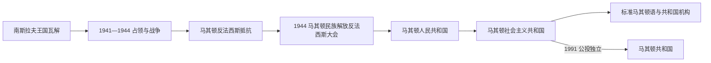

# 战争时期与马其顿共和国

## 时间

1941年—1991年

## 概括

第二次世界大战期间，瓦尔达尔马其顿主要由保加利亚占领和管理，西部部分地区由意大利占领体系控制。共产党领导的抵抗运动发展后，1944年反法西斯大会建立马其顿共和国制度。战后它成为社会主义南斯拉夫六个共和国之一，标准马其顿语、教育、教会和国家机构逐步建立。

## 演进图

## 战争与共和国形成

- 1941年轴心国入侵南斯拉夫后，保加利亚控制瓦尔达尔地区大部，西部部分地区进入意大利—阿尔巴尼亚占领体系。
- 占领初期部分居民对结束塞尔维亚王国统治抱有期待，但征用、同化政策和战争暴力推动抵抗扩大。
- 南斯拉夫共产党领导的游击运动把社会革命、反法西斯和马其顿共和国方案结合。
- 1944年马其顿民族解放反法西斯大会确立共和国制度和马其顿语官方地位，成为现代国家制度的直接前身。

## 社会主义共和国时期

- 战后马其顿先称人民共和国，后称社会主义共和国，是南斯拉夫联邦六个共和国之一。
- 1945年标准马其顿语规范化，学校、大学、科学院、文化机构和媒体推动现代民族文化制度化。
- 奥赫里德大主教区传统被用于现代教会建设；1967年马其顿东正教会宣布自主，教会地位争议延续多年。
- 工业化、城镇化和人口迁徙改变社会；1963年斯科普里地震后的国际重建成为共和国发展重要节点。
- 阿尔巴尼亚族等群体的语言、教育和政治权利问题持续存在，并延伸到独立时代。

## 关键辨析

- 现代马其顿共和国制度的直接起点在二战反法西斯运动和南斯拉夫联邦化，而不是古代王国。
- 保加利亚占领的性质与地方认同在不同史学传统中有争议，应同时区分国家政策、居民选择和战争阶段。
- 社会主义时期不仅是“南斯拉夫统治”，也是共和国制度、语言和民族机构形成的阶段。

## 演变关系

- 前一节点：[巴尔干战争、塞尔维亚统治与战间期](/%E4%BA%BA%E6%96%87%E7%A7%91%E5%AD%A6/%E5%8E%86%E5%8F%B2/%E6%AC%A7%E6%B4%B2/%E4%B8%9C%E5%8D%97%E6%AC%A7%E4%B8%8E%E5%B7%B4%E5%B0%94%E5%B9%B2/%E5%8C%97%E9%A9%AC%E5%85%B6%E9%A1%BF/%E5%B7%B4%E5%B0%94%E5%B9%B2%E6%88%98%E4%BA%89%E3%80%81%E5%A1%9E%E5%B0%94%E7%BB%B4%E4%BA%9A%E7%BB%9F%E6%B2%BB%E4%B8%8E%E6%88%98%E9%97%B4%E6%9C%9F.md)
- 后一节点：[独立、国名争议与北马其顿](/%E4%BA%BA%E6%96%87%E7%A7%91%E5%AD%A6/%E5%8E%86%E5%8F%B2/%E6%AC%A7%E6%B4%B2/%E4%B8%9C%E5%8D%97%E6%AC%A7%E4%B8%8E%E5%B7%B4%E5%B0%94%E5%B9%B2/%E5%8C%97%E9%A9%AC%E5%85%B6%E9%A1%BF/%E7%8B%AC%E7%AB%8B%E3%80%81%E5%9B%BD%E5%90%8D%E4%BA%89%E8%AE%AE%E4%B8%8E%E5%8C%97%E9%A9%AC%E5%85%B6%E9%A1%BF.md)
- 共同背景：[第二次世界大战时期的南斯拉夫](/%E4%BA%BA%E6%96%87%E7%A7%91%E5%AD%A6/%E5%8E%86%E5%8F%B2/%E6%AC%A7%E6%B4%B2/%E4%B8%9C%E5%8D%97%E6%AC%A7%E4%B8%8E%E5%B7%B4%E5%B0%94%E5%B9%B2/%E5%8D%97%E6%96%AF%E6%8B%89%E5%A4%AB%E5%8E%86%E5%8F%B2/%E7%AC%AC%E4%BA%8C%E6%AC%A1%E4%B8%96%E7%95%8C%E5%A4%A7%E6%88%98%E6%97%B6%E6%9C%9F%E7%9A%84%E5%8D%97%E6%96%AF%E6%8B%89%E5%A4%AB.md)、[南斯拉夫社会主义联邦共和国](/%E4%BA%BA%E6%96%87%E7%A7%91%E5%AD%A6/%E5%8E%86%E5%8F%B2/%E6%AC%A7%E6%B4%B2/%E4%B8%9C%E5%8D%97%E6%AC%A7%E4%B8%8E%E5%B7%B4%E5%B0%94%E5%B9%B2/%E5%8D%97%E6%96%AF%E6%8B%89%E5%A4%AB%E5%8E%86%E5%8F%B2/%E5%8D%97%E6%96%AF%E6%8B%89%E5%A4%AB%E7%A4%BE%E4%BC%9A%E4%B8%BB%E4%B9%89%E8%81%94%E9%82%A6%E5%85%B1%E5%92%8C%E5%9B%BD.md)
