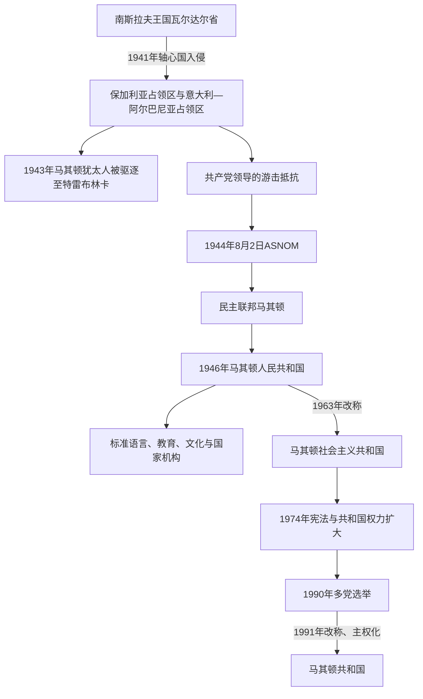

# 战争时期与马其顿共和国

## 时间

1941年—1991年

## 概括

1941年轴心国瓜分南斯拉夫后，瓦尔达尔马其顿大部由保加利亚占领管理，西部进入意大利控制的阿尔巴尼亚体系。占领初期对结束塞尔维亚化的期待，很快与征粮、征兵、警察统治、同化和大屠杀现实冲突。共产党领导的抵抗运动在1943—1944年扩大；1944年8月2日，马其顿民族解放反法西斯大会确立联邦共和国、马其顿民族和马其顿语的制度地位。战后共和国在南斯拉夫内完成语言、教育、文化、工业与行政体系建设，1990—1991年和平转向多党议会制度。

## 第二次世界大战：占领与社会分裂

### 占领区划

1941年4月德国入侵南斯拉夫后，王国迅速投降。瓦尔达尔省大部交由保加利亚军政当局，斯科普里、比托拉、什蒂普和普里莱普等城市纳入保加利亚行政、学校和教会体系；西部的泰托沃、戈斯蒂瓦尔、德巴尔与斯特鲁加部分地区由意大利占领，并并入意大利控制的“大阿尔巴尼亚”。1943年意大利投降后，德国接管西部军事控制并继续利用阿尔巴尼亚合作机构。

保加利亚政府称其行动为民族“解放”与行政统一，北马其顿和南斯拉夫国家叙事则称之为法西斯占领。理解地方经验需区分三个层面：保加利亚作为轴心国在国际法和军事上的占领角色；当地部分斯拉夫居民因反感战间期塞尔维亚化而最初欢迎保军；占领政策随后以国家认同、征用、警察和战争动员压缩选择空间。居民态度随时间、地区、阶层与政策变化，不能一概而论。

### 迫害、战争经济与大屠杀

占领当局替换学校和神职人员，要求公共机构采用保加利亚语和保加利亚国家身份；反对者、共产党人和被视为亲南斯拉夫者遭逮捕、监禁或处决。征粮、劳役、通货膨胀和黑市恶化民生。西部则发生阿尔巴尼亚民族行政扩张、地方武装、塞族和斯拉夫居民流离失所，以及不同社区间的报复。

1943年3月11日，保加利亚当局依与纳粹德国达成的驱逐安排，在斯科普里、比托拉和什蒂普逮捕约7,144名犹太人，集中于斯科普里烟草仓库“莫诺波尔”，随后经德占波兰运往特雷布林卡灭绝营，几乎全部遇害。保加利亚本土旧有公民中的许多人因国内政治、教会与社会反对而免于驱逐，但占领地犹太人未获同等公民保护；两段历史必须同时陈述，不能以其中一段抹去另一段。

## 抵抗运动的形成

1941年初，南斯拉夫共产党马其顿地区领导人梅托迪·沙托罗夫倾向与保加利亚共产党联系，对立即发动南斯拉夫框架下的武装斗争态度消极。南共领导层撤换其职务，拉扎尔·科利舍夫斯基等重建组织。1941年10月11日普里莱普游击队袭击保加利亚警察设施，后来被定为起义纪念日，但早期游击规模有限，科利舍夫斯基不久被捕。

1943年是转折点：

- 轴心国在全球战场转入守势，意大利投降使西部出现武器和控制真空。
- 南斯拉夫共产党明确提出在未来联邦中建立马其顿共和国，给抵抗提供具体国家目标。
- 斯韦托扎尔·武克马诺维奇—坦波等南共代表协调当地组织，马其顿共产党正式建立。
- 游击旅和民族解放委员会扩大，既吸收马其顿斯拉夫人，也有阿尔巴尼亚人、土耳其人、瓦拉几人和其他反法西斯参与者。
- 德、保军及合作武装的“清剿”和报复造成平民伤亡，也推动部分村庄转向游击队。

## ASNOM与现代国家制度起点

1944年8月2日，马其顿民族解放反法西斯大会第一次会议在普罗霍尔·普钦斯基修道院举行。会议选择与1903年伊林登纪念日重合，试图把反奥斯曼革命传统与反法西斯国家重建连接起来。大会宣布马其顿为民主联邦南斯拉夫内的联邦单位，确认马其顿语为官方语言，并提出公民平等、人民主权和民族权利原则。梅托迪亚·安多诺夫-琴托当选大会主席。

ASNOM既是抵抗机构，也是制宪权力来源。它没有建立完全独立国家，而是在铁托领导的南斯拉夫联邦方案中确立共和国；琴托等人后来主张更大共和国自主、反对过度向贝尔格莱德集中，因而与科利舍夫斯基领导的共产党发生冲突。

### 1944年秋的军事终局

1944年9月苏军进入保加利亚，保加利亚政变后退出轴心国并对德国宣战。德国曾支持伊万·米哈伊洛夫在斯科普里建立傀儡“独立马其顿”，米哈伊洛夫判断缺乏军事与社会条件而拒绝。10月后，改换阵营的保加利亚军队重新进入瓦尔达尔地区，与南斯拉夫游击队共同攻击撤退德军；这一阶段既不取消1941—1944年的占领性质，也说明战争末期阵营发生变化。11月13日斯科普里解放，至月末德军基本撤离。

## 战后建制、权力与清洗

1945年建立第一届人民政府，科利舍夫斯基任政府首脑。1946年宪法确立马其顿人民共和国为南斯拉夫联邦共和国之一；1963年改称马其顿社会主义共和国。共和国拥有宪法、议会、政府、法院和文化教育权限，但共产党垄断政治，外交、国防和宏观制度仍属联邦体系。

战后当局惩处合作人员，也打击反对南斯拉夫联邦、主张统一整个地理马其顿、坚持保加利亚认同或反对共产党的人。1945年初军队中的抗命与镇压常被称为“血腥圣诞节”，事件规模、参与动机和死亡数字在不同史学与政治叙事中争议很大，应避免未经核实的精确数字。琴托于1946年辞职并被捕，后以政治罪名判刑，显示共和国建制与一党中央化同时发生。

共和国并非只有名义机构。其法定元首先后由ASNOM主席团、议会主席及1974年后的共和国主席团承担，政府首脑则由人民政府总理、行政委员会主席担任；共产党中央领导在一党时期掌握关键实际权力。完整而分栏的序列见[北马其顿国家元首与政府首脑表](/%E4%BA%BA%E6%96%87%E7%A7%91%E5%AD%A6/%E5%8E%86%E5%8F%B2/%E6%AC%A7%E6%B4%B2/%E4%B8%9C%E5%8D%97%E6%AC%A7%E4%B8%8E%E5%B7%B4%E5%B0%94%E5%B9%B2/%E5%8C%97%E9%A9%AC%E5%85%B6%E9%A1%BF/%E5%8C%97%E9%A9%AC%E5%85%B6%E9%A1%BF%E5%9B%BD%E5%AE%B6%E5%85%83%E9%A6%96%E4%B8%8E%E6%94%BF%E5%BA%9C%E9%A6%96%E8%84%91%E8%A1%A8.md)。

## 标准语言与文化制度化

1945年5月马其顿字母表正式通过，随后颁行正字法，以中部方言为主要基础，同时在塞尔维亚语、保加利亚语之间建立独立标准。语言规范不是“凭空创造”一种语言，也不是古代语言复活，而是从已有南斯拉夫方言连续体中选择语音、拼写和词汇规范，再由国家教育普及。

| 制度 | 建立或发展 | 历史作用 |
|---|---|---|
| 标准马其顿语 | 1945年字母和正字法规范化 | 成为行政、学校、出版和媒体共同语言。 |
| 圣西里尔与美多德大学 | 1949年在斯科普里成立 | 培养共和国专业人才和研究群体。 |
| 马其顿科学院 | 1967年成立 | 组织语言、历史、自然科学和艺术研究。 |
| 马其顿广播电视与出版社 | 战后逐步扩展 | 建立全国公共传播与现代文学市场。 |
| 马其顿东正教会 | 1958年恢复奥赫里德大主教区传统，1967年宣布自主 | 强化共和国宗教文化身份；其自主地位长期未获其他东正教会承认，直到2022年才出现根本性突破。 |

官方历史叙事强调古代、中世纪、伊林登和反法西斯斗争的连续性，对保加利亚历史联系和战后镇压的讨论较受限制。国家建设因此既扩大本地文化表达，也通过学校、档案和纪念政治确立规范边界。

## 经济、城市与社会变化

战后土地改革、国有化和短期集体化削弱旧地主与商人阶层。1950年代南斯拉夫转向工人自治和较分散的计划—市场混合体系，马其顿作为较不发达共和国获得联邦发展资金。冶金、化工、纺织、烟草和电力工业扩张，斯科普里、比托拉、什蒂普和泰托沃吸收乡村人口；农业机械化、医疗和识字率改善。

发展仍受限制：山区交通成本高，工业依赖联邦市场与转移支付，就业增长追不上人口，许多人作为“客籍工人”赴西欧。城市快速扩张造成住房、环境和城乡差距。1963年7月26日斯科普里地震造成逾千人死亡、大量建筑毁坏；联合国协调的国际重建把城市改造为现代主义规划中心，也使灾后住房和基础设施成为南斯拉夫国际开放的象征。

## 对外边界与马其顿问题

铁托最初支持在巴尔干联邦框架下接近保加利亚，并在希腊内战中支持希腊共产党及斯拉夫马其顿组织。1948年南斯拉夫与斯大林决裂后，同保加利亚关系急剧恶化；希腊共产党失败后，大量政治难民和儿童进入南斯拉夫及东欧，其中包括来自爱琴马其顿的斯拉夫语居民。南斯拉夫以马其顿共和国证明民族问题已在联邦中解决，希腊和保加利亚则分别质疑其少数群体或历史语言主张。

边界在冷战中逐渐稳定，马其顿统一不再是现实国家政策。共和国身份的巩固更多依靠学校、文化和联邦代表权，而非改变国界。

## 阿尔巴尼亚族及其他共同体

社会主义宪法把阿尔巴尼亚人、土耳其人等称为“民族群体”或“民族性”，在学校、媒体和地方使用语言方面享有一定权利，但地位与作为构成民族的马其顿人并不完全相同。土耳其语学校和迁往土耳其的潮流并存；罗姆人、瓦拉几人、塞族和穆斯林斯拉夫人也处在共和国身份分类中。

1968年泰托沃等地阿尔巴尼亚族示威要求扩大语言、教育和象征权利。1974年宪法和南斯拉夫整体去中心化带来更多地方表达，但共和国没有设立阿尔巴尼亚语大学。1981年科索沃抗议后，安全化政策加强；1989年宪法修正更突出马其顿人的民族国家地位，阿尔巴尼亚和土耳其共同体担忧被降格。这些未解决的代表、教育和地方权力问题直接延续到1991年独立和2001年冲突。

## 1974年宪法、危机与多党转型

1974年南斯拉夫宪法扩大共和国权力，马其顿设集体主席团，拥有更完整的立法、财政与领土防卫体系；这为日后主权化提供制度资源。一党权力仍通过马其顿共产主义者联盟与南共体系运行，但共和国干部在联邦轮值机构中拥有地位。

1980年铁托去世后，外债、通胀、失业和联邦转移支付争议加剧。科索沃危机、塞尔维亚中央化、斯洛文尼亚—克罗地亚改革诉求和共产主义在东欧崩溃，使南斯拉夫共同合法性消失。马其顿经济依赖共同市场，军事上又是较弱共和国，因此领导层起初倾向保存松散联邦，而非立即单方面分离。

### 阶段终结的因素

- **结构因素**：一党制度缺乏处理多元政治和族群代表的合法机制；经济依赖、失业和地区发展差距削弱联邦支持。
- **外部与联邦压力**：东欧剧变、南共瓦解及塞尔维亚与西北共和国的宪政冲突，使联邦妥协空间收缩。
- **直接转折**：1990年举行首次多党选举，VMRO-DPMNE成为最大单一党但无绝对多数；1991年1月议会选举基罗·格利戈罗夫为共和国总统，3月成立尼古拉·克柳塞夫专家政府。4月删除国名中的“社会主义”，6月正式使用“马其顿共和国”，共和国已转为议会制并准备主权公投。

## 重要事件

| 时间 | 事件 | 结果与长期影响 |
|---|---|---|
| 1941年4月 | 轴心国占领并分区 | 战间期南斯拉夫秩序崩溃，身份冲突与战争统治叠加。 |
| 1941年10月11日 | 普里莱普游击行动 | 成为官方反法西斯起义纪念起点。 |
| 1943年3月 | 约7,144名犹太人被驱逐 | 瓦尔达尔马其顿犹太共同体几乎被毁灭。 |
| 1944年8月2日 | ASNOM第一次会议 | 共和国、官方语言与联邦地位的制宪起点。 |
| 1944年11月13日 | 斯科普里解放 | 德军撤退，共和国政府取得主要城市。 |
| 1945年 | 马其顿语标准化 | 行政、教育和现代民族文化获得统一语言工具。 |
| 1946年 | 人民共和国宪法 | 马其顿成为南斯拉夫六个联邦共和国之一。 |
| 1948年 | 铁托—斯大林决裂 | 与保加利亚关系转坏，巴尔干联邦和边界统一方案终止。 |
| 1963年 | 斯科普里地震 | 国际重建重塑首都、人口和城市规划。 |
| 1967年 | 马其顿东正教会宣布自主 | 宗教国家化加强，也产生长期教会承认争议。 |
| 1974年 | 新宪法 | 共和国权力和集体主席团制度扩大，为主权化提供法律机构。 |
| 1990年 | 首次多党选举 | 一党体制结束，国家进入议会民主转型。 |
| 1991年上半年 | 个别总统、专家政府与国名调整 | 社会主义共和国和平转化为准备独立的马其顿共和国。 |

## 演变关系

- 前一阶段：[巴尔干战争、塞尔维亚统治与战间期](/%E4%BA%BA%E6%96%87%E7%A7%91%E5%AD%A6/%E5%8E%86%E5%8F%B2/%E6%AC%A7%E6%B4%B2/%E4%B8%9C%E5%8D%97%E6%AC%A7%E4%B8%8E%E5%B7%B4%E5%B0%94%E5%B9%B2/%E5%8C%97%E9%A9%AC%E5%85%B6%E9%A1%BF/%E5%B7%B4%E5%B0%94%E5%B9%B2%E6%88%98%E4%BA%89%E3%80%81%E5%A1%9E%E5%B0%94%E7%BB%B4%E4%BA%9A%E7%BB%9F%E6%B2%BB%E4%B8%8E%E6%88%98%E9%97%B4%E6%9C%9F.md)
- 后一阶段：[独立、国名争议与北马其顿](/%E4%BA%BA%E6%96%87%E7%A7%91%E5%AD%A6/%E5%8E%86%E5%8F%B2/%E6%AC%A7%E6%B4%B2/%E4%B8%9C%E5%8D%97%E6%AC%A7%E4%B8%8E%E5%B7%B4%E5%B0%94%E5%B9%B2/%E5%8C%97%E9%A9%AC%E5%85%B6%E9%A1%BF/%E7%8B%AC%E7%AB%8B%E3%80%81%E5%9B%BD%E5%90%8D%E4%BA%89%E8%AE%AE%E4%B8%8E%E5%8C%97%E9%A9%AC%E5%85%B6%E9%A1%BF.md)
- 完整领导序列：[北马其顿国家元首与政府首脑表](/%E4%BA%BA%E6%96%87%E7%A7%91%E5%AD%A6/%E5%8E%86%E5%8F%B2/%E6%AC%A7%E6%B4%B2/%E4%B8%9C%E5%8D%97%E6%AC%A7%E4%B8%8E%E5%B7%B4%E5%B0%94%E5%B9%B2/%E5%8C%97%E9%A9%AC%E5%85%B6%E9%A1%BF/%E5%8C%97%E9%A9%AC%E5%85%B6%E9%A1%BF%E5%9B%BD%E5%AE%B6%E5%85%83%E9%A6%96%E4%B8%8E%E6%94%BF%E5%BA%9C%E9%A6%96%E8%84%91%E8%A1%A8.md)
- 共同战争背景：[第二次世界大战时期的南斯拉夫](/%E4%BA%BA%E6%96%87%E7%A7%91%E5%AD%A6/%E5%8E%86%E5%8F%B2/%E6%AC%A7%E6%B4%B2/%E4%B8%9C%E5%8D%97%E6%AC%A7%E4%B8%8E%E5%B7%B4%E5%B0%94%E5%B9%B2/%E5%8D%97%E6%96%AF%E6%8B%89%E5%A4%AB%E5%8E%86%E5%8F%B2/%E7%AC%AC%E4%BA%8C%E6%AC%A1%E4%B8%96%E7%95%8C%E5%A4%A7%E6%88%98%E6%97%B6%E6%9C%9F%E7%9A%84%E5%8D%97%E6%96%AF%E6%8B%89%E5%A4%AB.md)
- 共同联邦背景：[南斯拉夫社会主义联邦共和国](/%E4%BA%BA%E6%96%87%E7%A7%91%E5%AD%A6/%E5%8E%86%E5%8F%B2/%E6%AC%A7%E6%B4%B2/%E4%B8%9C%E5%8D%97%E6%AC%A7%E4%B8%8E%E5%B7%B4%E5%B0%94%E5%B9%B2/%E5%8D%97%E6%96%AF%E6%8B%89%E5%A4%AB%E5%8E%86%E5%8F%B2/%E5%8D%97%E6%96%AF%E6%8B%89%E5%A4%AB%E7%A4%BE%E4%BC%9A%E4%B8%BB%E4%B9%89%E8%81%94%E9%82%A6%E5%85%B1%E5%92%8C%E5%9B%BD.md)
- 全史入口：[北马其顿历史](/%E4%BA%BA%E6%96%87%E7%A7%91%E5%AD%A6/%E5%8E%86%E5%8F%B2/%E6%AC%A7%E6%B4%B2/%E4%B8%9C%E5%8D%97%E6%AC%A7%E4%B8%8E%E5%B7%B4%E5%B0%94%E5%B9%B2/%E5%8C%97%E9%A9%AC%E5%85%B6%E9%A1%BF/README.md)
