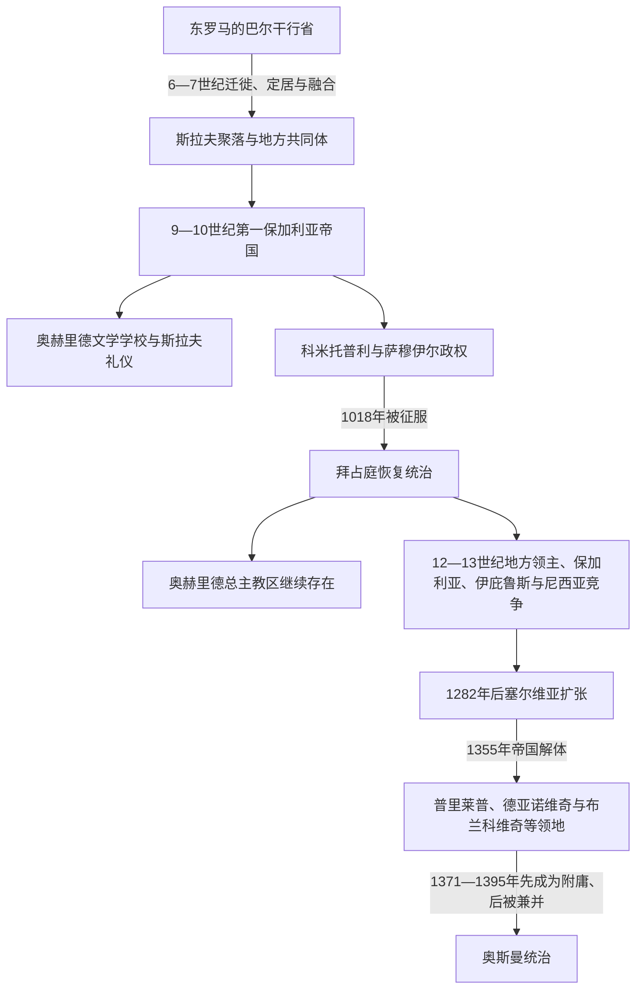

# 斯拉夫迁徙与中世纪马其顿地区

## 时间

6世纪—14世纪末

## 概括

6—7世纪斯拉夫语人群迁入后，今天北马其顿所在地区逐步形成以南斯拉夫语方言为主、同时包含希腊语、阿尔巴尼亚语、瓦拉几语及其他群体的社会。此后它不是一个边界稳定的“马其顿王国”，而是在拜占庭、第一和第二保加利亚帝国、伊庇鲁斯与尼西亚诸国、塞尔维亚王国—帝国及地方领主之间多次易手。奥赫里德文学学校和总主教区使该地成为斯拉夫基督教文化重镇；文化网络与政权边界并不同步。

## 斯拉夫迁徙与早期重组

斯拉夫人与阿瓦尔自6世纪多次越过多瑙河。早期行动既有季节性劫掠、围城，也有家庭和农业共同体定居；7世纪以后，大量斯拉夫聚落出现在巴尔干内陆。拜占庭文献常把这些地方共同体称为“斯克拉维尼亚”，但它们并非一个统一国家。东罗马仍控制塞萨洛尼基、部分沿海城市、要塞与交通线，并通过军事远征、贡赋、传教和结盟逐步恢复影响。

迁徙不是原居民被一次性取代。晚期罗马居民、希腊语城市人口、拉丁化或罗曼语牧民、阿尔巴尼亚语先民及其他群体与新来者发生融合、迁移和分工。斯拉夫语成为广泛乡村交际语言，却经历数世纪才与教会文字、区域政治和现代民族身份相结合。

## 保加利亚统治与奥赫里德文化中心

9世纪中后期，第一保加利亚帝国在鲍里斯一世和西缅一世时期向西南扩张。鲍里斯于864年前后接受基督教，随后接纳被大摩拉维亚驱逐的西里尔—美多德门徒。克莱门特和瑙姆在库特米切维察与奥赫里德周边建立教育、翻译和修道中心，培养斯拉夫语神职人员。所谓“奥赫里德文学学校”与普雷斯拉夫中心共同推动古教会斯拉夫语礼仪和文字文化；格拉哥里字母与早期西里尔传统的具体使用、形成地点和传播次序需避免过度简化。

奥赫里德的意义来自三种机制：

1. 西南边区远离君士坦丁堡和普雷斯拉夫，适合培养本地斯拉夫语神职人员。
2. 湖区道路连接亚得里亚海、爱琴海与巴尔干内陆，使抄写、教育和修道网络能够扩散。
3. 帝国基督教化需要以民众可理解的语言组织教区，文化政策同时服务王权整合。

## 科米托普利与萨穆伊尔政权

971年拜占庭夺取普雷斯拉夫并俘获保加利亚沙皇鲍里斯二世后，西部的科米托普利兄弟大卫、摩西、亚伦和萨穆伊尔继续抵抗。随着前三人先后死亡，萨穆伊尔成为核心统治者，以普雷斯帕、奥赫里德等地为基地，控制保加利亚西部、马其顿大部，并一度扩张至色萨利、伊庇鲁斯、塞尔维亚和亚得里亚海方向。罗马于997年承认萨穆伊尔帝号的说法常见于后世重构；可靠的是他以“保加利亚人的皇帝”身份与拜占庭争夺巴尔干霸权，奥赫里德成为其宗教—政治中心。

### 主要统治者与继承

| 顺序 | 统治者 | 统治与关系 | 关键事件 |
|---:|---|---|---|
| 1 | 罗曼 | 约977—997年；保加利亚旧王族，名义沙皇 | 科米托普利在其名义下掌握军事权；997年死于拜占庭囚禁。 |
| 2 | **萨穆伊尔** | 约997—1014年；科米托普利兄弟中最后的核心领袖 | 以普雷斯帕、奥赫里德为中心扩张；1014年克雷迪昂战败后不久去世。 |
| 3 | 加夫里尔·拉多米尔 | 1014—1015年；萨穆伊尔之子 | 继续抵抗，后被堂弟伊万·弗拉迪斯拉夫杀害。 |
| 4 | 伊万·弗拉迪斯拉夫 | 1015—1018年；亚伦之子、萨穆伊尔之侄 | 试图维持政权，围攻都拉斯时阵亡。 |
| — | 玛丽亚皇后及贵族集团 | 1018年；伊万·弗拉迪斯拉夫遗属 | 向巴西尔二世投降，部分贵族获拜占庭官爵和土地。 |

### 身份争议怎样准确处理

同时代拜占庭文献通常把萨穆伊尔国家及其臣民称为“保加利亚”，其统治者使用保加利亚沙皇传统，现代多数国际中世纪史研究因此将它视为第一保加利亚帝国的西部延续。20世纪南斯拉夫和马其顿史学曾强调其政治中心、军队和社会基础在马其顿地区，称其为“马其顿国家”或早期马其顿政治传统。两者关注点不同：前者重视中世纪国号与法统，后者重视地理中心及后世国家记忆。最稳妥写法是“以马其顿地区为中心的第一保加利亚帝国后期政权”，并明确中世纪“保加利亚人”称谓不能直接等同今日国籍统计。

### 衰落与灭亡

- **结构因素**：政权依靠科米托普利家族、山地堡垒与机动战争，缺少可与恢复后的拜占庭长期抗衡的财政和人口资源；广阔占领区整合有限。
- **外部压力**：巴西尔二世在稳定帝国内部和东线后，连续多年从色雷斯、色萨利和多瑙河方向推进，逐个切断堡垒与道路。
- **直接触发**：1014年克雷迪昂战役重创主力，萨穆伊尔去世后又发生弑君和继承危机。1018年伊万·弗拉迪斯拉夫战死，贵族相继投降，政权终结。

## 1018年后的拜占庭统治

巴西尔二世并未完全拆毁地方秩序。他把征服地组织为“保加利亚”军区等单位，部分旧贵族进入帝国官僚和军队；税收起初保留实物形式，后来改征货币引发不满。奥赫里德牧首区被降为自主总主教区，但管辖范围仍十分广泛，由皇帝任命总主教。此制度既削弱独立帝权，又保存了西南巴尔干的特殊教会网络。

- 1040年，彼得·德良在贝尔格莱德起兵并向南扩展，斯科普里等地卷入反拜占庭运动；内部分裂和军事失败导致起义被镇压。
- 1072年，斯科普里贵族格奥尔基·沃伊捷赫等再次起事，并拥立杜克利亚王子康斯坦丁·博丁为沙皇“彼得三世”；拜占庭很快恢复控制。
- 11—12世纪，诺曼人从亚得里亚海方向数次沿埃格纳提亚大道入侵，十字军和佩切涅格等活动也冲击地区。
- 科穆宁王朝依靠要塞、普罗尼亚授地和教会体系恢复秩序，但地方领主获得越来越多军事财政资源。

## 12—13世纪的多国竞争

1185年后第二保加利亚帝国兴起，第四次十字军1204年攻陷君士坦丁堡又瓦解拜占庭中央权力。马其顿地区于是成为数个国家和地方势力交叠的战场：

| 势力 | 主要活动 | 结局与影响 |
|---|---|---|
| 多布罗米尔·赫里斯 | 12世纪末以斯特鲁米察、普罗斯克等堡垒为据点 | 在拜占庭、保加利亚之间反复结盟，显示地方军事领主的自主性。 |
| 斯特雷兹 | 约1207—1214年控制普罗斯克及瓦尔达尔中游 | 借保加利亚支持起家，后寻求独立，死后领地被邻国瓜分。 |
| 伊庇鲁斯专制国 | 13世纪前期从西南进入奥赫里德等地 | 1230年克洛科特尼察战败后势力收缩。 |
| 第二保加利亚帝国 | 伊凡·阿森二世胜利后一度控制马其顿大部 | 中央权力减弱后难以维持长期统治。 |
| 尼西亚—复兴拜占庭 | 13世纪中叶逐步夺回斯科普里、奥赫里德等地 | 1261年恢复君士坦丁堡后仍受内战和财政困境影响。 |

政权频繁更迭并未消灭地方宗教文化。奥赫里德总主教区在不同统治者下继续运作，修道院、村社和城市行会通常比王朝边界更具连续性。

## 塞尔维亚扩张与地方领主时代

斯特凡·米卢廷于1282年夺取斯科普里，此后塞尔维亚王国沿瓦尔达尔河向南扩张。斯特凡·德昌斯基在1330年韦尔布日德战役击败保加利亚，斯特凡·杜尚乘拜占庭内战迅速占领马其顿、伊庇鲁斯和色萨利大部。1346年杜尚在斯科普里加冕为“塞尔维亚人和希腊人的皇帝”，佩奇大主教升为牧首。杜尚法典和授地制度试图整合新领土，但帝国依赖贵族私人军力，继承机制薄弱。

1355年杜尚去世后，其子乌罗什五世无法控制各地大贵族。瓦尔达尔地区形成数个并立政权：

- 乌格列沙·姆尔尼亚夫切维奇控制塞雷斯方向；其兄武卡欣以普里莱普为中心称王，并让儿子马尔科共治。
- 1371年马里查河战役中武卡欣与乌格列沙战死，奥斯曼突破东南通道。
- 马尔科保留普里莱普领地但承认奥斯曼宗主权，后世南斯拉夫史诗将他塑造成“马尔科王子”，文学形象与实际附庸政治不同。
- 康斯坦丁·德拉加什控制东北部和韦尔布日德—斯特鲁米察一带，同样成为奥斯曼附庸。
- 斯科普里及北部还受武克·布兰科维奇等塞尔维亚领主影响，直到奥斯曼推进。

## 奥斯曼征服与中世纪阶段终结

### 结构因素

塞尔维亚帝国的快速扩张未建立稳定的中央税收和常备军体系；贵族领地、教会地产与城市特权相互交错。杜尚死后没有一位继承者能调动全区域资源，地方领主又彼此竞争。

### 外部压力

奥斯曼军队依靠色雷斯基地、骑兵封地和附庸军逐步控制河谷通道，并利用巴尔干诸侯间的冲突。它并非一次战役征服全部地区，而是先迫使领主纳贡、出兵，再在时机成熟后直接并入。

### 直接过程

1371年马里查河战败使东部防线崩溃；1380年代奥斯曼持续夺取塞雷斯—斯科普里交通线，斯科普里约于1392年陷落。1395年马尔科与康斯坦丁作为奥斯曼附庸参加罗维内战役并阵亡，两人的领地随即被兼并。奥赫里德及西南地区也在14世纪末至15世纪初纳入奥斯曼行政。政治制度进入奥斯曼时代，但奥赫里德总主教区一直延续到1767年。

## 重要事件

| 时间 | 事件 | 长期影响 |
|---|---|---|
| 6—7世纪 | 斯拉夫人迁徙与定居 | 形成此后南斯拉夫语占优势的乡村和地方共同体。 |
| 9世纪后期 | 克莱门特、瑙姆在奥赫里德地区活动 | 奠定斯拉夫语教会教育和文学中心。 |
| 997年前后 | 萨穆伊尔取得皇帝地位 | 以奥赫里德为中心的西部政权达到高峰。 |
| 1014年 | 克雷迪昂战役 | 萨穆伊尔军力遭重创，继承危机加速。 |
| 1018年 | 拜占庭完成征服 | 保留奥赫里德自主总主教区，政治与文化延续分离。 |
| 1040、1072年 | 两次大规模反拜占庭起义 | 显示税制、贵族与保加利亚帝号记忆仍有动员力。 |
| 1204年 | 君士坦丁堡陷落 | 马其顿进入伊庇鲁斯、保加利亚、尼西亚和地方领主竞争。 |
| 1282年 | 米卢廷夺取斯科普里 | 塞尔维亚向马其顿扩张的长期阶段开始。 |
| 1346年 | 杜尚在斯科普里称帝 | 塞尔维亚帝国达到鼎盛，亦埋下贵族分权问题。 |
| 1371年 | 马里查河战役 | 地方领主主力覆灭，奥斯曼附庸化加快。 |
| 1392—1395年 | 斯科普里陷落、马尔科与康斯坦丁阵亡 | 现代北马其顿大部转入奥斯曼直接统治。 |

## 演变关系

- 前一阶段：[古代马其顿与罗马—拜占庭时期](/%E4%BA%BA%E6%96%87%E7%A7%91%E5%AD%A6/%E5%8E%86%E5%8F%B2/%E6%AC%A7%E6%B4%B2/%E4%B8%9C%E5%8D%97%E6%AC%A7%E4%B8%8E%E5%B7%B4%E5%B0%94%E5%B9%B2/%E5%8C%97%E9%A9%AC%E5%85%B6%E9%A1%BF/%E5%8F%A4%E4%BB%A3%E9%A9%AC%E5%85%B6%E9%A1%BF%E4%B8%8E%E7%BD%97%E9%A9%AC%E2%80%94%E6%8B%9C%E5%8D%A0%E5%BA%AD%E6%97%B6%E6%9C%9F.md)
- 后一阶段：[奥斯曼统治下的马其顿地区](/%E4%BA%BA%E6%96%87%E7%A7%91%E5%AD%A6/%E5%8E%86%E5%8F%B2/%E6%AC%A7%E6%B4%B2/%E4%B8%9C%E5%8D%97%E6%AC%A7%E4%B8%8E%E5%B7%B4%E5%B0%94%E5%B9%B2/%E5%8C%97%E9%A9%AC%E5%85%B6%E9%A1%BF/%E5%A5%A5%E6%96%AF%E6%9B%BC%E7%BB%9F%E6%B2%BB%E4%B8%8B%E7%9A%84%E9%A9%AC%E5%85%B6%E9%A1%BF%E5%9C%B0%E5%8C%BA.md)
- 争议辨析：[古代马其顿与现代国家名称辨析](/%E4%BA%BA%E6%96%87%E7%A7%91%E5%AD%A6/%E5%8E%86%E5%8F%B2/%E6%AC%A7%E6%B4%B2/%E4%B8%9C%E5%8D%97%E6%AC%A7%E4%B8%8E%E5%B7%B4%E5%B0%94%E5%B9%B2/%E5%8C%97%E9%A9%AC%E5%85%B6%E9%A1%BF/%E5%8F%A4%E4%BB%A3%E9%A9%AC%E5%85%B6%E9%A1%BF%E4%B8%8E%E7%8E%B0%E4%BB%A3%E5%9B%BD%E5%AE%B6%E5%90%8D%E7%A7%B0%E8%BE%A8%E6%9E%90.md)
- 对读：[保加利亚历史](/%E4%BA%BA%E6%96%87%E7%A7%91%E5%AD%A6/%E5%8E%86%E5%8F%B2/%E6%AC%A7%E6%B4%B2/%E4%B8%9C%E5%8D%97%E6%AC%A7%E4%B8%8E%E5%B7%B4%E5%B0%94%E5%B9%B2/%E4%BF%9D%E5%8A%A0%E5%88%A9%E4%BA%9A/README.md)、[塞尔维亚历史](/%E4%BA%BA%E6%96%87%E7%A7%91%E5%AD%A6/%E5%8E%86%E5%8F%B2/%E6%AC%A7%E6%B4%B2/%E4%B8%9C%E5%8D%97%E6%AC%A7%E4%B8%8E%E5%B7%B4%E5%B0%94%E5%B9%B2/%E5%A1%9E%E5%B0%94%E7%BB%B4%E4%BA%9A/README.md)、[拜占庭帝国](/%E4%BA%BA%E6%96%87%E7%A7%91%E5%AD%A6/%E5%8E%86%E5%8F%B2/%E6%AC%A7%E6%B4%B2/_%E9%80%9A%E5%8F%B2/%E5%8F%A4%E7%BD%97%E9%A9%AC/%E4%B8%9C%E7%BD%97%E9%A9%AC%E5%B8%9D%E5%9B%BD%E4%B8%8E%E6%8B%9C%E5%8D%A0%E5%BA%AD%E5%B8%9D%E5%9B%BD.md)
- 全史入口：[北马其顿历史](/%E4%BA%BA%E6%96%87%E7%A7%91%E5%AD%A6/%E5%8E%86%E5%8F%B2/%E6%AC%A7%E6%B4%B2/%E4%B8%9C%E5%8D%97%E6%AC%A7%E4%B8%8E%E5%B7%B4%E5%B0%94%E5%B9%B2/%E5%8C%97%E9%A9%AC%E5%85%B6%E9%A1%BF/README.md)
