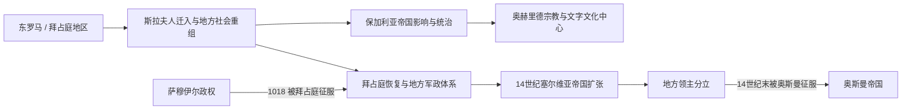

# 斯拉夫迁徙与中世纪马其顿地区

## 时间

6世纪—14世纪末

## 概括

斯拉夫人迁入后，马其顿地区形成多族群、东正教和斯拉夫语文化不断发展的社会，先后处于东罗马、保加利亚、塞尔维亚和地方政权竞争中。奥赫里德成为宗教、文字与教育中心，但中世纪政权边界远大于或不同于现代国界。

## 演进图

## 历史过程

- 6—7世纪斯拉夫语人群迁入巴尔干，与既有罗马化、希腊语、阿尔巴尼亚语及其他人群长期互动。
- 第一保加利亚帝国控制地区后，奥赫里德与克莱门特、瑙姆等人物相关的教育和教会活动推动斯拉夫礼仪与文字文化传播。
- 萨穆伊尔政权以奥赫里德一带为重要中心，通常置于第一保加利亚帝国后期理解；它也被不同现代民族史叙事重新解释，需区分中世纪政权和现代身份。
- 1018年拜占庭征服萨穆伊尔政权，但奥赫里德总主教区继续保持广泛宗教影响。
- 13—14世纪，保加利亚、拜占庭、伊庇鲁斯、塞尔维亚及地方领主反复争夺地区。塞尔维亚帝国解体后，奥斯曼逐步征服。

## 关键辨析

- 中世纪马其顿是地理区域，不是始终拥有固定边界和同一民族主体的国家。
- 斯拉夫语言文化发展是长期人口、教会与政治过程，不是一次迁徙立即形成现代马其顿民族。
- 奥赫里德传统同时进入保加利亚、马其顿及更广东南欧历史记忆，不能由单一现代国家排他占有。

## 演变关系

- 前一节点：[古代马其顿与罗马—拜占庭时期](/%E4%BA%BA%E6%96%87%E7%A7%91%E5%AD%A6/%E5%8E%86%E5%8F%B2/%E6%AC%A7%E6%B4%B2/%E4%B8%9C%E5%8D%97%E6%AC%A7%E4%B8%8E%E5%B7%B4%E5%B0%94%E5%B9%B2/%E5%8C%97%E9%A9%AC%E5%85%B6%E9%A1%BF/%E5%8F%A4%E4%BB%A3%E9%A9%AC%E5%85%B6%E9%A1%BF%E4%B8%8E%E7%BD%97%E9%A9%AC%E2%80%94%E6%8B%9C%E5%8D%A0%E5%BA%AD%E6%97%B6%E6%9C%9F.md)
- 后一节点：[奥斯曼统治下的马其顿地区](/%E4%BA%BA%E6%96%87%E7%A7%91%E5%AD%A6/%E5%8E%86%E5%8F%B2/%E6%AC%A7%E6%B4%B2/%E4%B8%9C%E5%8D%97%E6%AC%A7%E4%B8%8E%E5%B7%B4%E5%B0%94%E5%B9%B2/%E5%8C%97%E9%A9%AC%E5%85%B6%E9%A1%BF/%E5%A5%A5%E6%96%AF%E6%9B%BC%E7%BB%9F%E6%B2%BB%E4%B8%8B%E7%9A%84%E9%A9%AC%E5%85%B6%E9%A1%BF%E5%9C%B0%E5%8C%BA.md)
- 共同背景：[早期南斯拉夫人](/%E4%BA%BA%E6%96%87%E7%A7%91%E5%AD%A6/%E5%8E%86%E5%8F%B2/%E6%AC%A7%E6%B4%B2/%E4%B8%9C%E5%8D%97%E6%AC%A7%E4%B8%8E%E5%B7%B4%E5%B0%94%E5%B9%B2/%E5%8D%97%E6%96%AF%E6%8B%89%E5%A4%AB%E5%8E%86%E5%8F%B2/%E6%97%A9%E6%9C%9F%E5%8D%97%E6%96%AF%E6%8B%89%E5%A4%AB%E4%BA%BA.md)、[拜占庭帝国](/%E4%BA%BA%E6%96%87%E7%A7%91%E5%AD%A6/%E5%8E%86%E5%8F%B2/%E6%AC%A7%E6%B4%B2/_%E9%80%9A%E5%8F%B2/%E5%8F%A4%E7%BD%97%E9%A9%AC/%E4%B8%9C%E7%BD%97%E9%A9%AC%E5%B8%9D%E5%9B%BD%E4%B8%8E%E6%8B%9C%E5%8D%A0%E5%BA%AD%E5%B8%9D%E5%9B%BD.md)
