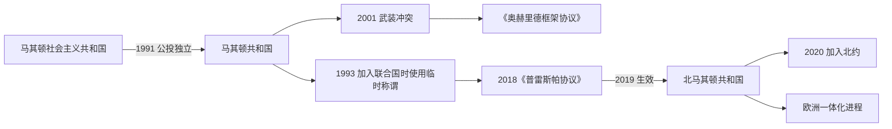

# 独立、国名争议与北马其顿

## 时间

1991年至今

## 概括

马其顿共和国于1991年公投独立，脱离南斯拉夫的过程相对和平。新国家随后处理经济转型、阿尔巴尼亚族权利、与希腊的国名争议及欧洲—大西洋整合。2018年《普雷斯帕协议》达成，2019年国名改为“北马其顿共和国”。

## 演进图

## 独立与国家建设

- 1991年独立公投后，共和国建立议会制国家并维持与南斯拉夫其他共和国不同的相对和平分离。
- 希腊反对其使用“马其顿共和国”国名及相关历史象征；国家于1993年以临时称谓加入联合国。
- 市场转型、南斯拉夫战争造成的区域封锁和国际争议使早期国家建设面临压力。
- 2001年政府军与阿尔巴尼亚族武装发生冲突，《奥赫里德框架协议》通过语言、地方治理和公平代表等改革结束主要战斗。
- 2018年与希腊签署《普雷斯帕协议》，2019年正式采用“北马其顿共和国”国名，并对古代马其顿遗产的表述作出区分。
- 2020年北马其顿加入北约；欧洲联盟加入进程仍受区域争议与制度改革影响。

## 国家结构与社会

| 层次 | 内容 | 说明 |
|---|---|---|
| 政体 | 议会共和国 | 总统为国家元首，政府由议会多数支持。 |
| 多族群制度 | 马其顿族、阿尔巴尼亚族及其他共同体 | 权利安排涉及语言、教育、地方自治和公共部门代表。 |
| 对外关系 | 希腊、保加利亚及西巴尔干邻国 | 国名、语言和历史解释与外交整合相互影响。 |
| 国际方向 | 北约与欧洲一体化 | 安全整合已推进，入盟进程仍在发展。 |

## 关键辨析

- 2019年改变的是国家对外和宪法国名，不表示现代马其顿民族、语言或公民身份被取消。
- 《普雷斯帕协议》区分现代北马其顿的斯拉夫语言文化与古代希腊马其顿遗产，但历史记忆仍有多种解释。
- 阿尔巴尼亚族问题是现代国家内部权利与权力分享问题，不应被简化为外部边界争端。

## 演变关系

- 前一节点：[战争时期与马其顿共和国](/%E4%BA%BA%E6%96%87%E7%A7%91%E5%AD%A6/%E5%8E%86%E5%8F%B2/%E6%AC%A7%E6%B4%B2/%E4%B8%9C%E5%8D%97%E6%AC%A7%E4%B8%8E%E5%B7%B4%E5%B0%94%E5%B9%B2/%E5%8C%97%E9%A9%AC%E5%85%B6%E9%A1%BF/%E6%88%98%E4%BA%89%E6%97%B6%E6%9C%9F%E4%B8%8E%E9%A9%AC%E5%85%B6%E9%A1%BF%E5%85%B1%E5%92%8C%E5%9B%BD.md)
- 共同背景：[南斯拉夫解体](/%E4%BA%BA%E6%96%87%E7%A7%91%E5%AD%A6/%E5%8E%86%E5%8F%B2/%E6%AC%A7%E6%B4%B2/%E4%B8%9C%E5%8D%97%E6%AC%A7%E4%B8%8E%E5%B7%B4%E5%B0%94%E5%B9%B2/%E5%8D%97%E6%96%AF%E6%8B%89%E5%A4%AB%E5%8E%86%E5%8F%B2/%E5%8D%97%E6%96%AF%E6%8B%89%E5%A4%AB%E8%A7%A3%E4%BD%93.md)
- 专题：[古代马其顿与现代国家名称辨析](/%E4%BA%BA%E6%96%87%E7%A7%91%E5%AD%A6/%E5%8E%86%E5%8F%B2/%E6%AC%A7%E6%B4%B2/%E4%B8%9C%E5%8D%97%E6%AC%A7%E4%B8%8E%E5%B7%B4%E5%B0%94%E5%B9%B2/%E5%8C%97%E9%A9%AC%E5%85%B6%E9%A1%BF/%E5%8F%A4%E4%BB%A3%E9%A9%AC%E5%85%B6%E9%A1%BF%E4%B8%8E%E7%8E%B0%E4%BB%A3%E5%9B%BD%E5%AE%B6%E5%90%8D%E7%A7%B0%E8%BE%A8%E6%9E%90.md)
- 国家总览：[北马其顿历史](/%E4%BA%BA%E6%96%87%E7%A7%91%E5%AD%A6/%E5%8E%86%E5%8F%B2/%E6%AC%A7%E6%B4%B2/%E4%B8%9C%E5%8D%97%E6%AC%A7%E4%B8%8E%E5%B7%B4%E5%B0%94%E5%B9%B2/%E5%8C%97%E9%A9%AC%E5%85%B6%E9%A1%BF/README.md)
