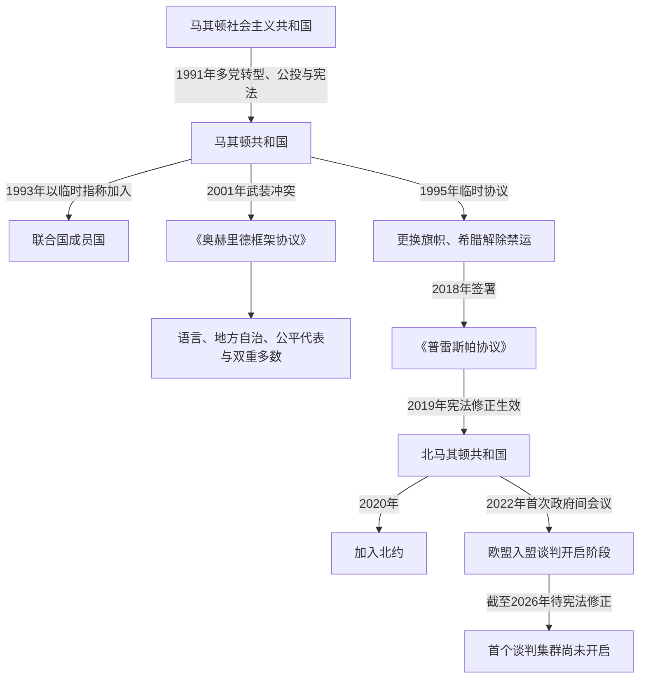

# 独立、国名争议与北马其顿

## 时间

1991年至今（核验截至2026年7月14日）

## 概括

马其顿共和国在1991年通过公投和宪法脱离南斯拉夫，南斯拉夫人民军随后和平撤出，使它避开克罗地亚和波斯尼亚式全面战争。新国家却同时面对经济封锁、希腊国名争议、阿尔巴尼亚族代表权和脆弱的议会制度。2001年武装冲突以《奥赫里德框架协议》结束，国家转向语言权利、地方自治、公平代表和“双重多数”的权力分享。2018年《普雷斯帕协议》促成2019年更名与2020年加入北约；欧盟谈判于2022年举行首次政府间会议，但截至2026年7月首个谈判集群仍因宪法纳入保加利亚人等条件而未开启。

## 1991年独立与宪政建立

1991年1月议会通过主权宣言并选举基罗·格利戈罗夫为总统，3月尼古拉·克柳塞夫组成专家政府。4月删除国名中的“社会主义”，6月正式采用“马其顿共和国”。9月8日公投问题在支持“主权独立国家”的同时保留日后加入南斯拉夫主权国家联盟的可能；登记选民约四分之三参加，投票者中绝大多数赞成。主要阿尔巴尼亚族政党因不满共同体地位而抵制，这使独立具有明确多数合法性，也暴露族群宪政分歧。

9月17日议会确认公投结果，11月17日通过新宪法。宪法建立议会共和国，总统直接选举，政府对议会负责；总统在独立初期对国防外交影响较大。马其顿避免卷入南斯拉夫内战，格利戈罗夫与联邦军方谈判，南斯拉夫人民军于1992年初撤出，带走大量装备却未发生大规模交火。保加利亚于1992年1月率先承认国家，希腊则拒绝承认其宪法国名和带维尔吉纳太阳图案的旗帜。

### 独立初期的结构难题

| 难题 | 表现 | 国家回应 |
|---|---|---|
| 安全 | 无完整军备，北邻南斯拉夫战争，科索沃局势不稳 | 建立本国军队；接受联合国预防性部署，避免战火外溢。 |
| 经济 | 失去南斯拉夫市场、私有化、失业、国际制裁阻断北向贸易 | 货币和银行改革、国企私有化、寻求国际援助与南向通道。 |
| 国际承认 | 希腊反对国名、旗帜与历史象征 | 以临时指称加入联合国，后签1995年临时协议。 |
| 族群代表 | 阿尔巴尼亚族要求宪法地位、大学和语言权 | 初期回应有限，争议最终在2001年冲突后制度化处理。 |
| 国家认同 | 古代象征、南斯拉夫遗产和邻国历史争议交叠 | 通过宪法、教育、外交承认与纪念政策塑造国家叙事。 |

## 希腊国名争议与1995年临时协议

希腊认为“马其顿共和国”可能暗示对希腊马其顿地区的领土要求，并反对新国家垄断古代马其顿象征。新国家则认为“马其顿”是其民族、语言和1944年以来共和国名称的一部分。1993年4月，国家以“前南斯拉夫的马其顿共和国”这一临时指称加入联合国；这不是其宪法国名，也没有要求居民改称自己的民族和语言。

1994年希腊实施贸易禁运，进一步打击内陆国家经济。1995年9月双方签署临时协议：雅典承认对方国家，斯科普里更换国旗、重申宪法无领土要求，希腊解除禁运并承诺不阻挠其加入使用临时指称的国际组织。协议恢复外交和贸易，却把最终名称留待联合国调解。1995年10月格利戈罗夫遭汽车炸弹袭击并重伤，议长斯托扬·安多夫代理总统至1996年1月；案件长期未破。

## 2001年武装冲突

### 背景

阿尔巴尼亚族约占国家人口四分之一，主要集中在西部和北部。独立后争议集中在宪法序言中的国家主体、阿尔巴尼亚语高等教育、公共部门和警察代表、地方财政以及国旗等象征。1994年泰托沃阿尔巴尼亚语大学未经国家承认，引发警察冲突；科索沃战争又带来难民、武器和跨境武装网络。联合国预防性部署在1999年因安理会政治原因终止，安全缓冲随之减弱。

### 冲突过程

- 2001年初，自称民族解放军的阿尔巴尼亚族武装在塔努舍夫齐、泰托沃山区和科索沃边境活动，要求扩大阿尔巴尼亚族平等权利。
- 政府将其视为来自科索沃的恐怖和分离主义威胁，动用军警反攻；战斗扩展至库马诺沃、阿拉奇诺沃和泰托沃周边。
- 多族群城市仍未全面陷入内战，但人口逃离、绑架、村庄破坏和报复使局势接近失控。双方均有侵犯平民和违反战争法指控。
- 总统鲍里斯·特拉伊科夫斯基推动民族团结政府，并接受欧盟、美国和北约调解。
- 8月13日主要马其顿族与阿尔巴尼亚族政党签署《奥赫里德框架协议》；北约“必要收获”行动收缴武装，议会于11月通过宪法修正。

### 框架协议的制度

| 机制 | 内容 | 长期意义 |
|---|---|---|
| 宪法表述 | 减少单一民族国家措辞，强调公民和各共同体 | 将国家合法性从主体民族垄断转向多族群共同体。 |
| 语言权利 | 占全国或地方至少20%的语言获得更广泛官方使用 | 实际主要扩大阿尔巴尼亚语地位，后续立法继续调整范围。 |
| 公平代表 | 公共行政、警察和国有机构提高少数群体比例 | 阿尔巴尼亚族进入国家机构，但职位分配也强化政党庇护。 |
| 地方自治 | 扩大市镇权限和财政，重划部分边界 | 将教育、文化和地方服务更多交给人口集中的市镇。 |
| 巴丹特尔多数 | 涉及文化、语言、地方和共同体利益的法律需议会双重多数 | 防止简单多数压倒少数群体，也使族群政党协商常态化。 |

协议避免国家分裂，却没有自动消除隔离教育、就业差距和互不信任。2004年反对市镇重划的全国公投因投票率不足而失败，改革继续实施。阿尔巴尼亚族的民主一体化联盟长期进入联合政府，使武装运动精英转化为制度内政党。

## 欧洲—大西洋整合与国内改革

北马其顿2004年申请加入欧盟，2005年获候选国地位；欧盟委员会自2009年起建议开启谈判，但希腊国名争议长期阻碍一致同意。国家推进司法、市场和地方治理改革，成效受到政党化行政、腐败和媒体控制问题限制。2008年北约布加勒斯特峰会未发入盟邀请，事实上的希腊阻挠使国名问题成为国内政治转折。2011年国际法院认定希腊在该次峰会上的做法违反1995年临时协议，但没有命令北约接纳该国。

## 格鲁埃夫斯基时期与民主危机

尼古拉·格鲁埃夫斯基自2006年任总理，VMRO-DPMNE凭经济民族主义、外资政策和强党组织长期执政。政府推动“斯科普里2014”工程，以巨型纪念碑、新古典建筑和古代英雄象征重塑首都；支持者视为恢复民族尊严，批评者称其耗资、党派化并进一步混淆古代与现代身份。国家机构、媒体、法院和商业同执政党关系日益紧密。

2015年反对派公布大规模窃听材料，指控政府非法监听、操纵选举、控制媒体并掩盖腐败。政治危机与同年库马诺沃武装冲突叠加。欧盟和美国斡旋《普尔日诺协议》，设特别检察机关并安排选举前技术政府。2016年总统格奥尔基·伊万诺夫赦免多名涉案人物，引发“彩色革命”抗议，后被迫撤回。2016年选举后，VMRO-DPMNE无法组阁；2017年塔拉特·贾费里当选议长时，示威者冲入议会并袭击议员。佐兰·扎埃夫随后组成SDSM与阿尔巴尼亚族政党联合政府，完成首次长达十年的执政更替。

## 《普雷斯帕协议》与更名

扎埃夫政府以解除北约、欧盟障碍为目标，同希腊总理亚历克西斯·齐普拉斯谈判。2018年6月17日双方在普雷斯帕湖畔签署协议，主要内容包括：

- 国家采用“北马其顿共和国”作为对内对外通用名称。
- 国籍表述为“马其顿人／北马其顿共和国公民”，语言称“马其顿语”，并注明属于南斯拉夫语言群。
- 双方区分古代希腊马其顿文明与北马其顿现代语言文化，审查可能含领土暗示的公共和教育表述。
- 希腊支持对方加入北约和推进欧盟程序。

2018年9月30日举行咨询性公投，问题把接受协议与加入欧盟、北约相连。投票者中约九成赞成，但投票率约37%，未达法律门槛；反对派据此否认政治授权，政府则强调咨询性质和赞成多数。议会经过跨党派争取，以宪法所需多数通过修正；希腊议会批准协议后，更名于2019年2月生效。过程具有宪法合法性，却在社会授权、议员转向和身份情感方面持续有争议。

## 北约、保加利亚争议与欧盟进程

北马其顿于2020年3月27日成为北约第30个成员国，安全整合目标实现。欧盟理事会同年同意开启入盟谈判，但保加利亚随后以2017年友好条约执行、共同历史人物、语言和仇恨言论问题阻止谈判框架推进。索非亚承认国家和公民现实，却拒绝将马其顿语言和民族叙事描述为与保加利亚历史完全无关的古老连续体；斯科普里则认为邻国在否定现代语言民族身份并把双边史学争议欧洲化。

2022年在法国斡旋方案下，保加利亚解除最初阻碍，欧盟与北马其顿举行首次政府间会议并开始筛选欧盟法。谈判框架要求北马其顿在进入下一阶段前修宪，把保加利亚人列入宪法序言所列共同体，同时继续执行双边条约。反对者担心此后仍会出现新的历史身份条件；支持者认为宪法纳入一个小共同体符合多族群国家原则且可打开入盟程序。

截至2026年7月14日，筛选工作已经完成，国家正在准备法治、公共行政和少数群体权利路线图，但宪法修正尚未通过，首个“基础”谈判集群仍未开启。2024年后阿尔巴尼亚的谈判进程与北马其顿脱钩。米茨科斯基政府坚持在获得不再追加双边条件的保证、并提出互惠要求之前不推动修宪；欧盟机构与保加利亚则坚持履行2022年框架是下一步前提。因此“谈判已经开始”与“实质集群尚未开启”可以同时成立。

## 2020年代政治

2020年疫情期间，技术政府和紧急状态凸显总统与政府在危机中的协作。2021年扎埃夫在地方选举失利后辞职，迪米塔尔·科瓦切夫斯基于2022年接任总理，接受法国方案并应对能源、物价和修宪争论。2024年选举中，VMRO-DPMNE领导的联盟大胜；法律学者戈尔达娜·西莉娅诺夫斯卡-达夫科娃当选该国首位女总统，赫里斯蒂扬·米茨科斯基联合阿尔巴尼亚族“值得”联盟和ZNAM组阁。前执政的阿尔巴尼亚族民主一体化联盟转入反对派，显示族群权力分享仍通过政党竞争而非固定配额运作。

截至2026年7月14日：

| 角色 | 现任 | 就任 | 权力位置 |
|---|---|---|---|
| 国家元首 | 戈尔达娜·西莉娅诺夫斯卡-达夫科娃 | 2024年5月12日 | 直接选举总统；负责国家代表、国防统帅及部分任命，日常行政由政府主导。 |
| 政府首脑 | 赫里斯蒂扬·米茨科斯基 | 2024年6月23日 | 领导议会多数政府，掌握内政、经济和欧盟谈判日常决策。 |
| 议会多数基础 | VMRO-DPMNE主导联盟、“值得”联盟与ZNAM | 2024年起 | 结合马其顿中右政党、阿尔巴尼亚族伙伴和新兴中间政党。 |

完整正式、代理总统和全部政府首脑见[北马其顿国家元首与政府首脑表](/%E4%BA%BA%E6%96%87%E7%A7%91%E5%AD%A6/%E5%8E%86%E5%8F%B2/%E6%AC%A7%E6%B4%B2/%E4%B8%9C%E5%8D%97%E6%AC%A7%E4%B8%8E%E5%B7%B4%E5%B0%94%E5%B9%B2/%E5%8C%97%E9%A9%AC%E5%85%B6%E9%A1%BF/%E5%8C%97%E9%A9%AC%E5%85%B6%E9%A1%BF%E5%9B%BD%E5%AE%B6%E5%85%83%E9%A6%96%E4%B8%8E%E6%94%BF%E5%BA%9C%E9%A6%96%E8%84%91%E8%A1%A8.md)。

## 当代国家的成就与脆弱点

### 稳定机制

- 1991年和平脱离南斯拉夫、2001年以协议结束冲突，说明精英在危机中能接受国际调解和宪法妥协。
- 阿尔巴尼亚族政党持续进入联合政府，语言、行政与地方自治权显著扩大。
- 北约成员身份降低外部安全不确定性，欧盟规范继续影响司法和公共行政改革。
- 定期选举实现多次政党轮替，总统与总理序列未因军事政变中断。

### 结构性问题

- 政党对行政、公共企业和司法任命影响过深，腐败与法治改革反复停滞。
- 族群权力分享避免多数压迫，却也容易把教育、招聘和预算固定在族群政党庇护网络。
- 人口外流、低生育、地区发展差距和对外资产业依赖削弱长期财政与人才基础。
- 同希腊、保加利亚的身份争议使外交整合与国内记忆政治相互绑架，改革议程被邻国条件和民族动员挤压。

## 重要事件

| 时间 | 事件 | 结果与长期影响 |
|---|---|---|
| 1991年9月8日 | 独立公投 | 建立脱离南斯拉夫的民主授权，同时暴露阿尔巴尼亚族抵制。 |
| 1992年 | 南斯拉夫人民军和平撤离 | 避免全面战争，但新国家军备和安全能力薄弱。 |
| 1993年4月 | 以临时指称加入联合国 | 获国际人格，国名争议仍未解决。 |
| 1995年9月 | 同希腊签署临时协议 | 更换旗帜、解除禁运并恢复双边合作。 |
| 2001年 | 武装冲突与《奥赫里德框架协议》 | 国家由多数民族模式转向制度化多族群权力分享。 |
| 2005年 | 获欧盟候选国地位 | 欧洲整合成为跨党派战略目标。 |
| 2008年 | 北约布加勒斯特峰会未发邀请 | 国名争议直接阻断安全整合。 |
| 2015年 | 窃听危机、库马诺沃冲突与《普尔日诺协议》 | 暴露国家俘获问题，启动技术政府和特别检察机制。 |
| 2017年 | 议会遭冲击、扎埃夫政府成立 | 长期执政集团更替并重启对希腊谈判。 |
| 2018年6月 | 签署《普雷斯帕协议》 | 更名换取希腊解除北约与欧盟阻碍。 |
| 2019年2月 | 北马其顿国名生效 | 现代国家与古代遗产的外交表述重新界定。 |
| 2020年3月 | 加入北约 | 完成安全体系整合。 |
| 2022年7月 | 欧盟首次政府间会议 | 入盟谈判开启阶段启动，宪法条件留待完成。 |
| 2024年 | 总统与议会选举政权更替 | 首位女总统上任，米茨科斯基政府改变修宪与欧盟谈判策略。 |
| 截至2026年7月 | 首个谈判集群仍未开启 | 欧盟进程继续受宪法修正、保加利亚争议和国内共识约束。 |

## 演变关系

- 前一阶段：[战争时期与马其顿共和国](/%E4%BA%BA%E6%96%87%E7%A7%91%E5%AD%A6/%E5%8E%86%E5%8F%B2/%E6%AC%A7%E6%B4%B2/%E4%B8%9C%E5%8D%97%E6%AC%A7%E4%B8%8E%E5%B7%B4%E5%B0%94%E5%B9%B2/%E5%8C%97%E9%A9%AC%E5%85%B6%E9%A1%BF/%E6%88%98%E4%BA%89%E6%97%B6%E6%9C%9F%E4%B8%8E%E9%A9%AC%E5%85%B6%E9%A1%BF%E5%85%B1%E5%92%8C%E5%9B%BD.md)
- 完整领导序列：[北马其顿国家元首与政府首脑表](/%E4%BA%BA%E6%96%87%E7%A7%91%E5%AD%A6/%E5%8E%86%E5%8F%B2/%E6%AC%A7%E6%B4%B2/%E4%B8%9C%E5%8D%97%E6%AC%A7%E4%B8%8E%E5%B7%B4%E5%B0%94%E5%B9%B2/%E5%8C%97%E9%A9%AC%E5%85%B6%E9%A1%BF/%E5%8C%97%E9%A9%AC%E5%85%B6%E9%A1%BF%E5%9B%BD%E5%AE%B6%E5%85%83%E9%A6%96%E4%B8%8E%E6%94%BF%E5%BA%9C%E9%A6%96%E8%84%91%E8%A1%A8.md)
- 名称专题：[古代马其顿与现代国家名称辨析](/%E4%BA%BA%E6%96%87%E7%A7%91%E5%AD%A6/%E5%8E%86%E5%8F%B2/%E6%AC%A7%E6%B4%B2/%E4%B8%9C%E5%8D%97%E6%AC%A7%E4%B8%8E%E5%B7%B4%E5%B0%94%E5%B9%B2/%E5%8C%97%E9%A9%AC%E5%85%B6%E9%A1%BF/%E5%8F%A4%E4%BB%A3%E9%A9%AC%E5%85%B6%E9%A1%BF%E4%B8%8E%E7%8E%B0%E4%BB%A3%E5%9B%BD%E5%AE%B6%E5%90%8D%E7%A7%B0%E8%BE%A8%E6%9E%90.md)
- 共同背景：[南斯拉夫解体](/%E4%BA%BA%E6%96%87%E7%A7%91%E5%AD%A6/%E5%8E%86%E5%8F%B2/%E6%AC%A7%E6%B4%B2/%E4%B8%9C%E5%8D%97%E6%AC%A7%E4%B8%8E%E5%B7%B4%E5%B0%94%E5%B9%B2/%E5%8D%97%E6%96%AF%E6%8B%89%E5%A4%AB%E5%8E%86%E5%8F%B2/%E5%8D%97%E6%96%AF%E6%8B%89%E5%A4%AB%E8%A7%A3%E4%BD%93.md)
- 全史入口：[北马其顿历史](/%E4%BA%BA%E6%96%87%E7%A7%91%E5%AD%A6/%E5%8E%86%E5%8F%B2/%E6%AC%A7%E6%B4%B2/%E4%B8%9C%E5%8D%97%E6%AC%A7%E4%B8%8E%E5%B7%B4%E5%B0%94%E5%B9%B2/%E5%8C%97%E9%A9%AC%E5%85%B6%E9%A1%BF/README.md)
