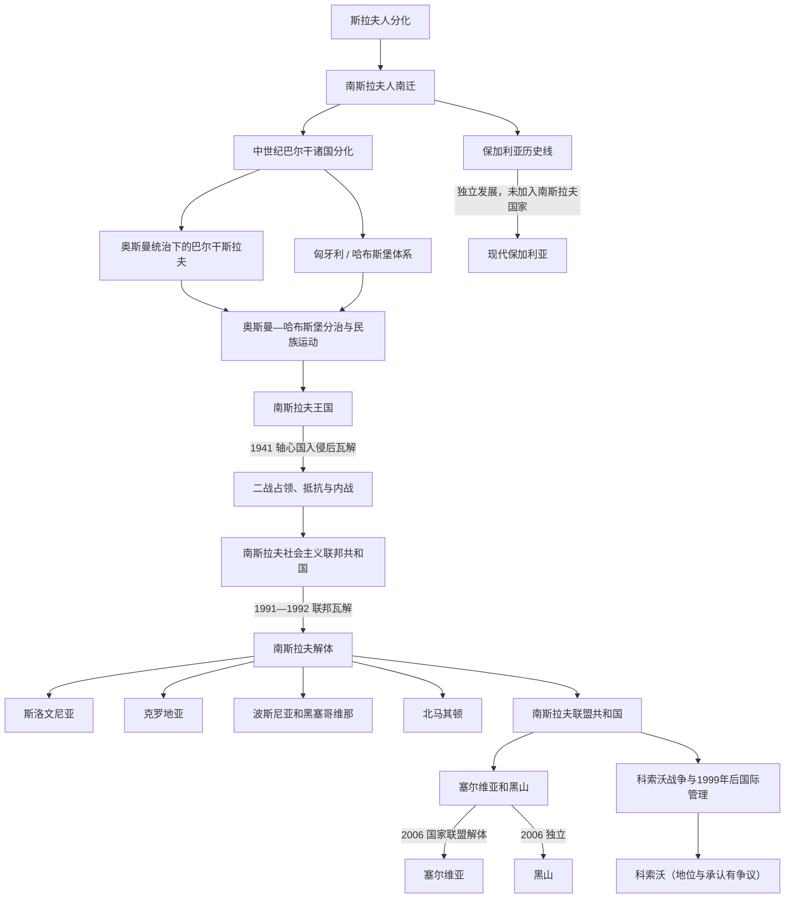

# 南斯拉夫历史

[返回东南欧与巴尔干历史](/%E4%BA%BA%E6%96%87%E7%A7%91%E5%AD%A6/%E5%8E%86%E5%8F%B2/%E6%AC%A7%E6%B4%B2/%E4%B8%9C%E5%8D%97%E6%AC%A7%E4%B8%8E%E5%B7%B4%E5%B0%94%E5%B9%B2/README.md)

## 历史主线

南斯拉夫历史主要展开在巴尔干半岛，可按“斯拉夫人南迁 → 巴尔干南斯拉夫诸国形成 → 奥斯曼—哈布斯堡分治 → 近代民族运动与国家形成 → 20世纪南斯拉夫国家实验 → 联邦解体与继承国家并行发展”来理解。这里的“南斯拉夫”既可指斯拉夫三大分支之一，也可指20世纪先后存在的南斯拉夫国家，两者不能混同。

本目录维护跨越多个国家的共同历史节点；塞尔维亚、克罗地亚、斯洛文尼亚、波斯尼亚和黑塞哥维那、黑山、北马其顿以及保加利亚的连续国家史，分别放在同级国家目录。保加利亚属于南斯拉夫语言文化方向，但从未加入20世纪的南斯拉夫国家。

## 南斯拉夫历史演变脉络图

## 导航表

| 顺序 | 名称 | 时间 | 简要概括 |
|---:|---|---|---|
| 1 | [斯拉夫人分化](/%E4%BA%BA%E6%96%87%E7%A7%91%E5%AD%A6/%E5%8E%86%E5%8F%B2/%E6%AC%A7%E6%B4%B2/%E6%96%AF%E6%8B%89%E5%A4%AB/%E6%96%AF%E6%8B%89%E5%A4%AB%E4%BA%BA%E5%88%86%E5%8C%96.md) | 6世纪前后 | 斯拉夫人向东、西、南三大方向分化。 |
| 2 | [早期南斯拉夫人](/%E4%BA%BA%E6%96%87%E7%A7%91%E5%AD%A6/%E5%8E%86%E5%8F%B2/%E6%AC%A7%E6%B4%B2/%E4%B8%9C%E5%8D%97%E6%AC%A7%E4%B8%8E%E5%B7%B4%E5%B0%94%E5%B9%B2/%E5%8D%97%E6%96%AF%E6%8B%89%E5%A4%AB%E5%8E%86%E5%8F%B2/%E6%97%A9%E6%9C%9F%E5%8D%97%E6%96%AF%E6%8B%89%E5%A4%AB%E4%BA%BA.md) | 6—7世纪以后 | 南斯拉夫人进入巴尔干，与拜占庭、阿瓦尔、保加尔和罗马化居民互动。 |
| 3 | 中世纪巴尔干诸国分化 | 7—15世纪 | [保加利亚第一帝国](/%E4%BA%BA%E6%96%87%E7%A7%91%E5%AD%A6/%E5%8E%86%E5%8F%B2/%E6%AC%A7%E6%B4%B2/%E4%B8%9C%E5%8D%97%E6%AC%A7%E4%B8%8E%E5%B7%B4%E5%B0%94%E5%B9%B2/%E4%BF%9D%E5%8A%A0%E5%88%A9%E4%BA%9A/%E4%BF%9D%E5%8A%A0%E5%88%A9%E4%BA%9A%E7%AC%AC%E4%B8%80%E5%B8%9D%E5%9B%BD.md)、[塞尔维亚中世纪国家](/%E4%BA%BA%E6%96%87%E7%A7%91%E5%AD%A6/%E5%8E%86%E5%8F%B2/%E6%AC%A7%E6%B4%B2/%E4%B8%9C%E5%8D%97%E6%AC%A7%E4%B8%8E%E5%B7%B4%E5%B0%94%E5%B9%B2/%E5%A1%9E%E5%B0%94%E7%BB%B4%E4%BA%9A/%E5%A1%9E%E5%B0%94%E7%BB%B4%E4%BA%9A%E4%B8%AD%E4%B8%96%E7%BA%AA%E5%9B%BD%E5%AE%B6.md)、[克罗地亚王国](/%E4%BA%BA%E6%96%87%E7%A7%91%E5%AD%A6/%E5%8E%86%E5%8F%B2/%E6%AC%A7%E6%B4%B2/%E4%B8%9C%E5%8D%97%E6%AC%A7%E4%B8%8E%E5%B7%B4%E5%B0%94%E5%B9%B2/%E5%85%8B%E7%BD%97%E5%9C%B0%E4%BA%9A/%E5%85%8B%E7%BD%97%E5%9C%B0%E4%BA%9A%E7%8E%8B%E5%9B%BD.md)、[波斯尼亚中世纪国家](/%E4%BA%BA%E6%96%87%E7%A7%91%E5%AD%A6/%E5%8E%86%E5%8F%B2/%E6%AC%A7%E6%B4%B2/%E4%B8%9C%E5%8D%97%E6%AC%A7%E4%B8%8E%E5%B7%B4%E5%B0%94%E5%B9%B2/%E6%B3%A2%E6%96%AF%E5%B0%BC%E4%BA%9A%E5%92%8C%E9%BB%91%E5%A1%9E%E5%93%A5%E7%BB%B4%E9%82%A3/%E6%B3%A2%E6%96%AF%E5%B0%BC%E4%BA%9A%E4%B8%AD%E4%B8%96%E7%BA%AA%E5%9B%BD%E5%AE%B6.md)形成不同历史线。 |
| 4 | [奥斯曼统治下的巴尔干斯拉夫](/%E4%BA%BA%E6%96%87%E7%A7%91%E5%AD%A6/%E5%8E%86%E5%8F%B2/%E6%AC%A7%E6%B4%B2/%E4%B8%9C%E5%8D%97%E6%AC%A7%E4%B8%8E%E5%B7%B4%E5%B0%94%E5%B9%B2/%E5%8D%97%E6%96%AF%E6%8B%89%E5%A4%AB%E5%8E%86%E5%8F%B2/%E5%A5%A5%E6%96%AF%E6%9B%BC%E7%BB%9F%E6%B2%BB%E4%B8%8B%E7%9A%84%E5%B7%B4%E5%B0%94%E5%B9%B2%E6%96%AF%E6%8B%89%E5%A4%AB.md) | 14—19世纪 | 奥斯曼征服和统治重塑巴尔干政治、宗教与社会格局。 |
| 5 | [奥斯曼—哈布斯堡分治与民族运动](/%E4%BA%BA%E6%96%87%E7%A7%91%E5%AD%A6/%E5%8E%86%E5%8F%B2/%E6%AC%A7%E6%B4%B2/%E4%B8%9C%E5%8D%97%E6%AC%A7%E4%B8%8E%E5%B7%B4%E5%B0%94%E5%B9%B2/%E5%8D%97%E6%96%AF%E6%8B%89%E5%A4%AB%E5%8E%86%E5%8F%B2/%E5%A5%A5%E6%96%AF%E6%9B%BC%E2%80%94%E5%93%88%E5%B8%83%E6%96%AF%E5%A0%A1%E5%88%86%E6%B2%BB%E4%B8%8E%E6%B0%91%E6%97%8F%E8%BF%90%E5%8A%A8.md) | 16世纪末—1918年 | 帝国边界、宗教文化差异与近代民族运动共同塑造南斯拉夫政治。 |
| 6 | [南斯拉夫王国](/%E4%BA%BA%E6%96%87%E7%A7%91%E5%AD%A6/%E5%8E%86%E5%8F%B2/%E6%AC%A7%E6%B4%B2/%E4%B8%9C%E5%8D%97%E6%AC%A7%E4%B8%8E%E5%B7%B4%E5%B0%94%E5%B9%B2/%E5%8D%97%E6%96%AF%E6%8B%89%E5%A4%AB%E5%8E%86%E5%8F%B2/%E5%8D%97%E6%96%AF%E6%8B%89%E5%A4%AB%E7%8E%8B%E5%9B%BD.md) | 1918—1941年 | 一战后建立的君主制统一国家。 |
| 7 | [第二次世界大战时期的南斯拉夫](/%E4%BA%BA%E6%96%87%E7%A7%91%E5%AD%A6/%E5%8E%86%E5%8F%B2/%E6%AC%A7%E6%B4%B2/%E4%B8%9C%E5%8D%97%E6%AC%A7%E4%B8%8E%E5%B7%B4%E5%B0%94%E5%B9%B2/%E5%8D%97%E6%96%AF%E6%8B%89%E5%A4%AB%E5%8E%86%E5%8F%B2/%E7%AC%AC%E4%BA%8C%E6%AC%A1%E4%B8%96%E7%95%8C%E5%A4%A7%E6%88%98%E6%97%B6%E6%9C%9F%E7%9A%84%E5%8D%97%E6%96%AF%E6%8B%89%E5%A4%AB.md) | 1941—1945年 | 轴心国占领、傀儡政权、抵抗运动和内战并行。 |
| 8 | [南斯拉夫社会主义联邦共和国](/%E4%BA%BA%E6%96%87%E7%A7%91%E5%AD%A6/%E5%8E%86%E5%8F%B2/%E6%AC%A7%E6%B4%B2/%E4%B8%9C%E5%8D%97%E6%AC%A7%E4%B8%8E%E5%B7%B4%E5%B0%94%E5%B9%B2/%E5%8D%97%E6%96%AF%E6%8B%89%E5%A4%AB%E5%8E%86%E5%8F%B2/%E5%8D%97%E6%96%AF%E6%8B%89%E5%A4%AB%E7%A4%BE%E4%BC%9A%E4%B8%BB%E4%B9%89%E8%81%94%E9%82%A6%E5%85%B1%E5%92%8C%E5%9B%BD.md) | 1945—1992年 | 六个共和国组成的社会主义联邦，冷战中走不结盟路线。 |
| 9 | [南斯拉夫解体](/%E4%BA%BA%E6%96%87%E7%A7%91%E5%AD%A6/%E5%8E%86%E5%8F%B2/%E6%AC%A7%E6%B4%B2/%E4%B8%9C%E5%8D%97%E6%AC%A7%E4%B8%8E%E5%B7%B4%E5%B0%94%E5%B9%B2/%E5%8D%97%E6%96%AF%E6%8B%89%E5%A4%AB%E5%8E%86%E5%8F%B2/%E5%8D%97%E6%96%AF%E6%8B%89%E5%A4%AB%E8%A7%A3%E4%BD%93.md) | 1991年以后 | 联邦瓦解伴随独立、战争、国际干预和边界重组。 |
| 10 | [南斯拉夫联盟共和国与塞尔维亚和黑山](/%E4%BA%BA%E6%96%87%E7%A7%91%E5%AD%A6/%E5%8E%86%E5%8F%B2/%E6%AC%A7%E6%B4%B2/%E4%B8%9C%E5%8D%97%E6%AC%A7%E4%B8%8E%E5%B7%B4%E5%B0%94%E5%B9%B2/%E5%8D%97%E6%96%AF%E6%8B%89%E5%A4%AB%E5%8E%86%E5%8F%B2/%E5%8D%97%E6%96%AF%E6%8B%89%E5%A4%AB%E8%81%94%E7%9B%9F%E5%85%B1%E5%92%8C%E5%9B%BD%E4%B8%8E%E5%A1%9E%E5%B0%94%E7%BB%B4%E4%BA%9A%E5%92%8C%E9%BB%91%E5%B1%B1.md) | 1992—2006年 | 塞尔维亚和黑山在联邦解体后继续组成共同国家，最终和平分立。 |

## 统治者与政府首脑专表

[南斯拉夫国家元首与政府首脑表](/%E4%BA%BA%E6%96%87%E7%A7%91%E5%AD%A6/%E5%8E%86%E5%8F%B2/%E6%AC%A7%E6%B4%B2/%E4%B8%9C%E5%8D%97%E6%AC%A7%E4%B8%8E%E5%B7%B4%E5%B0%94%E5%B9%B2/%E5%8D%97%E6%96%AF%E6%8B%89%E5%A4%AB%E5%8E%86%E5%8F%B2/%E5%8D%97%E6%96%AF%E6%8B%89%E5%A4%AB%E5%9B%BD%E5%AE%B6%E5%85%83%E9%A6%96%E4%B8%8E%E6%94%BF%E5%BA%9C%E9%A6%96%E8%84%91%E8%A1%A8.md)集中列出1918—2006年共同国家的全部君主、摄政、法定国家元首、政府首脑和一党时期实际领导。战时并立政权、1945年过渡摄政、1980年后的轮值主席团、联盟共和国代理元首和2003—2006年元首兼政府首脑均分开标注，不在阶段总览中重复维护。

## 重要转折与时间节点

| 时间 | 事件 | 意义 |
|---|---|---|
| 6—7世纪 | 斯拉夫人进入巴尔干 | 南斯拉夫历史的族群和空间基础形成。 |
| 681年 | 保加利亚第一帝国建立 | 巴尔干早期斯拉夫—保加尔国家形成。 |
| 1018年 | 拜占庭恢复对保加利亚控制 | 拜占庭重新主导巴尔干部分地区。 |
| 14—15世纪 | 奥斯曼征服巴尔干 | 塞尔维亚、保加利亚、波斯尼亚等方向进入奥斯曼时代。 |
| 1878年 | 柏林会议 | 巴尔干民族国家和自治实体进一步重组。 |
| 1918年 | 塞尔维亚人、克罗地亚人和斯洛文尼亚人王国成立 | 后来南斯拉夫王国的前身。 |
| 1941年 | 轴心国入侵并瓜分南斯拉夫 | 王国瓦解，占领、抵抗与内战开始。 |
| 1945年 | 社会主义联邦国家建立 | 二战后南斯拉夫联邦国家形成。 |
| 1948年 | 南斯拉夫与苏联决裂 | 联邦转向独立社会主义道路，后来参与不结盟运动。 |
| 1991年以后 | [南斯拉夫解体](/%E4%BA%BA%E6%96%87%E7%A7%91%E5%AD%A6/%E5%8E%86%E5%8F%B2/%E6%AC%A7%E6%B4%B2/%E4%B8%9C%E5%8D%97%E6%AC%A7%E4%B8%8E%E5%B7%B4%E5%B0%94%E5%B9%B2/%E5%8D%97%E6%96%AF%E6%8B%89%E5%A4%AB%E5%8E%86%E5%8F%B2/%E5%8D%97%E6%96%AF%E6%8B%89%E5%A4%AB%E8%A7%A3%E4%BD%93.md) | 当代西巴尔干国家格局形成。 |
| 1999年 | 科索沃战争、安理会第1244号决议 | 南联盟军警撤出，科索沃进入联合国临时管理与KFOR安全部署。 |
| 2006年 | 塞尔维亚和黑山国家联盟解体 | 塞尔维亚与黑山成为相互独立的国家。 |
| 2008年 | 科索沃宣布独立 | 获广泛但不普遍承认，塞尔维亚等继续反对。 |

## 国家历史线入口

| 国家 | 入口 | 与共同主线的关系 |
|---|---|---|
| 保加利亚 | [保加利亚历史](/%E4%BA%BA%E6%96%87%E7%A7%91%E5%AD%A6/%E5%8E%86%E5%8F%B2/%E6%AC%A7%E6%B4%B2/%E4%B8%9C%E5%8D%97%E6%AC%A7%E4%B8%8E%E5%B7%B4%E5%B0%94%E5%B9%B2/%E4%BF%9D%E5%8A%A0%E5%88%A9%E4%BA%9A/README.md) | 属于南斯拉夫语言文化分支，但未进入南斯拉夫国家线。 |
| 塞尔维亚 | [塞尔维亚历史](/%E4%BA%BA%E6%96%87%E7%A7%91%E5%AD%A6/%E5%8E%86%E5%8F%B2/%E6%AC%A7%E6%B4%B2/%E4%B8%9C%E5%8D%97%E6%AC%A7%E4%B8%8E%E5%B7%B4%E5%B0%94%E5%B9%B2/%E5%A1%9E%E5%B0%94%E7%BB%B4%E4%BA%9A/README.md) | 1918年进入南斯拉夫国家，2006年后成为独立国家。 |
| 克罗地亚 | [克罗地亚历史](/%E4%BA%BA%E6%96%87%E7%A7%91%E5%AD%A6/%E5%8E%86%E5%8F%B2/%E6%AC%A7%E6%B4%B2/%E4%B8%9C%E5%8D%97%E6%AC%A7%E4%B8%8E%E5%B7%B4%E5%B0%94%E5%B9%B2/%E5%85%8B%E7%BD%97%E5%9C%B0%E4%BA%9A/README.md) | 1918年进入南斯拉夫国家，1991年宣布独立。 |
| 斯洛文尼亚 | [斯洛文尼亚历史](/%E4%BA%BA%E6%96%87%E7%A7%91%E5%AD%A6/%E5%8E%86%E5%8F%B2/%E6%AC%A7%E6%B4%B2/%E4%B8%9C%E5%8D%97%E6%AC%A7%E4%B8%8E%E5%B7%B4%E5%B0%94%E5%B9%B2/%E6%96%AF%E6%B4%9B%E6%96%87%E5%B0%BC%E4%BA%9A/README.md) | 1918年进入南斯拉夫国家，1991年独立。 |
| 波斯尼亚和黑塞哥维那 | [波斯尼亚和黑塞哥维那历史](/%E4%BA%BA%E6%96%87%E7%A7%91%E5%AD%A6/%E5%8E%86%E5%8F%B2/%E6%AC%A7%E6%B4%B2/%E4%B8%9C%E5%8D%97%E6%AC%A7%E4%B8%8E%E5%B7%B4%E5%B0%94%E5%B9%B2/%E6%B3%A2%E6%96%AF%E5%B0%BC%E4%BA%9A%E5%92%8C%E9%BB%91%E5%A1%9E%E5%93%A5%E7%BB%B4%E9%82%A3/README.md) | 1918年进入南斯拉夫国家，1992年独立并发生战争。 |
| 黑山 | [黑山历史](/%E4%BA%BA%E6%96%87%E7%A7%91%E5%AD%A6/%E5%8E%86%E5%8F%B2/%E6%AC%A7%E6%B4%B2/%E4%B8%9C%E5%8D%97%E6%AC%A7%E4%B8%8E%E5%B7%B4%E5%B0%94%E5%B9%B2/%E9%BB%91%E5%B1%B1/README.md) | 1918年进入南斯拉夫国家，2006年退出与塞尔维亚的国家联盟。 |
| 科索沃 | [科索沃历史](/%E4%BA%BA%E6%96%87%E7%A7%91%E5%AD%A6/%E5%8E%86%E5%8F%B2/%E6%AC%A7%E6%B4%B2/%E4%B8%9C%E5%8D%97%E6%AC%A7%E4%B8%8E%E5%B7%B4%E5%B0%94%E5%B9%B2/%E7%A7%91%E7%B4%A2%E6%B2%83/README.md) | 社会主义时期为塞尔维亚境内自治省；1999年后国际管理，2008年宣布独立但承认不普遍。 |
| 北马其顿 | [北马其顿历史](/%E4%BA%BA%E6%96%87%E7%A7%91%E5%AD%A6/%E5%8E%86%E5%8F%B2/%E6%AC%A7%E6%B4%B2/%E4%B8%9C%E5%8D%97%E6%AC%A7%E4%B8%8E%E5%B7%B4%E5%B0%94%E5%B9%B2/%E5%8C%97%E9%A9%AC%E5%85%B6%E9%A1%BF/README.md) | 社会主义时期形成共和国建制，1991年独立。 |

## 关键辨析

- “南斯拉夫人”是语言文化分类，不意味着各群体共享单一国家史或民族身份。
- 20世纪南斯拉夫国家从未包括保加利亚；保加利亚在共同图中必须作为独立分支。
- 南斯拉夫解体不是各共和国从一个节点立即同步产生：斯洛文尼亚、克罗地亚、北马其顿和波黑先后独立，塞尔维亚与黑山则继续组成共同国家至2006年。
- 科索沃在1974年宪法下是塞尔维亚境内自治省，不是六个共和国之一；其1999年后国际管理和2008年独立争议不能画成1991年普通共和国退出。
- 中世纪政权与现代民族国家之间存在帝国统治、迁徙、宗教变化和近代民族建构，不能画成无条件的直系继承。
