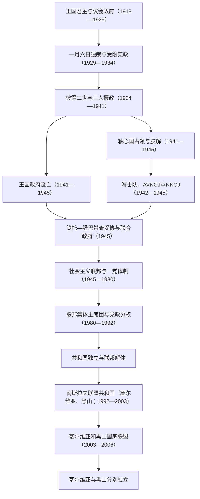

# 南斯拉夫国家元首与政府首脑表

## 范围与口径

本表集中整理1918—2006年历次南斯拉夫共同国家的君主、摄政、法定国家元首、政府首脑及实际权力结构。需要区分四个制度断点：

1. 1918—1941年的塞尔维亚人、克罗地亚人和斯洛文尼亚人王国／南斯拉夫王国是卡拉乔尔杰维奇王朝统治的君主国。
2. 1941—1945年王国政府流亡海外，境内同时存在轴心国占领和肢解政权、王党切特尼克以及共产党领导的游击队—反法西斯委员会；这不是一条单一行政序列。
3. 1945—1992年的民主联邦南斯拉夫、南斯拉夫联邦人民共和国和南斯拉夫社会主义联邦共和国是同一社会主义联邦的连续制度阶段；法定元首、联邦政府首脑和执政党实际领导应分表。
4. 1992年由塞尔维亚和黑山组成的南斯拉夫联盟共和国并未被国际社会自动承认为旧联邦的唯一延续者；2003年又改组为权力较弱的塞尔维亚和黑山国家联盟，2006年终结。

政府首脑表按人物连续任职段排列。同一人连续主持多个内阁但没有离职时合并为一行，并在备注中说明；流亡政府、游击队政府和1945年联合政府分别标明，避免把并行政权写成正常轮替。

## 职位与政体演变图

## 王国君主与摄政（1918—1945）

### 君主完整序列

| 顺序 | 君主 | 王室 | 在位时间 | 与前任关系 | 关键事件与备注 |
|---:|---|---|---|---|---|
| 1 | **彼得一世**（Petar I Karađorđević） | 卡拉乔尔杰维奇王朝 | 1918-12-01—1921-08-16 | 原塞尔维亚国王，成为统一王国首任君主 | 年老多病，建国后王权继续由王储亚历山大摄理；1921年《维多夫丹宪法》颁布后不久去世。 |
| 2 | **亚历山大一世**（Aleksandar I） | 卡拉乔尔杰维奇王朝 | 1921-08-16—1934-10-09 | 彼得一世次子、长期摄政王 | 1929年废宪解散议会并建立个人独裁，同年把国名改为“南斯拉夫王国”；1934年在马赛遇刺。 |
| 3 | **彼得二世**（Petar II） | 卡拉乔尔杰维奇王朝 | 1934-10-09—1945-11-29 | 亚历山大一世长子 | 即位时11岁；1934—1941年由三人摄政。1941年政变后提前亲政，轴心国入侵后流亡；1945年制宪议会废除王室。 |

### 摄政与代行王权

| 时间 | 摄政者或机构 | 权力来源 | 作用与备注 |
|---|---|---|---|
| 1918-12-01—1921-08-16 | **王储亚历山大** | 彼得一世早在1914年因病把王权职能交给王储 | 实际主持统一建国、战后边界与首届政府任命，父王去世后继位。 |
| 1934-10-09—1934-10-11 | 尼古拉·乌祖诺维奇政府 | 亚历山大遇刺后至摄政者宣誓前的临时安排 | 政府短暂代行王权，不能视为另立国家元首。 |
| 1934-10-11—1941-03-27 | **保罗亲王**、拉登科·斯坦科维奇、伊沃·佩罗维奇 | 亚历山大一世遗嘱与宪制安排 | 三人共同摄政，保罗亲王是政治核心；1941年加入三国同盟后被军人政变推翻。 |
| 1945-03-05—1945-11-29 | 斯尔詹·布迪萨夫列维奇、安特·曼迪奇、杜尚·塞尔内茨 | 彼得二世在铁托—舒巴希奇妥协下委任 | 三人代表流亡国王行使名义职能，与联合政府共存；共和国成立后自动终止。 |

## 王国与流亡政府首脑（1918—1945）

### 统一王国境内政府

| 顺序 | 政府首脑 | 任期 | 政党 / 政治基础 | 关键事件与备注 |
|---:|---|---|---|---|
| — | 尼古拉·帕西奇（Nikola Pašić） | 1918-12-01—1918-12-22 | 人民激进党 | 以塞尔维亚末任首相身份临时代行统一国家政府首脑，随后正式联合政府成立。 |
| 1 | 斯托扬·普罗蒂奇（Stojan Protić） | 1918-12-22—1919-08-16 | 人民激进党 | 首任正式首相；围绕中央集权、地方自治和制宪发生联盟冲突。 |
| 2 | 柳博米尔·达维多维奇（Ljubomir Davidović） | 1919-08-16—1920-02-19 | 民主党 | 处理制宪选举前政治与社会动荡。 |
| 3 | 斯托扬·普罗蒂奇（第二任） | 1920-02-19—1920-05-16 | 人民激进党 | 因执政联盟与自治问题再度更替。 |
| 4 | 米连科·韦斯尼奇（Milenko Vesnić） | 1920-05-16—1921-01-01 | 人民激进党主导联盟 | 主持制宪选举及宪法准备。 |
| 5 | **尼古拉·帕西奇** | 1921-01-01—1924-07-28 | 人民激进党 | 连续主持多个内阁；1921年推动《维多夫丹宪法》，确立中央集权君主国。 |
| 6 | 柳博米尔·达维多维奇（第二任） | 1924-07-28—1924-11-06 | 民主党及反激进党联盟 | 尝试缓和克罗地亚问题，联盟迅速瓦解。 |
| 7 | 尼古拉·帕西奇（再任） | 1924-11-06—1926-04-08 | 人民激进党 | 借选举联盟重新执政，因腐败争议和党内压力离职。 |
| 8 | 尼古拉·乌祖诺维奇（Nikola Uzunović） | 1926-04-08—1927-04-17 | 人民激进党 | 主持两个连续内阁，议会阵营仍高度分裂。 |
| 9 | 韦利米尔·武基切维奇（Velimir Vukićević） | 1927-04-17—1928-07-28 | 人民激进党 | 1928年议会枪击斯捷潘·拉迪奇等克罗地亚农民党议员后辞职。 |
| 10 | 安东·科罗舍茨（Anton Korošec） | 1928-07-28—1929-01-07 | 斯洛文尼亚人民党、王室支持 | 首位非塞尔维亚族首相；无法化解议会抵制和民族危机，国王独裁后被解除。 |
| 11 | **佩塔尔·日夫科维奇**（Petar Živković） | 1929-01-07—1932-04-04 | 王室军政集团；后南斯拉夫激进农民民主党 | 执行一月六日独裁、禁党、审查与行政区重划；1931年受限宪法未恢复自由竞争。 |
| 12 | 沃伊斯拉夫·马林科维奇（Vojislav Marinković） | 1932-04-04—1932-07-03 | 王室执政集团 | 任期短暂，未能扩大独裁体制的社会基础。 |
| 13 | 米兰·斯尔什基奇（Milan Srškić） | 1932-07-03—1934-01-27 | 南斯拉夫激进农民民主党 | 延续中央集权和警察统治，经济萧条加重不满。 |
| 14 | 尼古拉·乌祖诺维奇（再任） | 1934-01-27—1934-12-22 | 南斯拉夫国民党 | 任内亚历山大一世遇刺；短暂代行王权后继续任首相。 |
| 15 | 博戈柳布·耶夫蒂奇（Bogoljub Jevtić） | 1934-12-22—1935-06-24 | 南斯拉夫国民党 | 摄政初期政府；1935年选举争议削弱其地位。 |
| 16 | **米兰·斯托亚迪诺维奇**（Milan Stojadinović） | 1935-06-24—1939-02-05 | 南斯拉夫激进联盟 | 主持三个连续内阁，追求经济恢复并靠近意德；因克罗地亚问题、个人权力和外交风险被保罗亲王撤换。 |
| 17 | **德拉吉沙·茨韦特科维奇**（Dragiša Cvetković） | 1939-02-05—1941-03-27 | 南斯拉夫激进联盟与克罗地亚农民党妥协 | 1939年与马切克达成协议并建立克罗地亚自治省；1941年加入三国同盟后被政变推翻。 |

### 政变政府与流亡政府

| 顺序 | 政府首脑 | 任期 | 政府所在地 / 性质 | 关键事件与备注 |
|---:|---|---|---|---|
| 18 | **杜尚·西莫维奇**（Dušan Simović） | 1941-03-27—1942-01-11 | 贝尔格莱德；1941年4月后流亡开罗、伦敦 | 军人政变宣布彼得二世成年；轴心国入侵后撤离，政府与本土作战力量联系薄弱。 |
| 19 | 斯洛博丹·约万诺维奇（Slobodan Jovanović） | 1942-01-11—1943-06-26 | 伦敦流亡政府 | 连续主持两个内阁，支持德拉查·米哈伊洛维奇的切特尼克；盟国逐渐转向支持游击队。 |
| 20 | 米洛什·特里富诺维奇（Miloš Trifunović） | 1943-06-26—1943-08-10 | 伦敦流亡政府 | 试图重组跨党派政府，任期仅45天。 |
| 21 | 博日达尔·普里奇（Božidar Purić） | 1943-08-10—1944-07-08 | 伦敦流亡政府 | 盟国要求与铁托力量妥协，切特尼克的合作与抵抗记录亦使其国际地位下降。 |
| 22 | **伊万·舒巴希奇**（Ivan Šubašić） | 1944-07-08—1945-03-07 | 伦敦流亡政府；后参与联合安排 | 与铁托签订协议，同意建立联邦联合政府；其政府与游击队政府于1945年3月合并。 |

## 战时革命机构与1945年过渡元首

轴心国占领期间，王国法统、占领合作政权和游击队革命政权同时存在。下表只列最终成为社会主义联邦制度来源的反法西斯委员会机构，不把它写成当时对全部领土已有无争议统治。

| 顺序 | 法定负责人 | 机构与职务 | 任期 | 关键事件与备注 |
|---:|---|---|---|---|
| 1 | **伊万·里巴尔**（Ivan Ribar） | 南斯拉夫人民解放反法西斯委员会执行委员会主席 | 1942-11-27—1943-11-29 | AVNOJ首届会议产生的常设负责人，早期仍是游击队政治机关。 |
| 1 | 伊万·里巴尔 | AVNOJ主席团主席 | 1943-11-30—1945-08-10 | 第二次会议宣布AVNOJ为最高立法与执行机关，设计六共和国联邦；同时成立铁托主持的民族解放委员会。 |
| 1 | 伊万·里巴尔 | 民主联邦南斯拉夫临时国民议会主席团主席 | 1945-08-10—1945-11-29 | AVNOJ与战前议员等合并为临时议会；三人王室摄政仍在名义上并存。 |
| 1 | 伊万·里巴尔 | 制宪议会主席团主席；后为国民议会主席团主席 | 1945-11-29—1953-01-14 | 制宪议会废除王室、成立共和国；1946年宪法后继续担任形式国家元首，实际党政核心是铁托。 |

### 1943—1945年并行权力结构

| 层级 | 负责人 / 机构 | 实际作用 |
|---|---|---|
| 游击队军事与党内最高领导 | **约瑟普·布罗兹·铁托** | 南共领导人、游击队最高统帅；1943年起主持民族解放委员会，掌握革命政权实际军政权力。 |
| 革命法定代表机关 | 伊万·里巴尔与AVNOJ主席团 | 提供多民族联邦和立法代表的制度形式。 |
| 王国法统 | 彼得二世、伦敦政府；1945年三人摄政 | 获英国等盟国承认，但本土控制力逐步下降；1944—1945年被迫与铁托妥协。 |
| 占领与合作政权 | 德、意、匈、保占领当局及各地附庸政权 | 控制不同区域，实施镇压、征用、驱逐和种族灭绝政策；1944—1945年军事失败后瓦解。 |

## 社会主义联邦法定国家元首（1945—1992）

### 单一元首阶段

| 顺序 | 国家元首 | 职务 | 任期 | 权力性质与备注 |
|---:|---|---|---|---|
| 1 | 伊万·里巴尔 | 国民议会主席团主席 | 1945-11-29—1953-01-14 | 形式国家元首；一党体制下重大决策由铁托、南共中央和政府作出。 |
| 2 | **约瑟普·布罗兹·铁托** | 共和国总统 | 1953-01-14—1980-05-04 | 同时长期任南共联盟领导与武装力量最高统帅；1953—1963年还兼联邦执行委员会主席，1974年获不受任期限制的总统地位。 |

### 集体主席团轮值主席

1974年宪法规定六个共和国、塞尔维亚境内两个自治省及一度由执政党首组成联邦主席团。铁托在世时仍以终身总统凌驾于轮值机制；其去世后，主席团主席按共和国和自治省代表轮换。主席是集体元首的召集者，不等于拥有铁托式个人权力。

| 顺序 | 主席 | 代表单位 | 任期 | 关键事件与备注 |
|---:|---|---|---|---|
| 1 | 拉扎尔·科利舍夫斯基（Lazar Koliševski） | 马其顿 | 1980-05-04—1980-05-15 | 原任副主席，铁托去世后自动接任11天。 |
| 2 | 茨维耶廷·米亚托维奇（Cvijetin Mijatović） | 波斯尼亚和黑塞哥维那 | 1980-05-15—1981-05-15 | 铁托身后首个完整年度轮值主席。 |
| 3 | 塞尔盖·克赖格尔（Sergej Kraigher） | 斯洛文尼亚 | 1981-05-16—1982-05-15 | 任内科索沃抗议后联邦强化安全控制，经济稳定委员会提出改革。 |
| 4 | 佩塔尔·斯坦鲍利奇（Petar Stambolić） | 塞尔维亚 | 1982-05-16—1983-05-15 | 债务、紧缩和共和国利益冲突加深。 |
| 5 | 米卡·什皮利亚克（Mika Špiljak） | 克罗地亚 | 1983-05-16—1984-05-15 | 曾任联邦政府首脑，继续协调经济危机政策。 |
| 6 | 韦塞林·久拉诺维奇（Veselin Đuranović） | 黑山 | 1984-05-16—1985-05-15 | 共和国与联邦财政权争议扩大。 |
| 7 | 拉多万·弗莱科维奇（Radovan Vlajković） | 伏伊伏丁那 | 1985-05-16—1986-05-15 | 自治省仍拥有联邦主席团席位和否决影响。 |
| 8 | 西南·哈萨尼（Sinan Hasani） | 科索沃 | 1986-05-16—1987-05-15 | 科索沃族群紧张和塞尔维亚民族政治上升。 |
| 9 | 拉扎尔·莫伊索夫（Lazar Mojsov） | 马其顿 | 1987-05-16—1988-05-15 | 经济危机和共和国党组织竞争加剧。 |
| 10 | 拉伊夫·迪兹达雷维奇（Raif Dizdarević） | 波斯尼亚和黑塞哥维那 | 1988-05-16—1989-05-15 | 反官僚革命改变塞尔维亚、伏伊伏丁那、科索沃和黑山权力格局。 |
| 11 | 亚内兹·德尔诺夫舍克（Janez Drnovšek） | 斯洛文尼亚 | 1989-05-16—1990-05-15 | 任内东欧剧变、南共十四大破裂，各共和国转向多党选举。 |
| 12 | 鲍里萨夫·约维奇（Borisav Jović） | 塞尔维亚 | 1990-05-16—1991-05-15 | 与塞尔维亚领导层关系密切；联邦军与共和国政府冲突升级。 |
| — | 主席空缺；主席团集体 | 八名成员 | 1991-05-16—1991-06-30 | 亲塞尔维亚阵营阻止按轮换应接任的梅西奇当选；塞伊多·拜拉莫维奇只负责协调召集，不是正式主席。 |
| 13 | 斯捷潘·梅西奇（Stjepan Mesić） | 克罗地亚 | 1991-06-30—1991-12-05 | 在欧洲共同体施压下当选；克罗地亚宣布独立后其权威被塞尔维亚、黑山方面否认。 |
| — | 布兰科·科斯蒂奇（Branko Kostić） | 黑山 | 1991-12-05—1992-06-15 | 以副主席身份代行主席职能；主席团已失去斯洛文尼亚、克罗地亚等代表的有效参与，不能视作完整八单位联邦正常轮值。 |

## 社会主义联邦政府首脑（1943/1945—1992）

| 顺序 | 政府首脑 | 职务 | 任期 | 关键事件与备注 |
|---:|---|---|---|---|
| 1 | **约瑟普·布罗兹·铁托** | 民族解放委员会主席；1945年后部长会议 / 联邦政府主席；1953年后联邦执行委员会主席 | 1943-11-30起领导NKOJ；联合政府任期为1945-03-07—1963-06-29 | 1945年前与流亡政府并行；战后组织一党国家、国有化和联邦建制。1948年与斯大林决裂，1950年后发展工人自治和对外不结盟。 |
| 2 | 佩塔尔·斯坦鲍利奇 | 联邦执行委员会主席 | 1963-06-29—1967-05-16 | 1963年宪法后总统一职与政府首脑分离，经济改革和联邦分权上升。 |
| 3 | 米卡·什皮利亚克 | 联邦执行委员会主席 | 1967-05-16—1969-05-18 | 处理1968年学生抗议、科索沃示威及经济改革矛盾。 |
| 4 | 米特亚·里比契奇（Mitja Ribičič） | 联邦执行委员会主席 | 1969-05-18—1971-07-30 | 克罗地亚之春与共和国权力诉求高涨时期。 |
| 5 | **杰马尔·比耶迪奇**（Džemal Bijedić） | 联邦执行委员会主席 | 1971-07-30—1977-01-18 | 连续主持两个内阁；任内通过1974年宪法并扩大共和国、自治省权限，后因空难去世。 |
| 6 | 韦塞林·久拉诺维奇 | 联邦执行委员会主席 | 1977-01-18—1982-05-16 | 铁托去世与外债危机初期；联邦开始紧缩和稳定计划。 |
| 7 | **米尔卡·普拉宁茨**（Milka Planinc） | 联邦执行委员会主席 | 1982-05-16—1986-05-15 | 首位女性联邦政府首脑；在国际收支危机下实施配给、进口压缩和债务重组。 |
| 8 | 布兰科·米库利奇（Branko Mikulić） | 联邦执行委员会主席 | 1986-05-15—1989-03-16 | 通胀、工资冲突和大规模罢工加剧；1988年底内阁集体辞职，任至继任政府产生。 |
| 9 | **安特·马尔科维奇**（Ante Marković） | 联邦执行委员会主席 | 1989-03-16—1991-12-20 | 推动货币稳定、市场化和联邦改革党，但共和国政府控制财政、媒体和警察，战争使改革失去基础。 |
| — | 亚历山大·米特罗维奇（Aleksandar Mitrović） | 代理联邦执行委员会主席 | 1991-12-20—1992-07-14 | 由仍参与联邦的塞尔维亚、黑山方面安装；旧联邦机构在继承争议中继续运作，至新联盟共和国政府就职。 |

## 社会主义时期执政党实际领导

党首在一党体制中拥有关键人事和政策权。铁托兼具党、国家与军队最高地位；1980年后党主席同样轮换，权力分散在联邦主席团、共和国党组织、政府、军队和地方安全机构之间，不能把下列轮值者写成逐个继承铁托的个人统治者。

| 顺序 | 南共联盟最高领导 | 任期 | 权力变化与备注 |
|---:|---|---|---|
| 1 | **约瑟普·布罗兹·铁托** | 1937—1980-05-04 | 先任总书记，后称主席；长期控制党、军和国家仲裁权。 |
| — | 斯特万·多龙尼斯基（Stevan Doronjski） | 1980-05-04—1980-10-20 | 铁托去世后的临时党主席团主席。 |
| 2 | 拉扎尔·莫伊索夫 | 1980-10-20—1981-10-20 | 党内开始年度轮换。 |
| 3 | 杜尚·德拉戈萨瓦茨（Dušan Dragosavac） | 1981-10-20—1982-06-29 | 处理科索沃抗议后的组织整顿。 |
| 4 | 米特亚·里比契奇 | 1982-06-29—1983-06-30 | 共和国党组织自主性继续增强。 |
| 5 | 德拉戈斯拉夫·马尔科维奇（Dragoslav Marković） | 1983-06-30—1984-06-26 | 联邦党逐渐难以强制协调各共和国。 |
| 6 | 阿里·舒克里亚（Ali Šukrija） | 1984-06-26—1985-06-25 | 科索沃出身的联邦轮值党首。 |
| 7 | 维多耶·扎尔科维奇（Vidoje Žarković） | 1985-06-25—1986-06-26 | 经济和民族问题继续恶化。 |
| 8 | 米兰科·雷诺维察（Milanko Renovica） | 1986-06-26—1987-06-30 | 任内塞尔维亚党内权力重组。 |
| 9 | 博什科·克鲁尼奇（Boško Krunić） | 1987-06-30—1988-06-30 | 反官僚革命开始冲击联邦平衡。 |
| 10 | 斯蒂佩·舒瓦尔（Stipe Šuvar） | 1988-06-30—1989-05-17 | 无力制止共和国民族动员和相互否决。 |
| 11 | 米兰·潘切夫斯基（Milan Pančevski） | 1989-05-17—1990-05-17 | 1990年1月十四大因斯洛文尼亚、克罗地亚代表团退出而破裂；统一执政党实际停止运作。 |

## 南斯拉夫联盟共和国国家元首（1992—2003）

1992年的南斯拉夫联盟共和国只包括塞尔维亚和黑山。其宪法把联邦总统设为国家元首，但1992—1997年塞尔维亚总统斯洛博丹·米洛舍维奇控制最大共和国、执政党、警察和关键联邦联盟，往往比联邦总统更具实际权力。

| 顺序 | 国家元首 | 任期 | 产生方式与实际权力 |
|---:|---|---|---|
| 1 | 多布里察·乔西奇（Dobrica Ćosić） | 1992-06-15—1993-05-31 | 联邦议会选出；与米洛舍维奇在战争政策和权力上冲突，遭议会罢免。 |
| — | 米洛什·拉杜洛维奇（Miloš Radulović） | 1993-05-31—1993-06-25 | 共和国院议长依法代理。 |
| 2 | 佐兰·利利奇（Zoran Lilić） | 1993-06-25—1997-06-25 | 联邦议会选出，政治上依附米洛舍维奇；任内制裁和恶性通胀后实施货币稳定。 |
| — | 斯尔贾·博若维奇（Srđa Božović） | 1997-06-25—1997-07-23 | 共和国院议长代理。 |
| 3 | **斯洛博丹·米洛舍维奇**（Slobodan Milošević） | 1997-07-23—2000-10-07 | 从塞尔维亚总统转任联邦总统；科索沃战争、北约轰炸与选举争议后在2000年群众抗议中失去权力。 |
| 4 | **沃伊斯拉夫·科什图尼察**（Vojislav Koštunica） | 2000-10-07—2003-03-07 | 2000年直接选举击败米洛舍维奇；民主联盟内部与塞尔维亚政府分权竞争，任至国家联盟总统就职。 |

## 南斯拉夫联盟共和国政府首脑（1992—2003）

| 顺序 | 政府首脑 | 任期 | 政治基础与关键事件 |
|---:|---|---|---|
| 1 | 米兰·帕尼奇（Milan Panić） | 1992-07-14—1993-02-09 | 无党派、兼具美籍商业背景；主张结束战争和制裁，与米洛舍维奇冲突后失去议会支持。 |
| 2 | **拉多耶·孔蒂奇**（Radoje Kontić） | 1993-02-09—1998-05-19 | 黑山社会主义者民主党；主持两个内阁，实际受塞尔维亚—黑山执政党联盟制约，因黑山路线分裂被撤换。 |
| 3 | 莫米尔·布拉托维奇（Momir Bulatović） | 1998-05-19—2000-11-04 | 黑山社会主义人民党、亲米洛舍维奇；任内科索沃战争和北约轰炸，2000年政权更替后离职。 |
| 4 | 佐兰·日日奇（Zoran Žižić） | 2000-11-04—2001-07-24 | 黑山社会主义人民党与塞尔维亚民主反对派联盟；因米洛舍维奇被引渡至前南刑庭而辞职，政府继续看守至继任者就职。 |
| 5 | 德拉吉沙·佩希奇（Dragiša Pešić） | 2001-07-24—2003-03-07 | 黑山社会主义人民党；推动与黑山重新谈判国家结构，任至联邦改组为国家联盟。 |

## 塞尔维亚和黑山国家联盟（2003—2006）

2003年《宪章》把联盟层级缩减为外交、国防、部分经济协调和人权事务。两共和国保留不同货币、海关及经济制度，并可在三年后启动退出程序。国家联盟总统同时担任部长会议主席，因此元首与政府首脑只有一人。

| 顺序 | 国家元首兼政府首脑 | 任期 | 权力结构与终结 |
|---:|---|---|---|
| 1 | **斯韦托扎尔·马罗维奇**（Svetozar Marović） | 2003-03-07—2006-06-03 | 由国家联盟议会选举；中央机构权力很弱，塞尔维亚和黑山政府分别掌握内政、经济与警察。黑山2006年公投后宣布独立，联盟依法解体。 |

## 实际权力结构的阶段变化

| 阶段 | 法定国家元首 | 政府首脑 | 实际权力中心 |
|---|---|---|---|
| 1918—1929年 | 国王 | 首相与议会内阁 | 王室、塞尔维亚中央官僚与议会党派共同竞争，中央集权宪法有利于最大党和王权。 |
| 1929—1934年 | 亚历山大一世 | 国王任命的政府 | 国王本人、宫廷和军警体系；首相主要执行个人独裁政策。 |
| 1934—1941年 | 未成年彼得二世 | 首相 | 保罗亲王主导三人摄政，后期通过茨韦特科维奇—马切克协议寻求妥协。 |
| 1941—1945年 | 流亡国王；1945年三人摄政 | 流亡政府与铁托革命政府并行 | 境内控制随战争变化；1943年后铁托游击队、南共和AVNOJ快速取得军事政治优势。 |
| 1945—1980年 | 里巴尔后为铁托 | 铁托及其后的联邦执行委员会主席 | 铁托兼任党、军和国家仲裁者；共和国机构在1960—1970年代逐步扩大权限。 |
| 1980—1990年 | 集体主席团 | 联邦执行委员会 | 权力分散在主席团、共和国党组织、联邦政府、军队与地方安全机构；没有单一“铁托继承人”。 |
| 1990—1992年 | 分裂的集体主席团 | 马尔科维奇政府后残余机构 | 民选共和国政府、塞尔维亚领导层和南斯拉夫人民军分别掌权，联邦机关失去统一执行力。 |
| 1992—1997年 | 乔西奇、利利奇等联邦总统 | 联邦政府 | 塞尔维亚总统米洛舍维奇及其党警网络居主导；黑山领导层逐渐分化。 |
| 1997—2000年 | 米洛舍维奇 | 布拉托维奇政府 | 联邦总统与塞尔维亚执政体系结合，科索沃战争后被反对派和群众运动推翻。 |
| 2000—2003年 | 科什图尼察 | 日日奇、佩希奇 | 联邦总统、塞尔维亚政府和黑山政府三方分权，国家重组谈判取代统一中央政策。 |
| 2003—2006年 | 马罗维奇 | 同一人兼任 | 两共和国政府掌握绝大多数实权，联盟主要为过渡协调框架。 |

## 制度转折与终结原因

| 时间 | 转折 | 结构因素 | 外部压力 | 直接触发 |
|---|---|---|---|---|
| 1929年 | 王室独裁 | 中央集权宪法无法调和民族与党派冲突 | 战后边界和经济压力 | 1928年议会枪击及克罗地亚议员抵制使国王废宪。 |
| 1941年 | 王国崩溃 | 军队、国家认同和地区政治整合不足 | 德意及盟国包围，轴心国军事优势 | 3月政变后德国下令入侵，11天战争击溃王国。 |
| 1945年 | 君主制终结 | 流亡政府本土基础衰减，游击队控制军政组织 | 盟国承认铁托并推动妥协，苏军协助解放贝尔格莱德 | 人民阵线选举和11月29日制宪议会决议废除王室。 |
| 1980—1992年 | 社会主义联邦解体 | 1974年分权、债务通胀、发展差距、党国合法性衰退和民族政治相互强化 | 冷战结束削弱南斯拉夫战略特殊性；欧洲国家与国际金融力量介入 | 1990年统一执政党破裂、共和国多党选举、1991年独立决定与战争使联邦机关失效。 |
| 2003年 | 联盟共和国改组 | 塞黑经济和政治制度分离，黑山拒绝联邦集中 | 欧盟斡旋推动暂时共同框架 | 《贝尔格莱德协议》与国家联盟宪章生效。 |
| 2006年 | 国家联盟终结 | 联盟缺乏共同财政、货币和政治认同 | 欧盟为公投设定程序与承认条件 | 黑山公投达到规定门槛，6月3日宣布独立。 |

## 前后关系

- 建国、王朝与宪政：[南斯拉夫王国](/%E4%BA%BA%E6%96%87%E7%A7%91%E5%AD%A6/%E5%8E%86%E5%8F%B2/%E6%AC%A7%E6%B4%B2/%E4%B8%9C%E5%8D%97%E6%AC%A7%E4%B8%8E%E5%B7%B4%E5%B0%94%E5%B9%B2/%E5%8D%97%E6%96%AF%E6%8B%89%E5%A4%AB%E5%8E%86%E5%8F%B2/%E5%8D%97%E6%96%AF%E6%8B%89%E5%A4%AB%E7%8E%8B%E5%9B%BD.md)
- 战时并立政权：[第二次世界大战时期的南斯拉夫](/%E4%BA%BA%E6%96%87%E7%A7%91%E5%AD%A6/%E5%8E%86%E5%8F%B2/%E6%AC%A7%E6%B4%B2/%E4%B8%9C%E5%8D%97%E6%AC%A7%E4%B8%8E%E5%B7%B4%E5%B0%94%E5%B9%B2/%E5%8D%97%E6%96%AF%E6%8B%89%E5%A4%AB%E5%8E%86%E5%8F%B2/%E7%AC%AC%E4%BA%8C%E6%AC%A1%E4%B8%96%E7%95%8C%E5%A4%A7%E6%88%98%E6%97%B6%E6%9C%9F%E7%9A%84%E5%8D%97%E6%96%AF%E6%8B%89%E5%A4%AB.md)
- 社会主义联邦：[南斯拉夫社会主义联邦共和国](/%E4%BA%BA%E6%96%87%E7%A7%91%E5%AD%A6/%E5%8E%86%E5%8F%B2/%E6%AC%A7%E6%B4%B2/%E4%B8%9C%E5%8D%97%E6%AC%A7%E4%B8%8E%E5%B7%B4%E5%B0%94%E5%B9%B2/%E5%8D%97%E6%96%AF%E6%8B%89%E5%A4%AB%E5%8E%86%E5%8F%B2/%E5%8D%97%E6%96%AF%E6%8B%89%E5%A4%AB%E7%A4%BE%E4%BC%9A%E4%B8%BB%E4%B9%89%E8%81%94%E9%82%A6%E5%85%B1%E5%92%8C%E5%9B%BD.md)
- 解体过程：[南斯拉夫解体](/%E4%BA%BA%E6%96%87%E7%A7%91%E5%AD%A6/%E5%8E%86%E5%8F%B2/%E6%AC%A7%E6%B4%B2/%E4%B8%9C%E5%8D%97%E6%AC%A7%E4%B8%8E%E5%B7%B4%E5%B0%94%E5%B9%B2/%E5%8D%97%E6%96%AF%E6%8B%89%E5%A4%AB%E5%8E%86%E5%8F%B2/%E5%8D%97%E6%96%AF%E6%8B%89%E5%A4%AB%E8%A7%A3%E4%BD%93.md)
- 1992—2006年塞黑共同国家：[南斯拉夫联盟共和国与塞尔维亚和黑山](/%E4%BA%BA%E6%96%87%E7%A7%91%E5%AD%A6/%E5%8E%86%E5%8F%B2/%E6%AC%A7%E6%B4%B2/%E4%B8%9C%E5%8D%97%E6%AC%A7%E4%B8%8E%E5%B7%B4%E5%B0%94%E5%B9%B2/%E5%8D%97%E6%96%AF%E6%8B%89%E5%A4%AB%E5%8E%86%E5%8F%B2/%E5%8D%97%E6%96%AF%E6%8B%89%E5%A4%AB%E8%81%94%E7%9B%9F%E5%85%B1%E5%92%8C%E5%9B%BD%E4%B8%8E%E5%A1%9E%E5%B0%94%E7%BB%B4%E4%BA%9A%E5%92%8C%E9%BB%91%E5%B1%B1.md)
- 返回：[南斯拉夫历史](/%E4%BA%BA%E6%96%87%E7%A7%91%E5%AD%A6/%E5%8E%86%E5%8F%B2/%E6%AC%A7%E6%B4%B2/%E4%B8%9C%E5%8D%97%E6%AC%A7%E4%B8%8E%E5%B7%B4%E5%B0%94%E5%B9%B2/%E5%8D%97%E6%96%AF%E6%8B%89%E5%A4%AB%E5%8E%86%E5%8F%B2/README.md)
