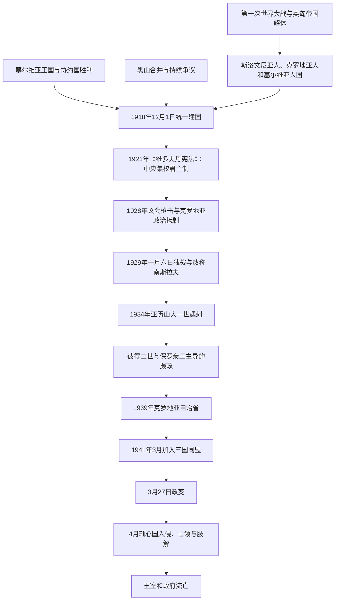

# 南斯拉夫王国

## 时间

1918年12月1日—1941年4月17日（君主制法统延续至1945年11月29日）

## 别称

- 1918—1929年：塞尔维亚人、克罗地亚人和斯洛文尼亚人王国
- 1929—1941年：南斯拉夫王国

## 概括

南斯拉夫王国是第一次世界大战结束后建立的南斯拉夫统一国家实验。它把战胜国塞尔维亚、此前独立的黑山，以及从奥匈帝国分离出来的斯洛文尼亚、克罗地亚、达尔马提亚、波斯尼亚和黑塞哥维那、伏伊伏丁那等地区置于同一君主国之中。新国家拥有较大的领土、人口和国际地位，却继承了极不均衡的法律、财政、土地、宗教和行政制度。

建国争议的核心不是是否合作，而是以何种国家结构合作。塞尔维亚主要政治力量倾向把统一理解为以贝尔格莱德为中心的单一国家；克罗地亚和斯洛文尼亚政治力量中则有较强的联邦、自治或历史地区权利诉求。1921年《维多夫丹宪法》确立中央集权君主制，1928年议会枪击把制度冲突推至临界点，亚历山大一世于1929年废宪独裁。1939年克罗地亚自治省是迟来的结构妥协，但欧洲战争爆发和1941年轴心国入侵使改革尚未完成便告中断。

## 建立背景

### 战争、帝国崩溃与统一方案

第一次世界大战前，南斯拉夫语族人口分处塞尔维亚、黑山、奥匈帝国和奥斯曼帝国的继承空间。1914年战争爆发后，塞尔维亚政府把解放并统一南斯拉夫人列为战争目标；流亡海外的奥匈南斯拉夫政治人物则组成“南斯拉夫委员会”。双方既需要合作争取协约国支持，也对王朝、边界和中央—地方关系存在分歧。

1917年《科孚宣言》提出建立由卡拉乔尔杰维奇王朝统治的共同国家，却没有解决联邦制还是单一制。1918年奥匈帝国崩溃，萨格勒布成立“斯洛文尼亚人、克罗地亚人和塞尔维亚人国”，但其军队、财政和外交承认不足；意大利依据战时秘密协定向亚得里亚海东岸推进，也加强了迅速与塞尔维亚联合的压力。

### 1918年12月1日建国

1918年11月，伏伊伏丁那议会宣布与塞尔维亚联合，黑山波德戈里察议会废黜彼得罗维奇王朝并选择与塞尔维亚合并；相关程序和代表性此后长期存在争议。12月1日，摄政王亚历山大在贝尔格莱德接受来自萨格勒布代表团的请愿，宣布成立塞尔维亚人、克罗地亚人和斯洛文尼亚人王国。

建国具有三重基础：塞尔维亚王国的军队与国际法地位、奥匈南斯拉夫地区代表机关的政治决定，以及协约国战后秩序。由于制宪会议尚未决定国家结构，临时统一在事实上先采用塞尔维亚王室和中央政府框架，这为后来“统一”与“兼并”的相反叙事留下空间。

## 国家演变图

## 制宪与议会政治（1918—1928）

### 制度整合

新国家需要统一至少六套法律行政传统、不同货币和铁路系统、差异悬殊的土地关系及税制。政府推行货币兑换、土地改革、退伍军人安置和行政合并，但兑换比率、征地补偿与官职分配常被解释为地区间利益转移。塞尔维亚在战时人口与物质损失巨大，旧奥匈地区则拥有较高城市化和工业基础，双方对“谁为统一付出、谁从统一获益”的判断并不相同。

### 1921年《维多夫丹宪法》

1920年制宪议会选举后，人民激进党、民主党、克罗地亚共和农民党、斯洛文尼亚人民党、南斯拉夫共产党等代表不同地区与社会基础。政府很快禁止在工运中影响扩大的共产党活动。克罗地亚共和农民党一度抵制议会，宪法最终在部分代表缺席和穆斯林组织等关键票支持下通过。

宪法确立世袭君主、单院议会和中央任命的行政体系，不承认历史地区作为联邦单位。国王拥有任命政府、解散议会和军队统帅等广泛权力。形式上实行议会制，实际上内阁更替频繁，选举暴力、行政干预和王室影响削弱议会责任制。

### 民族与国家观念冲突

塞尔维亚主流中央集权派常以“三名一族”观念主张塞尔维亚人、克罗地亚人和斯洛文尼亚人是一个民族的三个名称；克罗地亚农民党领袖斯捷潘·拉迪奇则要求承认克罗地亚政治主体性。斯洛文尼亚政党多以天主教社会网络和自治诉求参与联盟政治，波斯尼亚穆斯林政治组织则通过保护土地所有权和地方利益争取议会筹码。科索沃、马其顿和黑山也存在治安、认同与行政整合问题。

1925年拉迪奇承认王朝与宪法后短暂入阁，但合作未能消除结构冲突。1927年塞尔维亚独立民主党与克罗地亚农民党组成“农民—民主联盟”，要求重新安排国家权力，议会对抗进一步尖锐。

## 议会枪击与王室独裁（1928—1934）

1928年6月20日，黑山籍激进党议员普尼沙·拉契奇在议会向克罗地亚农民党代表开枪，斯捷潘·拉迪奇后来伤重去世。克罗地亚反对派退出贝尔格莱德议会，国家出现事实上的宪制瘫痪。

1929年1月6日，亚历山大一世解散议会、废止宪法、禁止以民族和宗教为基础的政党并实行新闻审查。10月国家改名为“南斯拉夫王国”，原历史地区被划为以河流命名的九个省，边界有意跨越族群和历史区域。政权试图以“完整南斯拉夫主义”从上而下制造共同国民身份，依靠宫廷、军队、警察和中央官僚运作。

1931年国王颁布新宪法并恢复受严格控制的两院制和公开投票，反对党仍难以自由竞争。独裁压制了公开政治，却促使乌斯塔沙等激进组织在海外活动，也没有解决农业贫困、经济萧条与地区财政矛盾。1934年10月，亚历山大在法国马赛被与乌斯塔沙合作的马其顿内部革命组织成员刺杀。

## 摄政、对外摇摆与克罗地亚妥协（1934—1941）

### 保罗亲王主导摄政

彼得二世即位时只有11岁，保罗亲王与另外两名摄政共同代行王权。摄政政权逐步放松独裁，但1935年选举制度仍使政府阵营以较少优势票获得压倒性席位。米兰·斯托亚迪诺维奇试图以经济恢复、国家级执政联盟和较灵活的对克政策巩固政权，同时在外交上改善与意大利、德国和保加利亚关系。

法国集体安全体系衰落、英国避免在巴尔干承担军事义务、德国成为重要贸易伙伴，使南斯拉夫越来越难以维持传统亲法路线。政府需要在国内反法西斯舆论、与希腊和土耳其的巴尔干协约以及轴心国包围之间平衡。

### 1939年克罗地亚自治省

摄政王担心克罗地亚问题会在战争中摧毁国家，1939年撤换斯托亚迪诺维奇，任命德拉吉沙·茨韦特科维奇与克罗地亚农民党领袖弗拉特科·马切克谈判。《茨韦特科维奇—马切克协议》把萨瓦省、滨海省及部分相邻地区合并为克罗地亚自治省，由总督和自治机构管理教育、农业、司法及部分内政，马切克进入中央政府。

该妥协首次承认克罗地亚领土政治单位，却留下波斯尼亚和黑塞哥维那分割、塞尔维亚和斯洛文尼亚地位、财政权限及最终宪法改革等问题。战争爆发后议会未能完成全面制度重建，其他群体也担心双边协议牺牲其权益。

## 1941年崩溃过程

### 加入三国同盟与政变

1940—1941年，匈牙利、罗马尼亚和保加利亚先后靠近轴心国，意大利占领阿尔巴尼亚并进攻希腊，南斯拉夫几乎被轴心势力包围。德国为支援对希腊作战，要求贝尔格莱德确保交通与政治服从。1941年3月25日，茨韦特科维奇政府签署加入三国同盟的议定书，并取得不驻军、不过境等承诺。

3月27日，空军将领杜尚·西莫维奇等发动政变，推翻摄政并宣布彼得二世成年。政变得到贝尔格莱德群众欢迎，却没有形成可靠的军事同盟。希特勒随即命令摧毁南斯拉夫。

### 入侵、投降与国家肢解

1941年4月6日德国轰炸贝尔格莱德，并与意大利、匈牙利、保加利亚等从多方向进攻。南斯拉夫军队动员不全、指挥体系迟缓，部队忠诚和装备差异严重；轴心国装甲、空军和通讯优势又形成压倒性打击。4月17日军方签署无条件投降，王室与政府经希腊、埃及流亡英国。

领土随后被直接吞并、军事占领或交给附庸政权。克罗地亚独立国控制克罗地亚和波黑大部，塞尔维亚处于德国军事占领和合作政府之下，斯洛文尼亚被德意匈分割，达尔马提亚部分地区由意大利吞并，马其顿大部交保加利亚占领，黑山由意大利控制。王国的国内政权就此毁灭，但彼得二世及流亡政府仍获盟国承认，直到1945年君主制正式废除。

## 王朝世系与政府结构

### 卡拉乔尔杰维奇王朝

| 顺序 | 君主 | 在位时间 | 摄政与关键事件 |
|---:|---|---|---|
| 1 | **彼得一世** | 1918-12-01—1921-08-16 | 年老多病，王储亚历山大继续代行王权；统一建国与《维多夫丹宪法》均发生于其名义统治期。 |
| 2 | **亚历山大一世** | 1921-08-16—1934-10-09 | 1929年建立个人独裁并改国名；1934年在马赛遇刺。 |
| 3 | **彼得二世** | 1934-10-09—1945-11-29 | 1934—1941年由三人摄政；1941年流亡，1945年被制宪议会废黜。 |

完整摄政、首相、流亡政府与后续共同国家领导序列见[南斯拉夫国家元首与政府首脑表](/%E4%BA%BA%E6%96%87%E7%A7%91%E5%AD%A6/%E5%8E%86%E5%8F%B2/%E6%AC%A7%E6%B4%B2/%E4%B8%9C%E5%8D%97%E6%AC%A7%E4%B8%8E%E5%B7%B4%E5%B0%94%E5%B9%B2/%E5%8D%97%E6%96%AF%E6%8B%89%E5%A4%AB%E5%8E%86%E5%8F%B2/%E5%8D%97%E6%96%AF%E6%8B%89%E5%A4%AB%E5%9B%BD%E5%AE%B6%E5%85%83%E9%A6%96%E4%B8%8E%E6%94%BF%E5%BA%9C%E9%A6%96%E8%84%91%E8%A1%A8.md)。

### 权力结构分期

| 时段 | 法定制度 | 实际权力结构 |
|---|---|---|
| 1918—1921年 | 临时代表机关与王室政府 | 摄政王、塞尔维亚政府骨干和跨地区党派共同塑造制度，但军政资源集中于贝尔格莱德。 |
| 1921—1929年 | 中央集权议会君主制 | 国王拥有广泛任免权，党派联盟、行政机器和王室互相制衡，内阁缺乏稳定议会基础。 |
| 1929—1934年 | 王室独裁，1931年后受限宪政 | 亚历山大一世、宫廷、军警与中央官僚居主导。 |
| 1934—1941年 | 未成年君主下的摄政体制 | 保罗亲王是政治核心，首相与克罗地亚农民党在1939年后分享部分权力。 |
| 1941—1945年 | 流亡王室与政府 | 保有法统和盟国承认但逐渐丧失本土影响；境内权力由占领者、合作政权及抵抗力量争夺。 |

## 重要事件

| 时间 | 事件 | 直接结果 | 长期意义 |
|---|---|---|---|
| 1918年12月1日 | 统一建国 | 多个前帝国地区和塞、黑两国进入共同君主国 | 创造南斯拉夫国家框架，也把国家结构争议制度化。 |
| 1921年6月28日 | 《维多夫丹宪法》 | 确立中央集权君主制 | 强化贝尔格莱德中央，却加深克罗地亚等地对制度合法性的质疑。 |
| 1928年6月20日 | 议会枪击 | 拉迪奇等人中枪、克罗地亚代表抵制议会 | 议会制危机成为王室独裁的直接触发。 |
| 1929年1月6日 | 亚历山大废宪 | 禁党、审查、行政区重划 | 强制南斯拉夫主义取代协商整合。 |
| 1934年10月9日 | 马赛刺杀 | 彼得二世即位、三人摄政 | 暴露镇压不能消除国内外激进反对力量。 |
| 1939年8月 | 克罗地亚自治省成立 | 克罗地亚农民党进入中央政府 | 承认自治原则，但改革因战争未完成。 |
| 1941年3月25—27日 | 加入三国同盟及政变 | 摄政倒台、彼得二世亲政 | 给德国入侵提供即时决策背景。 |
| 1941年4月6—17日 | 轴心国入侵与投降 | 王国被占领、肢解，政府流亡 | 开启占领、抵抗、族群暴力与革命并行的战争。 |

## 崛起条件

- **国际结构**：奥匈帝国瓦解、塞尔维亚属于战胜国和协约国支持，为统一提供机会。
- **安全压力**：意大利领土要求和战后边界不确定，促使奥匈南斯拉夫政治精英迅速寻求塞尔维亚军事保护。
- **共同思想资源**：19世纪伊利里亚运动、南斯拉夫主义和语言文化合作提供统一话语。
- **王国的现成国家能力**：塞尔维亚拥有王朝、军队、外交承认与官僚体系，能快速承接中央机构。
- **精英联盟**：尽管方案不一，塞尔维亚政府、南斯拉夫委员会和萨格勒布代表机关都认为某种共同国家优于领土被邻国瓜分。

## 衰落与灭亡原因

### 结构因素

1. **建国程序与宪制共识不足**：国家先成立、后议定制度；单一制与联邦制之争从未通过普遍接受的妥协解决。
2. **发展与制度差异**：前塞尔维亚、奥匈、奥斯曼和威尼斯地区在法律、土地、教育、宗教与经济结构上差异显著。
3. **代表性危机**：选举制度、行政干预和王室任免削弱议会责任，反对派常以抵制或街头政治取代制度合作。
4. **强制统一认同**：将多种民族政治认同视为暂时地方主义，激化了中央与克罗地亚、马其顿等问题。
5. **军政体系整合有限**：军官团和中央官僚以旧塞尔维亚体系为核心，地方精英对国家归属感不均。

### 外部压力

- 意大利支持反南斯拉夫流亡组织，并与德国共同重塑中欧、巴尔干秩序。
- 大萧条打击农产品价格、就业和国家财政，扩大地区分配冲突。
- 法国安全体系崩溃，英国支援承诺有限，德国凭贸易和地缘包围获得杠杆。
- 1941年德国、意大利、匈牙利和保加利亚联合作战，形成王国无法承受的军事优势。

### 直接触发因素

1939年自治妥协尚未制度化，欧洲战争已经封锁改革时间。1941年3月加入三国同盟引发政变；政变又触发希特勒立即入侵的决定。军队动员、指挥、民族信任和装备均不足，导致国家在11天内军事崩溃。王国并非仅因“民族矛盾”自动灭亡，而是在内部合法性和国家能力薄弱时遭受大国军事摧毁。

## 历史影响

- 王国建立了1918—1991年南斯拉夫共同国家的疆域与中央机构先例。
- 中央集权与联邦自治之争成为社会主义联邦改造国家结构时必须回应的问题。
- 1929年独裁、政治暗杀和1939年未完成的妥协，影响各群体对共同国家合法性的记忆。
- 1941年迅速崩溃以及随后的占领与屠杀，使二战后共产党能够以“兄弟情谊与团结”和联邦制重建国家。
- 君主制在本土毁灭后仍有流亡法统，因此1941年军事投降与1945年制度废除应分开表述。

## 演变关系

- 前一节点：[奥斯曼—哈布斯堡分治与民族运动](/%E4%BA%BA%E6%96%87%E7%A7%91%E5%AD%A6/%E5%8E%86%E5%8F%B2/%E6%AC%A7%E6%B4%B2/%E4%B8%9C%E5%8D%97%E6%AC%A7%E4%B8%8E%E5%B7%B4%E5%B0%94%E5%B9%B2/%E5%8D%97%E6%96%AF%E6%8B%89%E5%A4%AB%E5%8E%86%E5%8F%B2/%E5%A5%A5%E6%96%AF%E6%9B%BC%E2%80%94%E5%93%88%E5%B8%83%E6%96%AF%E5%A0%A1%E5%88%86%E6%B2%BB%E4%B8%8E%E6%B0%91%E6%97%8F%E8%BF%90%E5%8A%A8.md)。
- 后一节点：[第二次世界大战时期的南斯拉夫](/%E4%BA%BA%E6%96%87%E7%A7%91%E5%AD%A6/%E5%8E%86%E5%8F%B2/%E6%AC%A7%E6%B4%B2/%E4%B8%9C%E5%8D%97%E6%AC%A7%E4%B8%8E%E5%B7%B4%E5%B0%94%E5%B9%B2/%E5%8D%97%E6%96%AF%E6%8B%89%E5%A4%AB%E5%8E%86%E5%8F%B2/%E7%AC%AC%E4%BA%8C%E6%AC%A1%E4%B8%96%E7%95%8C%E5%A4%A7%E6%88%98%E6%97%B6%E6%9C%9F%E7%9A%84%E5%8D%97%E6%96%AF%E6%8B%89%E5%A4%AB.md)。
- 完整领导序列：[南斯拉夫国家元首与政府首脑表](/%E4%BA%BA%E6%96%87%E7%A7%91%E5%AD%A6/%E5%8E%86%E5%8F%B2/%E6%AC%A7%E6%B4%B2/%E4%B8%9C%E5%8D%97%E6%AC%A7%E4%B8%8E%E5%B7%B4%E5%B0%94%E5%B9%B2/%E5%8D%97%E6%96%AF%E6%8B%89%E5%A4%AB%E5%8E%86%E5%8F%B2/%E5%8D%97%E6%96%AF%E6%8B%89%E5%A4%AB%E5%9B%BD%E5%AE%B6%E5%85%83%E9%A6%96%E4%B8%8E%E6%94%BF%E5%BA%9C%E9%A6%96%E8%84%91%E8%A1%A8.md)。
- 返回：[南斯拉夫历史](/%E4%BA%BA%E6%96%87%E7%A7%91%E5%AD%A6/%E5%8E%86%E5%8F%B2/%E6%AC%A7%E6%B4%B2/%E4%B8%9C%E5%8D%97%E6%AC%A7%E4%B8%8E%E5%B7%B4%E5%B0%94%E5%B9%B2/%E5%8D%97%E6%96%AF%E6%8B%89%E5%A4%AB%E5%8E%86%E5%8F%B2/README.md)。
