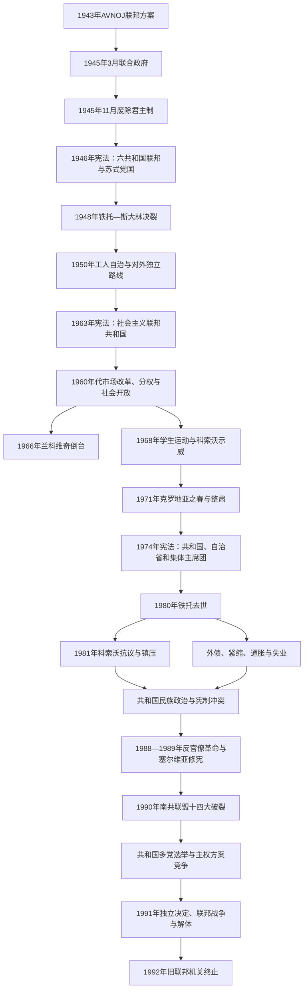

# 南斯拉夫社会主义联邦共和国

## 时间

1945年11月29日—1992年4月27日

## 国名变化

| 时间 | 正式国名 | 制度含义 |
|---|---|---|
| 1945年3月7日—11月29日 | 民主联邦南斯拉夫 | 铁托—舒巴希奇协议形成的联合政府阶段，三人摄政名义代行王权。 |
| 1945年11月29日—1963年4月7日 | 南斯拉夫联邦人民共和国 | 废除君主制后的联邦人民共和国，一党国家和计划经济成形。 |
| 1963年4月7日—1992年4月27日 | 南斯拉夫社会主义联邦共和国 | 强调工人自治和社会主义民主；1974年后共和国、自治省及联邦集体机构权力扩大。 |

## 概括

南斯拉夫社会主义联邦是共产党游击队在第二次世界大战胜利后建立的六共和国国家。它以联邦制、“兄弟情谊与团结”、共产党领导和人民解放战争记忆来克服王国时期的中央集权与民族冲突，又在1948年同苏联决裂后发展工人自治、对外不结盟和相对开放的社会主义模式。

这一制度在铁托时代能够借个人仲裁、联邦党军体系、国际战略地位、外部融资及共和国间再分配维持平衡；它也创造工业化、城市化、教育普及、女性社会参与、跨共和国迁徙和较高国际能见度。与此同时，市场化与分权扩大了地区发展差距，1974年宪法把权力分散到共和国和自治省，却没有建立在严重冲突中可以有效决断的民主联邦机制。铁托1980年去世后，外债、通胀、失业、科索沃危机和共和国民族政治互相强化；1990年统一执政党破裂和各共和国多党选举，使联邦从党内协调体系转为相互否决的主权竞争，最终在1991—1992年战争中解体。

## 联邦演变图

## 建立背景与革命建国（1943—1948）

### 联邦原则的形成

1943年AVNOJ第二次会议决定建立由平等民族和共和国组成的联邦，试图同时解决三项问题：否定轴心国肢解边界、取代战前王国中央集权，以及为共产党领导的革命政权提供跨民族合法性。塞尔维亚、克罗地亚、斯洛文尼亚、波斯尼亚和黑塞哥维那、黑山、马其顿各自建立反法西斯委员会；这些机构后来成为共和国国家机关的政治来源。

波黑不是按单一多数民族建立的民族共和国，而被定义为塞尔维亚人、克罗地亚人和穆斯林共同家园。塞尔维亚境内设伏伊伏丁那自治省和科索沃—梅托希亚自治地区。共和国边界主要依据历史行政区、战时委员会控制、族群分布与政治妥协划定，并非民族边界；它们在联邦内部最初是行政政治边界，后来却成为独立国家边界争论的核心。

### 联合政府与废除君主制

1945年3月，铁托领导的革命政府与舒巴希奇流亡政府合并，三人摄政名义上代表彼得二世。共产党控制军队、安全机关、地方委员会和人民阵线，非共产党部长无法形成独立权力中心。11月选举中，反对派认为媒体、警察和参选条件不公并抵制；人民阵线名单获压倒性优势。11月29日，制宪议会废除君主制。

1946年宪法仿照苏联体制，确立六共和国、联邦议会、国有经济和共产党的实际领导。政权清算合作政权、乌斯塔沙和切特尼克，也审判或压制非共产党对手；米哈伊洛维奇被处决，克罗地亚天主教总主教斯特皮纳茨被审判，安全机关监控社会。土地改革、没收、国有化和农业集体化重塑财产关系。

## 铁托—斯大林决裂与模式转型（1948—1960）

### 1948年冲突

战后南斯拉夫最初是东欧最亲苏、革命最积极的国家之一，但在希腊内战援助、阿尔巴尼亚关系、巴尔干联邦设想、经济合营和军政自主问题上与莫斯科冲突。1948年共产党和工人党情报局谴责南共领导，要求党内推翻铁托。铁托依靠本土军队、安全机构和党组织拒绝服从。

政权对亲苏或被怀疑亲苏者进行清洗，大量人员被关押，戈利奥托克岛成为最著名拘禁地。苏联集团实施经济与政治封锁，边境军事压力上升；美国及西欧随后提供粮食、贷款和军事援助，以防南斯拉夫被重新纳入苏联阵营。

### 工人自治

为与苏式高度集中模式区分，1950年法律把企业管理权名义上交给工人委员会。企业在国家计划、银行、地方政府和市场之间获得一定经营空间，收入分配与投资逐渐去中央化。1953年宪法性法律重组政府，铁托成为共和国总统，联邦执行委员会取代传统部长会议。

工人自治并非企业完全独立或政治多党化：共产党仍控制关键干部任命、信贷、投资方向与安全机构。不同地区拥有的资本、市场和出口条件不等，自治与地方财政也使富裕共和国更能积累，贫困地区依赖联邦投资基金。

## 对外不结盟与国际地位

南斯拉夫在脱离苏联后没有加入北约，而是同时与东西方维持关系。1955年赫鲁晓夫访问贝尔格莱德，苏南关系正常化，但铁托拒绝恢复从属。1956年铁托、印度总理尼赫鲁和埃及总统纳赛尔在布里俄尼会谈，推动不结盟合作；1961年首届不结盟国家首脑会议在贝尔格莱德召开。

不结盟具有多重作用：

- 为新独立国家提供在美苏两极之外协调反殖民、发展与和平议题的平台。
- 使南斯拉夫能从西方获得市场、技术和贷款，也同苏联及发展中国家贸易。
- 提高铁托个人与国家国际地位，缓解内部各共和国对外交方向的争论。
- 为建筑、军工、航运和工程企业在亚非国家承包项目创造市场。
- 但“不结盟”不是等距中立；南斯拉夫在不同危机中立场变化，仍依赖大国经济关系与安全平衡。

## 联邦单位与民族结构

| 联邦单位 | 首府 | 制度与历史特点 |
|---|---|---|
| 波斯尼亚和黑塞哥维那社会主义共和国 | 萨拉热窝 | 多民族共和国，不属于单一构成民族；1960年代后“穆斯林”逐步获承认为民族类别。 |
| 克罗地亚社会主义共和国 | 萨格勒布 | 包括克罗地亚大部、斯拉沃尼亚和达尔马提亚；境内有规模可观的塞尔维亚族人口。 |
| 马其顿社会主义共和国 | 斯科普里 | 战后确立马其顿共和国、标准语和教科文机构；与希腊、保加利亚存在历史与身份争议。 |
| 黑山社会主义共和国 | 铁托格勒 | 人口较少，曾以战争贡献和历史国家传统作为共和国地位基础。 |
| 塞尔维亚社会主义共和国 | 贝尔格莱德 | 最大共和国；境内含伏伊伏丁那与科索沃两个自治省，1974年后省在联邦层级拥有近似共和国的代表权。 |
| 斯洛文尼亚社会主义共和国 | 卢布尔雅那 | 工业化和人均收入最高，与中西欧市场联系紧密。 |
| 伏伊伏丁那社会主义自治省 | 诺维萨德 | 塞尔维亚境内多民族自治省，1974年后有自己的宪法、主席团、银行及联邦席位。 |
| 科索沃社会主义自治省 | 普里什蒂纳 | 阿尔巴尼亚族占多数；1968年后扩大文化语言权，1974年权力显著增加，但没有共和国的名义退出权。 |

宪法所称“民族”通常指拥有共和国的构成民族，“民族成分”或少数民族则包括阿尔巴尼亚人、匈牙利人、土耳其人等。这样的制度分类给予部分群体教育与文化权利，也把共和国和民族身份写入资源、人事与政治代表体系。

## 工业化、社会政策与日常生活

### 经济与城市化

战后国家以重工业、电力、矿业、交通和国防工业为优先，农村人口大量进入城市。亚得里亚海旅游、斯洛文尼亚和克罗地亚制造业、塞尔维亚工业中心、波黑矿冶军工及马其顿和黑山基础设施均在联邦投资下扩张。教育、医疗、住房和社会保险覆盖明显增长。

1965年前后改革扩大价格、利润、银行和对外贸易作用，意图提高效率并限制行政计划。企业和共和国获得更多自主权，但失业和收入差距上升。政府允许公民赴西欧工作，大量“客籍工人”汇款成为家庭和国家外汇来源；开放边境、旅游和西方消费品使南斯拉夫社会区别于多数华约国家。

### 工人自治的实际局限

企业工人委员会可以讨论计划、收入和管理者任命，但党组织、经理、银行及地方政治精英常掌握信息和资源。资本密集地区与出口企业更有优势，低发展地区需要联邦发展基金。地方和企业争取投资时可能形成低效重复建设，银行信贷和政治担保又把风险转向全联邦。自治增加参与渠道，却未形成对宏观债务、失业和地区竞争的稳定约束。

## 1960—1970年代分权与政治危机

### 兰科维奇倒台

亚历山大·兰科维奇长期主管安全系统并被视为偏向中央集权。1966年布里俄尼会议指控安全机关滥权和监听铁托，他被免职。此后秘密警察受重组，共和国党组织和科索沃自治力量扩大。该事件后来被不同叙事解释为反对警察专权、削弱塞尔维亚力量或清除铁托潜在继承者，实际兼有制度和权力因素。

### 1968年抗议

1968年贝尔格莱德等地学生抗议社会不平等、官僚特权和就业困难，铁托一度口头承认诉求，随后党组织恢复控制。同年科索沃阿尔巴尼亚族示威要求共和国地位、大学和语言权；政府镇压部分抗议，同时在其后扩大自治，普里什蒂纳大学于1970年成立。

### 克罗地亚之春

1960年代末，克罗地亚党内改革派、文化机构和学生要求更公平的外汇分配、承认克罗地亚语言及扩大共和国主权。运动既有经济分权和文化平等诉求，也出现排他民族主义表达。1971年底铁托迫使克罗地亚领导层辞职，大批干部、学生与知识分子被清洗或判刑。塞尔维亚、斯洛文尼亚和其他共和国改革派随后也遭整肃。

镇压恢复短期秩序，但许多分权要求被写入1974年宪法。制度由此出现矛盾：政治运动被一党强制压制，民族共和国的宪法权力却进一步加强。

## 1974年宪法与铁托晚期

1974年宪法大幅扩大六共和国和两个自治省权限。联邦主席团由各单位代表组成，重大决定依赖协商；共和国拥有自己的宪法、议会、政府、法院、警察和领土防御体系。科索沃、伏伊伏丁那虽仍属塞尔维亚，却在联邦主席团、宪法法院和党组织中具有直接代表。铁托被赋予不受任期限制的共和国总统地位，作为制度之上的最终仲裁者。

宪法还发展“联合劳动组织”、代表团制和复杂的自治利益协商。其设计希望避免任何单一共和国或民族支配联邦，并为铁托身后集体领导预作安排。然而，决策层级繁复、否决点增加；统一党组织和铁托个人仍是处理冲突的关键，宪法本身无法替代共同政治权威。

1970年代国家大量借入西方资金，为能源、工业、住房和消费扩张融资。石油危机、世界利率上升和投资效率不足逐步积累外债。联邦以低发展共和国和科索沃基金再分配资源，富裕地区认为负担过重，受援地区则认为资金不足且被附加政治条件。

## 铁托身后的集体领导（1980—1986）

### 权力轮换

铁托于1980年5月4日去世。联邦主席团按共和国和自治省代表逐年轮值，南共联盟党首也采用轮换；联邦执行委员会负责经济。此安排成功避免立即出现个人继承斗争，却使权力分散在联邦主席团、共和国党组织、政府、南斯拉夫人民军和地方安全机关之间。任何改革都需要多个单位同意，责任也容易相互推诿。

完整国家元首、政府首脑和党内最高领导序列见[南斯拉夫国家元首与政府首脑表](/%E4%BA%BA%E6%96%87%E7%A7%91%E5%AD%A6/%E5%8E%86%E5%8F%B2/%E6%AC%A7%E6%B4%B2/%E4%B8%9C%E5%8D%97%E6%AC%A7%E4%B8%8E%E5%B7%B4%E5%B0%94%E5%B9%B2/%E5%8D%97%E6%96%AF%E6%8B%89%E5%A4%AB%E5%8E%86%E5%8F%B2/%E5%8D%97%E6%96%AF%E6%8B%89%E5%A4%AB%E5%9B%BD%E5%AE%B6%E5%85%83%E9%A6%96%E4%B8%8E%E6%94%BF%E5%BA%9C%E9%A6%96%E8%84%91%E8%A1%A8.md)。

### 1981年科索沃抗议

1981年普里什蒂纳学生以食宿条件发动抗议，迅速扩大为要求科索沃共和国地位的政治运动。联邦实施紧急措施和大规模逮捕，并将诉求定性为阿尔巴尼亚民族主义。阿尔巴尼亚族对就业、政治地位和经济落后的不满持续，塞尔维亚族和黑山族人口外迁及受歧视叙事则在塞尔维亚社会引发强烈反应。各方对暴力、迁徙原因和国家偏袒的相反解释，成为1980年代民族动员中心。

### 债务与紧缩

1979年后世界经济条件恶化，出口与侨汇不足以覆盖债务。政府与国际货币基金组织等谈判重组，实行进口压缩、工资限制、货币贬值和能源配给。生活水平下降，失业和通胀上升，地区间企业相互拖欠。经济危机削弱“联邦能带来增长”的合法性，并使各共和国倾向保留税收和外汇、把成本归咎于他者。

## 共和国民族政治上升（1986—1990）

### 塞尔维亚权力重组

1986年塞尔维亚科学与艺术学院一份未正式通过的备忘录草稿泄露，批评联邦分权和塞尔维亚、科索沃处境，成为民族政治争论象征。斯洛博丹·米洛舍维奇在塞尔维亚共产主义者联盟内部击败伊万·斯坦鲍利奇，利用科索沃塞族集会和大众媒体建立“保护塞尔维亚”的政治形象。

1988—1989年“反官僚革命”通过大规模群众集会迫使伏伊伏丁那、黑山和科索沃原领导层更替，亲米洛舍维奇人物上台。塞尔维亚1989年修宪收回自治省在警察、司法、经济等方面的大量权力；科索沃阿尔巴尼亚族抗议遭紧急状态和武力镇压。塞尔维亚方面把改革称为恢复共和国统一，斯洛文尼亚、克罗地亚和科索沃阿尔巴尼亚族则视为破坏1974年联邦平衡。

### 斯洛文尼亚与克罗地亚的反应

斯洛文尼亚党和知识界推动言论开放、市场改革与邦联化。1988年南斯拉夫人民军审判斯洛文尼亚记者和军官的“JBTZ案”激起公民动员。克罗地亚社会也重新讨论民族权利、政治犯和经济主权。塞尔维亚领导层掌握塞尔维亚、黑山、伏伊伏丁那和科索沃四个联邦主席团席位的影响力，使其他共和国担心联邦机构被多数控制。

联邦政府首脑安特·马尔科维奇于1989—1990年推行货币稳定、冻结工资、企业改革和可兑换第纳尔，初期压低恶性通胀并获得跨民族支持；但共和国政府控制税收、银行、媒体和警察，联邦缺乏执行结构性改革的能力。

## 统一党与联邦制度崩溃（1990—1992）

### 南共联盟十四大

1990年1月，南共联盟第十四次特别代表大会围绕“一人一票”的更集中党制还是共和国自主、邦联化发生冲突。斯洛文尼亚代表团的改革提案连续被否决后退出，克罗地亚代表拒绝在其缺席下继续。统一执政党作为跨共和国协调和干部任命体系事实上解体。

各共和国随后举行多党选举。斯洛文尼亚和克罗地亚由主张更大主权的力量执政；波黑和马其顿出现民族或主权取向政党；塞尔维亚和黑山的原共产党领导则以改组政党继续掌权。选举民主化在共和国层面发生，却没有同步建立经全联邦公民授权的共同制宪机制。

### 主权方案冲突

主要方案包括：斯洛文尼亚、克罗地亚主张由主权国家组成的邦联；塞尔维亚要求维持或重新集中有共同军队和市场的联邦，并主张共和国边界内塞族拥有自决权；波黑和马其顿试图寻找不被塞克两极撕裂的非对称方案；联邦政府希望保存经济和国际法统一。

1991年5月，按轮换应由克罗地亚代表斯捷潘·梅西奇担任主席团主席，但亲塞尔维亚阵营阻止选举，直至欧洲共同体施压后才同意。主席团危机显示联邦集体元首已经无法正常运作。南斯拉夫人民军自称保卫宪法和统一，却越来越同塞尔维亚领导层及克罗地亚、波黑塞族武装目标重合。

### 最终终止

1991年6月25日，斯洛文尼亚和克罗地亚宣布独立。斯洛文尼亚十日战争后，联邦部队撤出；克罗地亚则因境内塞族叛乱、人民军介入和领土争夺进入全面战争。马其顿在1991年公投后和平脱离。波黑1992年独立公投遭多数塞族抵制，随后爆发战争。

1991年12月安特·马尔科维奇辞职，联邦政府只剩残余机构。1992年1月欧洲共同体承认斯洛文尼亚和克罗地亚，4月承认波黑；4月27日塞尔维亚和黑山宣布成立南斯拉夫联盟共和国，并主张延续旧国。旧社会主义联邦至此不再运作，国际社会后来认定其发生解体而非由塞黑自动独占延续资格。

## 统治结构

| 阶段 | 法定国家元首 | 政府首脑 | 实际权力中心 |
|---|---|---|---|
| 1945—1953年 | 国民议会主席团主席伊万·里巴尔 | 铁托 | 铁托、南共中央、军队与国家安全机关；法定元首主要履行代表职能。 |
| 1953—1963年 | 铁托任共和国总统 | 铁托兼任联邦执行委员会主席 | 党、国家、军队集中于铁托，工人自治在一党框架内展开。 |
| 1963—1974年 | 铁托任总统 | 联邦执行委员会主席 | 铁托仲裁，共和国党组织、银行和企业权力上升。 |
| 1974—1980年 | 终身总统铁托，另有联邦主席团 | 联邦执行委员会主席 | 铁托高于复杂集体制度，党军和共和国领导共同参与。 |
| 1980—1990年 | 八单位集体主席团及轮值主席 | 联邦执行委员会主席 | 权力分散在主席团、共和国党、政府、军队和地方机构，无单一继承者。 |
| 1990—1992年 | 分裂的联邦主席团 | 马尔科维奇后为残余代理机构 | 民选共和国政府、塞尔维亚领导层和人民军分别掌握实权，联邦机关失去统一命令。 |

## 重要事件

| 时间 | 事件 | 直接结果 | 长期意义 |
|---|---|---|---|
| 1945年11月29日 | 废除君主制 | 南斯拉夫联邦人民共和国成立 | 游击队革命政权完成法定建国。 |
| 1946年1月 | 新宪法 | 六共和国联邦与一党国家成形 | 奠定共和国边界和中央党国结构。 |
| 1948年 | 与斯大林决裂 | 被逐出情报局、遭苏联集团封锁 | 促成独立社会主义、不结盟和西方援助。 |
| 1950年 | 工人自治法 | 企业工人委员会制度化 | 成为南斯拉夫模式的核心标识。 |
| 1961年 | 贝尔格莱德不结盟会议 | 南斯拉夫居创始领导地位 | 扩大外交空间和全球南方联系。 |
| 1965年 | 经济改革 | 市场和银行作用扩大 | 提高开放度，也扩大失业及地区差异。 |
| 1966年 | 兰科维奇被罢免 | 安全系统和中央派受挫 | 共和国及自治省权力继续上升。 |
| 1968年 | 学生与科索沃抗议 | 镇压与有限让步并行 | 暴露社会不平等和科索沃地位问题。 |
| 1971年 | 克罗地亚之春被整肃 | 改革派和学生领袖下台 | 民族诉求被压制，却影响1974年分权。 |
| 1974年 | 新宪法 | 共和国、自治省和集体主席团权限扩大 | 防支配设计同时增加否决和解体条件。 |
| 1980年5月4日 | 铁托去世 | 轮值集体领导启动 | 联邦失去个人仲裁中心。 |
| 1981年 | 科索沃抗议 | 紧急状态、大规模逮捕 | 科索沃成为塞尔维亚和阿尔巴尼亚族民族动员核心。 |
| 1988—1989年 | 反官僚革命和塞尔维亚修宪 | 四个主席团席位政治上趋同，自治省权力受限 | 破坏1974年权力平衡并激化共和国冲突。 |
| 1990年1月 | 南共联盟十四大破裂 | 跨共和国统一党停止运作 | 共同政治协调机制消失。 |
| 1991年6月以后 | 独立与战争 | 联邦军与共和国、地方武装交战 | 国家从宪制危机转为暴力解体。 |
| 1992年4月27日 | 塞黑成立联盟共和国 | 旧社会主义联邦机关终止 | 继承问题转入国际谈判。 |

## 鼎盛条件

- 铁托兼具革命领袖、党首、总统、军队统帅和国际仲裁者地位。
- 联邦制承认主要民族共和国，较王国中央集权更能吸纳地方精英。
- 冷战两极都希望争取一个独立于苏联的巴尔干国家，南斯拉夫获得援助和外交空间。
- 工业化、社会福利、开放边境和就业迁移在数十年间提高生活机会。
- 不结盟运动赋予国家超出人口和经济规模的国际影响力。
- 联邦发展基金、共同军队、统一市场及党组织把共和国利益联系在一起。
- 对二战民族暴力的官方抑制和共同胜利记忆，在一代人中提供跨民族认同。

## 衰落与解体原因

### 结构因素

1. **不对称联邦**：共和国与自治省权力很强，却缺乏在主权争议中既民主又有效的联邦决策程序。
2. **一党协调依赖**：许多冲突在党内和铁托个人层面解决，制度没有经受竞争性共和国政府的考验。
3. **发展差距**：北部出口型地区与南部低发展地区对再分配、汇率和投资政策利益相反。
4. **债务型增长**：1970年代借贷和低效投资把外部冲击转化为1980年代长期紧缩。
5. **民族与共和国绑定**：资源、人事、教育和历史叙事都通过民族—共和国框架表达，危机中更容易转成领土主权竞争。
6. **军队定位矛盾**：人民军是全联邦机构，但军官结构、预算利益和“维护统一”使命使其难以在共和国争端中保持中立。
7. **历史暴力未充分公开处理**：战时罪行和战后镇压常被压制或选择性纪念，1980年代后被民族政治重新武器化。

### 外部压力

- 世界利率、石油危机和国际金融条件加重债务与紧缩。
- 东欧剧变和苏联衰落消除了南斯拉夫作为冷战“特殊缓冲”的战略租金。
- 欧洲共同体和大国最初在维持统一、邦联化和承认独立之间摇摆，未能在暴力前促成共同制宪方案。
- 邻国历史诉求和侨民资金、媒体也影响民族政治，但不是内部崩溃的单一原因。

### 直接触发因素

统一党在1990年崩溃后，各共和国通过选举获得各自民主合法性，却对联邦未来没有共同授权。塞尔维亚修宪和主席团席位平衡变化使斯洛文尼亚、克罗地亚更倾向退出；克罗地亚的国家象征、宪法和塞族地位变化又刺激境内塞族武装自治。1991年轮值主席危机、独立公投和人民军介入把制度争议转化为武装冲突。

因此，联邦解体不能归结为“古老民族仇恨”、铁托一人去世、经济危机或外国阴谋中的任一单因；这些因素通过失灵的联邦制度和竞争性政治动员相互作用，战争才成为直接摧毁机制。

## 历史评价与辨析

- 南斯拉夫既是高压一党国家，也是相较许多东欧国家更开放、分权和社会流动较强的社会主义制度；两面不能互相取消。
- 工人自治提供真实但有限的基层参与，不能等同于企业完全民主或自由市场。
- 1974年宪法既保护小共和国和自治省免受最大共和国支配，也使联邦在危机中更难决断；它不是自动导致解体的“定时炸弹”。
- 铁托的个人权威维持平衡，也延迟了建立可在其身后运行的公开政治协商机制。
- 国际承认通常以共和国边界为基础，但联邦解体时这些边界内存在大量混居人口，因此法律继承与地方自决发生正面冲突。
- 1991—1992年既有共和国退出，也有联邦机构被部分成员控制和共同国家功能消失；“分离”与“解体”是不同层面的描述。

## 演变关系

- 前一节点：[第二次世界大战时期的南斯拉夫](/%E4%BA%BA%E6%96%87%E7%A7%91%E5%AD%A6/%E5%8E%86%E5%8F%B2/%E6%AC%A7%E6%B4%B2/%E4%B8%9C%E5%8D%97%E6%AC%A7%E4%B8%8E%E5%B7%B4%E5%B0%94%E5%B9%B2/%E5%8D%97%E6%96%AF%E6%8B%89%E5%A4%AB%E5%8E%86%E5%8F%B2/%E7%AC%AC%E4%BA%8C%E6%AC%A1%E4%B8%96%E7%95%8C%E5%A4%A7%E6%88%98%E6%97%B6%E6%9C%9F%E7%9A%84%E5%8D%97%E6%96%AF%E6%8B%89%E5%A4%AB.md)。
- 后一节点：[南斯拉夫解体](/%E4%BA%BA%E6%96%87%E7%A7%91%E5%AD%A6/%E5%8E%86%E5%8F%B2/%E6%AC%A7%E6%B4%B2/%E4%B8%9C%E5%8D%97%E6%AC%A7%E4%B8%8E%E5%B7%B4%E5%B0%94%E5%B9%B2/%E5%8D%97%E6%96%AF%E6%8B%89%E5%A4%AB%E5%8E%86%E5%8F%B2/%E5%8D%97%E6%96%AF%E6%8B%89%E5%A4%AB%E8%A7%A3%E4%BD%93.md)。
- 联邦领导完整序列：[南斯拉夫国家元首与政府首脑表](/%E4%BA%BA%E6%96%87%E7%A7%91%E5%AD%A6/%E5%8E%86%E5%8F%B2/%E6%AC%A7%E6%B4%B2/%E4%B8%9C%E5%8D%97%E6%AC%A7%E4%B8%8E%E5%B7%B4%E5%B0%94%E5%B9%B2/%E5%8D%97%E6%96%AF%E6%8B%89%E5%A4%AB%E5%8E%86%E5%8F%B2/%E5%8D%97%E6%96%AF%E6%8B%89%E5%A4%AB%E5%9B%BD%E5%AE%B6%E5%85%83%E9%A6%96%E4%B8%8E%E6%94%BF%E5%BA%9C%E9%A6%96%E8%84%91%E8%A1%A8.md)。
- 返回：[南斯拉夫历史](/%E4%BA%BA%E6%96%87%E7%A7%91%E5%AD%A6/%E5%8E%86%E5%8F%B2/%E6%AC%A7%E6%B4%B2/%E4%B8%9C%E5%8D%97%E6%AC%A7%E4%B8%8E%E5%B7%B4%E5%B0%94%E5%B9%B2/%E5%8D%97%E6%96%AF%E6%8B%89%E5%A4%AB%E5%8E%86%E5%8F%B2/README.md)。
