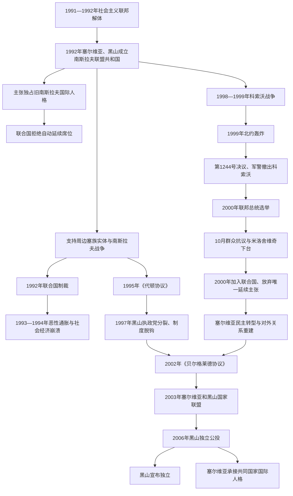

# 南斯拉夫联盟共和国与塞尔维亚和黑山

## 时间

1992年4月27日—2006年6月5日

## 政治阶段

| 阶段 | 时间 | 正式结构 | 核心特征 |
|---|---|---|---|
| 南斯拉夫联盟共和国 | 1992年4月27日—2003年2月4日 | 塞尔维亚、黑山两个共和国组成的联邦共和国 | 初期由米洛舍维奇控制的塞尔维亚居主导，经历战争、制裁、恶性通胀、科索沃战争和2000年政权更替。 |
| 塞尔维亚和黑山国家联盟 | 2003年2月4日—2006年6月5日 | 依据宪章组成的松散共同国家 | 两共和国拥有不同货币、海关和经济制度，共同层级仅负责有限外交、国防和协调事务。 |
| 分立 | 2006年5—6月 | 黑山公投独立，塞尔维亚承接共同国家国际人格 | 最后一个以南斯拉夫两共和国为基础的共同国家和平终结。 |

## 概括

斯洛文尼亚、克罗地亚、马其顿和波斯尼亚和黑塞哥维那脱离南斯拉夫社会主义联邦后，塞尔维亚与黑山于1992年建立南斯拉夫联盟共和国。新国家沿用“南斯拉夫”国名并宣称自己是旧联邦的唯一延续者，但其范围只剩两个共和国，国际社会也没有接受自动继承联合国席位的主张。

1990年代的联邦宪法规定议会制、共和国平等和公民权利，实际权力却长期集中在塞尔维亚总统斯洛博丹·米洛舍维奇、其执政党、警察、安全机关、国家媒体和商业网络。克罗地亚、波黑战争、联合国制裁和1993年恶性通胀摧毁经济；1995年后米洛舍维奇从战争支持者转为代顿谈判者。黑山领导层1997年分裂并逐步脱离贝尔格莱德控制，科索沃战争和1999年北约轰炸又使联邦国家能力和合法性遭到重创。

2000年米洛舍维奇在选举与群众抗议中倒台，联盟共和国加入联合国并开始民主转型。塞尔维亚与黑山对国家前途仍无共识，在欧盟斡旋下于2003年改组为“塞尔维亚和黑山”国家联盟。三年后黑山公投达到事先约定门槛并宣布独立，塞尔维亚依宪章承接共同国家国际组织成员资格。

## 国家演变图

## 建国与继承争议（1992）

### 两共和国联邦

1992年4月27日，塞尔维亚和黑山议会代表通过新宪法，宣布成立南斯拉夫联盟共和国。塞尔维亚人口、经济和军政资源远大于黑山，但宪法通过两院制等方式给两个共和国一定形式平等：公民院按人口产生，共和国院由两共和国等额代表组成。联邦总统由议会选举，联邦政府向议会负责。

塞尔维亚境内仍包括伏伊伏丁那和科索沃自治省，但米洛舍维奇时代自治权已大幅收缩。科索沃阿尔巴尼亚族抵制塞尔维亚和联邦机构，建立平行政治、教育和医疗网络，因此宪法的公民代表与实际治理存在巨大落差。

### 唯一延续国主张失败

贝尔格莱德主张联盟共和国只是旧南斯拉夫缩小疆域后的同一国际法主体，要求自动使用联合国席位、外交财产和条约权利。其他四个前共和国坚持六共和国为平等继承者。联合国安理会和大会认为旧联邦已解体，联盟共和国不能自动延续会员资格，需另行申请。

这一立场没有立即把联盟共和国逐出所有国际联系，但其代表无法正常占有旧联邦联合国席位。继承争议也影响外交馆产、黄金和外汇、档案、军产、债务及养老金分配。直到2000年新政府申请并获准加入联合国，塞黑才实质放弃唯一延续主张。

## 米洛舍维奇权力体系

### 法定职位与实际权力

1992—1997年米洛舍维奇担任塞尔维亚总统，法定级别低于联邦总统，却控制最大共和国政府、塞尔维亚社会党、内政警察和国家媒体，并通过与黑山社会主义者民主党及联邦议会联盟影响联邦机构。多布里察·乔西奇等联邦总统若同其政策冲突，便可能遭议会罢免；佐兰·利利奇则政治上高度依赖塞尔维亚执政集团。

1997年塞尔维亚总统任期届满后，米洛舍维奇转任联邦总统，把正式职位与原有网络结合。其统治不是单一党完全垄断：反对党、地方媒体和选举一直存在，黑山及部分城市也可由反对派执政；但选区规则、媒体资源、警察压力、国家企业和灰色经济利益使竞争严重不平等。

### 安全、商业与准军事网络

制裁和战争催生走私、外汇管制、特许进口及国家企业垄断。执政党、安全机关、军方、地方强人和新富阶层共享利益，模糊国家与犯罪经济边界。塞尔维亚国家安全部门同克罗地亚、波黑塞族武装及多个准军事组织保持不同程度联系，使政府既能影响周边战争，又可否认直接指挥。

黑山沿海和边境走私也成为政府收入来源。随着米洛·久卡诺维奇与贝尔格莱德分裂，黑山安全和商业网络转而服务本共和国制度独立。

## 战争、制裁与恶性通胀（1992—1995）

### 克罗地亚和波黑战争中的作用

联盟共和国官方宣称没有同邻国交战，南斯拉夫人民军也在1992年改组为南斯拉夫军队。然而，塞尔维亚和联邦机构向克罗地亚塞族、波黑塞族提供军官、装备、财政、燃料及政治支持；许多原人民军武器和人员直接转入当地塞族军队。与此同时，贝尔格莱德并非始终能控制帕莱和克宁领导层，和平方案遭拒时双方也发生冲突。

1994年米洛舍维奇因波黑塞族议会拒绝国际联系小组方案而关闭部分边界，并利用制裁压力重新塑造“和平缔造者”形象。1995年，他代表塞尔维亚并实际影响波黑塞族一方参加代顿谈判。《代顿协议》结束波黑战争，制裁逐步暂停，但战争责任、难民和国际刑事追诉继续影响国家。

### 联合国制裁

1992年5月，联合国因波黑战争对联盟共和国实施全面经济制裁，包括贸易、金融、航空和文化体育限制。制裁削弱正规工业与国际支付，却没有立即终结战争支持；走私和权贵特许反而增强政权控制资源的能力。普通居民面临失业、药品和燃料短缺，社会中间阶层积蓄被摧毁。

### 1993—1994年恶性通胀

战争支出、税收崩溃、对亏损企业和塞族实体的货币融资，以及制裁造成的供给短缺，使第纳尔发行失控。1993年末至1994年初发生历史上最严重的恶性通胀之一，工资和养老金在发放前已近乎失去价值，德国马克成为实际计价和储蓄工具。

1994年德拉戈斯拉夫·阿夫拉莫维奇推出新第纳尔，最初以德国马克为锚并限制央行融资，迅速压低通胀。稳定并未修复产业、法治或制裁造成的长期损害，灰色经济和权力资本关系继续存在。

## 反对派、选举与1996—1997年抗议

塞尔维亚反对派长期因意识形态、民族政策和领导竞争而分裂。1996年地方选举中，“团结”联盟在贝尔格莱德等城市获胜，政府拒绝承认部分结果，引发持续数月的学生和公民抗议。国际压力和国内动员迫使当局最终承认胜选城市。

抗议显示米洛舍维奇可以被制度和街头压力迫退，也暴露反对派难以形成持久统一平台。国家媒体仍占主导，安全机构和经济资源继续掌握在执政集团手中。

## 黑山路线分裂（1997—2000）

### 执政党分裂

黑山社会主义者民主党原与米洛舍维奇结盟。1997年，总统莫米尔·布拉托维奇和总理米洛·久卡诺维奇公开分裂：布拉托维奇支持贝尔格莱德，久卡诺维奇主张经济改革、对西方开放及限制联邦干预。久卡诺维奇在争议激烈的总统选举中获胜，米洛舍维奇阵营不再能依靠黑山共和国政府。

联邦总理职位随后由布拉托维奇等亲贝尔格莱德黑山人担任，但这不代表获得黑山现政府授权。黑山抵制部分联邦法律，建立自己的警察、海关和外交联系。贝尔格莱德与波德戈里察之间形成“同一国家内两套权力中心”。

### 货币和经济脱钩

1999年黑山引入德国马克与第纳尔并行，次年取消第纳尔；欧元现金启用后转用欧元。黑山也实行独立关税和预算制度。联邦仍有军队、国际人格和部分外交职能，但共同经济空间已经事实解体。西方国家在科索沃战争后向黑山提供援助，也把其视为限制米洛舍维奇的伙伴。

## 科索沃危机与1999年战争

### 从非暴力抵抗到武装冲突

1989—1990年后，科索沃阿尔巴尼亚族在易卜拉欣·鲁戈瓦领导下建立平行制度并抵制选举。国际社会在代顿谈判中没有解决科索沃最终地位，非暴力路线声望下降。科索沃解放军袭击警察、官员及被视为合作者者，塞尔维亚警察和南斯拉夫军队以村庄清剿、逮捕和重武器行动回应。

1998年冲突扩大，平民伤亡和流离失所迅速增加。联合国安理会要求停火，欧洲安全与合作组织部署核查团，但停火反复破裂。1999年朗布依埃谈判在高度自治、北约部队部署和未来地位上未达协议。

### 北约轰炸

1999年3月24日，北约在没有安理会明确授权的情况下发动空袭，目标从防空和军事设施扩大到交通、能源、政府和其他双重用途目标。联盟共和国将其视为侵略和主权侵犯；北约则主张阻止科索沃人道灾难。轰炸的合法性、必要性和目标选择持续受到争论。

战争期间，南斯拉夫和塞尔维亚部队驱逐大批科索沃阿尔巴尼亚族，实施屠杀、焚毁和身份文件破坏；科索沃解放军也侵害塞族、罗姆人和对手。北约误炸及对电视台、桥梁、列车、中国驻南联盟使馆等目标的攻击造成平民死亡和外交危机。

### 撤军与国际管理

1999年6月9日《库马诺沃军事技术协议》规定南斯拉夫军警撤出科索沃，北约停止轰炸。次日安理会通过第1244号决议，设立联合国临时行政当局和KFOR。决议一方面提及联盟共和国主权和领土完整，另一方面授权科索沃在国际管理下享有实质自治并启动政治进程。

阿尔巴尼亚族难民返回后，大批塞族、罗姆人和其他非阿尔巴尼亚族居民离开，发生报复袭击和财产侵占。贝尔格莱德从此不再有效治理科索沃大部，但仍坚持其为塞尔维亚领土。

## 2000年选举与政权更替

### 联邦修宪与选举

2000年7月，联邦宪法修正为总统由全民直选并可连任，同时改变共和国院构成。这使米洛舍维奇可以谋求新任期，也绕开不承认联邦改革的黑山政府。黑山执政联盟抵制9月选举，塞尔维亚民主反对派推举沃伊斯拉夫·科什图尼察为统一候选人。

官方结果称科什图尼察得票未过半、需第二轮；反对派依据投票记录主张其首轮胜出。全国罢工和抗议扩大，10月5日大批群众进入贝尔格莱德，联邦议会和国家电视台受冲击，警察和军队没有发动全面镇压。宪法法院和选举机构随后确认科什图尼察胜选，米洛舍维奇承认失败。

### 转型的双重权力

科什图尼察出任联邦总统，塞尔维亚层级则由佐兰·金吉奇领导的民主反对派在2000年12月选举后掌权。联邦总统强调法治、渐进改革和国家主权，金吉奇政府更积极推进私有化、对西方合作及将米洛舍维奇移送前南刑庭。2001年6月的引渡引发联邦执政联盟危机，联邦总理佐兰·日日奇辞职。

旧安全机构、军队、国营经济和有组织犯罪没有随选举立即消失。2003年金吉奇遭与安全和犯罪网络有关人员刺杀，说明转型中的国家重建仍极脆弱。

## 国际地位正常化

2000年11月，联盟共和国申请并加入联合国，承认自己是旧联邦的继承国之一而非自动延续者。随后加入或恢复参与多个国际机构，并同欧盟、美国及邻国改善关系。

2001年，联盟共和国、斯洛文尼亚、克罗地亚、波黑和马其顿签署继承问题协定，处理外交财产、金融资产、档案、债务和养老金。对前南刑庭合作成为外援和欧洲整合的重要条件，但在国内围绕主权、选择性司法和战争责任争议激烈。

## 从联盟共和国到国家联盟（2002—2003）

### 国家存续争论

黑山政府要求独立或仅保留松散共同体，塞尔维亚内部有人也认为维持名存实亡的联邦成本过高。欧盟担心新的分离可能影响科索沃和区域稳定，外交与安全政策高级代表哈维尔·索拉纳推动双方暂缓独立。

2002年3月，塞尔维亚、黑山和联邦领导签署《贝尔格莱德协议》，同意建立“塞尔维亚和黑山”。2003年2月4日通过宪章后，南斯拉夫联盟共和国正式终止。

### 2003年宪章结构

| 层级 | 主要权限 | 实际状况 |
|---|---|---|
| 国家联盟议会 | 通过有限共同法律、选举总统 | 议员来源和选举制度需两共和国协调，统一立法范围狭窄。 |
| 国家联盟总统兼部长会议主席 | 对外代表，并协调外交、国防、国际经济关系、人权等部长 | 斯韦托扎尔·马罗维奇一人兼任元首和政府首脑，缺少独立财政与强制执行力。 |
| 共同军队 | 名义保卫国家联盟 | 军事改革和文官控制推进，但共和国政治分歧及科索沃问题限制共同战略。 |
| 塞尔维亚共和国 | 内政、警察、经济、货币、海关、司法等 | 使用第纳尔，人口和机构规模占绝对多数。 |
| 黑山共和国 | 内政、警察、经济、货币、海关、司法等 | 使用欧元，拥有独立经济和对外网络。 |

宪章允许成员在三年后依据民主程序启动退出。共同国家没有统一市场所需的完整制度，更多是欧盟斡旋的过渡框架。

## 2006年黑山公投与分立

欧盟参与制定公投规则，把独立有效门槛设为有效票55%，并要求最低投票率等程序保障。2006年5月21日公投中，支持独立票略高于55%门槛，反对票主要集中于认同塞尔维亚—黑山共同国家的群体。国际观察总体认可程序。

6月3日黑山议会宣布独立；6月5日塞尔维亚议会确认塞尔维亚为国家联盟的法定继承者。共同军产、使领馆、档案和公民身份通过谈判分配。黑山作为新国家申请加入联合国等组织，塞尔维亚保留原成员席位。分立没有发生战争，显示2003年宪章和国际监督为退出提供了与1990年代不同的制度路径。

科索沃并未随国家联盟终结自动改变法律地位：依据宪章，若黑山退出，科索沃相关国际文件所涉成员是塞尔维亚；其后科索沃于2008年宣布独立，承认争议延续。

## 国家元首、政府首脑与实际权力

完整的联邦总统、代理总统、联邦总理及国家联盟领导任期见[南斯拉夫国家元首与政府首脑表](/%E4%BA%BA%E6%96%87%E7%A7%91%E5%AD%A6/%E5%8E%86%E5%8F%B2/%E6%AC%A7%E6%B4%B2/%E4%B8%9C%E5%8D%97%E6%AC%A7%E4%B8%8E%E5%B7%B4%E5%B0%94%E5%B9%B2/%E5%8D%97%E6%96%AF%E6%8B%89%E5%A4%AB%E5%8E%86%E5%8F%B2/%E5%8D%97%E6%96%AF%E6%8B%89%E5%A4%AB%E5%9B%BD%E5%AE%B6%E5%85%83%E9%A6%96%E4%B8%8E%E6%94%BF%E5%BA%9C%E9%A6%96%E8%84%91%E8%A1%A8.md)。

| 时段 | 法定元首 | 政府首脑 | 实际权力结构 |
|---|---|---|---|
| 1992—1997年 | 乔西奇、拉杜洛维奇代理、利利奇、博若维奇代理 | 帕尼奇、孔蒂奇 | 塞尔维亚总统米洛舍维奇及其党警网络居主导；黑山执政党是关键联盟伙伴。 |
| 1997—2000年 | 米洛舍维奇 | 孔蒂奇后为布拉托维奇 | 联邦总统整合原有塞尔维亚权力网络；黑山久卡诺维奇政府转为对抗中心。 |
| 2000—2003年 | 科什图尼察 | 日日奇、佩希奇 | 联邦总统、塞尔维亚金吉奇政府和黑山政府三方竞争；军队与安全机构处于转型。 |
| 2003—2006年 | 马罗维奇 | 同一人兼任 | 两共和国政府掌握绝大多数实权，国家联盟机关负责有限协调。 |

## 重要事件

| 时间 | 事件 | 直接结果 | 长期意义 |
|---|---|---|---|
| 1992年4月27日 | 联盟共和国成立 | 塞尔维亚、黑山建立新联邦 | 同旧六共和国联邦范围和国际地位不同。 |
| 1992年5月 | 联合国全面制裁 | 贸易、金融和交通受限 | 正规经济崩溃，灰色权力网络壮大。 |
| 1993—1994年 | 恶性通胀 | 货币和居民积蓄几近毁灭 | 深化社会贫困和对非正式外币经济依赖。 |
| 1994年1月 | 新第纳尔稳定方案 | 通胀迅速受控 | 证明货币纪律有效，但未解决制裁和权力结构。 |
| 1995年11—12月 | 代顿谈判和协议 | 波黑战争结束，制裁逐步松动 | 米洛舍维奇取得和平谈判者地位。 |
| 1996—1997年 | 塞尔维亚地方选举抗议 | 政府承认反对派城市胜选 | 公民动员为2000年更替积累经验。 |
| 1997年 | 黑山执政集团分裂 | 久卡诺维奇掌握共和国权力 | 塞黑共同国家开始制度脱钩。 |
| 1998—1999年 | 科索沃战争 | 冲突国际化、难民潮扩大 | 联邦面临北约直接干预。 |
| 1999年3—6月 | 北约轰炸 | 基础设施破坏、军警撤出科索沃 | 科索沃进入国际管理，政权合法性重创。 |
| 2000年9—10月 | 联邦总统选举与十月抗议 | 米洛舍维奇下台、科什图尼察就任 | 结束1990年代执政体系顶层统治。 |
| 2000年11月 | 加入联合国 | 接受新会员身份 | 放弃旧南斯拉夫唯一延续主张。 |
| 2001年6月 | 米洛舍维奇被移送前南刑庭 | 联邦执政联盟分裂 | 战争责任和对外合作成为转型争议核心。 |
| 2002年3月 | 《贝尔格莱德协议》 | 确定松散共同国家方案 | 独立争议暂缓三年。 |
| 2003年2月4日 | 国家联盟宪章生效 | 国名改为“塞尔维亚和黑山” | 联邦制被两国过渡协调框架取代。 |
| 2006年5月21日 | 黑山独立公投 | 独立票达到约定门槛 | 为和平退出提供民主程序。 |
| 2006年6月3—5日 | 黑山独立、塞尔维亚确认继承 | 国家联盟终止 | 最后一个南斯拉夫共同国家结束。 |

## 存续条件

- 塞尔维亚与黑山在历史、语言、东正教传统、安全机构和1990年代政治联盟上联系紧密。
- 两共和国领导最初都反对其他共和国独立，并希望保留南斯拉夫国际身份、军队和共同市场。
- 黑山人口与财政规模较小，在制裁和战争初期依赖联邦资源与塞尔维亚通道。
- 米洛舍维奇与布拉托维奇执政联盟能够控制联邦议会及关键职位。
- 国际社会在2000年代初担心立即分离影响科索沃和区域稳定，欧盟积极维持过渡共同体。
- 2003年宪章把共同权限降到最低，使利益不同的两共和国能暂时共存。

## 衰落与终结原因

### 结构因素

1. **规模极不对称**：塞尔维亚在人口、经济、军队和机构上占绝对优势，黑山难以相信形式平等能约束贝尔格莱德。
2. **实际与宪法脱节**：1990年代权力在塞尔维亚总统和安全网络，联邦总统、政府与议会常缺乏自主性。
3. **经济体系分离**：黑山改用德国马克和欧元，建立独立海关、税制和银行监管，共同市场失去实质。
4. **战争与制裁遗产**：经济崩溃、难民、军警权力和国际孤立削弱共同国家认同。
5. **科索沃地位**：联邦无法恢复对科索沃的有效管辖，也无法就自治、独立或国际管理形成共同政策。
6. **民主授权分裂**：2000年后塞尔维亚和黑山政府分别由不同选举与政治联盟产生，缺少全联盟政党体系。

### 外部压力

- 联合国制裁和国际刑事追诉持续影响国内权力与经济。
- 北约战争摧毁军事和基础设施，并把科索沃置于国际管理。
- 欧盟既反对立即解体又要求改革，最终用三年过渡和公投门槛规范退出。
- 欧元化、外援和各自欧洲整合路径增强黑山独立运作能力。

### 直接触发

2003年宪章明确允许三年后退出，使国家联盟从永久国家转为有期限的试验。三年内共同市场、直接选举和共享政治认同均未建立。黑山政府依宪章举行公投，结果刚越过欧盟认可的55%门槛，成为制度终结的直接触发。

## 历史评价与辨析

- 1992年的联盟共和国是新成立的两共和国国家，不是旧社会主义联邦在领土缩小后的无争议同一国家。
- “塞尔维亚统治”可描述实际权力不对称，但黑山执政精英在1997年前也是共同制度的参与者，不能把黑山仅写成被动附属。
- 米洛舍维奇在塞尔维亚总统任内已是联盟共和国最有权势者，法定职位层级不能代替实际权力分析。
- 制裁打击政权资源，也摧毁普通居民生活并助长走私网络，其效果不能只用“迫使谈判”概括。
- 2000年属于竞争性选举、罢工、街头动员和精英倒戈共同完成的政权更替，不是单一“革命”或纯粹外部策划。
- 2006年黑山独立与1991—1992年战争性解体不同，原因在于已有退出条款、国际认可规则及双方接受的公投程序。
- 塞尔维亚承接2006年共同国家成员资格，不等于它在1992年曾被承认为旧社会主义联邦的唯一延续国。

## 演变关系

- 前一节点：[南斯拉夫解体](/%E4%BA%BA%E6%96%87%E7%A7%91%E5%AD%A6/%E5%8E%86%E5%8F%B2/%E6%AC%A7%E6%B4%B2/%E4%B8%9C%E5%8D%97%E6%AC%A7%E4%B8%8E%E5%B7%B4%E5%B0%94%E5%B9%B2/%E5%8D%97%E6%96%AF%E6%8B%89%E5%A4%AB%E5%8E%86%E5%8F%B2/%E5%8D%97%E6%96%AF%E6%8B%89%E5%A4%AB%E8%A7%A3%E4%BD%93.md)。
- 联邦领导完整序列：[南斯拉夫国家元首与政府首脑表](/%E4%BA%BA%E6%96%87%E7%A7%91%E5%AD%A6/%E5%8E%86%E5%8F%B2/%E6%AC%A7%E6%B4%B2/%E4%B8%9C%E5%8D%97%E6%AC%A7%E4%B8%8E%E5%B7%B4%E5%B0%94%E5%B9%B2/%E5%8D%97%E6%96%AF%E6%8B%89%E5%A4%AB%E5%8E%86%E5%8F%B2/%E5%8D%97%E6%96%AF%E6%8B%89%E5%A4%AB%E5%9B%BD%E5%AE%B6%E5%85%83%E9%A6%96%E4%B8%8E%E6%94%BF%E5%BA%9C%E9%A6%96%E8%84%91%E8%A1%A8.md)。
- 后续分支：[塞尔维亚](/%E4%BA%BA%E6%96%87%E7%A7%91%E5%AD%A6/%E5%8E%86%E5%8F%B2/%E6%AC%A7%E6%B4%B2/%E4%B8%9C%E5%8D%97%E6%AC%A7%E4%B8%8E%E5%B7%B4%E5%B0%94%E5%B9%B2/%E5%A1%9E%E5%B0%94%E7%BB%B4%E4%BA%9A/README.md)与[黑山](/%E4%BA%BA%E6%96%87%E7%A7%91%E5%AD%A6/%E5%8E%86%E5%8F%B2/%E6%AC%A7%E6%B4%B2/%E4%B8%9C%E5%8D%97%E6%AC%A7%E4%B8%8E%E5%B7%B4%E5%B0%94%E5%B9%B2/%E9%BB%91%E5%B1%B1/README.md)。
- 科索沃后续：[科索沃](/%E4%BA%BA%E6%96%87%E7%A7%91%E5%AD%A6/%E5%8E%86%E5%8F%B2/%E6%AC%A7%E6%B4%B2/%E4%B8%9C%E5%8D%97%E6%AC%A7%E4%B8%8E%E5%B7%B4%E5%B0%94%E5%B9%B2/%E7%A7%91%E7%B4%A2%E6%B2%83/README.md)。
- 返回：[南斯拉夫历史](/%E4%BA%BA%E6%96%87%E7%A7%91%E5%AD%A6/%E5%8E%86%E5%8F%B2/%E6%AC%A7%E6%B4%B2/%E4%B8%9C%E5%8D%97%E6%AC%A7%E4%B8%8E%E5%B7%B4%E5%B0%94%E5%B9%B2/%E5%8D%97%E6%96%AF%E6%8B%89%E5%A4%AB%E5%8E%86%E5%8F%B2/README.md)。
