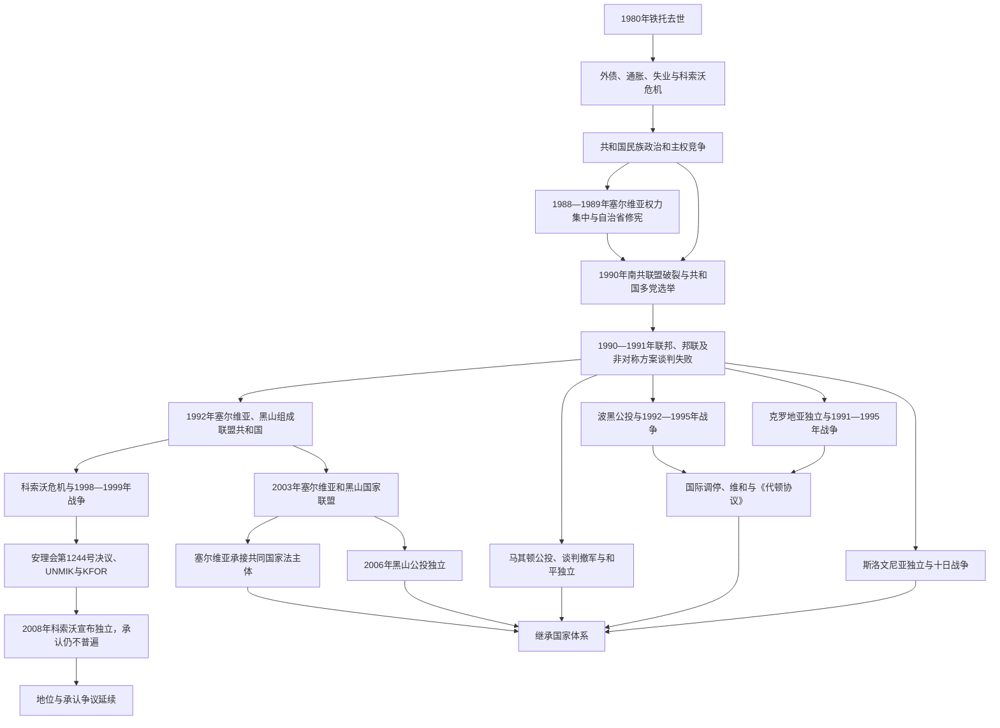

# 南斯拉夫解体

## 时间

1980年代危机—2008年科索沃宣布独立；核心联邦解体期为1991—1992年，主要南斯拉夫战争延续至1999年

## 概括

南斯拉夫解体不是一个国家在同一天和平分成数国，而是社会主义联邦的共同党政制度先行失效，六个共和国对主权、边界和民族自决提出彼此冲突的方案，随后各地区以不同路径脱离。斯洛文尼亚经历短暂十日战争；克罗地亚因境内塞族自治、南斯拉夫人民军介入和领土争夺陷入长期战争；马其顿通过公投和谈判相对和平独立；波斯尼亚和黑塞哥维那的混居结构、相互排斥的民族国家方案及外部支持导致最惨烈战争。塞尔维亚和黑山则在1992年继续组成新的南斯拉夫联盟共和国，直到2006年和平分立。

解体兼具四个层次：联邦宪法秩序崩溃、共和国独立、共和国境内领土与民族冲突、国际社会对承认、制裁、维和及军事干预的逐步介入。科索沃地位争议源于塞尔维亚内部自治问题和1998—1999年战争，其2008年独立并非1991年六共和国解体的同一步骤。要理解这一过程，必须同时看到经济危机和制度失灵、政治精英的民族动员、军警与地方武装的组织能力，以及国际环境变化，而不能用“古老仇恨”或单一外部阴谋解释。

## 解体过程图

## 解体前的结构危机

### 铁托身后权力分散

1974年宪法赋予六个共和国和塞尔维亚境内两个自治省广泛权限，以轮值联邦主席团防止任何单一民族支配。铁托1980年去世后，这套机制避免了立即争夺个人继承，却没有可在重大主权冲突中作出最终决定的共同民主权威。联邦政府负责货币、外债和宏观改革，共和国却控制大量税收、警察、媒体和企业；南斯拉夫人民军保卫联邦，军队的政治监督又逐渐同共和国党组织分离。

### 经济危机

1970年代外债、低效投资和石油冲击在1980年代转化为紧缩、货币贬值、失业和高通胀。富裕的斯洛文尼亚、克罗地亚认为联邦转移支付和统一市场政策压低其收益；科索沃、马其顿、波黑等低发展地区则认为投资不足。各共和国银行、企业和政府相互转移亏损，经济政策争论越来越以“本共和国被剥夺”的民族话语表达。

### 科索沃与塞尔维亚政治转向

1981年科索沃阿尔巴尼亚族示威要求共和国地位，联邦镇压后，阿尔巴尼亚族政治不满和塞族、黑山族安全感下降同时加深。米洛舍维奇在1987年后借塞族群众动员掌握塞尔维亚党政权力。1988—1989年“反官僚革命”使伏伊伏丁那、科索沃和黑山领导层更替，塞尔维亚修宪收回自治省大量权限。

塞尔维亚方面将其解释为恢复共和国统一和保护科索沃塞族；斯洛文尼亚、克罗地亚和科索沃阿尔巴尼亚族则认为四个联邦主席团席位受同一政治集团影响，1974年防支配平衡被打破。争论由自治政策升级为“联邦是共同国家还是共和国联盟”。

## 统一党崩溃与共和国选举

1990年1月，南共联盟第十四次代表大会因塞尔维亚主张更统一的党制、斯洛文尼亚主张党和国家邦联化而破裂。斯洛文尼亚代表退出，克罗地亚代表拒绝继续，跨共和国唯一执政组织停止有效运作。

1990年各共和国分别举行多党选举：

| 共和国 | 主要选举结果与政治方向 | 对共同国家的初步方案 |
|---|---|---|
| 斯洛文尼亚 | DEMOS反对派联盟执政，改革共产党总统米兰·库昌继续担任元首 | 主权共和国、市场民主，若保留共同国家则应为松散邦联。 |
| 克罗地亚 | 弗拉尼奥·图季曼领导的克罗地亚民主共同体执政 | 克罗地亚主权和邦联；境内塞族地位迅速成为冲突核心。 |
| 塞尔维亚 | 米洛舍维奇及塞尔维亚社会党获胜 | 保留有共同军队、市场和中央权威的联邦，同时主张塞族也有自决权。 |
| 黑山 | 莫米尔·布拉托维奇等改组共产党领导继续执政 | 与塞尔维亚保持联邦共同国家。 |
| 波黑 | 穆斯林、塞族、克罗地亚族三大民族政党联合执政后迅速分裂 | 伊泽特贝戈维奇等主张主权波黑；塞族民主党反对脱离南斯拉夫；克族方案随克罗地亚政策变化。 |
| 马其顿 | 多党议会无单一绝对多数，基罗·格利戈罗夫当选总统 | 寻求主权化及非对称共同框架，谈判失败后走向独立。 |

共和国选举带来真实政治竞争，却没有举行全联邦制宪选举，也没有一套各方接受的退出程序。每个政府都以本共和国选民授权解释“人民自决”，但混居地区的居民对“人民”是共和国全体公民还是各民族共同体有不同理解。

## 联邦方案谈判失败

1990—1991年，共和国领导人多次会谈。主要方案包括：

- 斯洛文尼亚、克罗地亚提出由主权国家缔约组成的邦联，各成员控制军队、外交和经济制度。
- 塞尔维亚、黑山倾向保留较强联邦，并主张如果共和国可以退出，克罗地亚和波黑境内塞族地区也应决定归属。
- 波黑和马其顿提出不对称联邦或“共和国联盟”，试图避免在塞尔维亚与克罗地亚之间选择。
- 联邦总理安特·马尔科维奇推动统一市场、货币稳定和全联邦改革党，希望经济利益阻止分裂。

各方案对主权单位、边界不可变、军队归属及少数民族保障没有共同起点。人民军领导层担忧共和国国防部队和武装警察瓦解统一军队，曾讨论紧急状态，但集体主席团未形成合法多数。1991年5月，亲塞尔维亚成员阻止按轮换应接任主席的克罗地亚代表梅西奇就职，联邦元首机制公开失灵。

## 斯洛文尼亚：十日战争

### 独立程序

斯洛文尼亚1990年12月公投中绝大多数投票者支持独立。1991年6月25日，议会通过独立法案并接管边境、海关和联邦资产。人民军奉命恢复联邦边界控制，斯洛文尼亚领土防御部队和警察包围军营、切断补给并争夺口岸。

### 战争和撤军

战斗约持续十天，规模和伤亡远低于后续战争。斯洛文尼亚境内塞族人口较少、边界不与塞尔维亚相连，人民军和塞尔维亚领导层都不愿为保留斯洛文尼亚投入长期战争。7月7日《布里俄尼协议》规定独立决定暂停三个月、联邦军返回军营；随后人民军撤出斯洛文尼亚。斯洛文尼亚实际上脱离联邦，并于1992年获广泛承认。

## 克罗地亚：独立、塞族叛乱与战争

### 宪法和地方自治冲突

克罗地亚新政府恢复历史国家象征、调整行政与警察人事，并在1990年宪法中把塞族由“构成民族”地位改为少数民族。许多克罗地亚人视此为结束共产党统治和恢复国家传统；克罗地亚塞族则结合二战乌斯塔沙记忆、民族主义宣传和现实就业安全，担心失去集体权利。

克宁等塞族聚居区于1990年发动“原木革命”，阻断道路并建立自治机构，后来宣布“塞尔维亚克拉伊纳共和国”。其领导获得塞尔维亚安全机关、准军事组织及人民军部分支持，目标是留在南斯拉夫或与塞尔维亚统一。克罗地亚政府坚持共和国边界和领土完整。

### 1991年战争

克罗地亚同斯洛文尼亚于1991年6月25日宣布独立，并按《布里俄尼协议》暂停实施三个月；10月8日正式切断剩余国家关系。人民军从名义上的冲突调停者转为同克罗地亚塞族武装共同攻击多个地区。武科瓦尔围城后城市于11月陷落并发生奥夫查拉处决；杜布罗夫尼克遭围攻和炮击；非塞族居民从克拉伊纳等地被驱逐，克罗地亚方面也对塞族平民和财产实施暴力。

1992年初停火后，联合国保护部队部署于若干受保护区，前线大致冻结。克罗地亚逐步重建军队，1993年和1995年发动行动。1995年5月“闪电行动”夺回西斯拉沃尼亚，8月“风暴行动”攻占克拉伊纳大部，大多数当地塞族逃离或被撤走，留下的塞族平民中发生杀害和纵火。东斯拉沃尼亚依据1995年《埃尔杜特协议》由联合国过渡管理，1998年和平回归克罗地亚。

## 马其顿：相对和平脱离

马其顿1991年9月8日公投支持建立有权同主权南斯拉夫国家结盟的独立国家，塞族和部分阿尔巴尼亚族选民参与不足。11月通过新宪法。总统基罗·格利戈罗夫同人民军谈判，军队在1992年撤出，未发生共和国与联邦间全面战争。

和平独立不代表没有争议。希腊反对使用“马其顿”国名及相关象征，导致该国1993年以临时称谓加入联合国；保加利亚率先承认国家但长期争论语言和历史；国内阿尔巴尼亚族对教育、语言、地方权力和构成民族地位不满，最终在2001年演变为武装冲突并通过《奥赫里德框架协议》缓和。

## 波斯尼亚和黑塞哥维那：多层战争

### 从政治分裂到独立公投

波黑人口混居，没有可在不大规模迁徙的情况下划出清晰民族边界。1991年，波黑塞族民主党建立塞族自治区域及独立议会，接受塞尔维亚支持并准备留在南斯拉夫；克族力量建立“黑塞哥—波斯尼亚”共同体并与克罗地亚联系；共和国政府主张波黑作为整体主权国家。

1992年2月29日至3月1日独立公投获参与者压倒性支持，但多数塞族抵制。欧洲共同体和美国承认波黑后，塞族部队、人民军遗留结构与波黑政府武装全面交战。克罗地亚防务委员会最初与政府军对抗塞族力量，1993年双方又爆发克—波战争，1994年《华盛顿协议》恢复联盟并成立波黑联邦。

### 围城、族群清洗与种族灭绝

波黑塞族军队控制较多重武器和领土，围困萨拉热窝近四年。各方都建立拘禁营、驱逐和杀害平民，强奸被系统用于恐吓和清除人口；规模、组织程度和地区分布并不相同。普里耶多尔、福查、维舍格勒、拉什瓦河谷等地发生严重罪行。

1995年7月，波黑塞族军队攻占联合国宣布的斯雷布雷尼察“安全区”，杀害八千余名波什尼亚克男性和男孩。国际法院与前南刑庭均把这一罪行认定为种族灭绝。这里的法律认定针对具体行动和责任，不等于把整个民族集体定罪。

### 国际干预与代顿

联合国实施武器禁运、制裁、维和及人道援助，但维和部队授权和兵力不足以强制和平。北约逐步设禁飞区并在1995年萨拉热窝市场炮击等事件后发动较大规模空袭。克罗地亚和波黑政府军地面攻势改变战场平衡，美国外交促成谈判。

1995年11月，《代顿协议》在美国草签，12月于巴黎正式签署。波黑作为一个国际法国家延续，内部由波黑联邦和塞族共和国两个实体组成，另有后来确定地位的布尔奇科特区；国际高级代表监督民事执行，北约主导部队执行军事安排。协议结束战争，却把民族否决和复杂权力分享固化于宪制。

## 塞尔维亚、黑山与“剩余南斯拉夫”

1992年4月27日，塞尔维亚和黑山成立南斯拉夫联盟共和国，宣称继续旧南斯拉夫的国际人格和联合国席位。联合国等机构没有接受自动延续，要求新国申请加入；该国直到2000年政权更替后才正式加入联合国。

米洛舍维奇领导的塞尔维亚通过政治、安全和后勤网络支持克罗地亚、波黑塞族实体，同时在不同阶段施压其接受和平方案。联合国制裁、战争开支、货币滥发和经济崩溃导致1993—1994年恶性通胀。黑山起初与塞尔维亚领导层一致，1997年后米洛·久卡诺维奇路线逐步分离，使用德国马克、建立独立海关和外交网络。

这一国家的发展和2003年改组详见[南斯拉夫联盟共和国与塞尔维亚和黑山](/%E4%BA%BA%E6%96%87%E7%A7%91%E5%AD%A6/%E5%8E%86%E5%8F%B2/%E6%AC%A7%E6%B4%B2/%E4%B8%9C%E5%8D%97%E6%AC%A7%E4%B8%8E%E5%B7%B4%E5%B0%94%E5%B9%B2/%E5%8D%97%E6%96%AF%E6%8B%89%E5%A4%AB%E5%8E%86%E5%8F%B2/%E5%8D%97%E6%96%AF%E6%8B%89%E5%A4%AB%E8%81%94%E7%9B%9F%E5%85%B1%E5%92%8C%E5%9B%BD%E4%B8%8E%E5%A1%9E%E5%B0%94%E7%BB%B4%E4%BA%9A%E5%92%8C%E9%BB%91%E5%B1%B1.md)。

## 科索沃：从自治危机到国际管理

### 平行制度与武装化

塞尔维亚1989—1990年限制科索沃自治后，大批阿尔巴尼亚族公务员、教师和媒体人员被排除或离职。易卜拉欣·鲁戈瓦领导的科索沃民主联盟建立平行教育、医疗和政治网络，以非暴力方式争取独立。由于长期未获国际地位突破，科索沃解放军在1990年代中期扩大袭击，塞尔维亚警察和军队以大规模清剿回应。

1998年冲突升级，村庄袭击、驱逐和双方针对平民的暴力造成难民潮。国际调停和停火未能持久。1999年朗布依埃谈判因自治、外国驻军和最终地位条款分歧失败。

### 北约战争与第1244号决议

北约于1999年3月24日开始在未获联合国安理会明确授权的情况下轰炸南斯拉夫联盟共和国，主张阻止人道灾难；其合法性至今存在争议。轰炸期间，塞尔维亚和南斯拉夫部队大规模驱逐科索沃阿尔巴尼亚族居民并实施多起屠杀，科索沃解放军也袭击塞族、罗姆人和被视为合作者者。北约轰炸造成军事和民用人员死亡及基础设施破坏。

6月《库马诺沃军事技术协议》规定南斯拉夫安全部队撤出科索沃。安理会第1244号决议确认南斯拉夫联盟共和国领土完整的原则性表述，同时建立联合国科索沃临时行政当局特派团和北约主导的KFOR，授权科索沃在国际管理下实行实质自治。阿尔巴尼亚族难民大规模返回后，许多塞族、罗姆人等离开或遭报复。

### 2008年独立及争议

联合国管理期间建立临时自治机构，但塞尔维亚与科索沃阿尔巴尼亚族对最终地位没有共识。2008年2月17日，科索沃议会宣布独立。美国和多数欧盟成员国等承认，塞尔维亚、俄罗斯、中国及部分国家不承认。国际法院2010年咨询意见认为该份独立宣言本身没有违反一般国际法或第1244号决议，但没有裁定国家地位、承认义务或普遍分离权。

因此，科索沃是独立运作且获广泛但不普遍承认的政治实体，其地位不能简单写成1991年某一共和国正常退出。详见[科索沃历史](/%E4%BA%BA%E6%96%87%E7%A7%91%E5%AD%A6/%E5%8E%86%E5%8F%B2/%E6%AC%A7%E6%B4%B2/%E4%B8%9C%E5%8D%97%E6%AC%A7%E4%B8%8E%E5%B7%B4%E5%B0%94%E5%B9%B2/%E7%A7%91%E7%B4%A2%E6%B2%83/README.md)。

## 国际社会的作用

### 承认与法律意见

欧洲共同体1991年成立由罗贝尔·巴丹泰尔主持的仲裁委员会。委员会认为南斯拉夫正处于解体过程，原共和国边界除非经协议不得改变，并对各共和国承认条件提出意见。国际承认使共和国独立获得法律效果，却未自动阻止境内战争；承认时机是否过早或过晚一直有争论。

### 制裁、维和与军事干预

| 工具 | 主要时期 | 作用与局限 |
|---|---|---|
| 武器禁运 | 1991年起 | 名义适用于全南斯拉夫，但旧人民军及塞族力量已有大量武器，波黑政府认为禁运固化不平衡。 |
| 对塞黑制裁 | 1992—1995年等 | 增加米洛舍维奇接受谈判的成本，也重创普通民众和区域灰色经济。 |
| 联合国维和 | 克罗地亚、波黑、马其顿等 | 监督停火、护送援助和预防扩大战争；授权不足时无法保护所有“安全区”。 |
| 北约空中力量 | 1994—1995年波黑、1999年南联盟 | 与地面战局和外交共同迫使协议；平民伤亡、授权和比例原则引发争议。 |
| 国际司法 | 1993年后 | 前南刑庭起诉各方高级责任人，发展战争罪、危害人类罪和种族灭绝判例，但审判缓慢且在各社会接受不一。 |
| 国际监督 | 代顿后的波黑、1999年后的科索沃 | 防止战争复发并建设制度，也产生外部官员权力与本地民主责任之间的矛盾。 |

国际因素既非旁观者，也不是解体的唯一制造者。冷战结束改变了大国优先事项；承认、制裁和干预影响战争进程，但武装组织、领土目标和暴力决策主要由本地领导与机构实施。

## 国家继承与共同财产

南斯拉夫联盟共和国最初主张自己是旧联邦唯一延续国，斯洛文尼亚、克罗地亚、波黑和马其顿则主张六共和国为平等继承者。联合国不允许塞黑自动使用旧席位；2000年11月1日，联盟共和国作为新会员加入联合国，实际放弃唯一延续主张。

2001年五个继承国签署继承问题协定，分配外交财产、金融资产、档案、养老金及其他权利义务，协定2004年生效。2006年国家联盟解体后，塞尔维亚依据宪章承接塞黑的国际组织成员资格，黑山重新申请加入；这与1992年旧社会主义联邦被认定为解体的情形不同。

## 解体路径对照

| 政治单位 | 关键决定 | 武装过程 | 国际结果 |
|---|---|---|---|
| 斯洛文尼亚 | 1990年公投，1991年6月宣布独立 | 十日战争后人民军撤离 | 1992年广泛承认并加入联合国。 |
| 克罗地亚 | 1991年公投和独立决定 | 1991—1995年战争；东斯拉沃尼亚至1998年和平回归 | 1992年获承认；共和国边界恢复但发生大规模人口迁徙。 |
| 马其顿 | 1991年公投和宪法 | 同人民军谈判撤军，无联邦战争 | 1993年以临时称谓加入联合国，后改国名北马其顿。 |
| 波黑 | 1992年独立公投 | 1992—1995年三方及多层战争 | 代顿后国家延续，内部两实体和国际监督。 |
| 塞尔维亚 | 未以共和国身份从旧联邦退出 | 同黑山建立新联盟，参与或支持周边冲突；科索沃战争 | 2006年承接塞黑共同国家成员资格。 |
| 黑山 | 1992年先留在塞黑共同国家，2006年公投 | 1990年代参与联盟体系，后与贝尔格莱德路线分离；2006年和平分立 | 作为新独立国加入联合国。 |
| 科索沃 | 1990年代平行制度，2008年宣布独立 | 1998—1999年战争，后由联合国管理 | 获部分国家承认，塞尔维亚及若干国家拒绝承认。 |

## 重要事件

| 时间 | 事件 | 直接结果 |
|---|---|---|
| 1989年 | 塞尔维亚修宪、科索沃危机升级 | 1974年自治平衡改变，共和国互信下降。 |
| 1990年1月 | 南共联盟十四大破裂 | 全联邦统一执政党停止运作。 |
| 1990年 | 六共和国多党选举 | 主权问题转由各共和国竞争性政府处理。 |
| 1991年5月 | 联邦主席团主席轮换受阻 | 集体元首合法性与军队指挥危机公开化。 |
| 1991年6月25日 | 斯洛文尼亚、克罗地亚宣布独立 | 十日战争和克罗地亚全面战争相继发生。 |
| 1991年9月8日 | 马其顿独立公投 | 通过谈判走向和平脱离。 |
| 1992年2—3月 | 波黑独立公投 | 国际承认后战争全面爆发。 |
| 1992年4月27日 | 塞黑成立南斯拉夫联盟共和国 | 旧六共和国联邦终止，继承资格争议开始。 |
| 1993年 | 前南刑庭成立 | 国际刑事追责机制介入战争。 |
| 1995年7月 | 斯雷布雷尼察种族灭绝 | 加速北约和外交压力。 |
| 1995年8月 | 克罗地亚“风暴行动” | 克拉伊纳塞族政权瓦解，大批塞族离开。 |
| 1995年12月14日 | 《代顿协议》正式签署 | 波黑战争结束，新宪制建立。 |
| 1998—1999年 | 科索沃战争 | 北约轰炸，南联盟军警撤出科索沃。 |
| 1999年6月10日 | 安理会第1244号决议 | 科索沃进入联合国临时管理与KFOR安全部署。 |
| 2000年10—11月 | 米洛舍维奇倒台、联盟共和国加入联合国 | 塞黑接受新会员和共同继承框架。 |
| 2001年6月29日 | 继承问题协定签署 | 五个国家约定分配旧联邦权利义务。 |
| 2003年2月4日 | 塞尔维亚和黑山国家联盟成立 | 联盟共和国改为松散共同国家。 |
| 2006年5—6月 | 黑山公投并独立 | 最后一个南斯拉夫共同国家解体。 |
| 2008年2月17日 | 科索沃宣布独立 | 地位和承认争议进入新阶段。 |

## 因果分析

### 结构因素

1. **宪法主权含混**：共和国是国家性单位，却又受联邦统一和构成民族自决原则约束；退出与边界变更没有各方认可程序。
2. **混居人口与民族—领土错位**：尤其在波黑和克罗地亚，不可能通过共和国独立同时满足所有民族领土方案。
3. **党国制度失效**：联邦长期依靠共产党内部纪律而非公开竞争的宪政仲裁；党一旦分裂，制度缺少替代协调中心。
4. **经济分配冲突**：债务、通胀和失业把共和国间再分配争议转化为民族受害叙事。
5. **安全机构碎片化**：人民军、共和国领土防御、警察和秘密安全网络为政治冲突迅速军事化提供组织与武器。
6. **历史记忆政治化**：二战屠杀和社会主义镇压被选择性重述，用来把当代对手描绘为生存威胁。

### 政治选择

- 米洛舍维奇以群众动员重组塞尔维亚和联邦席位平衡，并支持境外塞族领土目标。
- 斯洛文尼亚、克罗地亚领导层把共和国选举授权转化为主权决定，未能与联邦达成共同退出框架。
- 克罗地亚、波黑塞族及波黑克族、波什尼亚克领导分别建立民族领土机构，推动事实分割。
- 人民军领导从维护联邦逐步卷入特定领土战争，失去全联邦合法性。
- 媒体宣传、准军事组织和秘密警察将妥协描述为背叛，使暴力成为可执行政策。战争并非不可避免的自然现象，而是具体机构与领导决策的结果。

### 外部环境

冷战结束削弱大国维持南斯拉夫统一的战略动力。欧洲共同体缺乏统一安全能力，美国早期不愿深度介入，俄罗斯政治转型又限制其作用。国际社会在军火禁运、承认、制裁、维和与武力干预之间逐步升级，往往在大规模暴力发生后才改变政策。

### 直接触发

1991年联邦主席团和制宪谈判失败后，斯洛文尼亚、克罗地亚单方面实施独立，人民军以控制边界和解除共和国武装为名介入。克罗地亚塞族自治已形成武装领土，波黑各民族机构也提前组织。由此，原本可以谈判的主权争议与已部署的军警、武器和恐惧叙事结合，迅速转成领土战争。

## 长期影响

- 七个主要继承或争议政治实体形成，原共和国边界大体成为国际边界，科索沃仍是例外性争议。
- 战争造成大规模死亡、失踪、难民和国内流离失所，许多原本混居地区趋于族群同质化。
- 波黑形成高度复杂的权力分享和国际监督制度，和平稳定与政府效能之间长期紧张。
- 塞尔维亚、克罗地亚、波黑和科索沃围绕战争责任、失踪者、难民返乡和财产归还的争议延续。
- 前南刑庭和国际法院判例推动个人刑责原则，反对以民族集体责任取代具体命令和行为证据。
- 欧盟和北约扩展成为继承国家改革与外交重心，但承认分歧、边界和少数民族问题仍影响区域合作。
- “南斯拉夫”既留下战争创伤，也留下跨地区家庭、语言、文化市场、基础设施和共同社会经验，解体没有消除所有社会联系。

## 关键辨析

- 斯洛文尼亚、克罗地亚、波黑、马其顿从六共和国联邦脱离，与黑山2006年退出塞黑国家联盟不是同一法律阶段。
- 塞尔维亚和黑山并非1991年同时“独立”，而是共同维持新国家至2006年。
- 科索沃是塞尔维亚境内自治省，不是1974年宪法下的共和国；其地位变化来自后来战争、国际管理和独立宣言。
- 所有主要阵营都有犯罪，不意味着规模、政策性和法律定性完全相同；应以具体案件和机构责任区分。
- 国际承认影响国家法地位，但不是战争的唯一原因；本地武装和政治领导对暴力升级负直接责任。
- 《代顿协议》终结波黑战争，而不是一次性解决整个前南斯拉夫所有国家继承和科索沃问题。

## 演变关系

- 前一节点：[南斯拉夫社会主义联邦共和国](/%E4%BA%BA%E6%96%87%E7%A7%91%E5%AD%A6/%E5%8E%86%E5%8F%B2/%E6%AC%A7%E6%B4%B2/%E4%B8%9C%E5%8D%97%E6%AC%A7%E4%B8%8E%E5%B7%B4%E5%B0%94%E5%B9%B2/%E5%8D%97%E6%96%AF%E6%8B%89%E5%A4%AB%E5%8E%86%E5%8F%B2/%E5%8D%97%E6%96%AF%E6%8B%89%E5%A4%AB%E7%A4%BE%E4%BC%9A%E4%B8%BB%E4%B9%89%E8%81%94%E9%82%A6%E5%85%B1%E5%92%8C%E5%9B%BD.md)。
- 塞黑共同国家：[南斯拉夫联盟共和国与塞尔维亚和黑山](/%E4%BA%BA%E6%96%87%E7%A7%91%E5%AD%A6/%E5%8E%86%E5%8F%B2/%E6%AC%A7%E6%B4%B2/%E4%B8%9C%E5%8D%97%E6%AC%A7%E4%B8%8E%E5%B7%B4%E5%B0%94%E5%B9%B2/%E5%8D%97%E6%96%AF%E6%8B%89%E5%A4%AB%E5%8E%86%E5%8F%B2/%E5%8D%97%E6%96%AF%E6%8B%89%E5%A4%AB%E8%81%94%E7%9B%9F%E5%85%B1%E5%92%8C%E5%9B%BD%E4%B8%8E%E5%A1%9E%E5%B0%94%E7%BB%B4%E4%BA%9A%E5%92%8C%E9%BB%91%E5%B1%B1.md)。
- 后续国家入口：[斯洛文尼亚](/%E4%BA%BA%E6%96%87%E7%A7%91%E5%AD%A6/%E5%8E%86%E5%8F%B2/%E6%AC%A7%E6%B4%B2/%E4%B8%9C%E5%8D%97%E6%AC%A7%E4%B8%8E%E5%B7%B4%E5%B0%94%E5%B9%B2/%E6%96%AF%E6%B4%9B%E6%96%87%E5%B0%BC%E4%BA%9A/README.md)、[克罗地亚](/%E4%BA%BA%E6%96%87%E7%A7%91%E5%AD%A6/%E5%8E%86%E5%8F%B2/%E6%AC%A7%E6%B4%B2/%E4%B8%9C%E5%8D%97%E6%AC%A7%E4%B8%8E%E5%B7%B4%E5%B0%94%E5%B9%B2/%E5%85%8B%E7%BD%97%E5%9C%B0%E4%BA%9A/README.md)、[波斯尼亚和黑塞哥维那](/%E4%BA%BA%E6%96%87%E7%A7%91%E5%AD%A6/%E5%8E%86%E5%8F%B2/%E6%AC%A7%E6%B4%B2/%E4%B8%9C%E5%8D%97%E6%AC%A7%E4%B8%8E%E5%B7%B4%E5%B0%94%E5%B9%B2/%E6%B3%A2%E6%96%AF%E5%B0%BC%E4%BA%9A%E5%92%8C%E9%BB%91%E5%A1%9E%E5%93%A5%E7%BB%B4%E9%82%A3/README.md)、[北马其顿](/%E4%BA%BA%E6%96%87%E7%A7%91%E5%AD%A6/%E5%8E%86%E5%8F%B2/%E6%AC%A7%E6%B4%B2/%E4%B8%9C%E5%8D%97%E6%AC%A7%E4%B8%8E%E5%B7%B4%E5%B0%94%E5%B9%B2/%E5%8C%97%E9%A9%AC%E5%85%B6%E9%A1%BF/README.md)、[塞尔维亚](/%E4%BA%BA%E6%96%87%E7%A7%91%E5%AD%A6/%E5%8E%86%E5%8F%B2/%E6%AC%A7%E6%B4%B2/%E4%B8%9C%E5%8D%97%E6%AC%A7%E4%B8%8E%E5%B7%B4%E5%B0%94%E5%B9%B2/%E5%A1%9E%E5%B0%94%E7%BB%B4%E4%BA%9A/README.md)、[黑山](/%E4%BA%BA%E6%96%87%E7%A7%91%E5%AD%A6/%E5%8E%86%E5%8F%B2/%E6%AC%A7%E6%B4%B2/%E4%B8%9C%E5%8D%97%E6%AC%A7%E4%B8%8E%E5%B7%B4%E5%B0%94%E5%B9%B2/%E9%BB%91%E5%B1%B1/README.md)与[科索沃](/%E4%BA%BA%E6%96%87%E7%A7%91%E5%AD%A6/%E5%8E%86%E5%8F%B2/%E6%AC%A7%E6%B4%B2/%E4%B8%9C%E5%8D%97%E6%AC%A7%E4%B8%8E%E5%B7%B4%E5%B0%94%E5%B9%B2/%E7%A7%91%E7%B4%A2%E6%B2%83/README.md)。
- 共同国家领导序列：[南斯拉夫国家元首与政府首脑表](/%E4%BA%BA%E6%96%87%E7%A7%91%E5%AD%A6/%E5%8E%86%E5%8F%B2/%E6%AC%A7%E6%B4%B2/%E4%B8%9C%E5%8D%97%E6%AC%A7%E4%B8%8E%E5%B7%B4%E5%B0%94%E5%B9%B2/%E5%8D%97%E6%96%AF%E6%8B%89%E5%A4%AB%E5%8E%86%E5%8F%B2/%E5%8D%97%E6%96%AF%E6%8B%89%E5%A4%AB%E5%9B%BD%E5%AE%B6%E5%85%83%E9%A6%96%E4%B8%8E%E6%94%BF%E5%BA%9C%E9%A6%96%E8%84%91%E8%A1%A8.md)。
- 返回：[南斯拉夫历史](/%E4%BA%BA%E6%96%87%E7%A7%91%E5%AD%A6/%E5%8E%86%E5%8F%B2/%E6%AC%A7%E6%B4%B2/%E4%B8%9C%E5%8D%97%E6%AC%A7%E4%B8%8E%E5%B7%B4%E5%B0%94%E5%B9%B2/%E5%8D%97%E6%96%AF%E6%8B%89%E5%A4%AB%E5%8E%86%E5%8F%B2/README.md)。
