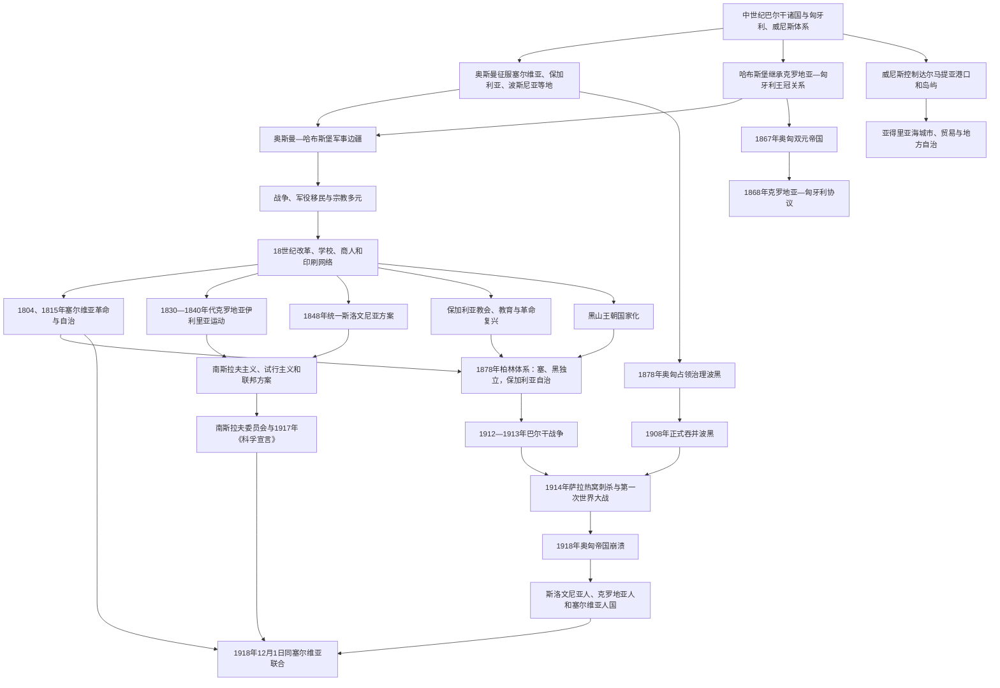

# 奥斯曼—哈布斯堡分治与民族运动

## 时间

约16世纪末—1918年；其制度背景可追溯至中世纪匈牙利、威尼斯和奥斯曼扩张

## 范围

近代南斯拉夫地区长期分处奥斯曼帝国、哈布斯堡君主国、匈牙利王冠、威尼斯共和国和拉古萨共和国等不同体系。塞尔维亚、保加利亚、波斯尼亚、马其顿和黑山周边多受奥斯曼统治；斯洛文尼亚诸地、克罗地亚残部和部分达尔马提亚进入哈布斯堡、匈牙利或威尼斯框架；边界又随战争反复移动。

本笔记关注帝国分治如何塑造军事边疆、宗教、法律、教育和地区认同，以及18—20世纪初文化复兴、民族革命、南斯拉夫主义和大国战争怎样把这些差异重新组织成自治、独立或联合国家方案。各民族运动并非自然走向同一个“南斯拉夫国家”：保加利亚建立独立国家，斯洛文尼亚和克罗地亚政治内部也长期在帝国自治、试行主义、南斯拉夫联合和独立方案间竞争。

## 概括

奥斯曼—哈布斯堡分治不是一条静止的文明边界，而是堡垒、军役移民、贸易、走私、通婚、难民和多重效忠构成的活动地带。哈布斯堡在克罗地亚—斯拉沃尼亚设军事边疆，以土地和宗教特权换取常备军役；奥斯曼在波斯尼亚和塞尔维亚边境以行省、堡垒和地方军政精英防守。威尼斯控制亚得里亚海港口和岛屿，拉古萨则通过向奥斯曼纳贡、同地中海贸易保持自治。

18世纪末至19世纪，印刷、学校、商人侨民、教会网络和国家改革扩大公共政治。塞尔维亚起义建立自治公国；克罗地亚伊利里亚运动以语言文化统一对抗马扎尔化；斯洛文尼亚运动提出“统一斯洛文尼亚”；保加利亚复兴通过教会、学校和革命组织走向自治国家；波黑、黑山和马其顿则因土地、宗教、王朝及邻国竞争形成不同道路。1912—1913年巴尔干战争基本终结奥斯曼在南斯拉夫腹地的统治，第一次世界大战又摧毁奥匈帝国。1918年统一王国因此既是南斯拉夫主义的成果，也是战争崩溃、安全压力和塞尔维亚军事优势下仓促形成的制度安排。

## 分治与联合方案演变图

## 帝国分治格局

### 奥斯曼地区

奥斯曼统治覆盖保加利亚、塞尔维亚大部、波斯尼亚和黑塞哥维那、马其顿、科索沃及黑山周边。帝国以行省、桑贾克、卡迪法庭、蒂玛尔及后来的包税体系治理，宗教社群拥有有限自治但法律地位不平等。波斯尼亚形成规模可观的本地穆斯林人口和边疆军政阶层，塞尔维亚和保加利亚东正教会则在修道院、教区和乡村共同体中保存书写与历史传统。

具体征服、宗教制度、伊斯兰化与社会经济见[奥斯曼统治下的巴尔干斯拉夫](/%E4%BA%BA%E6%96%87%E7%A7%91%E5%AD%A6/%E5%8E%86%E5%8F%B2/%E6%AC%A7%E6%B4%B2/%E4%B8%9C%E5%8D%97%E6%AC%A7%E4%B8%8E%E5%B7%B4%E5%B0%94%E5%B9%B2/%E5%8D%97%E6%96%AF%E6%8B%89%E5%A4%AB%E5%8E%86%E5%8F%B2/%E5%A5%A5%E6%96%AF%E6%9B%BC%E7%BB%9F%E6%B2%BB%E4%B8%8B%E7%9A%84%E5%B7%B4%E5%B0%94%E5%B9%B2%E6%96%AF%E6%8B%89%E5%A4%AB.md)。

### 哈布斯堡、匈牙利王冠与军事边疆

1526年莫哈奇战役后，克罗地亚贵族选择哈布斯堡的斐迪南为王，以获取抵御奥斯曼的资源。克罗地亚仍保留议会和班等历史机构，却同时受匈牙利王冠关系、维也纳宫廷和军事机关制约。哈布斯堡把最危险的边境从普通省政中分出，建立由维也纳军事当局直接管理的军事边疆。

边疆安置克罗地亚人、塞尔维亚人、弗拉赫人和其他逃离奥斯曼地区的居民，授予土地、宗教和社区特权，交换终身军役。居民身份既可能按宗教、职业和法律地位区分，也会在19世纪民族政治中被重述为塞族或克族历史权利。军事边疆保护哈布斯堡，也削弱克罗地亚议会对大片领土的控制；1881年边疆撤销并并入克罗地亚—斯拉沃尼亚后，政治代表和土地问题仍延续。

斯洛文尼亚语地区分属卡尼奥拉、施蒂里亚、克恩顿、戈里齐亚等哈布斯堡世袭领地。德语是宫廷、行政和城市精英的重要语言，地方方言、教会和农民社会则维持斯洛文尼亚语连续。这里没有一个中世纪以来统一的“斯洛文尼亚省”，现代民族运动因而把统一分散领地视为主要目标。

### 威尼斯、达尔马提亚和拉古萨

威尼斯长期控制伊斯特拉、达尔马提亚沿岸城市和岛屿，把当地纳入亚得里亚海海军与贸易体系。城市使用意大利语、拉丁语和南斯拉夫方言，天主教会、城市法和腹地移民交织。威尼斯与奥斯曼战争推动沿海边界移动，也使莫拉克人等军役社群跨境定居。

拉古萨共和国以杜布罗夫尼克为中心，向奥斯曼纳贡并取得在帝国内贸易特权，同时保持自身贵族共和制度和外交。它连接巴尔干矿产、牲畜与地中海市场，证明帝国分治之间仍存在密集经济联系。1808年拿破仑体系终结共和国，1815年其领土归哈布斯堡。

## 边疆社会和人口迁徙

### 战争与定居

16—18世纪战争使村庄反复废弃，居民可能向堡垒、山地、城市或对方帝国迁移。1683—1699年神圣同盟战争期间，哈布斯堡军深入塞尔维亚，奥斯曼反攻后大量东正教居民随佩奇牧首北迁。与此同时，奥斯曼从失地撤退时，穆斯林居民进入波斯尼亚和更南地区。

这些迁徙造成塞族东正教社群遍布克罗地亚—斯拉沃尼亚、伏伊伏丁那和匈牙利南部，波黑则同时有穆斯林、东正教和天主教人口。后来的民族国家边界无法完整包容这种混居，19—20世纪政治因而同时争论历史领土和人口多数。

### 军役、自治与忠诚

军事边疆居民直接向哈布斯堡军方服役，不完全受地方贵族农役约束；奥斯曼边境的地方穆斯林军户、堡垒禁卫军和山地基督徒也有特殊义务。特权来自皇帝或苏丹，可在中央改革中被取消，因此社群政治常围绕“恢复旧权利”而非最初要求独立。

边民也从事畜牧、农业、贸易和走私，和平时期跨界市场与亲族联系恢复。民族史把边界写成不可逾越的宗教断层，会遗漏实际日常往来。

## 启蒙、语言与公共文化

### 教育和印刷

18世纪哈布斯堡国家改革扩大官办学校、人口统计、征税和征兵，玛丽亚·特蕾西亚、约瑟夫二世的中央化与宗教宽容政策削弱部分教会垄断。奥斯曼地区的商人侨民、修道院和教会也资助学校与印刷，维也纳、布达、威尼斯、的里雅斯特、诺维萨德、莱比锡和伊斯坦布尔成为书籍网络节点。

识字人口仍是少数，但语法、词典、报纸和历史著作开始把地方口语塑造成标准语。选择何种方言、字母和教会词汇既是文化问题，也决定谁被想象为同一民族。

### 语言相近与政治差异

南斯拉夫中西部方言形成连续体，知识分子可据此主张塞尔维亚人、克罗地亚人、斯洛文尼亚人或更广“伊利里亚人”“南斯拉夫人”的亲缘。语言相近并未自动决定国家形式：东正教塞尔维亚精英有自治公国和中世纪王国传统；克罗地亚政治强调历史王国权利；斯洛文尼亚人追求在分散奥地利省份内获得语言平等；波黑宗教社群对民族归属选择更复杂。

保加利亚语与马其顿方言处于南斯拉夫东部连续体，教会和学校竞争又受到保加利亚、塞尔维亚、希腊国家政策影响。语言分类和政治民族边界因此必须分开。

## 塞尔维亚革命与国家化

### 第一次起义（1804—1813）

贝尔格莱德帕夏辖区的禁卫军强人夺权，1804年杀害多名塞尔维亚地方首领。卡拉乔尔杰领导起义最初要求恢复苏丹承诺的自治与治安，随后驱逐奥斯曼驻军、建立理事会、法院、学校和军队。俄国支持帮助起义维持，但1812年俄国为应对拿破仑同奥斯曼议和，奥斯曼军于1813年镇压起义。

### 第二次起义与自治

1815年米洛什·奥布雷诺维奇发动第二次起义，同时同奥斯曼官员谈判，逐步取得征税、地方行政和世袭领导权。1830年苏丹敕令承认塞尔维亚自治公国。卡拉乔尔杰维奇与奥布雷诺维奇两王朝此后竞争，议会、宪法和列强也介入君主权力。

1867年奥斯曼驻军撤出主要堡垒，1878年柏林会议承认塞尔维亚独立。塞尔维亚国家一方面成为南斯拉夫解放的军事中心，另一方面也可能把联合设想为扩大本国王朝和行政体系；这一张力在1918年建国中延续。

## 克罗地亚伊利里亚运动与政治方案

### 伊利里亚运动

1830—1840年代，柳德维特·盖伊等克罗地亚知识分子以“伊利里亚”名称推动南斯拉夫文化合作、统一正字法、报刊和文学语言。运动希望克服克罗地亚各历史地区分裂，并抵抗匈牙利语在行政中的扩张。哈布斯堡当局1843年禁止公开使用伊利里亚政治名称，但文化成果延续。

伊利里亚主义不等同于完整的后世南斯拉夫统一计划。参与者对克罗地亚历史国家权、斯拉夫文化共同体、哈布斯堡忠诚和同塞尔维亚关系看法不同。盖伊采用的什托卡维亚语基础促进塞克文学接近，也使卡伊和查方言地位产生争论。

### 1848年与耶拉契奇

1848年欧洲革命中，克罗地亚议会要求领土统一、语言权和摆脱匈牙利政府直接控制，约瑟普·耶拉契奇任克罗地亚班并率军对匈牙利革命政府作战。克罗地亚政治支持皇帝以换取自治，却在革命失败后同样遭维也纳新专制中央化。事件显示民族运动可同时是反匈牙利、亲王朝和要求本地权利，而非简单民族解放战争。

### 试行主义与南斯拉夫主义

1860年代以后，主教约瑟普·尤拉伊·斯特罗斯马耶和弗拉尼奥·拉契基等主张南斯拉夫文化政治合作，并设想联邦化哈布斯堡或同其他南斯拉夫人联合。安特·斯塔尔切维奇的权利党则以克罗地亚历史国家权和独立为中心，对“塞尔维亚”政治扩张高度警惕。

“试行主义”希望在奥匈二元结构中建立包括南斯拉夫地区的第三政治中心。它可被理解为在帝国内联合克罗地亚、斯洛文尼亚和波黑等地的方案，不必然要求同塞尔维亚王国合并。

## 斯洛文尼亚民族运动

斯洛文尼亚语书写传统在宗教改革时期已有基础，18—19世纪语法、文学和教育进一步标准化。知识分子如普雷舍伦发展世俗文学，语言成为跨越卡尼奥拉、施蒂里亚、克恩顿和滨海地区的共同纽带。

1848年“统一斯洛文尼亚”纲领要求把所有斯洛文尼亚语地区合为一个自治王国，并在学校、行政中使用斯洛文尼亚语。维也纳没有接受领土统一，但语言、协会、报刊和选举政治持续扩展。19世纪末斯洛文尼亚政党分为天主教、自由派和社会主义力量，对留在改革后的奥地利、与克罗地亚合作或更广南斯拉夫统一有不同方案。

的里雅斯特、戈里齐亚和克恩顿的意大利语、德语及斯洛文尼亚语人口混居，使民族领土方案相互重叠，1918年后成为意大利—南斯拉夫边界冲突来源。

## 保加利亚复兴与独立方向

保加利亚复兴以修道院历史、商人和手工业城市、世俗学校、印刷及教会自治为主要载体。反对君士坦丁堡希腊语高级教士的斗争促成1870年保加利亚督主教区成立，其教区投票把马其顿和色雷斯部分地区也卷入民族归属竞争。

革命家拉科夫斯基、列夫斯基、波特夫等建立秘密委员会或流亡武装。1876年四月起义遭奥斯曼军及非正规部队镇压，平民死亡震动欧洲舆论。1877—1878年俄土战争后，圣斯特凡诺条约拟建疆域很大的保加利亚，柏林会议则缩小为奥斯曼宗主权下保加利亚公国，另设东鲁米利亚自治省并把马其顿退还奥斯曼直接统治。

保加利亚1885年同东鲁米利亚联合，1908年宣布完全独立。它同塞尔维亚在马其顿归属上竞争，并于1913年第二次巴尔干战争中交战。因此，语言文化上的南斯拉夫亲缘没有转化为加入1918年南斯拉夫国家。

## 黑山、波黑与马其顿的不同道路

### 黑山王朝国家

黑山山地氏族和采邑主教借地形、宗教网络及俄国援助保持较大自主。彼得罗维奇王朝逐步把氏族联盟改造成中央国家，1852年达尼洛二世把神权采邑主教制改为世俗公国。1878年黑山获国际承认并扩张，1910年升为王国。

1916年奥匈占领后，国王尼古拉一世流亡。1918年波德戈里察议会废黜其王朝并决定同塞尔维亚联合，反对者发动“圣诞起义”。这说明黑山进入南斯拉夫国家既有统一支持，也伴随王朝和主权争议。

### 波黑改革、占领与吞并

奥斯曼坦志麦特中央化冲击波斯尼亚穆斯林贵族军政和土地特权，1831年格拉达什切维奇运动要求地方自治。1875年黑塞哥维那基督徒农民起义涉及税负、地租和地方暴力，迅速引发东方危机。1878年柏林会议授权奥匈帝国占领治理波黑，法律上仍承认苏丹名义主权。

奥匈建立共同财政部管理、官僚、铁路、教育和土地登记，试图培养跨宗教“波斯尼亚”忠诚并限制塞、克民族竞争。穆斯林地主、东正教塞族、天主教克族及新兴社会组织对土地、学校和自治有不同诉求。1908年奥匈正式吞并，触发波斯尼亚危机并激怒塞尔维亚和俄罗斯；吞并没有消除南斯拉夫青年激进主义。

### 马其顿竞争

1878年后奥斯曼马其顿成为保加利亚、希腊、塞尔维亚和本地组织竞争场域。学校和教会归属决定教师、书籍及政治认同；马其顿内部革命组织最初以自治为口号，派别对并入保加利亚、独立或区域联邦看法不同。1903年伊林登起义建立短暂地方政权后遭镇压。

1904—1908年各国支持的武装在乡村争夺，青年土耳其革命一度承诺宪政平等。1912—1913年巴尔干战争把马其顿分给塞尔维亚、希腊和保加利亚，人口和学校体系遭新一轮国家化。现代马其顿民族国家制度主要在二战社会主义时期确立，不能把19世纪所有斯拉夫居民预先归为单一现代身份。

## 1848—1868年哈布斯堡制度重组

1848年革命摧毁农奴制和旧等级秩序，但民族自治诉求互相冲突。塞族在伏伊伏丁那宣布自治政治组织并同匈牙利革命军作战；克罗地亚耶拉契奇支持皇帝；斯洛文尼亚人提出统一方案。维也纳借俄军击败匈牙利后实行新专制，最终又因财政和军事失败被迫恢复宪政。

1867年《奥匈折衷》建立奥地利、匈牙利两个内部国家，共戴一位君主并共享外交、军队和部分财政。斯洛文尼亚诸地属于奥地利半部，克罗地亚—斯拉沃尼亚属于匈牙利半部，达尔马提亚却属奥地利半部；南斯拉夫地区因此继续被内部边界分割。

1868年《克罗地亚—匈牙利协议》承认克罗地亚—斯拉沃尼亚在内政、教育、宗教和司法上自治，保留议会和班；财政、交通、贸易和军务多受布达佩斯控制。克罗地亚语获官方地位，但里耶卡归属以附加条款形成长期争议。双方对协议是自愿国家结合还是匈牙利支配有相反解释。

## 南斯拉夫主义的多种版本

| 方案 | 主要支持环境 | 国家构想 | 内在矛盾 |
|---|---|---|---|
| 文化伊利里亚主义 | 19世纪克罗地亚知识界 | 以语言文学合作唤醒南斯拉夫共同意识 | 是否牺牲克罗地亚独特历史权利、是否包括保加利亚等并无统一答案。 |
| 哈布斯堡试行主义 | 克罗地亚、斯洛文尼亚及部分波黑政治力量 | 把二元帝国改为含南斯拉夫单元的三元或联邦制 | 匈牙利反对割让克罗地亚等领地，塞尔维亚王国又在帝国外。 |
| 塞尔维亚主导统一 | 塞尔维亚王朝、军政和部分知识界 | 由独立塞尔维亚解放并联合南斯拉夫人 | 易被其他群体视为扩大塞尔维亚国家而非平等联邦。 |
| 联邦南斯拉夫主义 | 部分社会主义者、青年和跨民族知识分子 | 共和国或民族单元平等组成联邦 | 缺乏在1918年前即可实施的共同机关和边界共识。 |
| 大克罗地亚、大塞尔维亚、大保加利亚等民族国家方案 | 各国民族政党和秘密组织 | 依据历史权利、族群或教会范围扩张现有国家 | 在波黑、马其顿、克罗地亚边疆等混居地区彼此重叠。 |
| 王朝忠诚与帝国自治 | 天主教、保守派及地方精英中的多种力量 | 留在改革后的哈布斯堡或奥斯曼体系 | 帝国政府拒绝充分联邦化时吸引力下降。 |

“南斯拉夫主义”因此是一个方案家族，不是一条从伊利里亚运动直达1918年的单线意识形态。

## 1878年柏林体系

1877—1878年俄土战争后，柏林会议重绘巴尔干：

- 塞尔维亚和黑山获得国际承认并扩张。
- 保加利亚公国在奥斯曼宗主权下自治，东鲁米利亚另为自治省，马其顿仍归奥斯曼直接统治。
- 奥匈帝国获权占领、治理波黑，并在新帕扎尔桑贾克驻军，奥斯曼名义主权暂存。
- 大国以遏制俄国和维持均势为目标，地方民族诉求只被部分满足。
- 新边界包含大量少数群体并引发穆斯林难民、土地和公民权问题。

柏林体系一方面把塞、黑、保国家化，另一方面留下波黑地位、马其顿竞争和奥匈—塞尔维亚对抗，成为1912—1914年危机基础。

## 1903—1913年民族国家竞争

### 塞尔维亚政变与外交转向

1903年塞尔维亚军官刺杀亚历山大国王与德拉加王后，奥布雷诺维奇王朝终结，彼得一世恢复卡拉乔尔杰维奇王朝。新政权较重视议会制度并转向法国、俄罗斯，奥匈则以关税“猪战”试图施压。塞尔维亚寻找经马其顿和亚得里亚海的出路，更积极支持波黑塞族和南斯拉夫组织。

秘密军官网络在王朝政变、马其顿武装和后来的“统一或死亡”组织中作用突出。民选政府、王室和军方并非始终一致，这种双重权力也影响1914年危机。

### 青年土耳其革命与波黑吞并

1908年青年土耳其革命恢复奥斯曼宪法，短暂激发各民族合作期待。奥匈趁机宣布正式吞并波黑，保加利亚同时宣布完全独立。塞尔维亚要求领土补偿但在德国支持奥匈、俄罗斯尚未准备战争的情况下被迫接受，国内激进民族主义和反奥匈情绪加深。

### 巴尔干战争

1912年塞尔维亚、保加利亚、希腊和黑山组成巴尔干同盟进攻奥斯曼。第一次战争使奥斯曼几乎失去欧洲全部领土，阿尔巴尼亚在列强支持下独立，塞尔维亚未能获得直接亚得里亚海出口。战胜国对马其顿分配不满，1913年保加利亚攻击塞、希军队，引发第二次战争并失败；塞尔维亚获得瓦尔达尔马其顿。

战争扩大塞尔维亚领土、军队声望和南斯拉夫统一吸引力，也带来屠杀、强制迁徙、行政同化和新的少数民族问题。塞保关系恶化，保加利亚后来在一战加入同盟国对塞作战。

## 第一次世界大战与1918年联合

### 萨拉热窝刺杀和战争

1914年6月28日，波斯尼亚塞族青年加夫里洛·普林西普在萨拉热窝刺杀奥匈皇储弗朗茨·斐迪南。他属于“青年波斯尼亚”激进环境，获得同塞尔维亚秘密军官网络有关人员的武器和协助；塞尔维亚政府是否预先掌握、能否阻止及责任范围需与刺杀组织者区分。

奥匈向塞尔维亚发出最后通牒并于7月28日宣战，大国同盟机制把区域危机扩大为世界大战。塞尔维亚在1914年击退入侵，1915年遭德、奥匈、保加利亚联合进攻后军民经阿尔巴尼亚撤退；军队在科孚重建并转至萨洛尼卡战线。占领带来处决、拘禁、征用和保加利亚化政策，塞尔维亚人口损失极重。

奥匈境内南斯拉夫人被征入帝国军队，政治精英在忠诚、改革、流亡和反战之间分化。战争后期饥荒、逃兵、民族委员会和社会革命削弱帝国。

### 南斯拉夫委员会与《科孚宣言》

1915年，来自奥匈南斯拉夫地区的流亡政治人物组成南斯拉夫委员会，安特·特鲁姆比奇等希望在协约国支持下阻止意大利按秘密《伦敦条约》取得达尔马提亚，并争取平等统一。委员会依赖塞尔维亚政府，却担心被其吸收。

1917年塞尔维亚首相尼古拉·帕西奇与委员会签署《科孚宣言》，同意建立卡拉乔尔杰维奇王朝下的塞尔维亚人、克罗地亚人和斯洛文尼亚人共同国家，实行议会君主制。宣言保留民族名称和宗教平等，但没有明确联邦还是单一制，双方对主权来源的不同理解被推迟。

### 帝国崩溃与萨格勒布国家

1918年10月，奥匈南斯拉夫地区代表成立“斯洛文尼亚人、克罗地亚人和塞尔维亚人民族委员会”，随后宣布同奥匈帝国断绝关系，建立斯洛文尼亚人、克罗地亚人和塞尔维亚人国。新国控制前奥匈南斯拉夫领地的主张缺乏完整军队、统一行政和广泛国际承认；农村动乱、意大利军队依据战时承诺推进、塞尔维亚军队进入以及地方委员会各自行动造成紧迫压力。

与此同时，伏伊伏丁那大会议宣布直接并入塞尔维亚，黑山波德戈里察议会决定废黜本国王朝并同塞尔维亚合并。萨格勒布民族委员会代表团未等制宪协议完成便赴贝尔格莱德，1918年12月1日摄政王亚历山大宣布统一王国成立。

## 分区制度对照

| 地区 / 体系 | 法定主权与机构 | 地方政治空间 | 对现代民族运动的影响 |
|---|---|---|---|
| 奥斯曼塞尔维亚、保加利亚、马其顿等 | 苏丹、行省和宗教社群 | 教会、乡村长老、商人和后来的自治公国 | 革命、教会自治和独立国家方案较突出。 |
| 奥斯曼波斯尼亚 | 苏丹、总督区、地方穆斯林军政贵族 | 三大宗教社群、地方土地关系和城市精英 | 波斯尼亚地方认同与塞、克、穆斯林政治方向并存。 |
| 哈布斯堡奥地利半部的斯洛文尼亚诸地、达尔马提亚 | 皇帝、帝国议会及各王领议会 | 语言、教育、市政和选举政治 | 统一斯洛文尼亚、达尔马提亚—克罗地亚统一和南斯拉夫合作。 |
| 匈牙利半部的克罗地亚—斯拉沃尼亚 | 匈牙利王冠、1868年协议、萨博尔和班 | 部分内政自治，财政交通受布达佩斯影响 | 历史国家权、反马扎尔化、试行主义与南斯拉夫主义竞争。 |
| 军事边疆 | 皇帝和维也纳军事机关 | 军役社群与宗教特权 | 形成跨今日边界的塞族、克族人口和权利叙事。 |
| 威尼斯达尔马提亚、伊斯特拉 | 威尼斯共和国及城市机关 | 城市自治、天主教和海上贸易 | 意大利语与南斯拉夫语城市政治并存；后转入哈布斯堡民族竞争。 |
| 拉古萨共和国 | 本地贵族共和国，向奥斯曼纳贡 | 高度自治、跨帝国贸易 | 保留南斯拉夫语腹地与地中海城市传统。 |
| 塞尔维亚、黑山、保加利亚民族国家 | 本国王朝、议会与军队 | 国家化教育、教会、外交和武装组织 | 成为解放中心，也相互争夺马其顿等混居地区。 |

## 重要事件

| 时间 | 事件 | 直接结果 | 长期意义 |
|---|---|---|---|
| 1526—1527年 | 莫哈奇战役、克罗地亚选择哈布斯堡王 | 奥斯曼—哈布斯堡边境长期化 | 克罗地亚历史机构与王朝防务结合。 |
| 16—18世纪 | 军事边疆形成和扩展 | 军役移民获土地与特权 | 塞克人口混居及地方自治传统深化。 |
| 1699年 | 《卡尔洛夫奇条约》 | 奥斯曼北界南退 | 哈布斯堡成为中欧—北巴尔干主导帝国。 |
| 1804、1815年 | 两次塞尔维亚起义 | 自治公国逐步建立 | 独立南斯拉夫国家中心出现。 |
| 1809—1813年 | 法属伊利里亚行省 | 拿破仑行政短暂整合部分斯洛文尼亚、克罗地亚和达尔马提亚地区 | 改革、语言和“伊利里亚”名称进入近代政治记忆。 |
| 1830—1840年代 | 伊利里亚运动 | 克罗地亚语言文化复兴 | 为南斯拉夫文化合作和现代标准语奠基。 |
| 1848年 | 克罗地亚、斯洛文尼亚、伏伊伏丁那等民族纲领 | 农奴制终结，自治诉求未充分实现 | 民族政治进入群众、议会和国家改革层面。 |
| 1867—1868年 | 奥匈折衷与克匈协议 | 南斯拉夫地区继续分属两半帝国 | 试行主义和反匈牙利政治发展。 |
| 1870年 | 保加利亚督主教区成立 | 教会民族组织合法化 | 马其顿等地教会—民族竞争加剧。 |
| 1878年 | 柏林会议 | 塞、黑独立，保加利亚自治，奥匈占领波黑 | 民族国家扩大，未决领土问题增多。 |
| 1903年 | 塞尔维亚五月政变 | 卡拉乔尔杰维奇王朝复辟 | 塞尔维亚转向俄法并强化南斯拉夫角色。 |
| 1908年 | 波黑吞并、保加利亚独立 | 柏林体系被单方面改变 | 塞奥对抗和民族激进主义升级。 |
| 1912—1913年 | 巴尔干战争 | 奥斯曼欧洲疆域锐减、马其顿被分割 | 塞保竞争和新少数民族问题加深。 |
| 1914年6—7月 | 萨拉热窝刺杀与七月危机 | 奥匈对塞宣战 | 区域冲突升级为第一次世界大战。 |
| 1917年 | 《科孚宣言》 | 塞尔维亚政府与南斯拉夫委员会提出共同王国 | 国家结构分歧被暂时搁置。 |
| 1918年10—12月 | 奥匈崩溃、萨格勒布国家成立并联合 | 统一王国建立 | 帝国分治转为共同国家实验。 |

## 民族运动崛起条件

- **语言和教育标准化**：语法、词典、报刊和学校把方言使用者想象成跨地区共同体。
- **教会网络**：东正教自主教会、天主教机构和保加利亚督主教区提供组织、财产和历史记忆。
- **商人、侨民和城市中产**：跨帝国贸易为印刷、奖学金、武器和政治协会提供资金。
- **国家改革与议会政治**：人口统计、义务教育、征兵和选举一方面加强帝国，另一方面创造民族动员工具。
- **独立国家示范**：塞尔维亚、黑山和保加利亚能直接资助境外学校、教会和武装。
- **列强竞争**：俄罗斯、奥匈、法国、英国、德国和意大利都利用地方问题，提供外交空间也施加边界限制。
- **帝国战争与合法性危机**：军事失败、税收和土地冲突使自治或独立从文化愿望转为可执行政治。
- **共同威胁与语言亲缘**：意大利领土要求、马扎尔化及奥匈中央权力推动部分克罗地亚、斯洛文尼亚和塞尔维亚精英合作。

## 帝国秩序衰落原因

### 结构因素

奥斯曼和哈布斯堡都是多民族复合国家，能长期通过地方权利、王朝忠诚和官僚协商整合差异，却难以在大众民族政治时代同时满足互相重叠的领土诉求。奥匈二元制给予德奥和马扎尔精英优势，南斯拉夫地区又被奥地利、匈牙利内部边界切割；奥斯曼改革承诺平等公民，却与宗教社群、地方土地和欧洲干预发生冲突。

### 外部压力

俄土、奥斯曼—哈布斯堡战争和拿破仑战争反复改变边界。19世纪列强把民族问题纳入均势政治，民族运动可借外援成功，但新国家边界往往由大国决定。20世纪初德国支持奥匈、俄罗斯支持塞尔维亚，地区危机因联盟体系更易升级。

### 直接触发

对奥斯曼欧洲统治而言，1912年巴尔干同盟的协调进攻是直接军事摧毁机制。对奥匈帝国而言，1914年战争选择、长期伤亡、粮食危机、美国民族自决话语、协约国支持流亡委员会和1918年军事败局共同瓦解王朝忠诚。萨拉热窝刺杀触发战争，但帝国灭亡来自四年总体战而非刺杀本身。

## 1918年统一的条件与未解决问题

### 建国条件

1. 塞尔维亚作为协约国参战国拥有王朝、军队和国际承认。
2. 奥匈战败使克罗地亚、斯洛文尼亚、波黑和伏伊伏丁那原有主权结构突然崩溃。
3. 南斯拉夫委员会和数十年文化合作提供共同国家话语。
4. 意大利沿亚得里亚海推进形成紧迫外部安全压力。
5. 萨格勒布国家缺少稳定军队、财政和协约国正式承认。
6. 大量民众和精英确实支持某种南斯拉夫联合，但对制度细节缺乏共识。

### 未解决问题

- 联合是多个主权单位缔约，还是原塞尔维亚国家扩展，没有共同法律解释。
- 《科孚宣言》没有明确单一制、联邦制或历史地区自治。
- 黑山波德戈里察议会、伏伊伏丁那各族代表性和萨格勒布代表授权均存在争议。
- 塞尔维亚军队和官僚拥有实际优势，其他地区担心不平等。
- 保加利亚因战争阵营、马其顿争端和独立国家方向没有加入。
- 意大利、奥地利、匈牙利、阿尔巴尼亚、保加利亚及新王国间边界仍待和会决定。
- 宗教、法律、货币、土地和行政传统差异需要长期整合，却在政治上被“民族统一”话语低估。

## 关键辨析

- “奥斯曼—哈布斯堡分治”是概括框架，不应抹去威尼斯、拉古萨、地方公国和不断变化的边界。
- 军事边疆居民的“弗拉赫”身份可指法律军役、牧业或语言群体，不能始终等同现代罗马尼亚人或塞尔维亚人。
- 伊利里亚运动主要是19世纪克罗地亚语境中的文化政治运动，不是古代伊利里亚人的直接民族复国。
- 南斯拉夫主义包含帝国联邦化、文化合作、塞尔维亚主导统一和共和国联邦等多种互相竞争的方案。
- 1878年奥匈占领治理波黑与1908年正式吞并之间，名义主权地位不同。
- 1912年第一、1913年第二次巴尔干战争目的和阵营不同，不能合并为一次“共同反奥斯曼战争”。
- 普林西普属于波斯尼亚青年激进运动并获秘密网络协助，不应把刺杀简单归为整个塞尔维亚国家或整个民族的集体行动。
- 1918年建国既有民族统一理想，也有战败帝国崩溃和意大利军事压力，不能只写成自然而和平的民族合流。
- 保加利亚属于南斯拉夫语言文化方向，却因自身国家、王朝和领土战略而未加入南斯拉夫王国。

## 长期影响

1. 帝国边界塑造天主教、东正教和伊斯兰共同体分布，并影响现代国家认同。
2. 军事边疆和战争迁徙造成塞族、克族、波什尼亚克等人口跨共和国混居，成为20世纪边界争议背景。
3. 哈布斯堡议会、官僚和市民社会经验与奥斯曼自治、教会和革命经验在1918年国家中相遇。
4. 塞尔维亚、黑山、保加利亚先成国家，使其能以军队和外交影响尚处帝国统治的同语人群。
5. 文化语言合作为共同国家提供可能，历史国家权和不同王朝传统又使中央—地方冲突持续。
6. 柏林体系和巴尔干战争形成的边界、难民与少数民族问题延续至一战和战间期。
7. 1918年仓促联合把安全危机暂时解决，却把制宪主权和权力分配争议带入南斯拉夫王国。

## 演变关系

- 前一节点：[奥斯曼统治下的巴尔干斯拉夫](/%E4%BA%BA%E6%96%87%E7%A7%91%E5%AD%A6/%E5%8E%86%E5%8F%B2/%E6%AC%A7%E6%B4%B2/%E4%B8%9C%E5%8D%97%E6%AC%A7%E4%B8%8E%E5%B7%B4%E5%B0%94%E5%B9%B2/%E5%8D%97%E6%96%AF%E6%8B%89%E5%A4%AB%E5%8E%86%E5%8F%B2/%E5%A5%A5%E6%96%AF%E6%9B%BC%E7%BB%9F%E6%B2%BB%E4%B8%8B%E7%9A%84%E5%B7%B4%E5%B0%94%E5%B9%B2%E6%96%AF%E6%8B%89%E5%A4%AB.md)。
- 后一节点：[南斯拉夫王国](/%E4%BA%BA%E6%96%87%E7%A7%91%E5%AD%A6/%E5%8E%86%E5%8F%B2/%E6%AC%A7%E6%B4%B2/%E4%B8%9C%E5%8D%97%E6%AC%A7%E4%B8%8E%E5%B7%B4%E5%B0%94%E5%B9%B2/%E5%8D%97%E6%96%AF%E6%8B%89%E5%A4%AB%E5%8E%86%E5%8F%B2/%E5%8D%97%E6%96%AF%E6%8B%89%E5%A4%AB%E7%8E%8B%E5%9B%BD.md)。
- 相关国家线：[塞尔维亚](/%E4%BA%BA%E6%96%87%E7%A7%91%E5%AD%A6/%E5%8E%86%E5%8F%B2/%E6%AC%A7%E6%B4%B2/%E4%B8%9C%E5%8D%97%E6%AC%A7%E4%B8%8E%E5%B7%B4%E5%B0%94%E5%B9%B2/%E5%A1%9E%E5%B0%94%E7%BB%B4%E4%BA%9A/README.md)、[克罗地亚](/%E4%BA%BA%E6%96%87%E7%A7%91%E5%AD%A6/%E5%8E%86%E5%8F%B2/%E6%AC%A7%E6%B4%B2/%E4%B8%9C%E5%8D%97%E6%AC%A7%E4%B8%8E%E5%B7%B4%E5%B0%94%E5%B9%B2/%E5%85%8B%E7%BD%97%E5%9C%B0%E4%BA%9A/README.md)、[斯洛文尼亚](/%E4%BA%BA%E6%96%87%E7%A7%91%E5%AD%A6/%E5%8E%86%E5%8F%B2/%E6%AC%A7%E6%B4%B2/%E4%B8%9C%E5%8D%97%E6%AC%A7%E4%B8%8E%E5%B7%B4%E5%B0%94%E5%B9%B2/%E6%96%AF%E6%B4%9B%E6%96%87%E5%B0%BC%E4%BA%9A/README.md)、[波斯尼亚和黑塞哥维那](/%E4%BA%BA%E6%96%87%E7%A7%91%E5%AD%A6/%E5%8E%86%E5%8F%B2/%E6%AC%A7%E6%B4%B2/%E4%B8%9C%E5%8D%97%E6%AC%A7%E4%B8%8E%E5%B7%B4%E5%B0%94%E5%B9%B2/%E6%B3%A2%E6%96%AF%E5%B0%BC%E4%BA%9A%E5%92%8C%E9%BB%91%E5%A1%9E%E5%93%A5%E7%BB%B4%E9%82%A3/README.md)、[黑山](/%E4%BA%BA%E6%96%87%E7%A7%91%E5%AD%A6/%E5%8E%86%E5%8F%B2/%E6%AC%A7%E6%B4%B2/%E4%B8%9C%E5%8D%97%E6%AC%A7%E4%B8%8E%E5%B7%B4%E5%B0%94%E5%B9%B2/%E9%BB%91%E5%B1%B1/README.md)、[北马其顿](/%E4%BA%BA%E6%96%87%E7%A7%91%E5%AD%A6/%E5%8E%86%E5%8F%B2/%E6%AC%A7%E6%B4%B2/%E4%B8%9C%E5%8D%97%E6%AC%A7%E4%B8%8E%E5%B7%B4%E5%B0%94%E5%B9%B2/%E5%8C%97%E9%A9%AC%E5%85%B6%E9%A1%BF/README.md)与[保加利亚](/%E4%BA%BA%E6%96%87%E7%A7%91%E5%AD%A6/%E5%8E%86%E5%8F%B2/%E6%AC%A7%E6%B4%B2/%E4%B8%9C%E5%8D%97%E6%AC%A7%E4%B8%8E%E5%B7%B4%E5%B0%94%E5%B9%B2/%E4%BF%9D%E5%8A%A0%E5%88%A9%E4%BA%9A/README.md)。
- 返回：[南斯拉夫历史](/%E4%BA%BA%E6%96%87%E7%A7%91%E5%AD%A6/%E5%8E%86%E5%8F%B2/%E6%AC%A7%E6%B4%B2/%E4%B8%9C%E5%8D%97%E6%AC%A7%E4%B8%8E%E5%B7%B4%E5%B0%94%E5%B9%B2/%E5%8D%97%E6%96%AF%E6%8B%89%E5%A4%AB%E5%8E%86%E5%8F%B2/README.md)。
