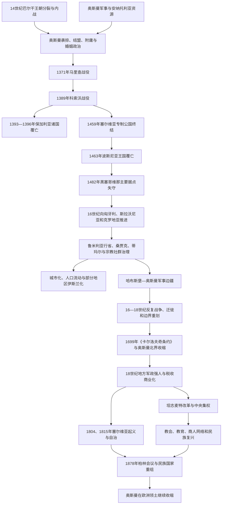

# 奥斯曼统治下的巴尔干斯拉夫

## 时间

约14世纪中叶—19世纪后期；不同地区进入和退出奥斯曼统治的时间并不相同

## 范围

本笔记从跨地区角度整理奥斯曼帝国征服和统治下的南斯拉夫社会，重点包括保加利亚、塞尔维亚、波斯尼亚、黑塞哥维那、马其顿、黑山周边及克罗地亚—斯拉沃尼亚边境。斯洛文尼亚和克罗地亚大部更多处在哈布斯堡、匈牙利和威尼斯体系，不能全部概括为奥斯曼属地；阿尔巴尼亚人、希腊人、弗拉赫人、犹太人、罗姆人、土耳其语穆斯林及其他群体也共同构成奥斯曼巴尔干社会。

## 概括

奥斯曼帝国不是在一次战役后同时“占领巴尔干五百年”。14—16世纪，奥斯曼利用巴尔干王朝分裂、内战、附庸关系和持续军事扩张，逐步消灭保加利亚诸国、塞尔维亚公国和波斯尼亚王国，并同匈牙利、哈布斯堡和威尼斯争夺克罗地亚、斯拉沃尼亚、达尔马提亚及多瑙河边境。地方统治者常先称臣纳贡、提供军队或缔结婚姻，数十年后才被直接并省。

征服把地方纳入以苏丹为最高权威、行省—桑贾克行政、蒂玛尔军役土地、伊斯兰法和宗教社群并存的帝国体系。基督徒承担特定税负，部分男童经“德夫希尔梅”征集进入禁卫军和宫廷；同时东正教会、天主教组织、修道院和地方共同体在不同条件下保留自治空间。波斯尼亚和部分城市、边疆出现显著伊斯兰化，许多皈依者成为地方精英、商人、士兵或普通农民。

17—19世纪，哈布斯堡—奥斯曼战争、人口迁徙、地方军政强人、税收商业化和帝国改革改变统治方式。19世纪塞尔维亚革命、保加利亚教会与民族复兴、波黑起义和列强干预推动自治、独立和边界重组。奥斯曼制度既造成征服与不平等，也提供长期治安、城市贸易、宗教多元和帝国内流动；其遗产不能只写成“停滞黑暗”或相反的“和谐共存”。

## 统治演变图

## 征服前的巴尔干格局

13—14世纪的巴尔干不是由稳定民族国家整齐分割。拜占庭帝国复国后国力有限；第二保加利亚帝国分裂为特尔诺沃、维丁等中心；塞尔维亚帝国在杜尚去世后由诸侯分据；波斯尼亚班国和后来王国扩张；匈牙利、威尼斯、热那亚和地方海港争夺亚得里亚海贸易。王朝继承、贵族家族和宗教管辖比现代民族边界更重要。

奥斯曼最初以拜占庭内战雇佣军和边疆战士身份进入欧洲，1350年代占据加里波利桥头堡，随后以埃迪尔内为欧洲中心。轻骑袭掠、常备宫廷军、附庸军队、战略婚姻和把土地授予军役者，使其能持续利用地方分裂。被征服精英并非只有逃亡和死亡：一些保留采邑或进入奥斯曼军政体系，另一些转入匈牙利和亚得里亚海城市。

## 征服过程

### 马里查与科索沃

1371年马里查河战役中，奥斯曼军击败塞尔维亚马其顿诸侯武卡申和乌格列沙，许多地方统治者随后称臣。1389年科索沃战役中，拉扎尔亲王领导的联盟与穆拉德一世军队均遭重大损失，两位最高统治者死亡。战役没有当天直接消灭塞尔维亚国家，却加速其成为附庸，并在后世塞尔维亚政治、宗教和文学记忆中获得核心地位。

奥斯曼在1402年安卡拉战役败于帖木儿后发生内战，塞尔维亚专制公国一度恢复空间并同匈牙利合作。15世纪中叶奥斯曼重建力量，控制摩拉瓦河谷和多瑙要塞；1459年斯梅代雷沃投降，塞尔维亚专制公国终结。贝尔格莱德在1456年抵抗成功，直到1521年才被苏莱曼一世攻占。

### 保加利亚、波斯尼亚和黑塞哥维那

特尔诺沃于1393年陷落，维丁在1396年尼科波利斯战役后失去独立，保加利亚政治中心被纳入鲁米利亚。地方教会最终受君士坦丁堡普世牧首管辖，修道院和乡村教区继续保存斯拉夫礼仪与文献传统。

1463年穆罕默德二世攻灭波斯尼亚王国并处死国王斯捷潘·托马舍维奇，匈牙利随后短暂建立北部防御据点。黑塞哥维那主要地区到1482年被奥斯曼控制。波斯尼亚成为边疆行省，后来的波斯尼亚总督区在对哈布斯堡、威尼斯战争中具有重要军政地位。

### 黑山与亚得里亚海边缘

泽塔／黑山山地的奥斯曼控制长期不均。低地和交通节点进入桑贾克体系，山区氏族、主教和地方首领凭地形、纳贡或反叛保有较大自治。采邑主教制后来成为黑山政治整合核心，但“从未被奥斯曼征服”的绝对说法忽略了税籍、军事行动和名义主权。

威尼斯控制部分达尔马提亚和科托尔湾城市，拉古萨共和国向奥斯曼纳贡以换取贸易和自治。亚得里亚海沿岸由此形成奥斯曼腹地、威尼斯港口、拉古萨商路和山地共同体交错的边界。

## 行政与军役体系

### 行省、桑贾克和卡迪

奥斯曼把欧洲领土统称为鲁米利亚，后随扩张和治理需要建立波斯尼亚、布达、特梅什瓦尔等总督区。总督区下辖桑贾克，地方行政与军事负责人由中央任命或调动。卡迪依据伊斯兰法、苏丹法令和地方习惯处理诉讼、契约、遗产、市场及行政事务。

帝国没有按现代民族划省。一个桑贾克可跨越后来的国家边界，边界也会随战争调整。法院记录显示穆斯林和非穆斯林都可利用卡迪法庭处理债务、财产和商业纠纷，但证言地位、婚姻和刑法等方面存在宗教差别。

### 蒂玛尔与土地

征服早期，国家把部分税收收益授予骑兵军役者，称蒂玛尔。土地原则上属于国家，农户拥有耕作和继承使用权，并向军役者及国家纳税。蒂玛尔并非西欧封建领地的简单同义词，持有者权利受登记、轮调和军事义务约束。

17世纪后，火器步兵、现金军费和长期战争使蒂玛尔作用下降，包税和终身税收承包扩大。地方官、商人、禁卫军关系户和豪强积累税源与庄园，农民负担和土地冲突增加。不同地区、时期差异很大，不能把整个奥斯曼时代概括为同一土地制度。

### 边疆军事人口

奥斯曼在边境利用阿肯哲轻骑、堡垒守军、德利等部队和地方辅助军。对面哈布斯堡建立军事边疆，安置塞尔维亚人、克罗地亚人、弗拉赫人和其他移民，以服兵役换取土地及特权。双方边境居民可能袭掠、走私、逃亡、改换效忠或跨境放牧，帝国界线同时是军事冲突和社会交流带。

## 宗教制度与不平等

### 宗教社群治理

苏丹以穆斯林君主身份居最高地位，伊斯兰法赋予基督徒和犹太人受保护但不平等地位。非穆斯林成年男性通常缴人头税，宗教建筑新建、公共礼仪、服饰和担任某些职位受时地不同限制。地方教会、主教、修道院和社群长老负责婚姻、教育、慈善和部分内部事务，并协助国家征税或代表请愿。

后来常用“米利特制度”概括这种安排，但把19世纪制度化的社群组织完整投射到15世纪并不准确。宗教自治始终受国家任命、财政需求和地方权力影响。

### 佩奇牧首区

1557年，奥斯曼恢复塞尔维亚佩奇牧首区，教区范围覆盖塞尔维亚、波黑、黑山及部分邻近地区。索科洛维奇家族出身的高官和大维齐尔穆罕默德帕夏常被视为恢复的重要政治背景。牧首区为东正教斯拉夫社群提供跨行省教会网络，修复修道院并保存历史记忆。

奥斯曼—哈布斯堡战争中部分教士支持哈布斯堡，牧首区又面临债务和内部争端；1766年被废，教区重新受君士坦丁堡管辖。19世纪民族教会运动后来把争取自主教会同政治独立联系起来。

### 天主教、犹太和其他社群

方济各会凭苏丹特许在波斯尼亚维持天主教牧灵网络，并成为地方天主教连续性的关键。1492年以后，来自伊比利亚半岛的塞法迪犹太人定居萨洛尼卡、萨拉热窝、贝尔格莱德和其他城市，参与贸易、手工业和医学。罗姆人、弗拉赫牧民及阿尔巴尼亚语社群在帝国分类中也因宗教、职业和纳税身份而不断变化。

## 德夫希尔梅与社会流动

14—17世纪，国家在部分基督徒地区定期征集男童，经改宗、教育后进入禁卫军、宫廷和行政体系，这一制度称德夫希尔梅。家庭失去子女、强制改宗和国家筛选体现帝国支配；某些家庭可能因子弟获得官职而寻求或规避征集，地方实践并不完全一致。

来自巴尔干的改宗者可升任总督、海军统帅乃至大维齐尔，索科洛维奇等家族最著名。这种向上流动没有消除制度强制和宗教不平等，也说明“土耳其统治者”不能一律按血缘理解：奥斯曼精英是由宫廷教育、忠于苏丹和帝国职业身份塑造的多来源群体。

## 伊斯兰化

### 地区差异

巴尔干皈依伊斯兰的速度和规模差别显著。波斯尼亚在15—17世纪形成数量可观的本地穆斯林人口，城市、边疆军职、土地权利、税负和既有教会结构都可能影响选择。保加利亚、马其顿、塞尔维亚、黑山和阿尔巴尼亚部分地区也有改宗社群，但许多乡村长期保持东正教或天主教多数。

皈依原因包括宗教信念、婚姻、城市机会、军政职业、税负、地方保护和精英地位延续，不能只归因于普遍强迫或纯粹经济算计。国家在某些时期、地区确有强制、儿童征集和镇压，但没有一个贯穿数百年、对所有基督徒统一执行的全面改宗计划。

### 城市与文化

萨拉热窝、斯科普里、莫斯塔尔、贝尔格莱德、索非亚等城市发展清真寺、浴室、商队驿站、市场、学校、桥梁和慈善基金。奥斯曼土耳其语、阿拉伯语、波斯语与南斯拉夫语言接触，留下行政、饮食、服饰和城市生活词汇。伊斯兰建筑和手稿文化成为区域遗产。

城市繁荣也依赖征税和帝国交通，战争时会被反复毁坏或更换人口。奥斯曼撤退后，一些城市的穆斯林居民逃亡或被驱逐，建筑被改用或拆除，进一步改变历史景观。

## 经济与社会

### 农业和税收

多数居民为农民，承担土地税、什一税、牲畜税、劳役或其他地方负担。税籍可用于了解村庄、宗教和人口，却只记录纳税单位，不应直接当作现代人口普查。山区、边疆、矿区、游牧和修道院可能享有特殊义务。

战争、瘟疫和税收增加会导致村庄废弃和人口逃迁；和平时期则可重新垦殖。地方豪强扩张大庄园后，农民对土地使用和附加征收的不满成为18—19世纪起义背景。

### 贸易、矿业和交通

帝国恢复和保护部分罗马道路、桥梁与商路，拉古萨商人在波斯尼亚、塞尔维亚和保加利亚经营金属、皮革、蜡、盐和纺织品。塞尔维亚、波斯尼亚矿山由本地、萨克森矿工及城市商人共同经营。多瑙河、萨瓦河和亚得里亚海连接中欧、伊斯坦布尔与地中海。

17—18世纪世界贸易重心转移、长期战争和地方关卡影响部分城市，但萨洛尼卡、萨拉热窝等仍是区域中心。18—19世纪基督徒商人和侨民网络积累财富，为学校、印刷和民族文化运动提供资金。

## 哈布斯堡—奥斯曼战争与人口迁徙

### 16世纪边境稳定化

1521年贝尔格莱德失守、1526年莫哈奇战役后，奥斯曼进入匈牙利中部并逼近克罗地亚和奥地利。哈布斯堡控制“王领匈牙利”和克罗地亚残部，双方围绕堡垒链长期战争。1593—1606年“长期战争”破坏波斯尼亚、塞尔维亚、克罗地亚和匈牙利边区。

### 1683—1699年战争

1683年维也纳围城失败后，哈布斯堡、波兰—立陶宛、威尼斯等组成神圣同盟反攻。哈布斯堡军一度深入塞尔维亚和马其顿，许多当地基督徒协助或随军。1690年奥斯曼反攻时，佩奇牧首阿尔塞尼耶三世率大量塞尔维亚人北迁至哈布斯堡领地，后世称“大迁徙”。迁徙规模和是否为一次统一行动存在争议，但它确实强化了哈布斯堡南部塞族教会和军事社群。

1699年《卡尔洛夫奇条约》使奥斯曼失去匈牙利大部、克罗地亚—斯拉沃尼亚部分地区和威尼斯所得领土，巴尔干北部边界南移。1718年后哈布斯堡曾短暂占领贝尔格莱德和塞尔维亚北部，1739年奥斯曼又收复；反复易手导致居民迁徙、堡垒重建和忠诚转换。

### 迁徙的长期作用

东正教人口进入哈布斯堡军事边疆，获得军役土地和宗教特权；穆斯林居民则常随奥斯曼撤退至波黑、塞尔维亚南部和其他省份。迁徙使语言宗教地图更加复杂，并为19世纪克罗地亚、塞尔维亚和波黑民族领土争议积累历史层次。

## 18—19世纪地方权力与改革

### 阿扬、禁卫军与地方自治

中央政府为获得现金而扩大包税，地方显贵、商人、禁卫军和军官成为“阿扬”，能掌握税收、民兵和行政。波斯尼亚的地方穆斯林贵族、维丁的帕斯万奥卢、斯库台帕夏等都曾与中央讨价还价。地方化并非帝国完全失去控制，而是统治在中央任命、世袭利益和军事承包间重新组合。

贝尔格莱德帕夏辖区的禁卫军“达希亚”夺权并杀害塞尔维亚地方首领，直接触发1804年第一次塞尔维亚起义。起义最初以恢复苏丹承诺的地方权利为名，随后建立独立机构；1815年第二次起义后，米洛什·奥布雷诺维奇通过武装和谈判取得自治。

### 坦志麦特

1839年和1856年改革诏书承诺臣民人身、财产和名誉保障，并逐步在税收、征兵、法院和行政上实行中央化及法律平等。改革削弱地方包税和旧军役特权，也引发既得利益反抗。波斯尼亚穆斯林贵族反对中央改革，1831年侯赛因·格拉达什切维奇领导自治运动；1850年代奥马尔帕夏以军事手段压服地方精英。

法律平等的实施不均，基督徒对税负、地方暴力和政治代表仍不满；穆斯林则担心传统地位和土地权受损。改革因此同时刺激帝国公民化和民族分离。

## 民族复兴与奥斯曼退却

### 塞尔维亚自治

1804—1813年第一次起义建立政府、军队和教育机构，失败后奥斯曼恢复统治。1815年第二次起义及米洛什同奥斯曼谈判，使塞尔维亚逐步成为世袭自治公国，仍向苏丹纳贡并有奥斯曼驻军。1830年敕令正式承认自治，1867年奥斯曼驻军撤出主要堡垒，1878年塞尔维亚获国际承认独立。

### 保加利亚复兴

18—19世纪保加利亚语教育、修道院、商人侨民和印刷扩展。教会斗争反对君士坦丁堡希腊语高级教士控制，1870年苏丹批准成立保加利亚督主教区，宗教管辖同时成为民族领土主张。1876年四月起义被残酷镇压，平民伤亡引起欧洲舆论；俄土战争后，1878年圣斯特凡诺与柏林安排重新划分保加利亚和马其顿。

### 波黑、黑山与马其顿

黑山采邑主教和彼得罗维奇王朝在山地建立更集中政权，多次同奥斯曼作战，1878年获国际承认。波黑1875年黑塞哥维那农民起义与税地矛盾推动东方危机，1878年柏林会议授权奥匈帝国占领治理波黑，名义奥斯曼主权暂时保留至1908年吞并。

马其顿和科索沃等地仍留在奥斯曼帝国，受到保加利亚、塞尔维亚、希腊和阿尔巴尼亚民族运动竞争。学校、教会归属和武装组织把地方身份卷入邻国国家建设，最终在1912—1913年巴尔干战争中被重新瓜分。

## 重要事件

| 时间 | 事件 | 直接结果 | 长期意义 |
|---|---|---|---|
| 1371年 | 马里查战役 | 马其顿塞尔维亚诸侯战败 | 奥斯曼附庸网络扩大。 |
| 1389年 | 科索沃战役 | 双方统帅死亡，塞尔维亚继续存在但更受制约 | 成为塞尔维亚历史记忆核心。 |
| 1393—1396年 | 特尔诺沃、维丁覆亡 | 保加利亚诸国被纳入帝国 | 东正教和地方文化转入帝国社群结构。 |
| 1459年 | 斯梅代雷沃陷落 | 塞尔维亚专制公国终结 | 奥斯曼推进至多瑙—萨瓦边界。 |
| 1463年 | 波斯尼亚王国覆亡 | 波斯尼亚逐步成为边疆行省 | 伊斯兰化和新城市网络发展。 |
| 1521、1526年 | 贝尔格莱德陷落、莫哈奇战役 | 奥斯曼进入匈牙利中部 | 哈布斯堡—奥斯曼长期边疆成形。 |
| 1557年 | 佩奇牧首区恢复 | 东正教塞尔维亚语社群获得广域教会中心 | 保存宗教、书写和历史认同。 |
| 1683—1699年 | 神圣同盟战争 | 奥斯曼北部疆域大幅收缩 | 迁徙和新边界改变族群分布。 |
| 1804年 | 第一次塞尔维亚起义 | 地方反禁卫军行动转向自治革命 | 开启巴尔干民族国家建立阶段。 |
| 1815年 | 第二次塞尔维亚起义 | 武装与谈判结合取得自治 | 塞尔维亚公国逐步制度化。 |
| 1839—1856年 | 坦志麦特改革 | 中央化与法律平等原则扩大 | 冲击旧特权，也未消除民族与土地矛盾。 |
| 1870年 | 保加利亚督主教区成立 | 教会民族组织获得法律地位 | 学校和教区成为国家诉求网络。 |
| 1875—1876年 | 波黑起义与保加利亚四月起义 | 东方危机国际化 | 促成俄土战争和1878年重组。 |
| 1878年 | 柏林会议 | 塞、黑、罗独立，保加利亚自治，奥匈占领波黑 | 奥斯曼欧洲统治大幅收缩但未结束。 |

## 统治稳定条件

- 奥斯曼拥有跨安纳托利亚和巴尔干的税收、军队和道路体系，能轮调官员并围攻要塞。
- 早期附庸政策允许地方王朝、贵族和教会逐步转入帝国框架，降低一次性征服成本。
- 蒂玛尔和后来的包税制度把地方税源转化为军事和行政资源。
- 宗教社群获得有限自治，地方精英可以代表群体与政府谈判。
- 帝国城市、市场和贸易网络为穆斯林、基督徒和犹太商人提供跨地区机会。
- 巴尔干邻国和列强长期相互竞争，难以持续联合驱逐奥斯曼。
- 地方身份、阶层和宗教利益多样，反抗并不总以现代民族独立为目标。

## 衰退因素

### 结构变化

火器战争和现金军费削弱蒂玛尔体系，包税和地方强人增加农民负担及中央控制成本。欧洲贸易、金融和军事技术变化提高帝国改革压力。宗教不平等在民族主义和列强“保护”话语下越来越难以维持。

### 外部压力

哈布斯堡、俄罗斯和威尼斯通过战争不断夺取边境；俄罗斯以东正教保护和泛斯拉夫主义扩大影响；英国、法国等又根据大国平衡支持或限制奥斯曼。19世纪列强干预使地方起义能获得武器、外交和国际承认，但也使新边界服从大国利益。

### 地方社会变迁

基督徒商人、教士、教师和侨民建立学校、印刷与募款网络，标准语言和民族史把宗教共同体转化为政治民族。地方穆斯林精英反对中央改革，农民则反对税地关系；帝国同时面对分离与反中央特权运动。

### 直接触发机制

塞尔维亚的直接触发是禁卫军强人对地方自治和首领的破坏；1875—1878年危机由税收、农民起义、镇压和列强战争层层升级；保加利亚问题则由教会分离、革命组织、四月起义镇压和俄土战争结合。奥斯曼退却不是单一“民族觉醒”自动结果，而是地方组织、帝国改革失败、战争和国际承认共同作用。

## 长期影响

1. 奥斯曼行省、道路和城市网络重新连接巴尔干腹地，许多现代城市形态和地名由此发展。
2. 伊斯兰化形成波什尼亚克、保加利亚穆斯林等多种社群，也使波黑、马其顿、科索沃和桑扎克保持多宗教格局。
3. 东正教会、方济各会、修道院和教区在帝国框架中保存并重塑语言文化认同。
4. 哈布斯堡—奥斯曼边界与军役迁徙造成塞族、克族、穆斯林和其他人群跨越后世国家边界混居。
5. 土地、包税和地方精英关系影响19世纪农民起义及波黑社会冲突。
6. 民族国家建立常伴随穆斯林难民外迁、基督徒回流和财产重分配，延续相互受害记忆。
7. 现代民族史曾把奥斯曼时期简化为“民族被奴役”，而帝国怀旧又可能淡化强制与不平等；较完整叙述需要同时保留两面。
8. 1878年并未结束奥斯曼巴尔干史，马其顿、科索沃、阿尔巴尼亚等地直到巴尔干战争才脱离或重组。

## 关键辨析

- “土耳其人”在民族史叙述中常泛指奥斯曼国家和穆斯林官员，但帝国军政精英来源多样，本地穆斯林也多使用南斯拉夫语言。
- 奥斯曼征服不是一次性事件，各地先后经历袭掠、附庸、直接并省和边界反复。
- 宗教社群自治并不等于现代平等公民制；基督徒有组织空间，也承担法律和财政上的不平等。
- 德夫希尔梅可带来个别社会上升，但其基础是对基督徒家庭的强制征集和改宗。
- 伊斯兰化既有利益和社会流动，也有强制与压力，原因应按地区和时期说明。
- 科索沃战役在1389年没有立即终结塞尔维亚国家，1459年才是专制公国直接灭亡节点。
- 克罗地亚和斯洛文尼亚不能整体列为奥斯曼属地；它们同奥斯曼史的主要联系是边境战争、局部占领和人口迁徙。
- 1878年奥匈“占领治理”波黑与1908年正式吞并是两个不同法律阶段。

## 演变关系

- 前序区域节点：[塞尔维亚中世纪国家](/%E4%BA%BA%E6%96%87%E7%A7%91%E5%AD%A6/%E5%8E%86%E5%8F%B2/%E6%AC%A7%E6%B4%B2/%E4%B8%9C%E5%8D%97%E6%AC%A7%E4%B8%8E%E5%B7%B4%E5%B0%94%E5%B9%B2/%E5%A1%9E%E5%B0%94%E7%BB%B4%E4%BA%9A/%E5%A1%9E%E5%B0%94%E7%BB%B4%E4%BA%9A%E4%B8%AD%E4%B8%96%E7%BA%AA%E5%9B%BD%E5%AE%B6.md)、[保加利亚第一帝国](/%E4%BA%BA%E6%96%87%E7%A7%91%E5%AD%A6/%E5%8E%86%E5%8F%B2/%E6%AC%A7%E6%B4%B2/%E4%B8%9C%E5%8D%97%E6%AC%A7%E4%B8%8E%E5%B7%B4%E5%B0%94%E5%B9%B2/%E4%BF%9D%E5%8A%A0%E5%88%A9%E4%BA%9A/%E4%BF%9D%E5%8A%A0%E5%88%A9%E4%BA%9A%E7%AC%AC%E4%B8%80%E5%B8%9D%E5%9B%BD.md)与[波斯尼亚中世纪国家](/%E4%BA%BA%E6%96%87%E7%A7%91%E5%AD%A6/%E5%8E%86%E5%8F%B2/%E6%AC%A7%E6%B4%B2/%E4%B8%9C%E5%8D%97%E6%AC%A7%E4%B8%8E%E5%B7%B4%E5%B0%94%E5%B9%B2/%E6%B3%A2%E6%96%AF%E5%B0%BC%E4%BA%9A%E5%92%8C%E9%BB%91%E5%A1%9E%E5%93%A5%E7%BB%B4%E9%82%A3/%E6%B3%A2%E6%96%AF%E5%B0%BC%E4%BA%9A%E4%B8%AD%E4%B8%96%E7%BA%AA%E5%9B%BD%E5%AE%B6.md)。
- 前期共同背景：[早期南斯拉夫人](/%E4%BA%BA%E6%96%87%E7%A7%91%E5%AD%A6/%E5%8E%86%E5%8F%B2/%E6%AC%A7%E6%B4%B2/%E4%B8%9C%E5%8D%97%E6%AC%A7%E4%B8%8E%E5%B7%B4%E5%B0%94%E5%B9%B2/%E5%8D%97%E6%96%AF%E6%8B%89%E5%A4%AB%E5%8E%86%E5%8F%B2/%E6%97%A9%E6%9C%9F%E5%8D%97%E6%96%AF%E6%8B%89%E5%A4%AB%E4%BA%BA.md)。
- 后一节点：[奥斯曼—哈布斯堡分治与民族运动](/%E4%BA%BA%E6%96%87%E7%A7%91%E5%AD%A6/%E5%8E%86%E5%8F%B2/%E6%AC%A7%E6%B4%B2/%E4%B8%9C%E5%8D%97%E6%AC%A7%E4%B8%8E%E5%B7%B4%E5%B0%94%E5%B9%B2/%E5%8D%97%E6%96%AF%E6%8B%89%E5%A4%AB%E5%8E%86%E5%8F%B2/%E5%A5%A5%E6%96%AF%E6%9B%BC%E2%80%94%E5%93%88%E5%B8%83%E6%96%AF%E5%A0%A1%E5%88%86%E6%B2%BB%E4%B8%8E%E6%B0%91%E6%97%8F%E8%BF%90%E5%8A%A8.md)。
- 返回：[南斯拉夫历史](/%E4%BA%BA%E6%96%87%E7%A7%91%E5%AD%A6/%E5%8E%86%E5%8F%B2/%E6%AC%A7%E6%B4%B2/%E4%B8%9C%E5%8D%97%E6%AC%A7%E4%B8%8E%E5%B7%B4%E5%B0%94%E5%B9%B2/%E5%8D%97%E6%96%AF%E6%8B%89%E5%A4%AB%E5%8E%86%E5%8F%B2/README.md)。
