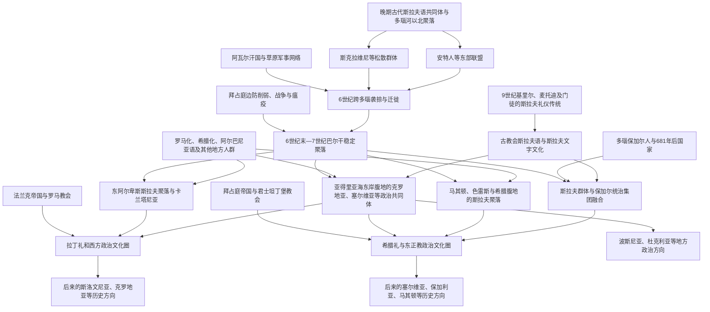

# 早期南斯拉夫人

## 时间

约6—10世纪；背景可追溯至晚期古代斯拉夫语共同体的形成

## 范围

“南斯拉夫人”首先是现代语言学和历史学中的分类，指斯拉夫语族南部支系相关人群及其后裔，不是6—7世纪已经自称并组成统一国家的单一民族。早期材料中的“斯克拉维尼”“安特人”等名称来自拜占庭、拉丁或其他外部作者，其范围会随时代变化，不能与后来的斯洛文尼亚人、克罗地亚人、塞尔维亚人、波什尼亚克人、黑山人、马其顿人和保加利亚人一一对应。

本笔记关注多瑙河以南及东阿尔卑斯、亚得里亚海东岸的斯拉夫迁徙、地方人口融合、早期政治组织、基督教化和语言文化分化。各现代国家的连续历史另见相应国家目录。

## 概括

6世纪前后，使用早期斯拉夫语的群体在东欧中部和多瑙河以北已广泛活动。拜占庭帝国因查士丁尼战争、瘟疫、财政压力和同波斯长期交战而难以守住多瑙边防；阿瓦尔汗国又把草原军事组织、被支配部众和斯拉夫群体卷入巴尔干战争。斯拉夫人先以袭掠、雇佣、季节迁移等方式越境，6世纪末至7世纪逐渐在巴尔干、东阿尔卑斯和亚得里亚海腹地形成稳定聚落。

这一过程不是一次由单一“斯拉夫民族”完成的整齐入侵。移民同原有希腊语、拉丁语、罗曼语、阿尔巴尼亚语及其他地方居民混合，沿海城市、岛屿和帝国控制区的连续性也各不相同。8—10世纪，拜占庭、法兰克、罗马教廷、第一保加利亚帝国和地方首领推动国家形成与基督教化；拉丁礼、希腊礼、教会斯拉夫语和不同政治中心，逐步塑造南斯拉夫内部差异。

## 迁徙与分化图

## 史料与认识方法

### 外部文字记录

6世纪拜占庭作者普罗科匹厄斯、约达尼斯以及后来《莫里斯战略》等文献提到斯克拉维尼和安特人，描述其居住、作战和社会组织。这些文本由帝国官员、军人或教士撰写，关注的是边境威胁和外交分类；其中的习俗概括可能带有传统民族志套语，不能作为现代民族性格证据。

拜占庭文献中的“斯克拉维尼亚”往往指由斯拉夫首领和社群控制、帝国尚未完全恢复行政的地区，而不是一个统一国家。10世纪《帝国行政论》记录克罗地亚人、塞尔维亚人等的迁徙和受洗传说，但成书距相关事件数百年，兼有当时外交需求，其具体谱系、故乡和迁徙路线存在争议。

### 考古、语言与生物证据

考古学通过聚落形态、手制陶器、墓葬和金属器讨论人口流动，但器物风格不等于固定民族。巴尔干许多地区出现村落重组、城市收缩和新型简朴物质文化；另一些沿海城市、岛屿和交通节点保持罗马—拜占庭连续性。

南斯拉夫语支的共同音韵、词汇和地名层说明使用近缘斯拉夫语的人群广泛定居，希腊语、拉丁语、早期罗曼语、阿尔巴尼亚语和古巴尔干底层词汇又显示长期接触。现代遗传研究可以说明人口混合和区域连续性，却不能把中世纪身份直接等同于现代基因群体。较可靠的总体认识是：真实迁徙规模可观，但并非把原居民完全替换。

## 晚期古代巴尔干背景

4—6世纪的巴尔干属于东罗马帝国，城市、道路、军镇、庄园和基督教教区密布。5世纪匈人、哥特人及多种军事集团经过后，帝国仍能控制多瑙河防线和沿海。查士丁尼一世时期修筑或恢复许多堡垒，却同时投入意大利、北非和对波斯战争；541年起瘟疫、地震、税收与人口压力削弱地方防务。

多瑙河并非绝对族群界线。帝国招募北方战士、同首领贸易和结盟，俘虏与难民也被安置于境内。斯拉夫语群体通过这样的边境网络逐渐熟悉道路、山口和帝国内部。6世纪中叶阿瓦尔人进入喀尔巴阡盆地，建立能动员多族部众的汗国，对拜占庭索取贡金，并在许多远征中利用斯拉夫造船、步兵和地方知识。

## 迁徙与定居阶段

### 6世纪：袭掠、服役与试探性定居

早期越境行动常沿摩拉瓦—瓦尔达尔河、萨瓦—德拉瓦河和黑海沿岸通道展开，目标包括俘虏、牲畜、粮食和贵重物品。一些群体在战后返回多瑙以北，另一些成为雇佣兵、俘虏或定居者。拜占庭军队也多次渡河北征，试图破坏聚落和迫使首领服从。

斯克拉维尼被文献描述为由许多首领和议事社群组成，缺乏能长期代表全部群体的单一国王。这种分散结构有利于小群迁移和在山谷定居，却也使外部大国能分别结盟或征服。

### 6世纪末—7世纪：边防崩溃与稳定聚落

602年多瑙军队哗变和福卡斯夺权通常被视为边防转折之一。此后拜占庭同萨珊波斯进行生死战争，阿瓦尔与斯拉夫军队深入巴尔干。626年阿瓦尔、斯拉夫和波斯力量从不同方向围攻君士坦丁堡失败，阿瓦尔霸权开始受损，但帝国也无力立即恢复全部内陆行政。

斯拉夫聚落分布至希腊半岛部分地区、马其顿、达尔马提亚腹地、波斯尼亚山区、内陆塞尔维亚和东阿尔卑斯。定居通常以河谷、盆地和可耕地为中心，政治边界尚不稳定。沿海的君士坦丁堡、塞萨洛尼基、拉古萨／杜布罗夫尼克、斯普利特等城市及岛屿维持不同程度帝国或罗曼居民连续性，与腹地斯拉夫社群贸易、冲突和通婚。

### 7—8世纪：地方化与帝国再整合

拜占庭在7世纪后逐步恢复沿海、希腊和部分马其顿的行政与教会网络，以军事行动、迁民、传教和贡赋把斯拉夫社群纳入帝国。部分斯拉夫人被迁至小亚细亚服役，帝国也把其他人口迁入巴尔干。希腊地区经历语言和人口再希腊化，但许多斯拉夫地名延续。

西北方向的斯拉夫社群在阿瓦尔、巴伐利亚人、伦巴第人和法兰克人之间发展；亚得里亚海东岸则形成若干地方首领辖区。后世民族史常把这些早期共同体画成连续国家，实际上名称、疆域和统治家族都在变动。

## 早期政治共同体

### 卡兰塔尼亚和东阿尔卑斯

7世纪法兰克商人萨莫领导的联盟反抗阿瓦尔，可能影响东阿尔卑斯斯拉夫社群。其瓦解后，卡兰塔尼亚等地方政体在今奥地利南部和斯洛文尼亚一带形成。8世纪面对阿瓦尔压力，卡兰塔尼亚首领寻求巴伐利亚保护，逐步进入法兰克政治和萨尔茨堡教会体系。地方王侯就职仪式后来成为斯洛文尼亚历史记忆的重要符号，但不能等同于现代民族国家。

### 克罗地亚方向

亚得里亚海东岸的“克罗地亚人”名称在早期来源中逐渐出现。9世纪形成达尔马提亚克罗地亚和潘诺尼亚克罗地亚等公国，处在法兰克、拜占庭、威尼斯和保加利亚之间。特尔皮米罗维奇等家族通过军事、教会建置和对外承认巩固权力，10世纪托米斯拉夫常被视为王国形成关键君主。所谓7世纪“白克罗地亚”迁徙叙事的细节与规模仍有争议。

### 塞尔维亚及亚得里亚海诸公国

内陆和南亚得里亚海方向出现塞尔维亚、杜克利亚、特拉武尼亚、扎胡姆列、帕加尼亚等名称。弗拉斯蒂米罗维奇家族在9世纪的塞尔维亚公国抵抗保加利亚扩张并同拜占庭往来。不同公国的族名、政治隶属与后世塞尔维亚、黑山、波黑或克罗地亚国家史有交叉，不宜把每个早期区域独占为某一现代民族。

### 第一保加利亚帝国

约680年，阿斯帕鲁赫领导的保加尔人越过多瑙河，在东北巴尔干建立国家，681年获拜占庭承认。突厥语族保加尔统治集团与人数较多的斯拉夫社群、地方居民逐渐融合，国家语言和身份日益斯拉夫化。保加利亚因此既属于草原保加尔国家传统，也成为南斯拉夫历史的重要国家中心。

9世纪鲍里斯一世受洗并建立基督教国家，西美昂一世时期教会斯拉夫文字文化繁荣。保加利亚国家与拜占庭、塞尔维亚及马其顿斯拉夫地区的政治文化互动，对东南斯拉夫语言和东正教传统影响深远。

## 基督教化与文字文化

### 两个主要传教网络

西北和亚得里亚海北部更多由阿奎莱亚、萨尔茨堡、罗马及法兰克教区传教，拉丁礼、拉丁字母和西方教会制度逐渐扎根。拜占庭则通过君士坦丁堡、塞萨洛尼基和沿海教区影响保加利亚、塞尔维亚、马其顿及南亚得里亚海。

教会归属不是从迁徙之初就固定。罗马与君士坦丁堡尚未在1054年正式决裂，地方统治者可在两方之间寻求承认。克罗地亚和塞尔维亚等政治共同体内部也长期存在礼仪和管辖交叠。

### 基里尔、麦托迪和门徒

9世纪，拜占庭传教士基里尔与麦托迪为大摩拉维亚传教，发展格拉哥里字母并把礼仪文本译为斯拉夫语。他们的事业并非最初在南巴尔干国家展开，但门徒被逐后在保加利亚获得庇护，于普雷斯拉夫和奥赫里德形成文学中心。西里尔字母在这一文化环境中发展，古教会斯拉夫语成为保加利亚、塞尔维亚、罗斯及其他东正教斯拉夫地区的礼仪和书写语言。

克罗地亚沿海部分地区也长期使用格拉哥里字母和斯拉夫礼仪，同时保持罗马教会归属。这说明“拉丁—东正教”边界并非简单等于“拉丁文—斯拉夫文”边界。

## 人口、社会与经济变化

### 聚落与农业

早期斯拉夫聚落多为规模较小的乡村，使用木、土等易腐材料，农业、畜牧、渔猎和林地资源结合。不同生态区形成不同经济：多瑙与潘诺尼亚平原适合谷物和畜牧，山地依赖季节放牧，亚得里亚海腹地同沿海城市交换木材、牲畜、盐和金属。

随着首领权力和教会扩张，贡赋、堡垒、市场和庄园制度发展。法兰克封建关系、拜占庭税制和保加利亚国家组织分别影响不同地区，不能用一套固定“斯拉夫部落制度”概括数百年。

### 原居民与文化融合

部分罗马化居民退向沿海、岛屿和山地，另一些留在内陆并被语言同化；“弗拉赫”后来常用来指讲罗曼语或从事季节放牧的群体，其身份也随时间变化。阿尔巴尼亚语人群的早期分布和形成仍有学术争论，但显然参与西巴尔干长期人口互动。希腊语城市与斯拉夫乡村之间既有战争，也有贸易、婚姻和基督教网络。

语言斯拉夫化不意味着所有居民来自同一迁徙群体。现代南斯拉夫各社会在地方古代人口、晚期古代帝国、斯拉夫移民和后续迁徙的长期混合中形成。

## 重要事件与阶段

| 时间 | 事件或过程 | 结果与意义 |
|---|---|---|
| 约500年前后 | 斯克拉维尼、安特人等出现在多瑙边境记录 | 外部作者开始系统描述早期斯拉夫群体。 |
| 6世纪中叶 | 阿瓦尔汗国进入喀尔巴阡盆地 | 阿瓦尔—斯拉夫军事网络加大巴尔干压力。 |
| 580年代以后 | 斯拉夫和阿瓦尔行动深入巴尔干 | 袭掠逐步同稳定定居结合。 |
| 602年 | 拜占庭多瑙军队哗变、边防危机 | 帝国难以继续长期北岸攻势，迁徙空间扩大。 |
| 626年 | 君士坦丁堡围攻失败 | 阿瓦尔霸权受挫，斯拉夫社群发展更自主。 |
| 7世纪 | 东阿尔卑斯、内陆巴尔干和亚得里亚海腹地广泛聚落化 | 南斯拉夫语言空间基本形成，但政治身份尚未定型。 |
| 681年 | 拜占庭承认多瑙保加利亚国家 | 保加尔—斯拉夫国家成为东南欧重要力量。 |
| 8世纪 | 卡兰塔尼亚进入巴伐利亚—法兰克体系 | 西北南斯拉夫地区受拉丁教会和法兰克制度影响。 |
| 9世纪 | 克罗地亚、塞尔维亚等地方公国可辨识 | 家族统治、教会和对外关系推动国家形成。 |
| 864年前后 | 保加利亚统治者鲍里斯受洗 | 基督教化和统一教会加强国家整合。 |
| 863年以后 | 基里尔、麦托迪传教及门徒南下 | 斯拉夫礼仪、格拉哥里及西里尔文字传统传播。 |
| 9—10世纪 | 法兰克、拜占庭、保加利亚和罗马教廷争夺影响 | 拉丁礼与希腊礼政治文化圈逐步分化。 |
| 10世纪 | 克罗地亚王国、塞尔维亚及保加利亚国家扩张 | 早期松散社群向更稳定王权和教会国家转变。 |

## 分化机制

### 政治中心不同

南斯拉夫语相近并没有产生统一国家。东阿尔卑斯受法兰克—神圣罗马帝国体系整合；克罗地亚处在法兰克、罗马、威尼斯和匈牙利方向；塞尔维亚、保加利亚、马其顿及南亚得里亚海更多同拜占庭竞争和学习；波斯尼亚则处于多种势力交界。

### 教会与文字制度不同

拉丁礼和罗马教廷、拜占庭礼和君士坦丁堡教会，以及后来的地方自主教会，塑造不同精英教育、法律和书写传统。1054年以后东西教会分裂加深差异，奥斯曼时期伊斯兰化又增加新的宗教共同体，但这些都是长期演变结果，不是6世纪迁徙时已经固定。

### 地理和帝国边界

阿尔卑斯、潘诺尼亚平原、迪纳拉山脉、摩拉瓦—瓦尔达尔走廊与亚得里亚海各自连接不同贸易和军事网络。后来的匈牙利、威尼斯、哈布斯堡、奥斯曼边界使地方经验进一步分岔。

### 身份的历史建构

中世纪居民可能首先认同地方、宗教、王朝或社会身份，族名的意义也会变化。19世纪民族运动通过标准语、学校、教会、历史叙事和国家制度，把部分早期名称重组为现代民族。现代南斯拉夫民族既有中世纪历史资源，也不是自6世纪以来毫无变化的实体。

## 关键辨析

- “斯拉夫人进入巴尔干”不等于原居民消失；语言替换、通婚、迁徙和帝国再安置同时发生。
- 斯克拉维尼、安特人和阿瓦尔统治下部众不是现代民族的直接完整名单。
- 阿瓦尔人与斯拉夫人有支配、联盟和共同作战，也有冲突；不能把所有远征归为一个族群。
- 保加利亚国家由保加尔统治集团、斯拉夫社群和地方人口融合形成；现代保加利亚人属南斯拉夫语支，但20世纪未加入南斯拉夫国家。
- 早期“克罗地亚”“塞尔维亚”迁徙传说包含真实记忆和后世政治编纂，具体路线与规模应标明争议。
- 宗教文化边界经过数世纪形成，不能把天主教、东正教、伊斯兰身份投射到6世纪迁徙者。
- 南斯拉夫语言连续体与现代标准语言、民族和国家边界并不完全重合。
- 现代遗传相似性或差异不能单独证明某个中世纪族名的直接血缘延续。

## 后续影响

1. 斯拉夫语在巴尔干大部和东阿尔卑斯扎根，形成现代南斯拉夫语言的基础。
2. 拜占庭、法兰克和保加利亚的竞争塑造拉丁基督教与东正教传统交界。
3. 早期公国和王国为后来的克罗地亚、塞尔维亚、保加利亚、斯洛文尼亚、黑山、波黑和马其顿历史提供制度与记忆资源。
4. 沿海罗曼城市和斯拉夫腹地互动，形成达尔马提亚和杜布罗夫尼克等独特城市文化。
5. 地方差异使19—20世纪“南斯拉夫统一”既能诉诸语言亲缘，也始终面对不同帝国遗产和国家传统。
6. 早期史料稀少且后世政治意义强，相关迁徙、民族形成和国家连续性仍需保留争议表述。

## 演变关系

- 前一节点：[斯拉夫人分化](/%E4%BA%BA%E6%96%87%E7%A7%91%E5%AD%A6/%E5%8E%86%E5%8F%B2/%E6%AC%A7%E6%B4%B2/%E6%96%AF%E6%8B%89%E5%A4%AB/%E6%96%AF%E6%8B%89%E5%A4%AB%E4%BA%BA%E5%88%86%E5%8C%96.md)。
- 后续共同阶段：[奥斯曼统治下的巴尔干斯拉夫](/%E4%BA%BA%E6%96%87%E7%A7%91%E5%AD%A6/%E5%8E%86%E5%8F%B2/%E6%AC%A7%E6%B4%B2/%E4%B8%9C%E5%8D%97%E6%AC%A7%E4%B8%8E%E5%B7%B4%E5%B0%94%E5%B9%B2/%E5%8D%97%E6%96%AF%E6%8B%89%E5%A4%AB%E5%8E%86%E5%8F%B2/%E5%A5%A5%E6%96%AF%E6%9B%BC%E7%BB%9F%E6%B2%BB%E4%B8%8B%E7%9A%84%E5%B7%B4%E5%B0%94%E5%B9%B2%E6%96%AF%E6%8B%89%E5%A4%AB.md)。
- 主要国家分支：[保加利亚第一帝国](/%E4%BA%BA%E6%96%87%E7%A7%91%E5%AD%A6/%E5%8E%86%E5%8F%B2/%E6%AC%A7%E6%B4%B2/%E4%B8%9C%E5%8D%97%E6%AC%A7%E4%B8%8E%E5%B7%B4%E5%B0%94%E5%B9%B2/%E4%BF%9D%E5%8A%A0%E5%88%A9%E4%BA%9A/%E4%BF%9D%E5%8A%A0%E5%88%A9%E4%BA%9A%E7%AC%AC%E4%B8%80%E5%B8%9D%E5%9B%BD.md)、[塞尔维亚中世纪国家](/%E4%BA%BA%E6%96%87%E7%A7%91%E5%AD%A6/%E5%8E%86%E5%8F%B2/%E6%AC%A7%E6%B4%B2/%E4%B8%9C%E5%8D%97%E6%AC%A7%E4%B8%8E%E5%B7%B4%E5%B0%94%E5%B9%B2/%E5%A1%9E%E5%B0%94%E7%BB%B4%E4%BA%9A/%E5%A1%9E%E5%B0%94%E7%BB%B4%E4%BA%9A%E4%B8%AD%E4%B8%96%E7%BA%AA%E5%9B%BD%E5%AE%B6.md)、[克罗地亚王国](/%E4%BA%BA%E6%96%87%E7%A7%91%E5%AD%A6/%E5%8E%86%E5%8F%B2/%E6%AC%A7%E6%B4%B2/%E4%B8%9C%E5%8D%97%E6%AC%A7%E4%B8%8E%E5%B7%B4%E5%B0%94%E5%B9%B2/%E5%85%8B%E7%BD%97%E5%9C%B0%E4%BA%9A/%E5%85%8B%E7%BD%97%E5%9C%B0%E4%BA%9A%E7%8E%8B%E5%9B%BD.md)、[波斯尼亚中世纪国家](/%E4%BA%BA%E6%96%87%E7%A7%91%E5%AD%A6/%E5%8E%86%E5%8F%B2/%E6%AC%A7%E6%B4%B2/%E4%B8%9C%E5%8D%97%E6%AC%A7%E4%B8%8E%E5%B7%B4%E5%B0%94%E5%B9%B2/%E6%B3%A2%E6%96%AF%E5%B0%BC%E4%BA%9A%E5%92%8C%E9%BB%91%E5%A1%9E%E5%93%A5%E7%BB%B4%E9%82%A3/%E6%B3%A2%E6%96%AF%E5%B0%BC%E4%BA%9A%E4%B8%AD%E4%B8%96%E7%BA%AA%E5%9B%BD%E5%AE%B6.md)。
- 返回：[南斯拉夫历史](/%E4%BA%BA%E6%96%87%E7%A7%91%E5%AD%A6/%E5%8E%86%E5%8F%B2/%E6%AC%A7%E6%B4%B2/%E4%B8%9C%E5%8D%97%E6%AC%A7%E4%B8%8E%E5%B7%B4%E5%B0%94%E5%B9%B2/%E5%8D%97%E6%96%AF%E6%8B%89%E5%A4%AB%E5%8E%86%E5%8F%B2/README.md)。
