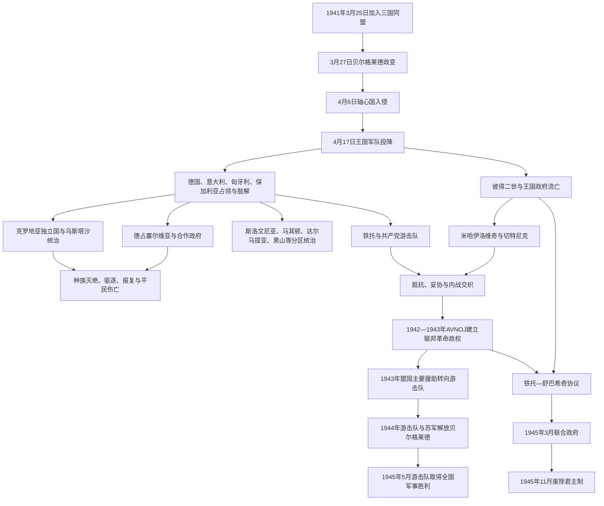

# 第二次世界大战时期的南斯拉夫

## 时间

1941年4月6日—1945年5月15日前后

## 概括

第二次世界大战时期的南斯拉夫同时经历外国入侵与占领、领土肢解、合作政权统治、针对平民的种族灭绝与大规模暴力、王党和共产党两条抵抗路线竞争，以及由战争推动的社会主义革命。1941年4月，轴心国在11天内击败南斯拉夫王国；德国、意大利、匈牙利和保加利亚直接吞并或占领不同地区，并扶植克罗地亚独立国、塞尔维亚合作政府等政权。

本土武装并非简单分成“占领者”和“抵抗者”。铁托领导的共产党游击队坚持持续武装斗争并逐步建立跨民族联邦政权；德拉查·米哈伊洛维奇领导的切特尼克以恢复君主国和塞尔维亚民族目标为核心，部分部队抵抗轴心国，另一些在不同地区、时段为打击游击队而与意大利、德国或合作政权达成协议。乌斯塔沙、切特尼克及其他武装均在不同区域对平民实施大规模暴力。到1943—1944年，盟国转向支持游击队，铁托的军队和政治机关最终取代流亡王国成为战后国家核心。

## 战争进程图

## 入侵与肢解

### 四月战争

1941年3月27日政变推翻亲王保罗主导的摄政后，新政府试图避免立即与德国开战，但希特勒已经命令从军事上摧毁南斯拉夫。4月6日，德国空军轰炸贝尔格莱德，德军从奥地利、匈牙利、罗马尼亚和保加利亚方向推进；意大利军队从阿尔巴尼亚和亚得里亚海侧进攻，匈牙利随后进入伏伊伏丁那部分地区。

王国军队尚未完成动员，指挥、通讯和反装甲能力薄弱。部队按边界线分散部署，难以应对快速穿插；政治忠诚危机和乌斯塔沙渗透进一步破坏抵抗。政府和王室撤向希腊，4月17日军方代表签署投降书。军事失败结束了王国在境内的统治，却没有自动废除其国际法统。

### 占领区和附庸政权

| 地区 | 主要控制者 | 统治方式与变化 |
|---|---|---|
| 克罗地亚、波黑大部及斯雷姆 | 克罗地亚独立国；德国、意大利分区驻军 | 乌斯塔沙领袖安特·帕韦利奇任“领袖”，意大利指定的名义国王从未赴任；政权依赖轴心国。 |
| 塞尔维亚核心区与巴纳特 | 德国军事占领；米兰·阿契莫维奇专员政府、后米兰·内迪奇“救国政府” | 德军控制军事、经济与镇压政策，本地政府和特种警察承担行政、反共与迫害任务。 |
| 斯洛文尼亚 | 德国、意大利、匈牙利分割；1943年后德国扩大控制 | 推行德意化、匈牙利化，驱逐人口并镇压抵抗；意大利投降后边界与占领机构重组。 |
| 达尔马提亚、亚得里亚海岛屿 | 意大利吞并或置于其势力范围；1943年后德国接管多地 | 意大利试图控制海岸并限制克罗地亚附庸国；投降后游击队和德军争夺。 |
| 黑山 | 意大利占领，1943年后德国占领 | 意大利试建附庸安排失败，1941年大起义后实行军事镇压并利用本地合作者。 |
| 瓦尔达尔马其顿 | 保加利亚占领大部，西部部分由意大利控制的阿尔巴尼亚管辖 | 行政、教育和教会保加利亚化；1944年保加利亚转向盟国后权力迅速瓦解。 |
| 科索沃与梅托希亚 | 大部并入意大利控制的阿尔巴尼亚，北部等由德国或保加利亚控制 | 边界变化、报复和人口迁徙加剧阿尔巴尼亚人与塞尔维亚人冲突。 |
| 巴奇卡、巴拉尼亚和梅吉穆列 | 匈牙利吞并 | 发生驱逐、强制统治与1942年诺维萨德突袭屠杀等事件。 |

这些边界服务于轴心国战略和附庸统治，既不等同于战前民族分布，也不能直接视为战后共和国边界的来源。

## 占领统治与平民暴力

### 克罗地亚独立国和乌斯塔沙

1941年4月10日，乌斯塔沙在德意支持下宣布克罗地亚独立国。政权涵盖今克罗地亚大部、波黑全境和斯雷姆，人口高度多元。它迅速颁布种族法，对塞尔维亚人、犹太人、罗姆人和政治反对者实施集中营关押、强迫改宗、驱逐与屠杀。亚塞诺瓦茨集中营群成为最大杀戮中心之一。暴力并非偶发失控，而是乌斯塔沙建立排他国家和改变人口结构政策的一部分。

统治范围在名义上统一，实际受德、意军事分区和地方武装制约。意大利一度利用或保护部分塞尔维亚武装以压制游击队，德国则要求保障铁路、矿产和治安。乌斯塔沙暴力扩大了塞尔维亚平民对切特尼克或游击队的支持，也引发以报复为名的反向屠杀。

### 德占塞尔维亚

德国把塞尔维亚视为军事占领区，控制贝尔格莱德、交通干线和重要矿山。1941年起，占领军以极高报复比例处决人质，克拉列沃、克拉古耶瓦茨等地发生大规模枪决。米兰·内迪奇政府没有主权，负责日常行政、难民安置、宣传和反共作战，并协助德方警察迫害犹太人和罗姆人。塞尔维亚境内绝大多数犹太人口在1942年前后已被杀害。

### 各方的族群暴力

切特尼克的一些指挥官和地方部队在波黑、桑扎克、克罗地亚等地屠杀穆斯林和克罗地亚平民，并把建立族群上更同质的“大塞尔维亚”视为目标。游击队总体以跨民族联邦和反法西斯动员为纲领，但也处决被认定为合作者、阶级敌人或政治对手；战争结束时针对战俘、撤退人员及德语族居民的报复和未经审判杀戮同样造成大量死亡。

因此，责任必须按具体组织、命令链、地区和时期辨析，不能把整个民族等同于某一武装，也不能以一方暴力消除另一方罪行。

## 两条主要抵抗路线

### 切特尼克与王国法统

德拉查·米哈伊洛维奇率领的“南斯拉夫祖国军”在1941年夏形成，向流亡政府效忠。早期切特尼克在塞尔维亚与游击队共同发动起义，但面对德军报复、战略目标差异和对战后权力的竞争，双方很快交战。米哈伊洛维奇倾向保存力量，等待盟军登陆或德国失败，再恢复君主制；其运动主要依靠塞尔维亚民族网络，难以形成稳定的全南斯拉夫号召。

切特尼克组织高度分散。部分部队继续攻击轴心国，另一些与意大利占领军、内迪奇机构甚至德军签订地方停战或合作安排，以获取武器和优先打击共产党。盟军截获情报、战地联络组报告和游击队持续作战表现，使英国和美国逐步认为切特尼克贡献有限且合作问题严重。

### 共产党游击队

南斯拉夫共产党在战前虽被禁止，却保有跨共和国地下组织。1941年德国进攻苏联后，铁托发动武装起义。游击队把抵抗与社会革命结合，主张各民族平等、恢复被肢解的国家并建立联邦。其领导核心受共产党控制，但通过“人民解放阵线”和地方反法西斯委员会吸纳非党员。

1941年“乌日策共和国”被镇压后，主力转入波黑、黑山等山地。游击队建立机动旅、师和军，避免长期固守城市，并以缴获武器扩大。女性反法西斯阵线、青年组织和地方委员会承担医疗、运输、教育与动员。跨地区组织能力、轴心国残酷镇压造成的反抗，以及意大利1943年投降后获得大批武器，使其迅速壮大。

## 战争主要阶段

### 1941年：起义与抵抗阵营破裂

塞尔维亚、黑山、波黑和克罗地亚等地先后爆发起义。游击队与切特尼克曾在部分行动中合作，但对持续作战、德国人质报复和战后制度的分歧导致武装冲突。德军秋季攻势摧毁塞尔维亚解放区，游击队主力撤往波黑，切特尼克则更多转入保存力量和地方妥协。

### 1942—1943年：轴心国围剿与革命政权形成

德意及合作军队多次围剿游击队。1942年科扎拉战役造成游击队和大量平民伤亡，许多被俘居民被送入集中营。1943年内雷特瓦河战役中，游击队突破围堵并转移伤员；随后在苏捷斯卡战役中遭受惨重损失，但铁托与主力指挥体系幸存。轴心国未能消灭游击队，反而强化其“全国抵抗核心”的声望。

1942年11月，南斯拉夫人民解放反法西斯委员会第一次会议召开。1943年11月29—30日第二次会议在亚伊采举行，宣布委员会为最高立法和执行代表机关，拒绝流亡国王在人民决定前回国，成立铁托主持的民族解放委员会，并规划由六个共和国组成的联邦。

### 1943年：意大利投降与盟国转向

1943年9月意大利停战，游击队夺取大量武器、港口和岛屿，德军则迅速接管意占区。盟国在德黑兰会议前后正式把主要军事援助转向铁托。英国首相丘吉尔推动流亡政府撤换支持米哈伊洛维奇的内阁，并派遣菲茨罗伊·麦克莱恩等联络人员与游击队合作。转向既基于意识形态之外的军事效率判断，也反映盟军不准备在巴尔干大规模登陆。

### 1944年：贝尔格莱德战役与政治妥协

1944年，游击队已发展为大规模正规军。苏联红军从罗马尼亚、保加利亚方向进入巴尔干；保加利亚九月政变后转向盟国并对德作战。10月，南斯拉夫部队与苏军共同解放贝尔格莱德。苏军随后主力向匈牙利推进，南斯拉夫军队承担继续向西作战的主要任务。

为建立获得国际承认的过渡政府，铁托与流亡政府首相伊万·舒巴希奇在维斯岛和贝尔格莱德达成协议，同意联邦原则、联合政府及由战后选举决定君主制。彼得二世虽抵制，最终仍委任三人摄政。

### 1945年：联合政府、胜利与边界冲突

1945年3月7日，铁托出任民主联邦南斯拉夫联合政府总理，舒巴希奇任外交部长，王室摄政保留名义元首职能。南斯拉夫军队向萨拉热窝、萨格勒布、斯洛文尼亚和的里雅斯特推进。德国投降后，乌斯塔沙、德军、斯洛文尼亚国民卫队、部分切特尼克和大量平民向奥地利撤退；英军在布莱堡附近拒绝其大规模投降并把许多人交给南斯拉夫军队，随后发生处决、死亡行军和监禁，受害人数和责任细节仍是研究与政治争议对象。

南斯拉夫军队短暂控制的里雅斯特，与英美军队形成对峙，随后撤出部分争议区。科索沃、马其顿和其他地区的反对力量也被军事镇压。到1945年5月中旬，铁托政权控制全国；11月人民阵线主导的制宪议会选举后，议会废除君主制并成立共和国。

## 战时政权与权力结构

| 阵营 / 机构 | 法定负责人 | 实际军事政治核心 | 目标与控制 |
|---|---|---|---|
| 流亡王国 | 彼得二世；历届流亡首相 | 王室、伦敦政府与米哈伊洛维奇之间协调不稳 | 恢复战前王国；获盟国承认但本土控制日益下降。 |
| 德意占领体系 | 各占领军司令 | 德国和意大利军事当局 | 保交通、资源与战略侧翼，利用附庸和地方武装维持治安。 |
| 克罗地亚独立国 | 安特·帕韦利奇；名义王位安排未实际运行 | 乌斯塔沙党、警察和德意驻军 | 建立排他克罗地亚国家，对目标群体实施系统迫害。 |
| 塞尔维亚合作政府 | 米兰·内迪奇 | 德国军事占领当局 | 行政管理、反共、宣传及协助镇压；不具主权。 |
| 切特尼克 | 米哈伊洛维奇，名义属王国军 | 地方指挥官自主性很强 | 恢复君主国、反共及塞尔维亚民族目标；抵抗和合作随地区变化。 |
| 游击队—AVNOJ | 伊万·里巴尔任代表机关主席，铁托主持政府 | 铁托、共产党中央和游击队最高司令部 | 持续反轴心战争、社会革命和联邦重建。 |
| 1945年联合政府 | 三人摄政名义代行王权；铁托任总理 | 铁托、共产党和人民解放军 | 以妥协形式取得广泛承认，实际向社会主义共和国过渡。 |

完整流亡首相、革命机构负责人及1945年过渡序列见[南斯拉夫国家元首与政府首脑表](/%E4%BA%BA%E6%96%87%E7%A7%91%E5%AD%A6/%E5%8E%86%E5%8F%B2/%E6%AC%A7%E6%B4%B2/%E4%B8%9C%E5%8D%97%E6%AC%A7%E4%B8%8E%E5%B7%B4%E5%B0%94%E5%B9%B2/%E5%8D%97%E6%96%AF%E6%8B%89%E5%A4%AB%E5%8E%86%E5%8F%B2/%E5%8D%97%E6%96%AF%E6%8B%89%E5%A4%AB%E5%9B%BD%E5%AE%B6%E5%85%83%E9%A6%96%E4%B8%8E%E6%94%BF%E5%BA%9C%E9%A6%96%E8%84%91%E8%A1%A8.md)。

## 重要事件

| 时间 | 事件 | 结果与意义 |
|---|---|---|
| 1941年4月6—17日 | 四月战争 | 王国军事崩溃并被轴心国肢解，王室流亡。 |
| 1941年4月10日 | 克罗地亚独立国成立 | 乌斯塔沙在德意保护下掌权，系统性迫害展开。 |
| 1941年7—秋季 | 各地起义与塞尔维亚解放区 | 抵抗迅速扩大，随后游击队与切特尼克决裂。 |
| 1942年1月 | 诺维萨德突袭 | 匈牙利占领军杀害塞尔维亚、犹太等平民，体现吞并区暴力。 |
| 1942年11月 | AVNOJ第一次会议 | 游击队建立全国性政治代表框架。 |
| 1943年初 | 内雷特瓦河战役 | 游击队突破围剿并保存大批伤员。 |
| 1943年5—6月 | 苏捷斯卡战役 | 游击队损失惨重但领导和主力幸存。 |
| 1943年9月 | 意大利投降 | 占领体系重组，游击队获得武器和控制区。 |
| 1943年11月29—30日 | AVNOJ第二次会议 | 决定联邦、建立革命政府并限制国王回国。 |
| 1943年末 | 盟国转向援助游击队 | 米哈伊洛维奇失去主要国际支持，铁托获得合法性资源。 |
| 1944年10月20日 | 贝尔格莱德解放 | 游击队与苏军击败德军，联邦首都转入铁托控制。 |
| 1944—1945年 | 铁托—舒巴希奇协议 | 流亡法统与革命政权暂时合并，为国际承认和政权过渡服务。 |
| 1945年3月7日 | 联合政府成立 | 王室摄政名义存在，铁托掌握政府和军队。 |
| 1945年5月 | 全国军事胜利与战后报复 | 轴心及合作武装瓦解，同时发生未经审判杀戮和强制迁徙。 |
| 1945年11月29日 | 废除君主制 | 革命政权完成从战时联邦到共和国的制度转换。 |

## 游击队崛起条件

- **持续作战能力**：游击队比等待盟军登陆的战略更符合盟国对破坏德军交通和牵制兵力的需求。
- **跨地区组织**：战前地下党、机动主力与地方委员会使其能在一个区域失利后转移并重建。
- **联邦纲领**：承认塞尔维亚、克罗地亚、斯洛文尼亚、波黑、黑山和马其顿等共和国地位，回应王国中央集权的失败。
- **占领与附庸暴力**：大规模屠杀、驱逐、征用和人质报复扩大了抵抗社会基础。
- **敌方体系裂缝**：意大利投降提供武器和空间，保加利亚转向盟国又改变东南战线。
- **国际援助与承认**：英国、美国和苏联的装备、联络、空运与外交压力，使游击队从革命武装变为盟军伙伴。
- **竞争者弱点**：切特尼克地方化、民族排他倾向和合作记录削弱其跨民族及国际可信度。

## 旧秩序灭亡与新政权胜出的原因

### 王国和流亡政府衰落

王国在1941年失去领土和军队，流亡政府内部又延续塞尔维亚—克罗地亚及王室—政党分歧。它对本土切特尼克部队的指挥有限，也无法有效回应合作与平民暴力问题。当盟国把军事效率置于恢复战前制度之上时，流亡政府的承认优势迅速流失。

### 占领与附庸政权失败

占领秩序以军事压迫、经济征用和族群分化为基础，缺乏广泛合法性。乌斯塔沙等政权的极端暴力制造持续反抗，德意之间及各附庸边界又相互冲突。随着意大利投降、苏军进入巴尔干和德国总体战败，地方合作政权失去外部支柱。

### 革命政权的直接胜利机制

游击队既建立军队，也建立税收、司法、宣传、群众组织和代表委员会；这使它在夺取城市前已具国家雏形。1944年后苏军协同和盟国承认加速胜利，但南斯拉夫主力仍依靠自身动员控制大部分国土。1945年联合政府为权力转移提供法统桥梁，人民阵线对政治组织和选举环境的控制则排除了君主派恢复权力的可能。

## 长期影响

1. **联邦国家的来源**：六共和国设计不是1945年凭空出现，而是在各共和国反法西斯委员会和AVNOJ中逐步形成。
2. **党军国家基础**：共产党以战争胜利者、解放军和地方委员会为基础掌权，军队、党和安全机构在战后政治中地位突出。
3. **“兄弟情谊与团结”**：战后政权以共同抵抗压制民族复仇叙事，但对战时罪行的公共讨论常受政治需要限制。
4. **人口与财产重组**：死亡、难民、德语族居民离去、犹太社群毁灭及国有化改变城乡和族群结构。
5. **边界与国际争端**：共和国边界、的里雅斯特问题、科索沃自治和马其顿民族建构均受战时决策影响。
6. **竞争记忆**：乌斯塔沙种族灭绝、切特尼克暴力、游击队镇压和战后处决在社会主义末期重新被民族政治选择性动员。
7. **不能简化为单一战争**：国际占领战、抵抗战、革命、内战和族群迫害彼此交叠，是理解1945年政权性质和1990年代记忆冲突的前提。

## 关键辨析

- “切特尼克”不是所有时期都采取同一政策，中央命令与地方实践需要分开；但地方合作和针对平民的暴力是理解其失败不可回避的事实。
- 游击队的跨民族纲领和主要反轴心贡献，不意味着其革命镇压与战后报复可以忽略。
- 克罗地亚独立国不是当代克罗地亚共和国的直接法统前身；社会主义克罗地亚的官方建国叙事来自反法西斯委员会。
- 1941年王国在国内灭亡、1945年君主制在法律上废除、1946年社会主义宪法生效，是三个不同时间点。
- 盟国转向铁托既有军事情报依据，也有大战略考虑，不能只归因于单一“宣传欺骗”或意识形态偏好。

## 演变关系

- 前一节点：[南斯拉夫王国](/%E4%BA%BA%E6%96%87%E7%A7%91%E5%AD%A6/%E5%8E%86%E5%8F%B2/%E6%AC%A7%E6%B4%B2/%E4%B8%9C%E5%8D%97%E6%AC%A7%E4%B8%8E%E5%B7%B4%E5%B0%94%E5%B9%B2/%E5%8D%97%E6%96%AF%E6%8B%89%E5%A4%AB%E5%8E%86%E5%8F%B2/%E5%8D%97%E6%96%AF%E6%8B%89%E5%A4%AB%E7%8E%8B%E5%9B%BD.md)。
- 后一节点：[南斯拉夫社会主义联邦共和国](/%E4%BA%BA%E6%96%87%E7%A7%91%E5%AD%A6/%E5%8E%86%E5%8F%B2/%E6%AC%A7%E6%B4%B2/%E4%B8%9C%E5%8D%97%E6%AC%A7%E4%B8%8E%E5%B7%B4%E5%B0%94%E5%B9%B2/%E5%8D%97%E6%96%AF%E6%8B%89%E5%A4%AB%E5%8E%86%E5%8F%B2/%E5%8D%97%E6%96%AF%E6%8B%89%E5%A4%AB%E7%A4%BE%E4%BC%9A%E4%B8%BB%E4%B9%89%E8%81%94%E9%82%A6%E5%85%B1%E5%92%8C%E5%9B%BD.md)。
- 战时与过渡领导序列：[南斯拉夫国家元首与政府首脑表](/%E4%BA%BA%E6%96%87%E7%A7%91%E5%AD%A6/%E5%8E%86%E5%8F%B2/%E6%AC%A7%E6%B4%B2/%E4%B8%9C%E5%8D%97%E6%AC%A7%E4%B8%8E%E5%B7%B4%E5%B0%94%E5%B9%B2/%E5%8D%97%E6%96%AF%E6%8B%89%E5%A4%AB%E5%8E%86%E5%8F%B2/%E5%8D%97%E6%96%AF%E6%8B%89%E5%A4%AB%E5%9B%BD%E5%AE%B6%E5%85%83%E9%A6%96%E4%B8%8E%E6%94%BF%E5%BA%9C%E9%A6%96%E8%84%91%E8%A1%A8.md)。
- 返回：[南斯拉夫历史](/%E4%BA%BA%E6%96%87%E7%A7%91%E5%AD%A6/%E5%8E%86%E5%8F%B2/%E6%AC%A7%E6%B4%B2/%E4%B8%9C%E5%8D%97%E6%AC%A7%E4%B8%8E%E5%B7%B4%E5%B0%94%E5%B9%B2/%E5%8D%97%E6%96%AF%E6%8B%89%E5%A4%AB%E5%8E%86%E5%8F%B2/README.md)。
