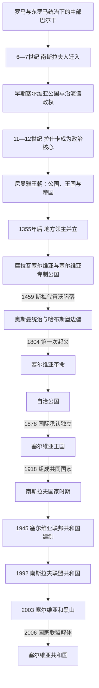

# 塞尔维亚历史

[返回东南欧与巴尔干历史](/%E4%BA%BA%E6%96%87%E7%A7%91%E5%AD%A6/%E5%8E%86%E5%8F%B2/%E6%AC%A7%E6%B4%B2/%E4%B8%9C%E5%8D%97%E6%AC%A7%E4%B8%8E%E5%B7%B4%E5%B0%94%E5%B9%B2/README.md)

## 历史主线

塞尔维亚史的核心不是一条从中世纪王国直接延续到现代共和国的直线，而是多次国家形成、帝国统治与联邦重组的叠加。南斯拉夫人迁入巴尔干后形成若干内陆和沿海政权；拉什卡在尼曼雅王朝下发展为王国和帝国，14世纪中叶以后转为地方领主并立，专制公国于1459年被奥斯曼征服。19世纪革命重新建立自治国家，1878年取得国际承认的独立，1882年升格王国；1918年又把主权投入南斯拉夫共同国家。1945年以后塞尔维亚成为社会主义联邦的一个共和国，1992—2006年先后与黑山组成南斯拉夫联盟共和国和塞尔维亚和黑山国家联盟，2006年才恢复为独立共和国。

## 阶段导航

| 顺序 | 阶段 | 时间 | 主线与边界 |
|---:|---|---|---|
| 1 | [塞尔维亚中世纪国家](/%E4%BA%BA%E6%96%87%E7%A7%91%E5%AD%A6/%E5%8E%86%E5%8F%B2/%E6%AC%A7%E6%B4%B2/%E4%B8%9C%E5%8D%97%E6%AC%A7%E4%B8%8E%E5%B7%B4%E5%B0%94%E5%B9%B2/%E5%A1%9E%E5%B0%94%E7%BB%B4%E4%BA%9A/%E5%A1%9E%E5%B0%94%E7%BB%B4%E4%BA%9A%E4%B8%AD%E4%B8%96%E7%BA%AA%E5%9B%BD%E5%AE%B6.md) | 约7世纪—1459年 | 早期公国、杜克利亚与拉什卡、尼曼雅王朝、帝国分裂、摩拉瓦塞尔维亚和专制公国；年代与统治范围存在较多争议。 |
| 2 | [奥斯曼与哈布斯堡之间的塞尔维亚](/%E4%BA%BA%E6%96%87%E7%A7%91%E5%AD%A6/%E5%8E%86%E5%8F%B2/%E6%AC%A7%E6%B4%B2/%E4%B8%9C%E5%8D%97%E6%AC%A7%E4%B8%8E%E5%B7%B4%E5%B0%94%E5%B9%B2/%E5%A1%9E%E5%B0%94%E7%BB%B4%E4%BA%9A/%E5%A5%A5%E6%96%AF%E6%9B%BC%E4%B8%8E%E5%93%88%E5%B8%83%E6%96%AF%E5%A0%A1%E4%B9%8B%E9%97%B4%E7%9A%84%E5%A1%9E%E5%B0%94%E7%BB%B4%E4%BA%9A.md) | 1459年—1804年 | 奥斯曼行省治理、佩奇牧首区、哈布斯堡军事边疆、战争和迁徙共同重组塞尔维亚社会。 |
| 3 | [塞尔维亚革命、公国与王国](/%E4%BA%BA%E6%96%87%E7%A7%91%E5%AD%A6/%E5%8E%86%E5%8F%B2/%E6%AC%A7%E6%B4%B2/%E4%B8%9C%E5%8D%97%E6%AC%A7%E4%B8%8E%E5%B7%B4%E5%B0%94%E5%B9%B2/%E5%A1%9E%E5%B0%94%E7%BB%B4%E4%BA%9A/%E5%A1%9E%E5%B0%94%E7%BB%B4%E4%BA%9A%E9%9D%A9%E5%91%BD%E3%80%81%E5%85%AC%E5%9B%BD%E4%B8%8E%E7%8E%8B%E5%9B%BD.md) | 1804年—1918年 | 两次起义、自治与立宪、公国独立、王国政治、巴尔干战争和第一次世界大战。 |
| 4 | [南斯拉夫国家框架下的塞尔维亚](/%E4%BA%BA%E6%96%87%E7%A7%91%E5%AD%A6/%E5%8E%86%E5%8F%B2/%E6%AC%A7%E6%B4%B2/%E4%B8%9C%E5%8D%97%E6%AC%A7%E4%B8%8E%E5%B7%B4%E5%B0%94%E5%B9%B2/%E5%A1%9E%E5%B0%94%E7%BB%B4%E4%BA%9A/%E5%8D%97%E6%96%AF%E6%8B%89%E5%A4%AB%E5%9B%BD%E5%AE%B6%E6%A1%86%E6%9E%B6%E4%B8%8B%E7%9A%84%E5%A1%9E%E5%B0%94%E7%BB%B4%E4%BA%9A.md) | 1918年—2006年 | 王国时期没有单独塞尔维亚单位；二战占领后建立联邦共和国，继而经历社会主义、联邦解体、塞黑共同国家和民主转型。 |
| 5 | [当代塞尔维亚](/%E4%BA%BA%E6%96%87%E7%A7%91%E5%AD%A6/%E5%8E%86%E5%8F%B2/%E6%AC%A7%E6%B4%B2/%E4%B8%9C%E5%8D%97%E6%AC%A7%E4%B8%8E%E5%B7%B4%E5%B0%94%E5%B9%B2/%E5%A1%9E%E5%B0%94%E7%BB%B4%E4%BA%9A/%E5%BD%93%E4%BB%A3%E5%A1%9E%E5%B0%94%E7%BB%B4%E4%BA%9A.md) | 2006年至今 | 独立共和国、科索沃地位争议、欧洲一体化、对外平衡、制度竞争与持续社会抗议。 |

## 世系与领导导航

| 专表 | 覆盖范围 | 使用说明 |
|---|---|---|
| [塞尔维亚中世纪统治者世系表](/%E4%BA%BA%E6%96%87%E7%A7%91%E5%AD%A6/%E5%8E%86%E5%8F%B2/%E6%AC%A7%E6%B4%B2/%E4%B8%9C%E5%8D%97%E6%AC%A7%E4%B8%8E%E5%B7%B4%E5%B0%94%E5%B9%B2/%E5%A1%9E%E5%B0%94%E7%BB%B4%E4%BA%9A/%E5%A1%9E%E5%B0%94%E7%BB%B4%E4%BA%9A%E4%B8%AD%E4%B8%96%E7%BA%AA%E7%BB%9F%E6%B2%BB%E8%80%85%E4%B8%96%E7%B3%BB%E8%A1%A8.md) | 早期公国至1459年专制公国 | 按可证实的核心统治序列列出君主、共治、复位、摄政、争位与统治中断；沿海杜克利亚另作并行辨析。 |
| [塞尔维亚近现代国家元首与政府首脑表](/%E4%BA%BA%E6%96%87%E7%A7%91%E5%AD%A6/%E5%8E%86%E5%8F%B2/%E6%AC%A7%E6%B4%B2/%E4%B8%9C%E5%8D%97%E6%AC%A7%E4%B8%8E%E5%B7%B4%E5%B0%94%E5%B9%B2/%E5%A1%9E%E5%B0%94%E7%BB%B4%E4%BA%9A/%E5%A1%9E%E5%B0%94%E7%BB%B4%E4%BA%9A%E8%BF%91%E7%8E%B0%E4%BB%A3%E5%9B%BD%E5%AE%B6%E5%85%83%E9%A6%96%E4%B8%8E%E6%94%BF%E5%BA%9C%E9%A6%96%E8%84%91%E8%A1%A8.md) | 1945年至2026年7月14日 | 分列塞尔维亚共和国层级的国家元首、政府首脑和实际权力结构；1918—1945年的南斯拉夫中央领导不重复抄录。 |
| [塞尔维亚革命、公国与王国](/%E4%BA%BA%E6%96%87%E7%A7%91%E5%AD%A6/%E5%8E%86%E5%8F%B2/%E6%AC%A7%E6%B4%B2/%E4%B8%9C%E5%8D%97%E6%AC%A7%E4%B8%8E%E5%B7%B4%E5%B0%94%E5%B9%B2/%E5%A1%9E%E5%B0%94%E7%BB%B4%E4%BA%9A/%E5%A1%9E%E5%B0%94%E7%BB%B4%E4%BA%9A%E9%9D%A9%E5%91%BD%E3%80%81%E5%85%AC%E5%9B%BD%E4%B8%8E%E7%8E%8B%E5%9B%BD.md) | 1804—1918年 | 短世系留在阶段主笔记，含起义领袖、亲王、国王和摄政。 |

## 重要转折与时间节点

| 时间 | 转折 | 意义 |
|---|---|---|
| 约9世纪 | 早期公国基督教化 | 塞尔维亚统治家族进入拜占庭—保加利亚竞争和基督教制度网络。 |
| 1217年、1219年 | 王国加冕与教会自主 | 王权和独立教会相互支撑，构成尼曼雅国家的制度核心。 |
| 1346年 | 杜尚称帝、总主教区升为牧首区 | 帝国达到最大范围，也因扩张过快、地方贵族权力强大而埋下分裂条件。 |
| 1389年 | 科索沃战役 | 双方均损失核心领导层；它不是国家当日灭亡，却加速奥斯曼宗主权和长期征服。 |
| 1459年 | 斯梅代雷沃陷落 | 塞尔维亚专制公国终结，多数核心地区纳入奥斯曼帝国。 |
| 1557年、1766年 | 佩奇牧首区恢复与撤销 | 教会网络一度跨越行省保存文化和共同体组织，后改隶君士坦丁堡牧首区。 |
| 1804年、1815年 | 两次塞尔维亚起义 | 从反地方军阀暴政发展为自治建国过程。 |
| 1830年、1878年、1882年 | 自治、独立、王国 | 现代塞尔维亚国家的国际地位分三步完成。 |
| 1912—1913年 | 两次巴尔干战争 | 国土和人口迅速扩张，同时把科索沃、马其顿等多族群地区纳入国家。 |
| 1918年 | 组成塞尔维亚人、克罗地亚人和斯洛文尼亚人王国 | 独立塞尔维亚王国结束，国家问题转入南斯拉夫框架。 |
| 1941—1945年 | 轴心国分割占领、抵抗与内战 | 大规模屠杀、报复和政治革命重塑战后秩序。 |
| 1974年 | 南斯拉夫与塞尔维亚新宪法 | 伏伊伏丁那和科索沃自治权扩大，塞尔维亚内部成为复合治理结构。 |
| 1989—1992年 | 自治权收缩与南斯拉夫解体 | 米洛舍维奇权力集中、民族动员、战争和国际制裁彼此强化。 |
| 1999年 | 科索沃战争、北约轰炸和安理会第1244号决议 | 塞尔维亚失去对科索沃的实际行政控制，地位问题延续至今。 |
| 2000年 | 10月5日政权更替 | 米洛舍维奇时代结束，多党竞争、市场转型与对外关系重建加速。 |
| 2006年 | 塞黑国家联盟解体 | 塞尔维亚恢复独立国家地位并通过新宪法。 |
| 2024—2026年 | 诺维萨德车站雨棚坍塌后的抗议周期 | 事故问责、腐败、选举和媒体环境成为政治危机焦点，并引发政府更替与提前选举讨论。 |

## 关键辨析

- “塞尔维亚人”“塞尔维亚土地”和“塞尔维亚国家”在中世纪文献中的范围会变化，不能把现代国界和现代民族概念倒推到所有早期政权。
- 杜克利亚、泽塔、波斯尼亚、科索沃、马其顿和伏伊伏丁那在不同时期具有独立或并立的政治轨迹；它们不是永远从属于单一塞尔维亚核心。
- 1389年科索沃战役是重大转折而非即时亡国日期；1459年才通常被视为专制公国的终点，部分名义“塞尔维亚专制君主”此后仍在匈牙利边境活动。
- 1918—2006年的塞尔维亚史必须放在南斯拉夫中央国家与塞尔维亚共和国两个层级同时观察，不能把联邦元首、塞尔维亚共和国元首和党领导人混为同一职务。
- 科索沃自1999年起由另一套实际治理结构运行，2008年宣布独立；塞尔维亚不承认，国际承认也不一致。因此法定主张、实际控制和国际地位应分开表述。
