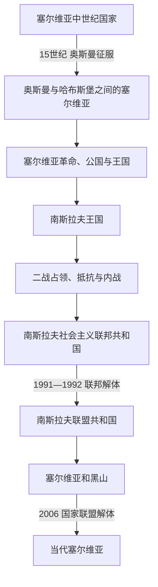

# 塞尔维亚历史

## 概括

塞尔维亚历史可按“中世纪诸政权 → 奥斯曼与哈布斯堡边疆 → 革命、自治公国与王国 → 两代南斯拉夫国家 → 南斯拉夫联盟共和国与塞黑国家联盟 → 2006年后的共和国”来理解。塞尔维亚是南斯拉夫国家实验的重要政治中心，但塞尔维亚史与南斯拉夫史并不等同。

## 历史阶段导航

| 顺序 | 阶段 | 时间 | 历史走向 |
|---:|---|---|---|
| 1 | [塞尔维亚中世纪国家](/%E4%BA%BA%E6%96%87%E7%A7%91%E5%AD%A6/%E5%8E%86%E5%8F%B2/%E6%AC%A7%E6%B4%B2/%E4%B8%9C%E5%8D%97%E6%AC%A7%E4%B8%8E%E5%B7%B4%E5%B0%94%E5%B9%B2/%E5%A1%9E%E5%B0%94%E7%BB%B4%E4%BA%9A/%E5%A1%9E%E5%B0%94%E7%BB%B4%E4%BA%9A%E4%B8%AD%E4%B8%96%E7%BA%AA%E5%9B%BD%E5%AE%B6.md) | 9—15世纪 | 公国、王国与帝国发展，后受奥斯曼扩张冲击。 |
| 2 | [奥斯曼与哈布斯堡之间的塞尔维亚](/%E4%BA%BA%E6%96%87%E7%A7%91%E5%AD%A6/%E5%8E%86%E5%8F%B2/%E6%AC%A7%E6%B4%B2/%E4%B8%9C%E5%8D%97%E6%AC%A7%E4%B8%8E%E5%B7%B4%E5%B0%94%E5%B9%B2/%E5%A1%9E%E5%B0%94%E7%BB%B4%E4%BA%9A/%E5%A5%A5%E6%96%AF%E6%9B%BC%E4%B8%8E%E5%93%88%E5%B8%83%E6%96%AF%E5%A0%A1%E4%B9%8B%E9%97%B4%E7%9A%84%E5%A1%9E%E5%B0%94%E7%BB%B4%E4%BA%9A.md) | 15世纪—1804年 | 帝国统治、军事边疆、教会网络与人口迁徙。 |
| 3 | [塞尔维亚革命、公国与王国](/%E4%BA%BA%E6%96%87%E7%A7%91%E5%AD%A6/%E5%8E%86%E5%8F%B2/%E6%AC%A7%E6%B4%B2/%E4%B8%9C%E5%8D%97%E6%AC%A7%E4%B8%8E%E5%B7%B4%E5%B0%94%E5%B9%B2/%E5%A1%9E%E5%B0%94%E7%BB%B4%E4%BA%9A/%E5%A1%9E%E5%B0%94%E7%BB%B4%E4%BA%9A%E9%9D%A9%E5%91%BD%E3%80%81%E5%85%AC%E5%9B%BD%E4%B8%8E%E7%8E%8B%E5%9B%BD.md) | 1804年—1918年 | 起义、自治、独立、王国扩张及一战。 |
| 4 | 南斯拉夫国家时期 | 1918年—1992年 | 先后经历[南斯拉夫王国](/%E4%BA%BA%E6%96%87%E7%A7%91%E5%AD%A6/%E5%8E%86%E5%8F%B2/%E6%AC%A7%E6%B4%B2/%E4%B8%9C%E5%8D%97%E6%AC%A7%E4%B8%8E%E5%B7%B4%E5%B0%94%E5%B9%B2/%E5%8D%97%E6%96%AF%E6%8B%89%E5%A4%AB%E5%8E%86%E5%8F%B2/%E5%8D%97%E6%96%AF%E6%8B%89%E5%A4%AB%E7%8E%8B%E5%9B%BD.md)、[二战占领与内战](/%E4%BA%BA%E6%96%87%E7%A7%91%E5%AD%A6/%E5%8E%86%E5%8F%B2/%E6%AC%A7%E6%B4%B2/%E4%B8%9C%E5%8D%97%E6%AC%A7%E4%B8%8E%E5%B7%B4%E5%B0%94%E5%B9%B2/%E5%8D%97%E6%96%AF%E6%8B%89%E5%A4%AB%E5%8E%86%E5%8F%B2/%E7%AC%AC%E4%BA%8C%E6%AC%A1%E4%B8%96%E7%95%8C%E5%A4%A7%E6%88%98%E6%97%B6%E6%9C%9F%E7%9A%84%E5%8D%97%E6%96%AF%E6%8B%89%E5%A4%AB.md)和[社会主义联邦](/%E4%BA%BA%E6%96%87%E7%A7%91%E5%AD%A6/%E5%8E%86%E5%8F%B2/%E6%AC%A7%E6%B4%B2/%E4%B8%9C%E5%8D%97%E6%AC%A7%E4%B8%8E%E5%B7%B4%E5%B0%94%E5%B9%B2/%E5%8D%97%E6%96%AF%E6%8B%89%E5%A4%AB%E5%8E%86%E5%8F%B2/%E5%8D%97%E6%96%AF%E6%8B%89%E5%A4%AB%E7%A4%BE%E4%BC%9A%E4%B8%BB%E4%B9%89%E8%81%94%E9%82%A6%E5%85%B1%E5%92%8C%E5%9B%BD.md)。 |
| 5 | [南斯拉夫联盟共和国与塞尔维亚和黑山](/%E4%BA%BA%E6%96%87%E7%A7%91%E5%AD%A6/%E5%8E%86%E5%8F%B2/%E6%AC%A7%E6%B4%B2/%E4%B8%9C%E5%8D%97%E6%AC%A7%E4%B8%8E%E5%B7%B4%E5%B0%94%E5%B9%B2/%E5%8D%97%E6%96%AF%E6%8B%89%E5%A4%AB%E5%8E%86%E5%8F%B2/%E5%8D%97%E6%96%AF%E6%8B%89%E5%A4%AB%E8%81%94%E7%9B%9F%E5%85%B1%E5%92%8C%E5%9B%BD%E4%B8%8E%E5%A1%9E%E5%B0%94%E7%BB%B4%E4%BA%9A%E5%92%8C%E9%BB%91%E5%B1%B1.md) | 1992年—2006年 | 与黑山继续组成共同国家，经历战争、制裁、政权转型和松散联盟。 |
| 6 | [当代塞尔维亚](/%E4%BA%BA%E6%96%87%E7%A7%91%E5%AD%A6/%E5%8E%86%E5%8F%B2/%E6%AC%A7%E6%B4%B2/%E4%B8%9C%E5%8D%97%E6%AC%A7%E4%B8%8E%E5%B7%B4%E5%B0%94%E5%B9%B2/%E5%A1%9E%E5%B0%94%E7%BB%B4%E4%BA%9A/%E5%BD%93%E4%BB%A3%E5%A1%9E%E5%B0%94%E7%BB%B4%E4%BA%9A.md) | 2006年至今 | 独立共和国、科索沃问题与欧洲整合。 |

## 关键辨析

- 中世纪塞尔维亚国家、近代塞尔维亚王国与当代共和国之间有奥斯曼统治和多次国家重组，不能画成无间断直系继承。
- “塞尔维亚主导南斯拉夫”可以描述部分权力失衡争议，却不能把多民族、多共和国的南斯拉夫简单等同于扩大版塞尔维亚。
- 2006年塞尔维亚和黑山分立后塞尔维亚成为独立国家；科索沃的地位、承认与治理问题应和国家继承问题分别辨析。
