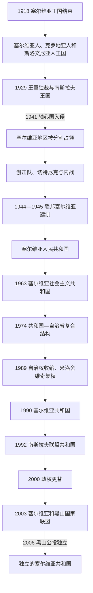

# 南斯拉夫国家框架下的塞尔维亚

[返回塞尔维亚历史](/%E4%BA%BA%E6%96%87%E7%A7%91%E5%AD%A6/%E5%8E%86%E5%8F%B2/%E6%AC%A7%E6%B4%B2/%E4%B8%9C%E5%8D%97%E6%AC%A7%E4%B8%8E%E5%B7%B4%E5%B0%94%E5%B9%B2/%E5%A1%9E%E5%B0%94%E7%BB%B4%E4%BA%9A/README.md)

## 时间

1918年—2006年

## 概括

1918年以后，塞尔维亚王国停止作为独立国家存在，其王朝、军队和官僚资源进入南斯拉夫共同国家。王国时期没有一个与“塞尔维亚”同名的联邦或自治单位；1941年轴心国分割占领后，抵抗战争和共产主义革命才产生作为联邦组成单位的塞尔维亚人民共和国。1945—1992年，塞尔维亚的政策同时受联邦、共和国和自治省三个层级制约。1992—2006年它又与黑山维持共同国家，直到黑山公投独立，塞尔维亚才重新成为独立共和国。

## 王国时期：共同国家中的塞尔维亚

### 1918年统一与中央集权

新王国继承塞尔维亚的卡拉乔尔杰维奇王朝、军队核心和部分法律官僚体系，同时吸收原奥匈地区及黑山等地。1921年《维多夫丹宪法》建立中央集权君主国，把全国划为不依历史边界的州；塞尔维亚因此既是权力中心和最大人口集团，又不是一个单独的宪法单位。塞族政治也并非铁板一块，激进党、民主党、农业派、共和派和共产党对王权、地方自治和社会改革意见不同。

克罗地亚联邦主义诉求、斯洛文尼亚地方利益、波斯尼亚和马其顿等地区问题与塞族主导的中央机构发生冲突。1928年议会枪击事件后，亚历山大一世于1929年废宪、解散政党并实行个人独裁，把国名改为南斯拉夫王国，以河流命名九个巴诺维纳，试图用“整体南斯拉夫主义”压倒历史民族身份。1934年国王遇刺后摄政政府逐步恢复有限议会政治，1939年建立克罗地亚巴诺维纳，却没有解决“塞尔维亚单位”与其余地区重组问题。

王国的结构性弱点包括：统一程序仓促、战后发展差距巨大、中央机构代表不平衡、土地改革与民族边界纠缠、政治暴力和王室独裁削弱合法性。直接终结则来自1941年德意轴心国入侵，而非内部宪政争议自然演化。共同国家中央过程详见[南斯拉夫王国](/%E4%BA%BA%E6%96%87%E7%A7%91%E5%AD%A6/%E5%8E%86%E5%8F%B2/%E6%AC%A7%E6%B4%B2/%E4%B8%9C%E5%8D%97%E6%AC%A7%E4%B8%8E%E5%B7%B4%E5%B0%94%E5%B9%B2/%E5%8D%97%E6%96%AF%E6%8B%89%E5%A4%AB%E5%8E%86%E5%8F%B2/%E5%8D%97%E6%96%AF%E6%8B%89%E5%A4%AB%E7%8E%8B%E5%9B%BD.md)。

## 第二次世界大战：分割占领、抵抗与内战

1941年4月轴心国迅速击败南斯拉夫。今天塞尔维亚各地被不同占领者分割：中部由德国军事占领司令直接控制，米兰·阿契莫维奇委员政府、继而米兰·内迪奇“民族救亡政府”只是占领军授权的协力机构；巴奇卡被匈牙利兼并，斯雷姆划入克罗地亚独立国，东南部由保加利亚占领，科索沃大部并入意大利控制的阿尔巴尼亚，巴纳特在德国占领区内由当地德意志人行政。

1941年夏，共产党游击队和德拉扎·米哈伊洛维奇领导的王党切特尼克都发动抵抗，一度合作并解放部分地区。德国实行人质报复和大规模处决，克拉列沃、克拉古耶瓦茨屠杀成为典型。面对镇压和战略分歧，两支力量很快内战：游击队追求革命与持续作战，切特尼克优先保存力量、恢复王国并与游击队竞争，其部分部队在不同时期同意大利、德国或协力政权合作。

德国占领机关及协力行政参与对犹太人和罗姆人的登记、拘禁和杀害，班吉察、托波夫斯克棚屋、赛米什特等营地成为屠杀体系。1942年占领当局已宣称当地犹太问题“解决”，反映的是大规模灭绝而非人口自然消失。与此同时，克罗地亚独立国对塞族、犹太人和罗姆人的屠杀造成大量难民进入塞尔维亚。

1944年秋，南斯拉夫游击队与苏联红军在贝尔格莱德攻势中击退德军。反法西斯塞尔维亚人民解放大会建立共和国层级机构，游击队随后清算协力者、真实或被指认的反对者，处决、监禁和财产没收造成新的政治暴力。战争在塞尔维亚不是单纯“反外敌”，而是占领、族群迫害、抵抗和革命内战叠加；跨地区过程见[第二次世界大战时期的南斯拉夫](/%E4%BA%BA%E6%96%87%E7%A7%91%E5%AD%A6/%E5%8E%86%E5%8F%B2/%E6%AC%A7%E6%B4%B2/%E4%B8%9C%E5%8D%97%E6%AC%A7%E4%B8%8E%E5%B7%B4%E5%B0%94%E5%B9%B2/%E5%8D%97%E6%96%AF%E6%8B%89%E5%A4%AB%E5%8E%86%E5%8F%B2/%E7%AC%AC%E4%BA%8C%E6%AC%A1%E4%B8%96%E7%95%8C%E5%A4%A7%E6%88%98%E6%97%B6%E6%9C%9F%E7%9A%84%E5%8D%97%E6%96%AF%E6%8B%89%E5%A4%AB.md)。

## 社会主义联邦中的塞尔维亚

### 联邦共和国建制与一党体制

1945年塞尔维亚成为民主联邦南斯拉夫、后来的南斯拉夫联邦人民共和国六个共和国之一，1946年共和国宪法确立塞尔维亚人民共和国，并在其内部设置伏伊伏丁那自治省和科索沃—梅托希亚自治区。共产党控制干部任命、警察、军队和社会组织；共和国政府负责本地经济、教育和行政，但重大路线由南斯拉夫共产党及约瑟普·布罗兹·铁托领导的联邦决定。

土地改革、国有化和计划工业化改变财产结构，大量农村人口进入贝尔格莱德、诺维萨德、尼什等工业城市。1948年铁托与斯大林决裂后，亲苏嫌疑者遭整肃；1950年代起工人自治、企业分权、对外劳务和不结盟开放使社会比苏联模式灵活，生活水平、教育和医疗显著改善，也形成地方企业、银行和共和国之间竞争资源的机制。1963年国名改为塞尔维亚社会主义共和国。

### 1960—1970年代的分权

1966年联邦安全首脑亚历山大·兰科维奇失势，安全机关在科索沃的滥权受到揭露，联邦随后扩大自治与民族平等政策。1968年科索沃阿尔巴尼亚人示威推动语言、教育和象征权利调整；贝尔格莱德学生同年也因不平等和官僚特权抗议。1972年铁托清洗以马尔科·尼凯齐奇、拉廷卡·佩罗维奇为代表的塞尔维亚自由派，显示共和国改革仍受党最高层约束。

1974年南斯拉夫和塞尔维亚宪法赋予伏伊伏丁那、科索沃各自宪法、议会、政府、法院、警察和在联邦主席团中的席位。两自治省仍法定属于塞尔维亚，却能参与并在部分事项上制约共和国决策；共和国机构又不能直接统一管理全境。这种安排保护了多民族自治，也使危机时权责分散、互相否决。完整共和国元首和政府首脑见[塞尔维亚近现代国家元首与政府首脑表](/%E4%BA%BA%E6%96%87%E7%A7%91%E5%AD%A6/%E5%8E%86%E5%8F%B2/%E6%AC%A7%E6%B4%B2/%E4%B8%9C%E5%8D%97%E6%AC%A7%E4%B8%8E%E5%B7%B4%E5%B0%94%E5%B9%B2/%E5%A1%9E%E5%B0%94%E7%BB%B4%E4%BA%9A/%E5%A1%9E%E5%B0%94%E7%BB%B4%E4%BA%9A%E8%BF%91%E7%8E%B0%E4%BB%A3%E5%9B%BD%E5%AE%B6%E5%85%83%E9%A6%96%E4%B8%8E%E6%94%BF%E5%BA%9C%E9%A6%96%E8%84%91%E8%A1%A8.md)。

## 危机、米洛舍维奇崛起与联邦解体

1980年铁托去世后，联邦改以轮值主席团治理。外债、通货膨胀、失业和地区发展差距恶化。1981年科索沃阿尔巴尼亚学生抗议扩大为要求共和国地位的运动，遭紧急措施和镇压；塞族与黑山族离开科索沃的原因包括经济迁移、歧视感和政治压力，各方对规模与性质的解释高度对立。

斯洛博丹·米洛舍维奇在1987年科索沃波列集会中支持当地塞族抗议者，借民族问题击败伊万·斯坦博利奇。1988—1989年“反官僚革命”通过群众动员和党内压力更换伏伊伏丁那、科索沃和黑山领导层。1989年塞尔维亚宪法修正案把警察、司法、经济等权力收回共和国；科索沃矿工罢工和抗议遭镇压。1990年新宪法保留自治省名称但大幅缩小自治，塞尔维亚共产党改组为社会党，多党选举由米洛舍维奇及其政党获胜。

塞尔维亚领导层主张维持联邦或重组为更集中体系，斯洛文尼亚、克罗地亚等则要求松散邦联或独立。民族政治、宪法僵局、经济崩溃和各共和国武装化共同导致1991—1992年联邦解体，不能归因于单一民族或一个宪法条款。南斯拉夫人民军日益受贝尔格莱德与塞尔维亚—黑山领导层影响，塞尔维亚政府向克罗地亚和波斯尼亚塞族政权提供政治、财政和军事支持；塞尔维亚本身形式上未向两共和国宣战，这一法律表述不应掩盖其实际介入。

## 南斯拉夫联盟共和国、战争与制裁

塞尔维亚与黑山于1992年组成南斯拉夫联盟共和国，宣称延续旧南斯拉夫国际人格，但联合国等没有自动接受。因波斯尼亚战争等问题，联合国实施严厉制裁；贸易中断、战争融资和货币滥发造成1993—1994年恶性通货膨胀，居民储蓄和社会保障崩溃。数十万来自克罗地亚、波斯尼亚和后来的科索沃的塞族难民进入塞尔维亚，另有反战者和专业人口外流。

米洛舍维奇在1995年代波斯尼亚塞族领导层参与代顿谈判，战争停止、制裁逐步解除。1996年地方选举舞弊引发数月抗议，政府最终承认反对派胜选。媒体控制、安全机关、国家企业和庇护网络仍维持政权，形式多党制没有转化为公平竞争。

### 科索沃战争与1999年

科索沃阿尔巴尼亚人自1990年代初发展平行教育、医疗和政治机构；和平抵抗未改变地位后，科索沃解放军扩大武装行动。1998年塞尔维亚警察、南斯拉夫军队与科索沃解放军冲突升级，双方侵害平民，塞尔维亚军警的大规模驱逐和杀戮尤其造成阿尔巴尼亚人口外逃。朗布依埃谈判失败后，北约在没有联合国安理会明确授权的情况下于1999年3—6月轰炸南斯拉夫，轰炸造成军人和平民死亡及基础设施破坏。

《库马诺沃军事技术协定》和联合国安理会第1244号决议促使南斯拉夫军警撤出科索沃，联合国临时行政当局和北约驻军进入。多数阿尔巴尼亚难民返回，许多塞族、罗姆人和其他非阿尔巴尼亚人因报复、恐惧和暴力离开。塞尔维亚保留法定主权主张，却失去实际行政控制。

## 2000年转型与共同国家解体

2000年联邦总统选举后，米洛舍维奇拒绝承认沃伊斯拉夫·科什图尼察首轮获胜，引发罢工和10月5日大规模抗议，政权崩溃。2001年佐兰·金吉奇领导的塞尔维亚政府推进市场改革、国际合作并把米洛舍维奇移交海牙法庭；改革联盟内部围绕联邦权限、私有化、司法和战争责任分裂。2003年金吉奇遇刺，紧急状态下的“军刀行动”打击有安全机关和战争网络背景的有组织犯罪。

2003年南斯拉夫联盟共和国改组为松散的“塞尔维亚和黑山”，共同机构仅保留有限外交、防务和市场职能，两共和国货币和经济政策已分离。黑山于2006年5月举行公投，赞成独立票略过预定门槛；6月宣布独立。宪章规定塞尔维亚承接共同国家的国际组织席位和条约，因此2006年的转折是国家联盟有序解体，而不是战争性“塞黑分裂”。共同国家细节见[南斯拉夫联盟共和国与塞尔维亚和黑山](/%E4%BA%BA%E6%96%87%E7%A7%91%E5%AD%A6/%E5%8E%86%E5%8F%B2/%E6%AC%A7%E6%B4%B2/%E4%B8%9C%E5%8D%97%E6%AC%A7%E4%B8%8E%E5%B7%B4%E5%B0%94%E5%B9%B2/%E5%8D%97%E6%96%AF%E6%8B%89%E5%A4%AB%E5%8E%86%E5%8F%B2/%E5%8D%97%E6%96%AF%E6%8B%89%E5%A4%AB%E8%81%94%E7%9B%9F%E5%85%B1%E5%92%8C%E5%9B%BD%E4%B8%8E%E5%A1%9E%E5%B0%94%E7%BB%B4%E4%BA%9A%E5%92%8C%E9%BB%91%E5%B1%B1.md)。

## 重要事件

| 时间 | 事件 | 过程、结果与影响 |
|---|---|---|
| 1918年12月1日 | 南斯拉夫共同王国成立 | 塞尔维亚王国停止独立存在，王朝与军队进入中央国家。 |
| 1921年 | 《维多夫丹宪法》 | 建立中央集权体制，没有设置塞尔维亚联邦单位。 |
| 1929年 | 王室独裁与国名更改 | 取消议会竞争、重划巴诺维纳，未解决民族代表问题。 |
| 1941年4月 | 轴心国入侵和分割 | 中部军管、周边兼并与协力政府取代主权行政。 |
| 1941年—1944年 | 抵抗、内战与大屠杀 | 外来占领、革命竞争和族群迫害共同造成巨量伤亡。 |
| 1944年—1946年 | 贝尔格莱德攻势、反法西斯大会与共和国宪法 | 共产主义领导的塞尔维亚联邦单位建立。 |
| 1948年 | 铁托—斯大林决裂 | 政治整肃后转向工人自治、不结盟和对西方开放。 |
| 1966年—1974年 | 兰科维奇下台、自治扩大与新宪法 | 塞尔维亚共和国、伏伊伏丁那和科索沃形成复杂复合结构。 |
| 1981年 | 科索沃抗议 | 民族关系、经济差距和宪法地位成为联邦危机中心。 |
| 1987年—1989年 | 米洛舍维奇崛起与自治权收缩 | 塞尔维亚权力集中，南斯拉夫各共和国冲突加深。 |
| 1991年—1992年 | 社会主义联邦解体、联盟共和国成立 | 塞尔维亚与黑山维持共同国家并卷入战争体系。 |
| 1992年—1994年 | 国际制裁和恶性通胀 | 经济、社会保障和中产储蓄崩溃，灰色经济扩张。 |
| 1995年 | 代顿协议 | 波斯尼亚战争停止，米洛舍维奇转为国际谈判方。 |
| 1998年—1999年 | 科索沃战争和北约轰炸 | 南斯拉夫军警撤出科索沃，国际临时治理开始。 |
| 2000年10月5日 | 米洛舍维奇政权终结 | 多党民主和市场转型进入新阶段。 |
| 2003年 | 金吉奇遇刺、国家联盟建立 | 改革遭受安全—犯罪网络反扑；塞黑关系制度化为松散联盟。 |
| 2006年 | 黑山公投和独立 | 塞尔维亚承接共同国家国际地位，恢复独立国家形式。 |

## 各政体兴衰因素

| 政体阶段 | 形成 / 维持条件 | 结构性弱点 | 直接终点 |
|---|---|---|---|
| 南斯拉夫王国 | 一战胜利、南斯拉夫统一运动、塞尔维亚王朝与军队 | 中央集权争议、发展差异、政治暴力、民族与地方代表不足 | 1941年轴心国军事入侵和国家瓦解。 |
| 社会主义联邦中的塞尔维亚 | 游击队胜利、共产党组织、联邦制、工业化与不结盟 | 一党压制、共和国与省权责重叠、债务和区域差距、继承机制依赖铁托 | 党国合法性崩溃、民族动员和1991—1992年联邦解体。 |
| 南斯拉夫联盟共和国 | 塞尔维亚—黑山共同军政、联邦机构和米洛舍维奇联盟 | 战争与制裁、权力个人化、两共和国经济分离、科索沃冲突 | 2000年政权更替后重谈关系，2003年改组为国家联盟。 |
| 塞尔维亚和黑山 | 欧盟调解、暂时维持国际连续性、防务外交有限合作 | 双货币、双关税与双政治体系，缺乏共同认同和有效中央能力 | 2006年黑山公投达到门槛，按宪章退出。 |

## 统治结构与领导导航

1918—1945年国家元首和中央政府属于南斯拉夫共同国家，分别在[南斯拉夫王国](/%E4%BA%BA%E6%96%87%E7%A7%91%E5%AD%A6/%E5%8E%86%E5%8F%B2/%E6%AC%A7%E6%B4%B2/%E4%B8%9C%E5%8D%97%E6%AC%A7%E4%B8%8E%E5%B7%B4%E5%B0%94%E5%B9%B2/%E5%8D%97%E6%96%AF%E6%8B%89%E5%A4%AB%E5%8E%86%E5%8F%B2/%E5%8D%97%E6%96%AF%E6%8B%89%E5%A4%AB%E7%8E%8B%E5%9B%BD.md)和[第二次世界大战时期的南斯拉夫](/%E4%BA%BA%E6%96%87%E7%A7%91%E5%AD%A6/%E5%8E%86%E5%8F%B2/%E6%AC%A7%E6%B4%B2/%E4%B8%9C%E5%8D%97%E6%AC%A7%E4%B8%8E%E5%B7%B4%E5%B0%94%E5%B9%B2/%E5%8D%97%E6%96%AF%E6%8B%89%E5%A4%AB%E5%8E%86%E5%8F%B2/%E7%AC%AC%E4%BA%8C%E6%AC%A1%E4%B8%96%E7%95%8C%E5%A4%A7%E6%88%98%E6%97%B6%E6%9C%9F%E7%9A%84%E5%8D%97%E6%96%AF%E6%8B%89%E5%A4%AB.md)维护。1945年以后，塞尔维亚共和国层级的国家元首、政府首脑以及“法定职务与实际权力不一致”的阶段分析统一见[塞尔维亚近现代国家元首与政府首脑表](/%E4%BA%BA%E6%96%87%E7%A7%91%E5%AD%A6/%E5%8E%86%E5%8F%B2/%E6%AC%A7%E6%B4%B2/%E4%B8%9C%E5%8D%97%E6%AC%A7%E4%B8%8E%E5%B7%B4%E5%B0%94%E5%B9%B2/%E5%A1%9E%E5%B0%94%E7%BB%B4%E4%BA%9A/%E5%A1%9E%E5%B0%94%E7%BB%B4%E4%BA%9A%E8%BF%91%E7%8E%B0%E4%BB%A3%E5%9B%BD%E5%AE%B6%E5%85%83%E9%A6%96%E4%B8%8E%E6%94%BF%E5%BA%9C%E9%A6%96%E8%84%91%E8%A1%A8.md)；联邦层级则见[南斯拉夫社会主义联邦共和国](/%E4%BA%BA%E6%96%87%E7%A7%91%E5%AD%A6/%E5%8E%86%E5%8F%B2/%E6%AC%A7%E6%B4%B2/%E4%B8%9C%E5%8D%97%E6%AC%A7%E4%B8%8E%E5%B7%B4%E5%B0%94%E5%B9%B2/%E5%8D%97%E6%96%AF%E6%8B%89%E5%A4%AB%E5%8E%86%E5%8F%B2/%E5%8D%97%E6%96%AF%E6%8B%89%E5%A4%AB%E7%A4%BE%E4%BC%9A%E4%B8%BB%E4%B9%89%E8%81%94%E9%82%A6%E5%85%B1%E5%92%8C%E5%9B%BD.md)和[南斯拉夫联盟共和国与塞尔维亚和黑山](/%E4%BA%BA%E6%96%87%E7%A7%91%E5%AD%A6/%E5%8E%86%E5%8F%B2/%E6%AC%A7%E6%B4%B2/%E4%B8%9C%E5%8D%97%E6%AC%A7%E4%B8%8E%E5%B7%B4%E5%B0%94%E5%B9%B2/%E5%8D%97%E6%96%AF%E6%8B%89%E5%A4%AB%E5%8E%86%E5%8F%B2/%E5%8D%97%E6%96%AF%E6%8B%89%E5%A4%AB%E8%81%94%E7%9B%9F%E5%85%B1%E5%92%8C%E5%9B%BD%E4%B8%8E%E5%A1%9E%E5%B0%94%E7%BB%B4%E4%BA%9A%E5%92%8C%E9%BB%91%E5%B1%B1.md)。这样可避免把铁托、塞尔维亚主席团主席、塞尔维亚总理和南斯拉夫联邦总统错误地列成一条职位连续表。

## 演变关系

- 前一节点：[塞尔维亚革命、公国与王国](/%E4%BA%BA%E6%96%87%E7%A7%91%E5%AD%A6/%E5%8E%86%E5%8F%B2/%E6%AC%A7%E6%B4%B2/%E4%B8%9C%E5%8D%97%E6%AC%A7%E4%B8%8E%E5%B7%B4%E5%B0%94%E5%B9%B2/%E5%A1%9E%E5%B0%94%E7%BB%B4%E4%BA%9A/%E5%A1%9E%E5%B0%94%E7%BB%B4%E4%BA%9A%E9%9D%A9%E5%91%BD%E3%80%81%E5%85%AC%E5%9B%BD%E4%B8%8E%E7%8E%8B%E5%9B%BD.md)。
- 后一节点：[当代塞尔维亚](/%E4%BA%BA%E6%96%87%E7%A7%91%E5%AD%A6/%E5%8E%86%E5%8F%B2/%E6%AC%A7%E6%B4%B2/%E4%B8%9C%E5%8D%97%E6%AC%A7%E4%B8%8E%E5%B7%B4%E5%B0%94%E5%B9%B2/%E5%A1%9E%E5%B0%94%E7%BB%B4%E4%BA%9A/%E5%BD%93%E4%BB%A3%E5%A1%9E%E5%B0%94%E7%BB%B4%E4%BA%9A.md)。
