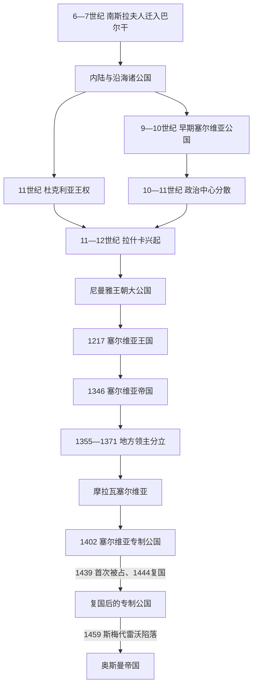

# 塞尔维亚中世纪国家

[返回塞尔维亚历史](/%E4%BA%BA%E6%96%87%E7%A7%91%E5%AD%A6/%E5%8E%86%E5%8F%B2/%E6%AC%A7%E6%B4%B2/%E4%B8%9C%E5%8D%97%E6%AC%A7%E4%B8%8E%E5%B7%B4%E5%B0%94%E5%B9%B2/%E5%A1%9E%E5%B0%94%E7%BB%B4%E4%BA%9A/README.md)

## 时间

约7世纪—1459年

## 概括

中世纪“塞尔维亚”不是固定国界内的一朝一代，而是内陆拉什卡、沿海杜克利亚—泽塔及其他南斯拉夫诸地区反复组合的政权群。早期统治者的年代主要依靠较晚成书的拜占庭记载重建，存在空白和争议。12世纪后期，尼曼雅王朝以拉什卡为核心整合内陆与部分沿海地区，1217年建立王国、1219年取得教会自主；14世纪杜尚扩张并称帝，却在他死后因继承、贵族割据和区域差异迅速分裂。摩拉瓦塞尔维亚和专制公国在奥斯曼与匈牙利之间延续到1459年。

## 建立背景与早期政权

### 从罗马边疆到南斯拉夫诸公国

今天塞尔维亚所在的中部巴尔干先后属于罗马帝国和东罗马帝国，交通轴线沿多瑙河、摩拉瓦河和瓦尔达尔河展开。6—7世纪阿瓦尔人入侵与南斯拉夫人迁徙改变了人口和聚落格局，东罗马对内陆的控制一度收缩。随后形成的“茹帕”地方共同体由茹潘统领，若干茹帕再受大茹潘或亲王协调；这种层级并非成熟的领土官僚国家，却为后来的统合提供了政治单元。

8—10世纪早期塞尔维亚公国处于拜占庭与保加利亚的竞争之间。弗拉斯蒂米尔约在9世纪中叶击退保加利亚进攻；其后穆蒂米尔与兄弟共治又发生内斗。统治家族在9世纪完成基督教化，教区、修道传统和斯拉夫礼仪逐渐进入政治生活。彼得、帕夫勒和扎哈里亚等统治者反复借助保加利亚或拜占庭上台，924年保加利亚直接占领内陆公国；查斯拉夫约927年复国，但其死后统一结构再次消散。

### 杜克利亚与拉什卡的重心转换

11世纪，政治重心一度转向亚得里亚海沿岸的杜克利亚。斯特凡·沃伊斯拉夫摆脱拜占庭控制，米哈伊洛约在1077年取得王号，康斯坦丁·博丁扩展影响；博丁死后王族内争削弱杜克利亚。沿海政权的完整脉络见[中世纪杜克利亚与泽塔](/%E4%BA%BA%E6%96%87%E7%A7%91%E5%AD%A6/%E5%8E%86%E5%8F%B2/%E6%AC%A7%E6%B4%B2/%E4%B8%9C%E5%8D%97%E6%AC%A7%E4%B8%8E%E5%B7%B4%E5%B0%94%E5%B9%B2/%E9%BB%91%E5%B1%B1/%E4%B8%AD%E4%B8%96%E7%BA%AA%E6%9D%9C%E5%85%8B%E5%88%A9%E4%BA%9A%E4%B8%8E%E6%B3%BD%E5%A1%94.md)，不能简单并入拉什卡王位表。

博丁曾任命武坎管理拉什卡。到11世纪末，拉什卡凭借山地防御、通往科索沃和摩拉瓦河谷的交通位置以及与匈牙利联姻，逐渐成为内陆最强政治中心。武坎、乌罗什一世、乌罗什二世、德萨等大茹潘一面向拜占庭称臣，一面利用拜占庭—匈牙利战争扩大自主；频繁废立也说明最高权力仍依赖贵族集团和外部支持。

## 尼曼雅王朝的崛起与国家建设

斯特凡·尼曼雅在1160年代战胜兄长，逐步摆脱拜占庭控制，兼并泽塔等地，并通过斯图代尼察、希兰达尔等修道院把王朝、教会与土地开发结合起来。1196年他让位给斯特凡·尼曼雅二世，自己出家为西缅。斯特凡曾被兄长武坎推翻，复位后在第四次十字军重塑地区秩序的背景下转向罗马教廷，于1217年获加冕为“首冠王”。

圣萨瓦于1219年从尼西亚方面取得塞尔维亚教会自主，日察成为早期总主教驻地。王权从西方取得王号、教会从东正教世界取得自主，显示塞尔维亚并非单向选择“东方”或“西方”，而是在两套权威之间建立自身制度。王朝修道院既是宗教中心，也是墓地、文书保存、地产经营与政治记忆的载体。

乌罗什一世时期引入萨克森矿工，布尔多、特雷普查和新布尔多等矿区后来支撑银矿、铸币与亚得里亚海贸易。杜布罗夫尼克商人、沿海城市和内陆市场把塞尔维亚接入地中海经济。德拉古廷与米卢廷的更替、德拉古廷在北部继续保有领地以及米卢廷向马其顿扩张，体现王国常以家族分封、共治和边境领地维持，而非绝对统一的中央集权。

## 帝国扩张、统治结构与鼎盛条件

斯特凡·杜尚在1331年推翻父亲德昌斯基。借拜占庭内战之机，他占领马其顿、阿尔巴尼亚、伊庇鲁斯和色萨利大片地区，1346年在斯科普里加冕为“塞尔维亚人和希腊人的皇帝”，总主教区同时升为牧首区。1349年和1354年两次颁布的《杜尚法典》把王朝法令、教会法和拜占庭法律传统结合，规范贵族、教会、法庭、农民义务和治安。

| 领域 | 运行机制 | 能力与限制 |
|---|---|---|
| 王权与宫廷 | 君主授予土地、头衔和司法权，依靠近侍、财政官与地方贵族执行 | 扩张时能快速整合精英，但对大贵族及家族领地依赖很强。 |
| 地方治理 | 茹帕、城市、矿区和领主领地并存；新征服的希腊地区常保留拜占庭制度 | 制度弹性有利于扩张，却造成法律和政治层次不一。 |
| 教会 | 自主总主教区、后来的牧首区与王朝修道院形成跨地区网络 | 提供合法性、教育和文书能力；升格牧首区引发与君士坦丁堡的教会冲突，1375年才和解。 |
| 军事 | 君主亲兵、贵族骑兵、地方义务军和雇佣兵并用 | 对个人统帅与封臣动员依赖高，缺少可在继承危机中稳定运转的常备体系。 |
| 财政与贸易 | 银矿、关税、铸币、牧业和杜布罗夫尼克商路 | 形成帝国扩张的物质基础，但矿区和通道易被地方领主掌握。 |
| 人口与宗教 | 东正教徒为主，另有天主教城市社群、希腊语臣民、阿尔巴尼亚人、瓦拉几人等 | 多元人口扩大税源，也要求维持不同习惯法和地方精英合作。 |

帝国鼎盛来自四项条件叠加：拜占庭内战创造外部窗口；尼曼雅王朝积累的王权与教会合法性降低整合成本；矿业和贸易提供现金；杜尚的军事动员与婚姻外交把保加利亚等邻国暂时纳入平衡。但扩张速度超过行政整合，且没有建立足以约束区域大贵族的稳定继承机制。

## 分裂、奥斯曼压力与直接灭亡过程

### 结构性分裂

1355年杜尚突然去世，乌罗什五世缺乏父亲的个人威望。帝国横跨语言、法律和地方传统不同的区域，大贵族掌握军队、税源和城堡；1365年乌罗什任命武卡欣·姆尔尼亚夫切维奇为共治国王，实际承认权力分散。1371年马里查河战役中武卡欣和乌格列沙阵亡，同年乌罗什无嗣去世，尼曼雅主系终结。帝国不是被一次外敌进攻立即摧毁，而是先转化为多个区域政权。

### 摩拉瓦塞尔维亚与科索沃战役

拉扎尔·赫雷贝利亚诺维奇在摩拉瓦河流域建立最强区域政权，通过婚姻和教会和解扩大影响。1389年科索沃战役中拉扎尔与奥斯曼苏丹穆拉德一世均死亡，双方损失惨重。战役没有使塞尔维亚政权当日消失；拉扎尔之子斯特凡在母亲米利察摄政下继续统治，但须向奥斯曼称臣并出兵。科索沃后来成为宗教、文学和民族记忆的核心，其历史结果应与后世象征意义区分。

### 专制公国的复兴与终结

1402年安卡拉战役后奥斯曼进入内战，斯特凡·拉扎列维奇取得拜占庭“专制君主”称号，又与匈牙利结盟，获得贝尔格莱德。他整顿矿业、军役和城市，在马纳西亚发展文书文化。继承人久拉吉·布兰科维奇因须归还贝尔格莱德而新建斯梅代雷沃，继续在匈牙利与奥斯曼之间求存。

专制公国衰亡可分三层：

- 结构因素：王室缺少稳定成年男性继承人，领地和堡垒分散，财政与军队规模远小于奥斯曼帝国。
- 外部压力：奥斯曼控制马其顿和通往多瑙河的交通线，匈牙利虽提供支援，也把塞尔维亚视为缓冲区并要求要塞与效忠。
- 直接过程：奥斯曼于1439年首次占领专制公国；1444年久拉吉借“长期战役”后的和约复国。1454年起穆罕默德二世再度逐城推进，新布尔多于1455年陷落。久拉吉1456年死后，宫廷围绕亲奥斯曼、亲匈牙利路线和继承婚姻分裂。1459年波斯尼亚王子斯特凡·托马舍维奇取得专制君主称号，却缺少足够军队；6月20日斯梅代雷沃向奥斯曼投降，作为领土国家的中世纪塞尔维亚专制公国终结。

## 重要事件

| 时间 | 事件 | 过程与影响 |
|---|---|---|
| 约839—842年 | 弗拉斯蒂米尔抵抗保加利亚 | 早期公国证明能够联合若干茹帕抵御外部征服。 |
| 约870年代 | 统治家族基督教化 | 教会组织、斯拉夫礼仪和王权合法性开始结合。 |
| 924年、约927年 | 保加利亚征服与查斯拉夫复国 | 展示早期公国受大国扶植和干预的脆弱性。 |
| 1042年 | 巴尔战役 | 斯特凡·沃伊斯拉夫击败拜占庭军，杜克利亚成为沿海强权。 |
| 1160年代—1196年 | 尼曼雅统一与扩张 | 拉什卡成为核心，建立延续近两百年的王朝框架。 |
| 1217年、1219年 | 王国加冕与教会自主 | 王权、教会与修道院网络形成较稳定制度组合。 |
| 1282年 | 德热沃会议 | 德拉古廷让位米卢廷但保留北部领地，形成家族内部的并行统治。 |
| 1330年 | 韦尔伯日德战役 | 德昌斯基击败保加利亚，塞尔维亚成为巴尔干强国。 |
| 1346年、1349年、1354年 | 称帝与法典 | 帝国化和法律编纂达到顶点，也放大多区域治理难题。 |
| 1371年 | 马里查河战役与乌罗什五世去世 | 主要南部领主阵亡，尼曼雅主系终结，割据固化。 |
| 1389年 | 科索沃战役 | 领导层损失和奥斯曼宗主权加深，但国家仍延续七十年。 |
| 1402年 | 安卡拉战役与专制公国建立 | 奥斯曼内战给予斯特凡·拉扎列维奇复兴国家的窗口。 |
| 1439年、1444年 | 首次亡国与复国 | 专制公国日益依赖匈牙利—奥斯曼力量平衡。 |
| 1455年 | 新布尔多陷落 | 最重要矿业和财政中心之一被夺，复国能力严重受损。 |
| 1459年 | 斯梅代雷沃陷落 | 奥斯曼完成对核心领土的兼并。 |

## 王朝世系

完整顺序、共治、复位、摄政和争议统治者见[塞尔维亚中世纪统治者世系表](/%E4%BA%BA%E6%96%87%E7%A7%91%E5%AD%A6/%E5%8E%86%E5%8F%B2/%E6%AC%A7%E6%B4%B2/%E4%B8%9C%E5%8D%97%E6%AC%A7%E4%B8%8E%E5%B7%B4%E5%B0%94%E5%B9%B2/%E5%A1%9E%E5%B0%94%E7%BB%B4%E4%BA%9A/%E5%A1%9E%E5%B0%94%E7%BB%B4%E4%BA%9A%E4%B8%AD%E4%B8%96%E7%BA%AA%E7%BB%9F%E6%B2%BB%E8%80%85%E4%B8%96%E7%B3%BB%E8%A1%A8.md)。这张专表只把拉什卡—王国—帝国—摩拉瓦塞尔维亚—专制公国的核心序列连在一起；杜克利亚、泽塔、马其顿和色萨利的并行王权另行标注，避免制造一个从7世纪不间断延续到1459年的虚构王位。

## 演变关系

- 前一背景：[早期南斯拉夫人](/%E4%BA%BA%E6%96%87%E7%A7%91%E5%AD%A6/%E5%8E%86%E5%8F%B2/%E6%AC%A7%E6%B4%B2/%E4%B8%9C%E5%8D%97%E6%AC%A7%E4%B8%8E%E5%B7%B4%E5%B0%94%E5%B9%B2/%E5%8D%97%E6%96%AF%E6%8B%89%E5%A4%AB%E5%8E%86%E5%8F%B2/%E6%97%A9%E6%9C%9F%E5%8D%97%E6%96%AF%E6%8B%89%E5%A4%AB%E4%BA%BA.md)。
- 并行沿海线：[中世纪杜克利亚与泽塔](/%E4%BA%BA%E6%96%87%E7%A7%91%E5%AD%A6/%E5%8E%86%E5%8F%B2/%E6%AC%A7%E6%B4%B2/%E4%B8%9C%E5%8D%97%E6%AC%A7%E4%B8%8E%E5%B7%B4%E5%B0%94%E5%B9%B2/%E9%BB%91%E5%B1%B1/%E4%B8%AD%E4%B8%96%E7%BA%AA%E6%9D%9C%E5%85%8B%E5%88%A9%E4%BA%9A%E4%B8%8E%E6%B3%BD%E5%A1%94.md)。
- 后一阶段：[奥斯曼与哈布斯堡之间的塞尔维亚](/%E4%BA%BA%E6%96%87%E7%A7%91%E5%AD%A6/%E5%8E%86%E5%8F%B2/%E6%AC%A7%E6%B4%B2/%E4%B8%9C%E5%8D%97%E6%AC%A7%E4%B8%8E%E5%B7%B4%E5%B0%94%E5%B9%B2/%E5%A1%9E%E5%B0%94%E7%BB%B4%E4%BA%9A/%E5%A5%A5%E6%96%AF%E6%9B%BC%E4%B8%8E%E5%93%88%E5%B8%83%E6%96%AF%E5%A0%A1%E4%B9%8B%E9%97%B4%E7%9A%84%E5%A1%9E%E5%B0%94%E7%BB%B4%E4%BA%9A.md)。
