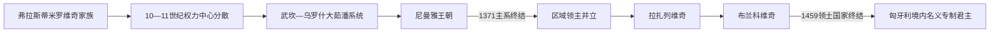

# 塞尔维亚中世纪统治者世系表

[返回塞尔维亚中世纪国家](/%E4%BA%BA%E6%96%87%E7%A7%91%E5%AD%A6/%E5%8E%86%E5%8F%B2/%E6%AC%A7%E6%B4%B2/%E4%B8%9C%E5%8D%97%E6%AC%A7%E4%B8%8E%E5%B7%B4%E5%B0%94%E5%B9%B2/%E5%A1%9E%E5%B0%94%E7%BB%B4%E4%BA%9A/%E5%A1%9E%E5%B0%94%E7%BB%B4%E4%BA%9A%E4%B8%AD%E4%B8%96%E7%BA%AA%E5%9B%BD%E5%AE%B6.md)

## 范围与读法

本表整理“内陆早期公国—拉什卡大公国—尼曼雅王国与帝国—摩拉瓦塞尔维亚—专制公国”的可证实核心统治序列。早期史料稀少，约800—950年的在位年只能写成推定范围；10世纪中叶至11世纪末也不存在一条能够连续填满的内陆王位线。沿海杜克利亚—泽塔的统治序列见[中世纪杜克利亚与泽塔](/%E4%BA%BA%E6%96%87%E7%A7%91%E5%AD%A6/%E5%8E%86%E5%8F%B2/%E6%AC%A7%E6%B4%B2/%E4%B8%9C%E5%8D%97%E6%AC%A7%E4%B8%8E%E5%B7%B4%E5%B0%94%E5%B9%B2/%E9%BB%91%E5%B1%B1/%E4%B8%AD%E4%B8%96%E7%BA%AA%E6%9D%9C%E5%85%8B%E5%88%A9%E4%BA%9A%E4%B8%8E%E6%B3%BD%E5%A1%94.md)，不以现代民族国家观念强行并入本表。

## 早期内陆公国统治序列

| 顺序 | 统治者 | 家族 / 称号 | 在位 | 与前任关系 | 关键事件与备注 |
|---:|---|---|---|---|---|
| 1 | 维舍斯拉夫 | 早期王族；执政官 / 亲王 | 8世纪后半叶，确切年代不详 | 已知最早的同一家族统治者 | 主要见于较晚拜占庭记载，不能据此确定精确国界。 |
| 2 | 拉多斯拉夫 | 早期王族；亲王 | 约8世纪末—9世纪初 | 维舍斯拉夫之子 | 事迹与确切年代不详。 |
| 3 | 普罗西戈伊 | 早期王族；亲王 | 约9世纪初 | 拉多斯拉夫之子 | 事迹不详；其子弗拉斯蒂米尔开始有较多可重建事件。 |
| 4 | **弗拉斯蒂米尔** | 弗拉斯蒂米罗维奇；亲王 | 约830年代—约851年 | 普罗西戈伊之子 | 击退普列西安一世时期的保加利亚进攻，扩大对特拉武尼亚的宗主联系。 |
| 5 | 穆蒂米尔、斯特罗伊米尔、戈伊尼克 | 弗拉斯蒂米罗维奇；兄弟共治，穆蒂米尔居首 | 约851年—891/892年 | 弗拉斯蒂米尔三子 | 击败保加利亚进攻；穆蒂米尔后来驱逐两弟。统治家族约在此期完成基督教化。 |
| 6 | 普里比斯拉夫 | 弗拉斯蒂米罗维奇；亲王 | 891/892年—892/893年 | 穆蒂米尔长子 | 在位约一年，被堂兄彼得推翻，与兄弟逃往克罗地亚。 |
| 7 | 彼得·戈伊尼科维奇 | 弗拉斯蒂米罗维奇；亲王 | 892/893年—917年 | 戈伊尼克之子，前任堂兄 | 击败布兰和克洛尼米尔的争位，后因与拜占庭接触被保加利亚诱捕。 |
| 8 | 帕夫勒·布拉诺维奇 | 弗拉斯蒂米罗维奇；亲王 | 917年—920/921年 | 布兰之子，保加利亚扶立 | 后转向拜占庭，被保加利亚支持的扎哈里亚推翻。 |
| 9 | 扎哈里亚·普里比斯拉夫列维奇 | 弗拉斯蒂米罗维奇；亲王 | 920/921年—924年 | 普里比斯拉夫之子 | 上台后转向拜占庭；924年保加利亚入侵时逃往克罗地亚。 |
| — | 保加利亚直接控制 | 无塞尔维亚亲王 | 924年—约927年 | 征服与统治中断 | 统治精英和人口遭俘迁，沿海诸公国未全部被吞并。 |
| 10 | **查斯拉夫·克洛尼米罗维奇** | 弗拉斯蒂米罗维奇；亲王 | 约927年—约950年代或960年前后 | 克洛尼米尔之子 | 西美昂一世死后返国，在拜占庭宗主权下复国；死亡年代和方式存在争议。其后内陆统一序列中断。 |

## 拉什卡大茹潘与尼曼雅王朝

| 顺序 | 统治者 | 家族 / 称号 | 在位 | 与前任关系 | 关键事件与备注 |
|---:|---|---|---|---|---|
| 11 | **武坎** | 武坎系；拉什卡大茹潘 | 约1083年—约1112年 | 由杜克利亚国王康斯坦丁·博丁任命，血缘不详 | 向科索沃和东南扩张，反复与拜占庭作战；拉什卡开始取代杜克利亚成为核心。 |
| 12 | 乌罗什一世 | 武坎系；大茹潘 | 约1112年—约1145年 | 武坎的侄辈或近亲，具体关系有争议 | 与匈牙利王室联姻，利用匈拜竞争扩大自主。 |
| 13 | 乌罗什二世 | 武坎系；大茹潘 | 约1145年—1155年；约1155年后复位至1161/1162年前后 | 乌罗什一世之子 | 1150年败于拜占庭并恢复藩属义务；1155年家族内争中一度被废。 |
| 14 | 德萨 | 武坎系；大茹潘 | 1155年短暂；1162年—约1165年 | 乌罗什一世之子、乌罗什二世之弟 | 先后控制泽塔、特雷比涅等地；因联络匈牙利和德意志势力被拜占庭拘捕。 |
| 15 | 贝洛什 | 武坎系；大茹潘 | 1162年短暂 | 乌罗什一世之子 | 曾任匈牙利宫廷重臣和克罗地亚—达尔马提亚总督，短暂接受大茹潘位后退回匈牙利。 |
| 16 | 蒂霍米尔 | 扎维达家族；大茹潘 | 约1165/1166年—1166/1168年 | 尼曼雅长兄；拜占庭支持上台 | 被弟弟尼曼雅击败，传统记载称在潘蒂诺战败溺亡。 |
| 17 | **斯特凡·尼曼雅** | 尼曼雅王朝；大茹潘 | 1166/1168年—1196年 | 蒂霍米尔之弟 | 奠定王朝，摆脱拜占庭控制、扩张领土、建设修道院；让位后出家为西缅。 |
| 18 | **斯特凡“首冠王”** | 尼曼雅王朝；大茹潘，1217年起国王 | 1196年—1202年、1204/1205年—1228年 | 尼曼雅次子 | 被兄长武坎推翻后复位；1217年加冕，1219年其弟萨瓦取得教会自主。 |
| 19 | 武坎·尼曼雅 | 尼曼雅王朝；大茹潘、泽塔统治者 | 1202年—1204/1205年 | 斯特凡兄长 | 借匈牙利支持夺位并承认匈牙利宗主权，后败于斯特凡；属于一次明确的废立插段。 |
| 20 | 斯特凡·拉多斯拉夫 | 尼曼雅王朝；国王 | 1228年—1233/1234年 | 首冠王长子 | 倚重岳父伊庇鲁斯统治者，在其失势后被贵族推翻。 |
| 21 | 斯特凡·弗拉迪斯拉夫 | 尼曼雅王朝；国王 | 1233/1234年—1243年 | 拉多斯拉夫之弟 | 与保加利亚伊凡·阿森二世联姻；保加利亚衰弱后被弟乌罗什取代。 |
| 22 | 斯特凡·乌罗什一世 | 尼曼雅王朝；国王 | 1243年—1276年 | 弗拉迪斯拉夫之弟 | 发展银矿、铸币与贸易；被长子德拉古廷在匈牙利支持下推翻，次年去世。 |
| 23 | 斯特凡·德拉古廷 | 尼曼雅王朝；国王 | 1276年—1282年 | 乌罗什一世长子 | 1282年让位弟米卢廷；此后仍以“斯雷姆国王”统治北部领地至1316年，形成并立。 |
| 24 | **斯特凡·乌罗什二世·米卢廷** | 尼曼雅王朝；国王 | 1282年—1321年 | 德拉古廷之弟 | 向马其顿扩张、发展矿业与修道院；死后其子、侄与私生子之间爆发继承战。 |
| 25 | 斯特凡·乌罗什三世·德昌斯基 | 尼曼雅王朝；国王 | 1321年—1331年 | 米卢廷之子 | 击败君士坦丁和弗拉迪斯拉夫二世；1330年在韦尔伯日德击败保加利亚，后被子杜尚推翻并死于囚禁。 |
| 26 | **斯特凡·乌罗什四世·杜尚** | 尼曼雅王朝；国王，1346年起皇帝 | 1331年—1355年 | 德昌斯基之子 | 利用拜占庭内战扩张，1346年称帝，颁布《杜尚法典》；突然去世时未完成制度整合。 |
| 27 | 斯特凡·乌罗什五世 | 尼曼雅王朝；1346年起青年国王，1355年起皇帝 | 1355年—1371年 | 杜尚独子 | 继承帝国后地方领主坐大；1365年立武卡欣为共治国王；无嗣去世，主系终结。 |
| 28 | 武卡欣·姆尔尼亚夫切维奇 | 姆尔尼亚夫切维奇家族；共治国王 | 1365年—1371年 | 非宗室，由乌罗什五世授王号 | 实控马其顿北部；1371年马里查河战役阵亡。其共治不等于取代乌罗什的皇位。 |

## 摩拉瓦塞尔维亚与专制公国

| 顺序 | 统治者 / 摄政 | 家族 / 称号 | 在位 | 与前任关系 | 关键事件与备注 |
|---:|---|---|---|---|---|
| 29 | **拉扎尔·赫雷贝利亚诺维奇** | 拉扎列维奇；亲王 | 约1373年—1389年 | 非尼曼雅主系，以地方领主身份崛起 | 整合摩拉瓦流域、促成1375年教会和解；1389年科索沃战役阵亡。并非统一帝国皇位的无争议继承者。 |
| — | 米利察亲王妃 | 拉扎列维奇；摄政 | 1389年—约1393年 | 拉扎尔遗孀，为未成年子斯特凡摄政 | 在奥斯曼压力下接受藩属关系，以婚姻和外交保存政权。 |
| 30 | **斯特凡·拉扎列维奇** | 拉扎列维奇；亲王，1402年起专制君主 | 1389年—1427年 | 拉扎尔之子 | 早期为奥斯曼藩属；安卡拉战役后转与匈牙利结盟，经营贝尔格莱德、矿业和马纳西亚文化中心；无嗣，指定外甥久拉吉继承。 |
| 31 | **久拉吉·布兰科维奇** | 布兰科维奇；专制君主 | 1427年—1439年、1444年—1456年 | 斯特凡的外甥，武克·布兰科维奇之子 | 建斯梅代雷沃；1439年奥斯曼首次灭国，1444年复国；在匈牙利与奥斯曼间维持缓冲。 |
| 32 | 拉扎尔·布兰科维奇 | 布兰科维奇；专制君主 | 1456年—1458年 | 久拉吉幼子 | 接手已失去新布尔多等南部地区的国家；与奥斯曼议和，死后仅有女儿。 |
| — | 耶莱娜·帕莱奥洛吉娜、斯特凡·布兰科维奇、米哈伊洛·安杰洛维奇 | 三人摄政委员会 | 1458年1月—3月 | 拉扎尔遗孀、兄长与大臣 | 亲匈牙利和亲奥斯曼路线冲突；米哈伊洛一度试图引奥斯曼军入城，随即被捕。 |
| 33 | 斯特凡·布兰科维奇 | 布兰科维奇；专制君主 | 1458年3月—1459年4月 | 拉扎尔之兄 | 双目失明；由匈牙利支持，后因宫廷选择波斯尼亚婚姻方案而被逐。 |
| 34 | **斯特凡·托马舍维奇** | 科特罗马尼奇；专制君主，后为波斯尼亚国王 | 1459年3月21日—6月20日 | 波斯尼亚王子，与拉扎尔之女耶莱娜成婚 | 通过婚姻取得称号；面对穆罕默德二世大军缺乏救援，交出斯梅代雷沃。领土国家至此终结。 |

## 争位者与并行统治辨析

| 人物 / 政权 | 时间 | 地位 | 为什么不并入单一主线 |
|---|---|---|---|
| 布兰·穆蒂米罗维奇 | 895/896年 | 争位者 | 进攻彼得失败后被俘并致盲，没有稳定统治。 |
| 克洛尼米尔·斯特罗伊米罗维奇 | 897/898年 | 保加利亚支持的争位者 | 进攻彼得失败身亡，没有取得公认在位。 |
| 普里米斯拉夫 | 12世纪60年代 | 史料中的大茹潘 | 有学者认为他就是乌罗什二世，另有观点视为乌罗什一世第四子，身份不能确定。 |
| 斯特凡·君士坦丁 | 1321年—1322年 | 米卢廷之子、王位争夺者 | 米卢廷死后自称继承，与德昌斯基交战失败；是否正式加冕有争议。 |
| 斯特凡·弗拉迪斯拉夫二世 | 1316年—1325年前后 | 德拉古廷之子、斯雷姆国王；1321年后争夺中央王位 | 北部领地和匈牙利支持使其具实际统治，但没有长期控制王国核心。 |
| 西缅·乌罗什 | 1356年—约1370年 | 伊庇鲁斯、色萨利“塞尔维亚人和希腊人的皇帝” | 杜尚异母弟，在南部建立继承政权，与乌罗什五世并立而非统治拉什卡核心。 |
| 约万·乌罗什 | 约1370年—1373年 | 色萨利皇帝 | 西缅之子，退位出家；属于帝国南部继承国。 |
| 马尔科·姆尔尼亚夫切维奇 | 1371年—1395年 | 普里莱普地区国王、奥斯曼藩属 | 继承父亲武卡欣的王号，但实际仅统治区域领地。 |
| 武克·布兰科维奇 | 约1370年代—1397年 | 科索沃一带区域领主 | 科索沃战役后继续抵抗，未使用全塞尔维亚王号；后来被奥斯曼夺地。 |

## 1459年后的名义“塞尔维亚专制君主”

1459年后，匈牙利国王仍把“塞尔维亚专制君主”头衔和南部边境领地授予塞尔维亚或相关贵族，以组织骑兵、吸纳移民并防守奥斯曼。这些人拥有领地、宫廷和军事作用，却没有统治已被奥斯曼占领的塞尔维亚本土，因此不应把1459年后的头衔连续计算为专制公国仍然存在。

| 顺序 | 名义专制君主 | 任衔时间 | 家族 / 关系 | 备注 |
|---:|---|---|---|---|
| 1 | 武克·格尔古雷维奇 | 1471年—1485年 | 布兰科维奇旁支，久拉吉之孙 | 匈牙利边将，后世称“火龙武克”。 |
| 2 | 久拉吉·布兰科维奇 | 1486年—1496年 | 斯特凡·布兰科维奇之子 | 后出家为马克西姆，将头衔让给弟弟。 |
| 3 | 约万·布兰科维奇 | 1496年—1502年 | 久拉吉之弟 | 无男性后嗣，布兰科维奇男系名义专制君主终结。 |
| 4 | 伊瓦尼什·贝里斯拉维奇 | 1504年—1514年 | 娶约万遗孀耶莱娜·雅克希奇 | 由匈牙利王授衔，统领斯雷姆边境领地。 |
| 5 | 斯特凡·贝里斯拉维奇 | 1520年—1535年 | 伊瓦尼什之子 | 幼年继承，后在奥斯曼压力与匈牙利内战中失势并被杀。 |
| 6 | 拉迪奇·博日奇 | 1527年—1528年 | 与前任无直系关系 | 匈牙利王位内战中由扎波尧派授衔，属于并立名义头衔。 |
| 7 | 帕夫勒·巴基奇 | 1537年 | 边境军人贵族 | 由哈布斯堡斐迪南一世授衔，同年战死；通常被视为最后一位名义塞尔维亚专制君主。 |

## 连续性说明

- 约10世纪中叶至11世纪末的空档是真实史料和政治结构问题，不应用推测人物填满。
- 1202—1205年前后、1365—1371年、1439—1444年及1458年摄政期必须保留废立、共治和统治中断，不能合并成“后期诸王”。
- 1459年的终结对象是斯梅代雷沃为中心的领土国家；匈牙利境内名义专制君主属于[奥斯曼与哈布斯堡之间的塞尔维亚](/%E4%BA%BA%E6%96%87%E7%A7%91%E5%AD%A6/%E5%8E%86%E5%8F%B2/%E6%AC%A7%E6%B4%B2/%E4%B8%9C%E5%8D%97%E6%AC%A7%E4%B8%8E%E5%B7%B4%E5%B0%94%E5%B9%B2/%E5%A1%9E%E5%B0%94%E7%BB%B4%E4%BA%9A/%E5%A5%A5%E6%96%AF%E6%9B%BC%E4%B8%8E%E5%93%88%E5%B8%83%E6%96%AF%E5%A0%A1%E4%B9%8B%E9%97%B4%E7%9A%84%E5%A1%9E%E5%B0%94%E7%BB%B4%E4%BA%9A.md)中的边境政治延续。
