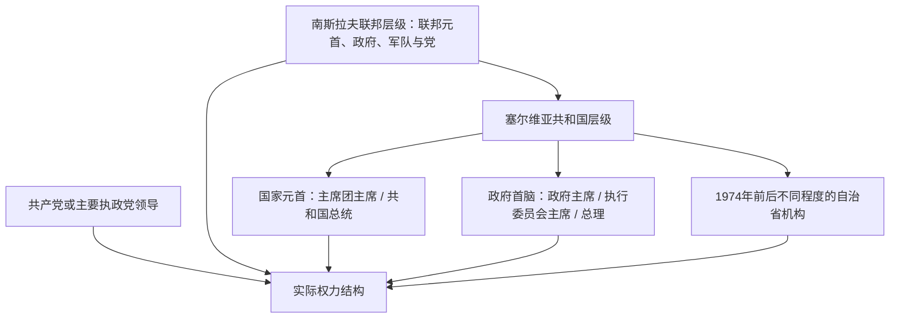

# 塞尔维亚近现代国家元首与政府首脑表

[返回南斯拉夫国家框架下的塞尔维亚](/%E4%BA%BA%E6%96%87%E7%A7%91%E5%AD%A6/%E5%8E%86%E5%8F%B2/%E6%AC%A7%E6%B4%B2/%E4%B8%9C%E5%8D%97%E6%AC%A7%E4%B8%8E%E5%B7%B4%E5%B0%94%E5%B9%B2/%E5%A1%9E%E5%B0%94%E7%BB%B4%E4%BA%9A/%E5%8D%97%E6%96%AF%E6%8B%89%E5%A4%AB%E5%9B%BD%E5%AE%B6%E6%A1%86%E6%9E%B6%E4%B8%8B%E7%9A%84%E5%A1%9E%E5%B0%94%E7%BB%B4%E4%BA%9A.md)

## 范围与截止时间

本表分开列出塞尔维亚共和国层级的国家元首、政府首脑和实际权力结构，核验截止到2026年7月14日。1945—1974年没有与后来共和国主席团完全相同的国家元首职位：共和国议会主席承担部分代表职能，而最高政治权力集中在南斯拉夫共产党、联邦政府和铁托。为避免制造虚假职务连续性，国家元首完整表从1974年集体主席团开始，政府首脑表则从1945年共和国政府成立开始。

## 塞尔维亚共和国层级国家元首

### 集体主席团与多党共和国

| 顺序 | 人物 | 职务 | 任期 | 产生方式 / 继任关系 | 关键事件与备注 |
|---:|---|---|---|---|---|
| 1 | 德拉戈斯拉夫·马尔科维奇 | 塞尔维亚社会主义共和国主席团主席 | 1974年5月6日—1978年5月5日 | 1974年宪法建立集体主席团后的首任主席 | 共和国、省和联邦三层权力重新分配。 |
| 2 | 多布里沃耶·维迪奇 | 主席团主席 | 1978年5月5日—1982年5月5日 | 主席团内部继任 | 铁托去世前后，联邦转入集体领导。 |
| 3 | 尼古拉·柳比契奇 | 主席团主席 | 1982年5月5日—1984年5月5日 | 主席团内部继任 | 曾任联邦国防部长，任内经济和科索沃危机加深。 |
| 4 | 杜尚·契克雷比奇 | 主席团主席 | 1984年5月5日—1985年5月5日 | 主席团内部继任 | 同时具有长期共和国党政经历。 |
| 5 | 伊万·斯坦博利奇 | 主席团主席 | 1985年5月5日—1987年12月14日 | 主席团内部继任 | 与米洛舍维奇的党内冲突后失势；2000年遭绑架杀害。 |
| 6 | 佩塔尔·格拉查宁 | 主席团主席 | 1987年12月14日—1989年3月20日 | 斯坦博利奇下台后继任 | 米洛舍维奇成为党内实际强人，格拉查宁主要承担法定元首职务。 |
| 7 | 柳比沙·伊吉奇 | 代主席团主席 | 1989年3月20日—5月8日 | 临时代行 | 处于自治权修宪和新主席产生之间。 |
| 8 | **斯洛博丹·米洛舍维奇** | 主席团主席；1991年起共和国总统 | 1989年5月8日—1997年7月23日 | 先由社会主义体制选出，1990、1992年直接选举 | 1990年宪法扩大总统权力；主导塞尔维亚和联盟共和国政治，1997年转任联邦总统。 |
| 9 | 德拉甘·托米奇 | 代共和国总统 | 1997年7月23日—12月29日 | 议会议长依法代行 | 米洛舍维奇转任联邦总统后的过渡。 |
| 10 | 米兰·米卢蒂诺维奇 | 共和国总统 | 1997年12月29日—2002年12月29日 | 直接选举 | 法定元首，但1997—2000年实际最高权力仍在联邦总统米洛舍维奇。 |
| 11 | 娜塔莎·米契奇 | 代共和国总统 | 2002年12月30日—2004年2月4日 | 议会议长依法代行 | 多次总统选举因投票率门槛无效，代任时间延长；2003年宣布紧急状态。 |
| 12 | 德拉甘·马尔希恰宁 | 代共和国总统 | 2004年2月4日—3月3日 | 新任议会议长代行 | 短期代任。 |
| 13 | 沃伊斯拉夫·米哈伊洛维奇 | 代共和国总统 | 2004年3月3日—3月4日 | 代议长临时代行 | 仅约一天，必须保留以免产生任期断点。 |
| 14 | 普雷德拉格·马尔科维奇 | 代共和国总统 | 2004年3月4日—7月11日 | 议会议长代行 | 任内完成新的总统选举。 |
| 15 | 鲍里斯·塔迪奇 | 共和国总统 | 2004年7月11日—2012年4月5日 | 2004、2008年直接选举 | 推动欧洲一体化与地区和解；提前辞职以合并举行选举。 |
| 16 | 斯拉维察·久基奇—德亚诺维奇 | 代共和国总统 | 2012年4月5日—5月31日 | 议会议长依法代行 | 组织2012年总统选举。 |
| 17 | 托米斯拉夫·尼科利奇 | 共和国总统 | 2012年5月31日—2017年5月31日 | 直接选举 | 塞尔维亚前进党阵营首次取得总统职位；任后未获党内提名连任。 |
| 18 | **亚历山大·武契奇** | 共和国总统 | 2017年5月31日—至今；2022年5月31日起第二任 | 2017、2022年直接选举 | 宪法上总统不是政府首脑，但其党派领导、选举动员和外交角色使总统成为实际政治中心。截止2026年7月14日仍在任。 |

武契奇在2026年6月底公开表示可能辞职并推动提前议会及总统选举，但截至本表截止日尚未完成法定辞职程序，因此不能提前把国家元首写成空缺或继任者。

## 塞尔维亚共和国层级政府首脑

### 1945—1991年：政府主席与执行委员会主席

| 顺序 | 人物 | 职务 | 任期 | 关键事件 / 备注 |
|---:|---|---|---|---|
| 1 | 布拉戈耶·内什科维奇 | 政府主席 | 1945年4月9日—1948年9月5日 | 战后建制、国有化、土地改革和政治清算；同时为共产党塞尔维亚组织领导人。 |
| 2 | 佩塔尔·斯坦博利奇 | 政府主席；1953年起执行委员会主席 | 1948年9月5日—1953年12月16日 | 跨三个内阁，经历铁托—斯大林决裂和工人自治起步。 |
| 3 | 约万·韦塞利诺夫 | 执行委员会主席 | 1953年12月16日—1957年4月6日 | 在联邦分权和经济恢复中主持共和国行政。 |
| 4 | 米洛什·米尼奇 | 执行委员会主席 | 1957年4月6日—1962年6月9日 | 跨两个内阁，工业化和城市化继续。 |
| 5 | 斯洛博丹·佩内齐奇“克尔聪” | 执行委员会主席；1963年起共和国执行委员会主席 | 1962年6月9日—1964年11月17日 | 安全部门出身，1964年车祸身亡。 |
| 6 | 德拉吉·斯塔门科维奇 | 共和国执行委员会主席 | 1964年11月17日—1967年5月6日 | 跨两个内阁，经历1965年经济改革。 |
| 7 | 久里察·约伊基奇 | 共和国执行委员会主席 | 1967年5月6日—1969年5月7日 | 兰科维奇下台后的分权时期。 |
| 8 | 米连科·博亚尼奇 | 共和国执行委员会主席 | 1969年5月7日—1974年5月6日 | 共和国自由派兴衰与1974年新宪法酝酿期。 |
| 9 | 杜尚·契克雷比奇 | 塞尔维亚社会主义共和国议会执行委员会主席 | 1974年5月6日—1978年5月6日 | 执行1974年共和国—自治省复合治理。 |
| 10 | 伊万·斯坦博利奇 | 执行委员会主席 | 1978年5月6日—1982年5月5日 | 铁托去世与经济危机初期。 |
| 11 | 布拉尼斯拉夫·伊科尼奇 | 执行委员会主席 | 1982年5月6日—1986年5月6日 | 科索沃紧张和紧缩政策持续。 |
| 12 | 德西米尔·耶夫蒂奇 | 执行委员会主席 | 1986年5月6日—1989年12月5日 | 米洛舍维奇崛起、反官僚革命和自治权修宪。 |
| 13 | 斯坦科·拉德米洛维奇 | 执行委员会主席 | 1989年12月5日—1991年2月11日 | 一党制向多党制转型，职务随后改为政府总理。 |

### 1991年至今：总理

| 顺序 | 人物 | 任期 | 产生与交接 | 关键事件 / 备注 |
|---:|---|---|---|---|
| 14 | 德拉古廷·泽莱诺维奇 | 1991年2月11日—12月23日 | 首届多党议会后组阁 | 南斯拉夫战争爆发初期，社会党占绝对多数。 |
| 15 | 拉多曼·博若维奇 | 1991年12月23日—1993年2月10日 | 社会党内继任 | 联盟共和国成立、战争和制裁开始。 |
| 16 | 尼古拉·沙伊诺维奇 | 1993年2月10日—1994年3月18日 | 新议会多数组阁 | 1993—1994年恶性通胀达到顶峰。 |
| 17 | 米尔科·马里亚诺维奇 | 1994年3月18日—2000年10月24日 | 社会党主导多个内阁 | 代顿、1996—1997年抗议、科索沃战争和北约轰炸；2000年政权更替后辞职。 |
| 18 | 米洛米尔·米尼奇 | 2000年10月24日—2001年1月25日 | 社会党、民主反对派和复兴运动组成过渡政府 | 负责到2000年12月议会选举及和平交接。 |
| 19 | **佐兰·金吉奇** | 2001年1月25日—2003年3月12日 | 塞尔维亚民主反对派多数组阁 | 市场与国家机构改革、海牙合作；2003年遇刺。 |
| — | 内博伊沙·乔维奇、扎尔科·科拉奇等副总理 | 2003年3月12日—18日短期代行 | 按政府内部安排代行 | 刺杀后的紧急过渡，不视为另组完整内阁。 |
| 20 | 佐兰·日夫科维奇 | 2003年3月18日—2004年3月3日 | 议会选举继任总理 | “军刀行动”打击有组织犯罪，改革联盟随后分裂。 |
| 21 | 沃伊斯拉夫·科什图尼察 | 2004年3月3日—2008年7月7日 | 两届联合政府 | 2006年独立、宪法与科索沃地位谈判；2008年联盟因对欧政策分裂。 |
| 22 | 米尔科·茨韦特科维奇 | 2008年7月7日—2012年7月27日 | 亲欧联合政府 | 欧盟申请、签证自由化和金融危机；总统塔迪奇在执政联盟中影响较强。 |
| 23 | 伊维察·达契奇 | 2012年7月27日—2014年4月27日 | 前进党—社会党联盟 | 2013年布鲁塞尔协议；前进党随后提前选举扩大优势。 |
| 24 | **亚历山大·武契奇** | 2014年4月27日—2017年5月31日 | 前进党主导政府 | 财政紧缩、对欧谈判、基础设施和权力集中；当选总统后离任。 |
| — | 伊维察·达契奇 | 2017年5月31日—6月29日代总理 | 第一副总理临时代行 | 武契奇就任总统与新政府产生之间的过渡。 |
| 25 | 安娜·布尔纳比奇 | 2017年6月29日—2024年5月2日 | 前进党支持的三届政府 | 数字化、疫情治理、科索沃谈判和选举争议；后转任议会议长。 |
| 26 | 米洛什·武切维奇 | 2024年5月2日—2025年4月16日 | 前进党主导政府 | 诺维萨德车站雨棚坍塌引发抗议；2025年1月宣布辞职，3月19日议会确认，技术政府留任至继任者产生。 |
| 27 | **久罗·马楚特** | 2025年4月16日—至今 | 议会选举产生 | 医生、无长期党政履历，以缓和教育与社会危机为任务；截止2026年7月14日仍为总理。 |

## 实际权力结构分期

| 时段 | 法定制度 | 实际权力中心 | 说明 |
|---|---|---|---|
| 1918—1941年 | 南斯拉夫君主立宪，1929年后王室独裁 | 国王、中央政府、军队与主要政党精英 | 当时没有单独塞尔维亚元首或政府，不能把南斯拉夫君主列成“塞尔维亚总统”。 |
| 1941—1944年 | 德国军事占领与协力行政 | 德国军事司令和占领机关 | 内迪奇政府没有主权，职务表应放在占领结构而非合法国家元首表。 |
| 1945—1966年 | 联邦制、一党制 | 铁托、南斯拉夫共产党中央、联邦安全与军队体系 | 塞尔维亚共和国政府执行重大政策，党组织掌握干部权。 |
| 1966—1980年 | 一党制下的共和国和自治省分权 | 铁托与南共联盟；共和国、省级党政精英分享执行权 | 1974年后法定结构高度分散，但铁托仍具最终整合作用。 |
| 1980—1987年 | 联邦和共和国集体主席团轮值 | 联邦党、共和国党和省级领导层协商 | 没有单一继承铁托的强人，经济和民族危机中决策趋于僵化。 |
| 1987—2000年 | 多党宪法逐步取代党国，联邦与共和国并存 | 米洛舍维奇、塞尔维亚社会党、安全机关和控制型媒体 | 米洛舍维奇1997年转任联邦总统后，米卢蒂诺维奇虽为共和国元首，仍非实际最高领导。 |
| 2000—2003年 | 联盟共和国与塞尔维亚双层民选机构 | 联邦总统科什图尼察与塞尔维亚总理金吉奇相互制衡 | 两人代表的政党、改革速度和国家观不同，形成“双重权力中心”。 |
| 2003—2012年 | 议会制共和国、联合政府 | 总理、总统与联盟政党按议会多数分权 | 法定总统权力有限，但塔迪奇兼任最大执政党领袖时政治影响超出礼仪角色。 |
| 2012—2017年 | 前进党主导议会制 | 先为第一副总理、后为总理的武契奇及前进党 | 尼科利奇为法定总统，2014年后政府首脑武契奇成为主要决策者。 |
| 2017—2026年7月14日 | 总统与政府分立的议会制 | 总统武契奇、前进党领导网络及政府 | 武契奇虽不再正式担任党主席和总理，仍通过选举名单、政策宣布、外交和执政联盟保持主导；马楚特自2025年任政府首脑。 |

## 职位边界

- 现代君主与摄政完整表留在[塞尔维亚革命、公国与王国](/%E4%BA%BA%E6%96%87%E7%A7%91%E5%AD%A6/%E5%8E%86%E5%8F%B2/%E6%AC%A7%E6%B4%B2/%E4%B8%9C%E5%8D%97%E6%AC%A7%E4%B8%8E%E5%B7%B4%E5%B0%94%E5%B9%B2/%E5%A1%9E%E5%B0%94%E7%BB%B4%E4%BA%9A/%E5%A1%9E%E5%B0%94%E7%BB%B4%E4%BA%9A%E9%9D%A9%E5%91%BD%E3%80%81%E5%85%AC%E5%9B%BD%E4%B8%8E%E7%8E%8B%E5%9B%BD.md)，不与共和国职务混表。
- 南斯拉夫联邦元首、联邦总理和联邦党主席属于共同国家，见[南斯拉夫社会主义联邦共和国](/%E4%BA%BA%E6%96%87%E7%A7%91%E5%AD%A6/%E5%8E%86%E5%8F%B2/%E6%AC%A7%E6%B4%B2/%E4%B8%9C%E5%8D%97%E6%AC%A7%E4%B8%8E%E5%B7%B4%E5%B0%94%E5%B9%B2/%E5%8D%97%E6%96%AF%E6%8B%89%E5%A4%AB%E5%8E%86%E5%8F%B2/%E5%8D%97%E6%96%AF%E6%8B%89%E5%A4%AB%E7%A4%BE%E4%BC%9A%E4%B8%BB%E4%B9%89%E8%81%94%E9%82%A6%E5%85%B1%E5%92%8C%E5%9B%BD.md)与[南斯拉夫联盟共和国与塞尔维亚和黑山](/%E4%BA%BA%E6%96%87%E7%A7%91%E5%AD%A6/%E5%8E%86%E5%8F%B2/%E6%AC%A7%E6%B4%B2/%E4%B8%9C%E5%8D%97%E6%AC%A7%E4%B8%8E%E5%B7%B4%E5%B0%94%E5%B9%B2/%E5%8D%97%E6%96%AF%E6%8B%89%E5%A4%AB%E5%8E%86%E5%8F%B2/%E5%8D%97%E6%96%AF%E6%8B%89%E5%A4%AB%E8%81%94%E7%9B%9F%E5%85%B1%E5%92%8C%E5%9B%BD%E4%B8%8E%E5%A1%9E%E5%B0%94%E7%BB%B4%E4%BA%9A%E5%92%8C%E9%BB%91%E5%B1%B1.md)。
- “实际权力中心”是对制度运行的分期判断，不取代法定职务表。尤其在米洛舍维奇和武契奇时期，法定元首、政府首脑、执政党和安全—媒体网络必须分开观察。
- 当前人物以2026年7月14日为截止：共和国总统为亚历山大·武契奇，政府总理为久罗·马楚特。
- 2006年后的制度过程和当前争议见[当代塞尔维亚](/%E4%BA%BA%E6%96%87%E7%A7%91%E5%AD%A6/%E5%8E%86%E5%8F%B2/%E6%AC%A7%E6%B4%B2/%E4%B8%9C%E5%8D%97%E6%AC%A7%E4%B8%8E%E5%B7%B4%E5%B0%94%E5%B9%B2/%E5%A1%9E%E5%B0%94%E7%BB%B4%E4%BA%9A/%E5%BD%93%E4%BB%A3%E5%A1%9E%E5%B0%94%E7%BB%B4%E4%BA%9A.md)。
