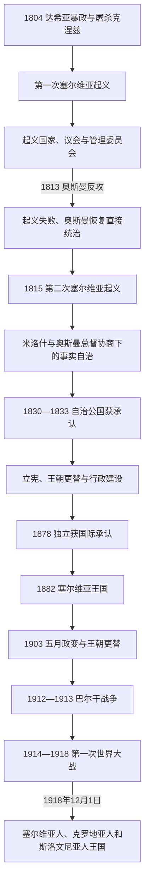

# 塞尔维亚革命、公国与王国

[返回塞尔维亚历史](/%E4%BA%BA%E6%96%87%E7%A7%91%E5%AD%A6/%E5%8E%86%E5%8F%B2/%E6%AC%A7%E6%B4%B2/%E4%B8%9C%E5%8D%97%E6%AC%A7%E4%B8%8E%E5%B7%B4%E5%B0%94%E5%B9%B2/%E5%A1%9E%E5%B0%94%E7%BB%B4%E4%BA%9A/README.md)

## 时间

1804年—1918年

## 概括

现代塞尔维亚国家不是在1804年一次“独立成功”，而是经过第一次起义建政与失败、第二次起义后的事实自治、1830—1833年奥斯曼敕令确认、1867年奥斯曼驻军撤离、1878年国际承认独立和1882年升格王国等阶段形成。奥布雷诺维奇与卡拉乔尔杰维奇两家竞争王位，君主、国务委员会、议会、政党和军官集团不断重分权力。1912—1913年扩张使国家规模迅速增长；第一次世界大战的占领与巨大伤亡又推动王国在1918年投入南斯拉夫统一。

## 塞尔维亚革命

### 第一次起义：从反军阀到起义国家

1804年2月，地方首领在奥拉沙茨推举卡拉乔尔杰领导反抗。初始目标是清除非法控制贝尔格莱德帕沙辖区的达希亚军阀，并非立即反对苏丹。起义军击败达希亚后，奥斯曼中央不愿接受持久武装自治，冲突扩大为对帝国军队的战争。

1805年伊万科瓦茨、1806年米沙尔和德利格勒等战役使起义军控制大部分乡村；1806年底攻入贝尔格莱德，次年夺取城堡。1805年成立的管理委员会是行政和司法中枢，地方议会、军事首领和卡拉乔尔杰之间持续争权。1811年改革加强最高领袖权力，却没有消除地区司令的独立基础。

俄国在1806—1812年俄土战争中提供军事和外交支持。拿破仑入侵前夕，俄国以《布加勒斯特条约》结束战争，条约为塞族人留下有限自治承诺，但俄军撤退使起义国家失去关键外援。1813年奥斯曼从多路反攻，贝尔格莱德失守，卡拉乔尔杰和许多领袖流亡，报复、奴役和人口逃亡随之发生。

### 第二次起义与谈判自治

1814年哈季·普罗丹起义仓促失败，奥斯曼镇压加深不安。1815年米洛什·奥布雷诺维奇在塔科沃被推举为领袖，起义军在柳比奇、帕莱日、波扎雷瓦茨和杜布列取得战果。米洛什没有追求全面决战，而是与马拉什勒·阿里帕夏谈判，使塞族地方首领重新参与征税、司法和治安；奥斯曼总督和驻军仍保留名义与部分实际权力。

米洛什利用俄国外交和奥斯曼在希腊独立战争、俄土战争中的压力，逐步扩大自治。1830年敕令确认塞尔维亚自治和奥布雷诺维奇家族的世袭亲王地位，1833年又把六个争议辖区交给公国。穆斯林居民和奥斯曼行政人员分阶段迁出，但贝尔格莱德等要塞驻军直到1867年才撤离。

## 公国的制度建设与王朝竞争

### 米洛什的集权与立宪压力

米洛什以个人财政、任命地方官和控制贸易建立强势亲王权。他废除部分封建义务、确认农民土地占有，却也垄断商业并残酷压制反对者。1835年群众集会迫使他同意《斯雷滕耶宪法》，其中包含权力分立和权利条款；奥斯曼、俄国和奥地利均担心其过于自由和近似独立，宪法仅施行数周。

1838年奥斯曼颁布的新章程通常称“土耳其宪法”，建立终身国务委员，对亲王形成约束。以托马·武契奇、阿夫拉姆·彼得罗尼耶维奇等为核心的“护宪派”迫使米洛什退位，1842年又驱逐其子米哈伊洛，拥立亚历山大·卡拉乔尔杰维奇。由此，王朝竞争与“亲王—国务委员会”之争长期叠加。

### 官僚国家、法律和民族方案

亚历山大时期建立较稳定的部委、法院、学校和文官体系。1844年《塞尔维亚民法典》参考奥地利法，确认财产与家庭制度；同年伊利亚·加拉沙宁撰写《纲领》，设想在奥斯曼衰退中扩大塞尔维亚影响。它后来被不同政治力量解释为南斯拉夫合作方案或“大塞尔维亚”蓝图，需结合具体时期辨析。

1858年圣安德烈议会罢免亚历山大，米洛什复位；1860年米哈伊洛第二次即位。他改革军队、地方行政和教育，联络巴尔干反奥斯曼力量。1862年贝尔格莱德丘库尔喷泉冲突引发奥斯曼要塞炮击城市，国际谈判促使多数驻军撤离；1867年奥斯曼把最后要塞钥匙交给亲王，公国在仍属奥斯曼名义宗主权下取得完整内部控制。米哈伊洛1868年遇刺后，未成年米兰由三人摄政至1872年。

## 独立、王国化与政治现代化

### 战争与国际承认

1875年波斯尼亚—黑塞哥维那起义引发东方危机。塞尔维亚1876年向奥斯曼宣战，初战失利，俄国介入后于1877年再战。1878年柏林会议承认塞尔维亚、黑山和罗马尼亚独立，塞尔维亚获得尼什、皮罗特、托普利察和弗拉涅等地区，同时承担宗教平等、债务和财产等国际义务。

独立的条件不仅是军事胜利，还包括俄国支持、奥匈对巴尔干秩序的安排和奥斯曼整体退却。新领土上的穆斯林与阿尔巴尼亚人口大量迁离或被迫离开，塞族难民也从奥斯曼地区进入；国家扩张伴随人口排斥与财产重分配，不能只写作“民族解放”。

### 王国与奥布雷诺维奇末期

米兰于1882年称王，依靠奥匈资本、贸易和外交支持修建铁路、建立常备军与国家银行。现代化增加财政与征兵负担，1883年蒂莫克起义遭镇压。1885年塞尔维亚因保加利亚统一问题发动战争，在斯利夫尼察战败，奥匈干预阻止保加利亚继续推进，边界维持不变。

1888年宪法扩大议会权力与男性选举权，米兰次年退位。未成年亚历山大在摄政下即位，1893年提前宣布成年并夺取权力；他反复更换宪法和政府，1900年与德拉加·马欣结婚加剧王朝继承危机。1903年军官发动五月政变，杀死国王夫妇，奥布雷诺维奇王朝断绝。政变结束个人王权危机，却使秘密军官网络成为政治中的持久力量。

### 彼得一世、议会政治与对奥匈转向

议会选举彼得一世·卡拉乔尔杰维奇为王，并恢复接近1888年宪法的制度。激进党主导政府，报刊和议会空间扩大，1903—1914年常被称为议会主义的“黄金期”；但选举压力、官僚干预、军官政治和对少数群体的治理问题并未消失。

奥匈企图以关税压迫塞尔维亚，1906—1911年“猪战”反而促使塞尔维亚寻找法国资本和新出口市场，修建加工与交通设施。1908年奥匈兼并波斯尼亚引发危机，塞尔维亚在俄国无力支持时被迫接受。1911年部分军官建立“统一或死亡”组织，俗称“黑手”，其民族网络与文官政府关系紧张。

## 巴尔干战争与第一次世界大战

### 1912—1913年的扩张

塞尔维亚与保加利亚、希腊、黑山组成巴尔干同盟，于1912年击败奥斯曼。塞军在库马诺沃等战役取胜，进入科索沃、桑扎克和马其顿。列强建立阿尔巴尼亚国家，阻止塞尔维亚获得亚得里亚海出海口。1913年因马其顿分配争议，保加利亚攻击昔日盟友；塞尔维亚、希腊、罗马尼亚和奥斯曼反击，《布加勒斯特条约》使塞尔维亚控制瓦尔达尔马其顿大部。

国土和人口近乎跃增，军队士气与王国国际地位上升；同时新地区的阿尔巴尼亚人、马其顿斯拉夫人、土耳其人等被置于军事和行政整合之下，暴力、迁移和强制同化争议加深。财政、行政和军队尚未来得及整合扩张成果，欧洲大战即爆发。

### 1914—1918年的生存战争

1914年6月，波斯尼亚塞族青年加夫里洛·普林西普在萨拉热窝刺杀奥匈皇储。刺客与“青年波斯尼亚”、黑手成员及塞尔维亚境内网络存在联系，但塞尔维亚政府是否指挥刺杀并无证据。奥匈提出部分侵犯主权的最后通牒，塞尔维亚接受多数条款仍遭宣战，由联盟体系引发世界大战。

塞军在采尔和科卢巴拉击退1914年入侵，但伤亡、难民和斑疹伤寒耗尽国力。1915年德国、奥匈和保加利亚联合进攻，塞军与大批平民经黑山、阿尔巴尼亚撤至亚得里亚海，再由协约国运往科孚岛；本土被奥匈和保加利亚分区占领。占领当局实施征用、拘禁、同化和镇压，1917年托普利察起义遭残酷平定。

流亡政府和军队在萨洛尼卡战线重建。1917年塞尔维亚政府与南斯拉夫委员会发表《科孚宣言》，同意战后建立卡拉乔尔杰维奇王朝下的共同国家，但中央集权、民族自治和国家继承等问题没有解决。1918年9月协约军突破萨洛尼卡战线，塞军迅速北进，11月收复贝尔格莱德。

### 王国如何结束

1918年11月，伏伊伏丁那多地议会决定并入塞尔维亚；黑山波德戈里察议会决定废黜本国王朝并与塞尔维亚合并，该过程随即引发合法性与代表性争议。12月1日，摄政王亚历山大宣布塞尔维亚王国与原奥匈南斯拉夫地区的“斯洛文尼亚人、克罗地亚人和塞尔维亚人国”组成共同王国。

因此塞尔维亚王国并非在1918年被军事灭亡：它作为战胜国完成领土恢复，却因精英选择南斯拉夫统一而停止以独立国家形式存在。战争死亡、伤残、基础设施破坏和男女比例失衡深刻限制新国家；塞尔维亚的军队、王朝与官僚机构又在共同国家中占有较强地位，成为日后中央集权争议的来源。

## 统治者与摄政完整表

| 顺序 | 统治者 / 摄政 | 身份与王室 | 在位 / 执政 | 与前任关系 | 关键事件与备注 |
|---:|---|---|---|---|---|
| 1 | **卡拉乔尔杰·彼得罗维奇** | 最高领袖；卡拉乔尔杰维奇家族奠基人 | 1804年—1813年 | 奥拉沙茨集会推举 | 领导第一次起义与起义国家；1813年失败流亡，1817年返境后被杀。不是国际承认的君主。 |
| — | 奥斯曼恢复直接统治 | 贝尔格莱德总督体系 | 1813年—1815年 | 征服中断 | 镇压和难民潮后，地方矛盾导致第二次起义。 |
| 2 | **米洛什·奥布雷诺维奇** | 亲王；奥布雷诺维奇王朝奠基人 | 1815年—1839年、1858年—1860年 | 第二次起义领袖；第二次由议会复位 | 取得事实自治和1830年世袭承认；因立宪压力退位，1858年复位。 |
| 3 | 米兰二世·奥布雷诺维奇 | 亲王；奥布雷诺维奇 | 1839年，约三周 | 米洛什长子 | 即位时病重，未能亲政，迅速去世。 |
| — | 阿夫拉姆·彼得罗尼耶维奇、耶夫雷姆·奥布雷诺维奇、托马·武契奇—佩里希奇 | 三人摄政 | 1839年6月—1840年3月 | 国务委员会为病重米兰及未返国的米哈伊洛摄政 | 摄政跨越两位亲王，直到米哈伊洛回国亲政。 |
| 4 | 米哈伊洛·奥布雷诺维奇 | 亲王；奥布雷诺维奇 | 1839年—1842年、1860年—1868年 | 米兰之弟；第二次继承父亲 | 首次被护宪派推翻；第二次推动改革和1867年奥斯曼驻军撤离，1868年遇刺。 |
| 5 | 亚历山大·卡拉乔尔杰维奇 | 亲王；卡拉乔尔杰维奇 | 1842年—1858年 | 卡拉乔尔杰之子，由议会选出 | 护宪派和国务委员会影响较强；官僚、法制和教育建设推进，后被圣安德烈议会罢免。 |
| — | 米利沃耶·布拉兹纳瓦茨、约万·里斯蒂奇、约万·加夫里洛维奇 | 三人摄政 | 1868年—1872年 | 为未成年米兰摄政 | 1869年制定新宪法；布拉兹纳瓦茨掌握军队，摄政平衡官僚与自由派。 |
| 6 | **米兰一世·奥布雷诺维奇** | 1868—1882年亲王，1882—1889年国王 | 1868年—1889年；1872年起亲政 | 米哈伊洛的旁系侄孙 | 1878年独立获承认、1882年称王；经历蒂莫克起义和1885年对保战争，1889年退位。 |
| — | 约万·里斯蒂奇、科斯塔·普罗蒂奇、约万·贝利马尔科维奇 | 三人摄政 | 1889年—1893年 | 为未成年亚历山大摄政 | 普罗蒂奇1892年去世；亚历山大1893年以政变方式提前亲政并解散摄政。 |
| 7 | 亚历山大一世·奥布雷诺维奇 | 国王；奥布雷诺维奇 | 1889年—1903年；1893年起亲政 | 米兰一世之子 | 多次改宪、婚姻和继承危机加深反对；1903年五月政变中与王后被杀，王朝绝嗣。 |
| 8 | **彼得一世·卡拉乔尔杰维奇** | 国王；卡拉乔尔杰维奇 | 1903年—1918年为塞尔维亚国王 | 亚历山大·卡拉乔尔杰维奇之子，由议会选举 | 议会政治、猪战、巴尔干战争和一战时期君主；1918年起成为共同王国国王。 |
| — | 亚历山大王储 | 王国摄政 | 1914年6月—1918年 | 彼得一世次子、王储 | 因父王健康不佳行使王权，统率战时国家；1918年以摄政身份宣布南斯拉夫统一。 |

## 重要事件

| 时间 | 事件 | 过程、结果与影响 |
|---|---|---|
| 1804年 | 奥拉沙茨集会 | 地方反达希亚行动转向长期革命。 |
| 1805—1807年 | 伊万科瓦茨、米沙尔、德利格勒与贝尔格莱德战役 | 起义军建立领土控制和行政机构。 |
| 1812—1813年 | 《布加勒斯特条约》与起义失败 | 俄国撤援，奥斯曼复占，第一次建政中断。 |
| 1815年 | 第二次起义 | 军事胜利与谈判相结合，形成事实自治。 |
| 1830—1833年 | 奥斯曼自治敕令 | 世袭亲王、公国边界和内部行政权获得正式承认。 |
| 1835年 | 《斯雷滕耶宪法》 | 短暂确立权力限制和权利原则，受大国压力撤销。 |
| 1842年、1858年 | 两次王朝更替 | 显示亲王权并非稳固世袭，议会和精英集团可参与废立。 |
| 1862年、1867年 | 贝尔格莱德冲突与驻军撤离 | 公国取得几乎完整内部主权。 |
| 1876—1878年 | 塞奥战争与柏林会议 | 独立获承认并取得南部领土，人口和国际义务同步变化。 |
| 1882年、1885年 | 称王与塞保战争 | 国家地位提高，但地区扩张政策遭受军事挫折。 |
| 1888年—1893年 | 自由宪法、退位与国王夺权 | 议会制度扩张后又遭王权干预。 |
| 1903年 | 五月政变 | 奥布雷诺维奇王朝终结，军官集团进入政治核心。 |
| 1906—1911年 | 猪战 | 塞尔维亚减少对奥匈市场依赖，扩大法国资本与新贸易路线。 |
| 1912—1913年 | 巴尔干战争 | 国土大扩张，同时产生新地区治理与族群暴力问题。 |
| 1914年 | 萨拉热窝刺杀、最后通牒和宣战 | 地区危机升级为世界大战。 |
| 1915年—1916年 | 三国进攻与阿尔巴尼亚撤退 | 国家领土被占，军队和政府转入海外继续作战。 |
| 1917年 | 《科孚宣言》与托普利察起义 | 战后统一方案形成；占领区反抗遭镇压。 |
| 1918年 | 萨洛尼卡突破、解放与统一 | 王国恢复领土后并入南斯拉夫共同国家。 |

## 崛起、压力与阶段终结

- 崛起机制：村社自治、两次起义的军事组织、俄国外交、奥斯曼改革危机和大国均势共同创造自治空间；农民土地占有、牲畜贸易、官僚教育和常备军又把起义共同体转化为国家。
- 制度矛盾：王朝世袭与议会主权、亲王个人统治与国务委员会、文官政府与秘密军官网络长期并存，现代化没有形成单一稳定权力中心。
- 外部压力：奥斯曼、俄国、奥匈和西欧列强都影响边界与王位；国家越扩大，对外依赖和战略暴露也越高。
- 直接终结：1918年并非王朝覆灭或战败亡国，而是王国政府、王储摄政与南斯拉夫委员会等在战争胜利后选择共同国家。未解决的中央集权、民族代表和地方自治争议转入[南斯拉夫王国](/%E4%BA%BA%E6%96%87%E7%A7%91%E5%AD%A6/%E5%8E%86%E5%8F%B2/%E6%AC%A7%E6%B4%B2/%E4%B8%9C%E5%8D%97%E6%AC%A7%E4%B8%8E%E5%B7%B4%E5%B0%94%E5%B9%B2/%E5%8D%97%E6%96%AF%E6%8B%89%E5%A4%AB%E5%8E%86%E5%8F%B2/%E5%8D%97%E6%96%AF%E6%8B%89%E5%A4%AB%E7%8E%8B%E5%9B%BD.md)。

## 演变关系

- 前一节点：[奥斯曼与哈布斯堡之间的塞尔维亚](/%E4%BA%BA%E6%96%87%E7%A7%91%E5%AD%A6/%E5%8E%86%E5%8F%B2/%E6%AC%A7%E6%B4%B2/%E4%B8%9C%E5%8D%97%E6%AC%A7%E4%B8%8E%E5%B7%B4%E5%B0%94%E5%B9%B2/%E5%A1%9E%E5%B0%94%E7%BB%B4%E4%BA%9A/%E5%A5%A5%E6%96%AF%E6%9B%BC%E4%B8%8E%E5%93%88%E5%B8%83%E6%96%AF%E5%A0%A1%E4%B9%8B%E9%97%B4%E7%9A%84%E5%A1%9E%E5%B0%94%E7%BB%B4%E4%BA%9A.md)。
- 后一节点：[南斯拉夫国家框架下的塞尔维亚](/%E4%BA%BA%E6%96%87%E7%A7%91%E5%AD%A6/%E5%8E%86%E5%8F%B2/%E6%AC%A7%E6%B4%B2/%E4%B8%9C%E5%8D%97%E6%AC%A7%E4%B8%8E%E5%B7%B4%E5%B0%94%E5%B9%B2/%E5%A1%9E%E5%B0%94%E7%BB%B4%E4%BA%9A/%E5%8D%97%E6%96%AF%E6%8B%89%E5%A4%AB%E5%9B%BD%E5%AE%B6%E6%A1%86%E6%9E%B6%E4%B8%8B%E7%9A%84%E5%A1%9E%E5%B0%94%E7%BB%B4%E4%BA%9A.md)。
