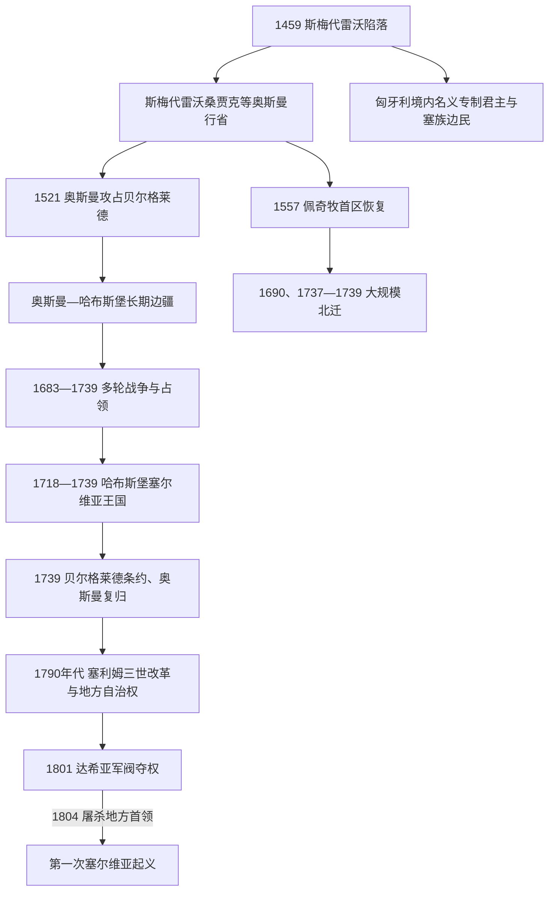

# 奥斯曼与哈布斯堡之间的塞尔维亚

[返回塞尔维亚历史](/%E4%BA%BA%E6%96%87%E7%A7%91%E5%AD%A6/%E5%8E%86%E5%8F%B2/%E6%AC%A7%E6%B4%B2/%E4%B8%9C%E5%8D%97%E6%AC%A7%E4%B8%8E%E5%B7%B4%E5%B0%94%E5%B9%B2/%E5%A1%9E%E5%B0%94%E7%BB%B4%E4%BA%9A/README.md)

## 时间

1459年—1804年

## 概括

1459年斯梅代雷沃陷落后，多数中部塞尔维亚地区纳入奥斯曼帝国；贝尔格莱德直到1521年才被攻占，萨瓦河和多瑙河以北的塞族社会则长期处在匈牙利、后来的哈布斯堡体系内。17—18世纪战争使边界、人口和行政权反复移动。奥斯曼地方制度、东正教教会、哈布斯堡军事边疆、跨境贸易和多次迁徙共同重组了塞尔维亚社会，并为1804年革命提供了组织、武器经验和地方精英网络。

## 奥斯曼征服与行省治理

### 征服并非在1459年一次完成

1459年灭亡的是斯梅代雷沃专制公国。匈牙利仍控制贝尔格莱德和多瑙河—萨瓦河防线，匈牙利国王还向武克·格尔古雷维奇、布兰科维奇后裔和贝里斯拉维奇家族授予名义“塞尔维亚专制君主”称号，详细序列见[塞尔维亚中世纪统治者世系表](/%E4%BA%BA%E6%96%87%E7%A7%91%E5%AD%A6/%E5%8E%86%E5%8F%B2/%E6%AC%A7%E6%B4%B2/%E4%B8%9C%E5%8D%97%E6%AC%A7%E4%B8%8E%E5%B7%B4%E5%B0%94%E5%B9%B2/%E5%A1%9E%E5%B0%94%E7%BB%B4%E4%BA%9A/%E5%A1%9E%E5%B0%94%E7%BB%B4%E4%BA%9A%E4%B8%AD%E4%B8%96%E7%BA%AA%E7%BB%9F%E6%B2%BB%E8%80%85%E4%B8%96%E7%B3%BB%E8%A1%A8.md)。这些边境领主组织塞族轻骑兵和移民，却不再统治奥斯曼占领下的塞尔维亚本土。

苏莱曼一世于1521年攻陷贝尔格莱德，1526年莫哈奇战役摧毁中世纪匈牙利王国，奥斯曼随后深入潘诺尼亚。中部塞尔维亚多属斯梅代雷沃桑贾克，通称“贝尔格莱德帕沙辖区”；不同区域也曾隶属布丁、特梅什瓦尔、波斯尼亚、鲁米利亚等更大行政单位，因此不能把今天塞尔维亚疆域视为一个固定行省。

### 土地、税收与地方社会

| 层级 / 群体 | 机制 | 对塞尔维亚社会的影响 |
|---|---|---|
| 苏丹、总督与桑贾克贝伊 | 任命官员、组织驻军、征税和司法 | 贝尔格莱德、尼什等城市成为军政与商贸节点；边境战争时军权更突出。 |
| 提马尔与西帕希 | 以税收收益换取骑兵服役 | 农村基督徒向国家及土地收益持有者承担税役，土地权利与军事财政相连。 |
| 税农与地方强人 | 将部分税收承包给私人，18世纪地方阿扬和禁卫军势力增长 | 提高财政灵活性，也加重任意征敛和地方武装割据风险。 |
| 基督徒拉亚 | 缴纳土地税、什一税及人头税等，村社由地方首领协助管理 | 多数塞族人口保持农村东正教生活；地方“克涅兹”成为国家与村社之间的中介。 |
| 弗拉赫身份与边境居民 | 部分牧民、运输者和军役人口获得减免或特殊义务 | 促进山区与边境迁徙；“弗拉赫”在不同文书中可能是法律—职业类别，不总等同单一民族。 |
| 城市社群 | 穆斯林军政人员、东正教商人、犹太人、罗姆人等共居 | 城市伊斯兰建筑、行会、市场和跨帝国贸易发展，人口结构与农村不同。 |
| 德夫希尔梅 | 在部分基督徒地区征集男童进入宫廷或禁卫军体系 | 并非年年、处处等量执行；少数人升至帝国高位，不能掩盖对家庭的强制性。 |

奥斯曼统治既不是数百年完全不变的“停滞”，也不能只以宗教宽容概括。和平时期的商路、矿山、畜牧和城镇可恢复，战争、瘟疫、征税和驻军掠夺又会造成村落逃亡。普通人的处境取决于时期、地区、法律身份和地方官员，北部战区尤其不稳定。

## 教会、文化网络与共同体组织

1557年，佩奇牧首区在奥斯曼许可下恢复。索科卢·穆罕默德帕夏家族与首任牧首马卡里耶的关系有助于这一安排。牧首区管辖范围跨越多个行省，修复教堂、管理教区、征收教会费用并保存礼仪和历史记忆；它既是宗教机构，也为分散的东正教社群提供沟通网络。

教会并非始终与帝国对立。主教须从奥斯曼政府取得任命并承担财政义务，部分教士在战争中支持哈布斯堡或起义后遭惩罚。1766年，因债务、内部斗争和中央整顿，奥斯曼撤销佩奇牧首区，教区改隶君士坦丁堡牧首区。北方哈布斯堡领地内则发展出卡尔洛夫齐都主教区，修道院、学校、印刷和与俄国的联系逐渐形成另一套塞族文化中心。

## 哈布斯堡边疆与人口迁徙

### 军事边疆

在匈牙利和哈布斯堡领地，许多塞族居民被安置于军事边疆，以世袭土地、税收优惠或社群特权换取守边服役。边民直接受军事机关管辖，与匈牙利贵族领地制度之间常有冲突。军役培养了基层军官、武器技能和跨境情报网络，后来部分起义者具有哈布斯堡战争经验。

1690年，皇帝利奥波德一世向在其领地内的塞族教会和社群颁布特权，确认东正教礼仪与一定自治。特权的具体适用范围不断被宫廷、匈牙利地方权力和教会重新解释，不能视为建立了独立塞尔维亚国家。

### 战争与两次大迁徙

1683年维也纳围城失败后，神圣同盟反攻。哈布斯堡军于1688年占领贝尔格莱德并深入巴尔干，部分塞族人起兵配合；奥斯曼1690年反攻时，佩奇牧首阿尔塞尼耶三世带领大量神职人员、军民和家庭北撤，后称“塞尔维亚人大迁徙”。迁徙人数无法精确统计，它不是所有科索沃和塞尔维亚人口整体迁空，却显著增强哈布斯堡南部的东正教社群。

1737—1739年战争中，牧首阿尔塞尼耶四世再次支持哈布斯堡，战败后又有一轮北迁。战争、疫病、报复和重新安置共同改变人口分布；与此同时，其他东正教和穆斯林人口也在相反方向移动，边疆社会不能用单向民族迁徙解释。

## 1718—1739年的哈布斯堡“塞尔维亚王国”

欧根亲王1717年攻占贝尔格莱德，1718年帕萨罗维茨条约把萨瓦河、 多瑙河以南一片地区交给哈布斯堡，宫廷设立直属军政管理的“塞尔维亚王国”。它是哈布斯堡王冠下的行政称号，不是独立民族国家。政府修筑要塞、测量土地、引入德意志和其他移民、重整税收，并试图扩大天主教影响；官僚化和新税负也引起当地东正教居民不满。

1737年哈布斯堡再次对奥斯曼开战但迅速失利。1739年贝尔格莱德条约把萨瓦河和多瑙河以南大部分地区归还奥斯曼，河流重新成为主要边界。贝尔格莱德等城撤去哈布斯堡人口与设施，新的迁徙和财产重分配随之发生。

## 18世纪危机与革命前夜

1788—1791年奥地利—奥斯曼战争期间，科查·安杰尔科维奇组织塞族自由军配合哈布斯堡作战，史称“科查边疆”。1791年西斯托瓦条约恢复旧边界，许多参与者再次北撤；留下的人则带回军训和地方组织经验。

苏丹塞利姆三世为恢复贝尔格莱德帕沙辖区秩序，在1793年和1796年的敕令中扩大地方克涅兹参与征税和治安的权力，限制禁卫军返境。地方牲畜贸易和跨境商路使一批村社首领积累财富，他们成为潜在的政治领导层。但禁卫军在1799年后返回，1801年四名达希亚首领杀死改革派总督哈吉·穆斯塔法帕夏，架空苏丹官员，增加税收、强占土地并以暴力控制地方。

1804年初，达希亚为预防反抗而处决数十名重要克涅兹，史称“屠杀克涅兹”。地方首领在奥拉沙茨集会，推举卡拉乔尔杰领导起义。起义最初宣称为苏丹清除非法军阀，随后在战争与外交中转向争取自治乃至独立，因此1804年既是本阶段的直接终点，也是现代塞尔维亚革命的起点。

## 重要事件

| 时间 | 事件 | 结果与长期影响 |
|---|---|---|
| 1459年 | 斯梅代雷沃陷落 | 中世纪领土国家终结，核心地区纳入奥斯曼体系。 |
| 1471—1537年 | 匈牙利授予名义塞尔维亚专制君主头衔 | 延续边境军政传统，但不等于塞尔维亚本土复国。 |
| 1521年 | 贝尔格莱德陷落 | 奥斯曼突破多瑙河防线，城市成为帝国北方要塞。 |
| 1557年 | 佩奇牧首区恢复 | 建立跨行省东正教组织网络。 |
| 1594年—1595年 | 巴纳特起义与圣萨瓦遗骸被焚 | 起义遭镇压；焚烧遗骸成为宗教—政治记忆的重要节点。 |
| 1688年—1690年 | 哈布斯堡占领贝尔格莱德、奥斯曼反攻 | 引发合作、报复和1690年大迁徙。 |
| 1699年 | 卡尔洛维茨条约 | 奥斯曼在中欧大幅退却，边疆大致稳定在萨瓦河—多瑙河一线。 |
| 1717年—1718年 | 贝尔格莱德再陷与帕萨罗维茨条约 | 建立哈布斯堡“塞尔维亚王国”。 |
| 1737年—1739年 | 新一轮战争、迁徙与贝尔格莱德条约 | 哈布斯堡退回河流以北，奥斯曼恢复对中部塞尔维亚控制。 |
| 1766年 | 佩奇牧首区撤销 | 奥斯曼境内塞族教区转隶君士坦丁堡牧首区。 |
| 1788年—1791年 | 科查边疆 | 塞族自由军获得战斗经验，哈布斯堡最终未改变边界。 |
| 1793年、1796年 | 改革敕令 | 地方克涅兹权力扩大，为自治组织提供制度空间。 |
| 1801年 | 达希亚杀死哈吉·穆斯塔法帕夏 | 禁卫军军阀夺取实际统治，苏丹改革失效。 |
| 1804年 | 屠杀克涅兹与奥拉沙茨集会 | 地方安全危机直接触发第一次塞尔维亚起义。 |

## 从帝国边疆到革命的因果链

- 结构积累：村社克涅兹、东正教教会、商人和军事边民提供了超越单个村落的组织网络。
- 经济变化：牲畜出口和跨境贸易使地方精英获得现金、武器与哈布斯堡市场联系，也使任意征税更加不可接受。
- 军事经验：多轮奥斯曼—哈布斯堡战争让边民熟悉武器、要塞和正规军协同。
- 外部环境：奥斯曼中央改革与地方禁卫军、税农和阿扬势力冲突，贝尔格莱德帕沙辖区出现双重权威。
- 直接触发：达希亚暴政和1804年屠杀克涅兹使地方精英相信谈判无法保证生存，于是转向武装起义。

更完整的帝国中央结构见[奥斯曼帝国](/%E4%BA%BA%E6%96%87%E7%A7%91%E5%AD%A6/%E5%8E%86%E5%8F%B2/%E8%A5%BF%E4%BA%9A/%E5%9C%9F%E8%80%B3%E5%85%B6/%E5%A5%A5%E6%96%AF%E6%9B%BC%E5%B8%9D%E5%9B%BD/README.md)；本笔记重点说明这些制度如何在塞尔维亚边疆落地。

## 演变关系

- 前一节点：[塞尔维亚中世纪国家](/%E4%BA%BA%E6%96%87%E7%A7%91%E5%AD%A6/%E5%8E%86%E5%8F%B2/%E6%AC%A7%E6%B4%B2/%E4%B8%9C%E5%8D%97%E6%AC%A7%E4%B8%8E%E5%B7%B4%E5%B0%94%E5%B9%B2/%E5%A1%9E%E5%B0%94%E7%BB%B4%E4%BA%9A/%E5%A1%9E%E5%B0%94%E7%BB%B4%E4%BA%9A%E4%B8%AD%E4%B8%96%E7%BA%AA%E5%9B%BD%E5%AE%B6.md)。
- 后一节点：[塞尔维亚革命、公国与王国](/%E4%BA%BA%E6%96%87%E7%A7%91%E5%AD%A6/%E5%8E%86%E5%8F%B2/%E6%AC%A7%E6%B4%B2/%E4%B8%9C%E5%8D%97%E6%AC%A7%E4%B8%8E%E5%B7%B4%E5%B0%94%E5%B9%B2/%E5%A1%9E%E5%B0%94%E7%BB%B4%E4%BA%9A/%E5%A1%9E%E5%B0%94%E7%BB%B4%E4%BA%9A%E9%9D%A9%E5%91%BD%E3%80%81%E5%85%AC%E5%9B%BD%E4%B8%8E%E7%8E%8B%E5%9B%BD.md)。
